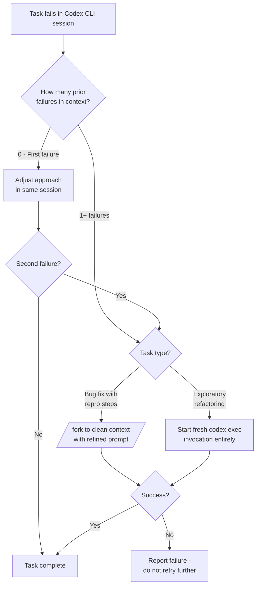

# Why Retrying Fails: What Context Contamination Means for Your Codex CLI Retry Strategy


---

Every developer who has used a coding agent long enough knows the pattern: a task fails, you say "try again," and somehow the second attempt is *worse*. The agent references the same wrong file, repeats the same flawed approach, and burns through your token budget producing the same broken output — but more confidently.

Until May 2026, this was anecdotal frustration. Yang's "Why Retrying Fails: Context Contamination in LLM Agent Pipelines" (arXiv:2605.08563) gives it a formal name — **context contamination** — and proves mathematically that naive retries are not just unhelpful but provably worse than starting fresh [^1]. The implications for how you configure Codex CLI sessions are immediate and practical.

## The Problem: Your Failed Attempts Poison Future Ones

When an LLM agent executes a multi-step task and fails, the failure trace — wrong tool calls, incorrect file edits, hallucinated paths — remains in the conversation history. On the next attempt, the model treats that history as context. The result is a measurably elevated per-step error rate.

Yang introduces the **Context-Contaminated Restart Model (CCRM)** to formalise this [^1]. The model is elegantly simple:

- A pipeline executes **T** sequential tool calls
- On the first (clean) attempt, each step fails with base rate **ε₀**
- On every subsequent (contaminated) attempt, the per-step error rate rises to **ε₁ > ε₀**
- The **cascade ratio** ε₁/ε₀ quantifies how much worse retries become

The closed-form success probability across K attempts is:

```
P(succeed in ≤K attempts) = p₀ + (1 − p₀)[1 − (1 − p₁)^(K−1)]
```

where p₀ = (1−ε₀)^T is the clean success probability and p₁ = (1−ε₁)^T the contaminated one [^1].

## The Numbers Are Stark

Validated against real SWE-bench Verified data from the Verdent agent, the fitted parameters are brutal [^1]:

| Metric | Value |
|---|---|
| Base error rate (ε₀) | 0.034 |
| Contaminated error rate (ε₁) | 0.239 |
| **Cascade ratio (ε₁/ε₀)** | **7.1×** |
| Clean pass@1 | 76.1% |
| Contaminated pass@3 | 81.2% (actual) |
| IID-predicted pass@3 | 98.6% (overestimate) |
| **IID overestimation** | **17.4 percentage points** |

The standard independent-and-identically-distributed model — the one most retry logic implicitly assumes — overestimates your three-attempt success rate by 17.4 percentage points. Every "just retry it" workflow you have is lying to you about its reliability [^1].

## Clean Restarts Win — Provably

Theorem 6.1 in the paper proves that clearing context before each retry strictly dominates contaminated retries across all parameter regimes [^1]. For the SWE-bench parameters above, context-clearing yields approximately **21% more tasks resolved with an identical budget**.

This is not a heuristic. It is a mathematical proof with an information-theoretic lower bound confirming the formula is tight [^1].

## Mapping to Codex CLI: Four Concrete Interventions

The CCRM framework maps directly onto Codex CLI's session management primitives. Here is what to change.

### 1. Fork Instead of Retrying In-Place

Codex CLI's `/fork` command creates a new session that inherits the transcript but starts with a fresh context window [^2]. This is the closest analogue to a clean restart:

```bash
# Inside a session that has failed a task:
/fork
```

The fork preserves the full transcript in the original session whilst giving you a clean runway. Critically, the model does not see the failed tool-call history in its active context [^2].

For headless workflows, the equivalent is to start a new `codex exec` invocation rather than relying on within-session retries:

```bash
# Anti-pattern: single invocation hoping retries work
codex exec "Fix the failing test in auth.rs"

# Better: fresh invocations with clean context
codex exec "Fix the failing test in auth.rs" || \
codex exec "Fix the failing test in auth.rs"
```

### 2. Set Compaction Thresholds to Prevent Contamination Accumulation

Context compaction in Codex CLI triggers at `model_auto_compact_token_limit` and summarises the entire conversation — including failed attempts [^3]. The compaction summary can inadvertently encode failure patterns into a condensed form that persists across the session.

The production-validated finding from Liu et al.'s 13.5-million-session study is that compaction consumes 22% of turn time and destroys 66.1% of cache hit rate [^4]. Combined with CCRM, this means compaction after a failure both preserves contamination *and* destroys your cache advantage.

```toml
# ~/.codex/config.toml

# Conservative compaction: trigger early to keep context clean
model_auto_compact_token_limit = 80000  # ~60% of 135K effective window

# Custom compaction prompt that explicitly discards failure traces
compact_prompt = """
Summarise only the current task objective and successful progress.
Discard all failed attempts, incorrect tool calls, and error traces.
Focus on: what we are building, what works so far, what remains.
"""
```

### 3. Use Named Profiles to Allocate Budget Optimally

CCRM's Theorem 4.1 provides a closed-form formula for optimal budget allocation [^1]:

```
T* = √(B · log(1/(1−ε₁)) / log(1/(1−ε₀)))
K* = √(B · log(1/(1−ε₀)) / log(1/(1−ε₁)))
```

For a fixed total tool-call budget **B**, this balances pipeline depth (T) against retry count (K). Strong contamination favours shallow, single-step pipelines with more fresh restarts; mild contamination favours deeper pipelines with fewer retries.

In Codex CLI, named profiles let you encode these trade-offs:

```toml
# Profile for contamination-sensitive tasks: shallow pipeline, more restarts
[profile.retry-safe]
model = "gpt-5.6-terra"
rollout_token_budget = 50000
model_auto_compact_token_limit = 30000

# Profile for deep exploration: single long attempt
[profile.deep-explore]
model = "gpt-5.6-sol"
rollout_token_budget = 200000
model_auto_compact_token_limit = 120000
```

Select the profile based on your task's expected cascade ratio. Bug fixes with known reproduction steps have lower contamination risk (mild cascade, use `deep-explore`). Exploratory refactoring across unfamiliar code has higher contamination risk (strong cascade, use `retry-safe` with fresh invocations) [^1].

### 4. AGENTS.md Directives for Contamination Awareness

Your AGENTS.md can instruct the agent to avoid the most common contamination patterns:

```markdown
## Retry Discipline

- When a tool call fails, do NOT immediately retry the same approach.
- Before retrying, state what went wrong and propose a different strategy.
- Never reference outputs from failed attempts as evidence or context.
- If the same approach has failed twice, stop and report the failure
  rather than consuming budget on contaminated retries.
```

The ICSE 2026 JAWs study showed that AGENTS.md directives reduce median runtime by 28.64% and output tokens by 16.58% [^5]. Contamination-aware directives compound this effect by preventing the retry loops that inflate both metrics.

## The Decision Flow



## Measuring Your Own Cascade Ratio

Before blindly applying these patterns, measure your actual contamination. Yang recommends preliminary trials to fit ε₀ and ε₁ empirically [^1]. In Codex CLI terms:

1. Run 20–30 tasks with `codex exec` (single attempts, clean context each time) — this gives you pass@1 = p₀
2. For tasks that fail, retry them *in the same session* — this gives you the contaminated pass rate
3. Fit the cascade ratio: if your clean pass@1 is 0.75 and contaminated pass@2 adds only 3% (not the ~19% IID predicts), your cascade ratio is high and clean restarts are essential

The `/usage` command in Codex CLI shows token consumption per turn, letting you track whether retries are consuming disproportionate budget — the 4× compute amplification from tool failures documented by Liu et al. [^4].

## The Counterintuitive Conclusion

The paper's most important practical result is Theorem 3.2's phase transition [^1]: as the cascade ratio increases, the number of retries needed for a given success probability diverges toward infinity. Past a critical threshold, **no amount of retrying in contaminated context will solve the task**.

For Codex CLI users, this means the instinct to keep pushing — "try again," "try harder," "use a different approach" — is not just inefficient but mathematically futile once contamination has set in. The correct response is always a clean restart: fork the session, start a new `codex exec`, or at minimum run `/compact` with a failure-discarding prompt before the next attempt.

Your retry strategy should not be "try again." It should be "try fresh."

## Citations

[^1]: Yang, Z. (2026). "Why Retrying Fails: Context Contamination in LLM Agent Pipelines." arXiv:2605.08563. [https://arxiv.org/abs/2605.08563](https://arxiv.org/abs/2605.08563)

[^2]: OpenAI. (2026). "Codex CLI Session Lifecycle: Archive, Resume, Fork, and Compact." Codex CLI Documentation. [https://codex.danielvaughan.com/2026/06/05/codex-cli-session-lifecycle-archive-resume-fork-compact-management/](https://codex.danielvaughan.com/2026/06/05/codex-cli-session-lifecycle-archive-resume-fork-compact-management/)

[^3]: OpenAI. (2026). "Codex CLI Context Compaction: Architecture, Configuration, and Managing Long Sessions." Codex CLI Documentation. [https://codex.danielvaughan.com/2026/03/31/codex-cli-context-compaction-architecture/](https://codex.danielvaughan.com/2026/03/31/codex-cli-context-compaction-architecture/)

[^4]: Liu, S. et al. (2026). "Agentic Coding in the Wild: What 13.5 Million Production Sessions Reveal." arXiv:2608.00101. [https://arxiv.org/abs/2608.00101](https://arxiv.org/abs/2608.00101)

[^5]: Lulla, S. et al. (2026). "JAWs: Just AGENTS.md Works — Measuring the Efficiency Impact of Agent Context Files." ICSE 2026. arXiv:2601.20404. [https://arxiv.org/abs/2601.20404](https://arxiv.org/abs/2601.20404)

[^6]: OpenAI. (2026). "Codex CLI v0.147.0 Release Notes." GitHub. [https://github.com/openai/codex/releases](https://github.com/openai/codex/releases)
