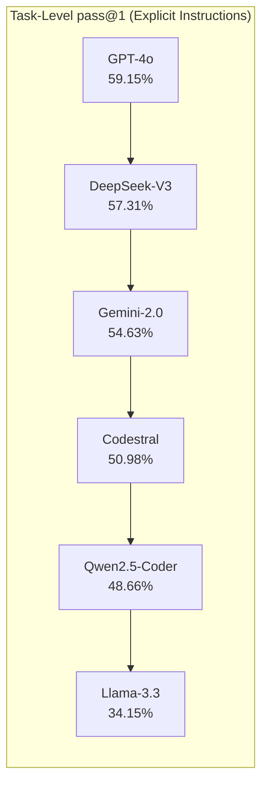
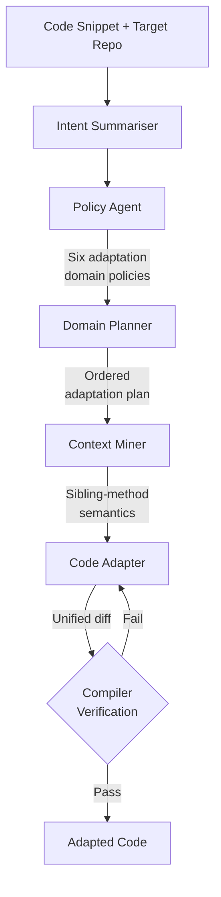

# AdaptEval and the Code Adaptation Gap: Why Your Coding Agent Botches Snippet Integration — and How to Configure Codex CLI for Policy-Aligned Adaptation


---

## The Integration Problem Nobody Benchmarked

Every developer knows the ritual: find a promising code snippet on Stack Overflow or get one from an LLM, then spend twenty minutes wiring it into the codebase. Rename functions to match local conventions, swap parameter types, add exception handling the original author omitted, refactor type annotations to satisfy the linter. It is tedious, error-prone, and — until January 2026 — completely unbenchmarked.

AdaptEval, introduced by Rong et al. at SANER 2026, is the first benchmark purpose-built for **code snippet adaptation** [^1]. Its 164 tasks and 523 individual adaptations, drawn from real Stack Overflow questions and GitHub integration patterns, expose a striking finding: frontier LLMs solve at most 59% of adaptation tasks even when given explicit step-by-step instructions [^1]. Drop the instructions and rely on the model's own reasoning? The best performer manages just 19.5% [^1].

The follow-up work, AdaptAgent — a multi-agent, domain-guided reasoning framework accepted at ASE 2026 — demonstrates that decomposing adaptation into specialised sub-agents (intent extraction, domain policy, planning, context mining, and code generation) outperforms single-shot prompting [^2]. The implication for Codex CLI users: the way you frame an adaptation task matters more than the model you choose.

---

## What AdaptEval Measures

AdaptEval defines three adaptation categories containing 38 fine-grained types [^1]:

| Category | Adaptations | Examples |
|---|---|---|
| **Method Signature** | 128 | Rename Function (70), Encapsulate (13), Insert/Delete/Update Parameter |
| **Logic Customisation** | 227 | Update Call (52), Insert/Delete Condition (31/13), Handle Exception (11), Convert Object Type (23) |
| **Refactoring** | 168 | Insert Type Annotation (52), Rename Variable (20), Update API Reference Name (25) |

The benchmark uses a two-tier testing framework: adaptation-level tests verify each individual change, while function-level tests confirm the integrated result compiles and behaves correctly [^1].

### The Numbers That Matter



Two findings stand out. First, **code-specific LLMs underperform general-purpose models** — Qwen2.5-Coder and Codestral both trail GPT-4o and DeepSeek-V3, suggesting instruction-following ability trumps code-specific pretraining for adaptation tasks [^1]. Second, there is a **20.31% average gap between Method Signature and Logic Customisation** performance [^1]. Renaming a function succeeds over 90% of the time; adapting exception-handling logic drops below 40%.

### The Explicit-Instructions Multiplier

The most actionable finding: providing adaptation-level step-by-step instructions yields **up to 34.84 percentage points improvement** over task-level intentions alone [^1]. In other words, telling the model *what* to do is necessary but insufficient — telling it *how*, step by step, is where the real gains lie.

Reasoning models (DeepSeek-R1, Claude 3.7 Sonnet, QwQ-32B) partially close this gap by inferring implicit context, but they introduce a new failure mode: **self-doubt refusal**, where the model declines valid instructions because it questions the developer's intent [^1].

---

## Why Single-Shot Prompting Fails at Adaptation

AdaptEval's error analysis reveals that **AssertionError dominates failures** across all models, accounting for over half of failed adaptations [^1]. The root cause: models fall back on pretraining conventions rather than following the specified requirements. When asked to adapt a snippet's exception handling to match the target codebase's error hierarchy, the model instead generates its own preferred pattern.

This is precisely the problem AdaptAgent addresses. By decomposing adaptation into five specialised agents, the framework prevents any single component from overriding the developer's intent [^2]:



The ablation results confirm that **planning is especially critical for code-hardening and exception-handling adaptations**, while **intent extraction matters most for logic customisation** [^2]. Remove either component and accuracy degrades significantly.

---

## Mapping to Codex CLI Configuration

The research points to four concrete configuration strategies for Codex CLI users who regularly integrate external code.

### 1. AGENTS.md as Your Adaptation Policy Layer

AdaptAgent's Policy Agent encodes domain-specific adaptation rules. In Codex CLI, `AGENTS.md` serves the same function. Rather than generic instructions, encode your project's specific adaptation policies:

```markdown
<!-- AGENTS.md -->
## Code Adaptation Rules

When integrating external code snippets:
- Always rename functions to match our camelCase convention
- Map all exception types to our error hierarchy in `src/errors/`
- Add type annotations matching our strict TypeScript config
- Preserve the original snippet's logic but adapt parameter types
  to our domain models in `src/types/`
- Never add new dependencies without checking `package.json` first
- Handle exceptions using our `AppError` base class, not raw Error
```

This directly addresses AdaptEval's finding that models default to pretraining conventions — explicit policy in `AGENTS.md` acts as the constraint layer that prevents drift [^3].

### 2. Plan Mode for Multi-Step Adaptations

AdaptAgent's strongest signal: planning before coding improves accuracy on complex adaptations. Codex CLI's Plan Mode (`Shift+Tab` or `/plan`) maps directly to this pattern [^4]:

```bash
# Engage plan mode before adaptation
codex --model gpt-5.6-terra \
  "Integrate the retry logic from this Stack Overflow snippet
   into our HTTP client. Plan the adaptation first."
```

Configure `plan_mode_reasoning_effort` in your profile for adaptation-heavy sessions:

```toml
# ~/.codex/profiles/adapt.toml
model = "gpt-5.6-terra"
plan_mode_reasoning_effort = "high"

[approval_policy]
read = "auto-edit"
```

The `high` reasoning effort mirrors AdaptAgent's finding that reasoning models better infer implicit context — but by forcing the plan step, you avoid the self-doubt refusal pattern that reasoning models exhibit under single-shot prompting [^1].

### 3. Named Profiles for Adaptation Workflows

Create a dedicated adaptation profile that encodes the step-by-step instruction pattern AdaptEval proved critical:

```toml
# ~/.codex/profiles/adapt.toml
model = "gpt-5.6-terra"
system_prompt_suffix = """
When adapting external code snippets, always:
1. List every function, parameter, and type that needs renaming
2. Identify exception-handling patterns that need mapping
3. Check for implicit dependencies on external libraries
4. Generate a unified diff, not a full file replacement
5. Verify against the project's linter configuration
"""
```

Activate it with `codex --profile adapt` when working on integration tasks. This encodes the 34.84pp instruction multiplier that AdaptEval demonstrated [^1].

### 4. PostToolUse Hooks for Compiler Verification

AdaptAgent's iterative compiler verification loop — generate diff, compile, fix, repeat — maps to Codex CLI's PostToolUse hook pattern [^5]:

```markdown
<!-- AGENTS.md -->
## PostToolUse Verification

After every file write during code adaptation:
- Run `npm run typecheck` to verify type compatibility
- Run `npm run lint` to verify naming conventions
- If either fails, fix the adaptation before proceeding
- Do not move to the next adaptation step until the current one passes
```

This catches the dominant AssertionError failure mode — the model's pretraining conventions overriding your project's requirements — at the point of generation rather than at review time.

---

## The Adaptation Gap in Context

The AdaptEval numbers put a sharp edge on something senior developers have felt intuitively: AI-assisted coding is not a single capability. The model that resolves SWE-bench issues brilliantly may fumble a straightforward snippet integration because adaptation demands a different cognitive profile — instruction-following fidelity over raw reasoning power.

The combination of AdaptEval's diagnostic signal and AdaptAgent's architectural solution suggests a general principle: **decompose adaptation tasks into explicit policy, planning, and verification phases rather than relying on single-shot prompting**. Codex CLI already provides the primitives — `AGENTS.md` for policy, Plan Mode for planning, PostToolUse hooks for verification, and named profiles for workflow isolation. The research tells us when and why to use each one.

With GPT-5.6 Terra as the recommended model for adaptation-heavy work (balancing instruction-following fidelity with reasoning depth) and the `--approve-for-me` flag in v0.147.0 for automated verification loops [^6], the gap between research insight and production configuration has never been narrower.

---

## Citations

[^1]: Rong, X., Dhulipala, H., Yadavally, A., & Nguyen, T. N. (2026). "AdaptEval: A Benchmark for Evaluating Large Language Models on Code Snippet Adaptation." *SANER 2026*. arXiv:2601.04540. [https://arxiv.org/abs/2601.04540](https://arxiv.org/abs/2601.04540)

[^2]: Rong, X., Dhulipala, H., Yadavally, A., & Nguyen, T. N. (2026). "AdaptAgent: A Multi-agent, Domain-Guided Reasoning Framework for Code Adaptation." *ASE 2026*. arXiv:2608.04459. [https://arxiv.org/abs/2608.04459](https://arxiv.org/abs/2608.04459)

[^3]: OpenAI. (2026). "AGENTS.md — Codex CLI Documentation." [https://github.com/openai/codex](https://github.com/openai/codex)

[^4]: OpenAI. (2026). "Codex CLI Plan Mode Documentation." [https://github.com/openai/codex](https://github.com/openai/codex)

[^5]: OpenAI. (2026). "Codex CLI Hooks — PreToolUse and PostToolUse." [https://github.com/openai/codex](https://github.com/openai/codex)

[^6]: OpenAI. (2026). "Codex CLI v0.147.0 Release Notes — Agent Plugins, --approve-for-me." [https://github.com/openai/codex/releases](https://github.com/openai/codex/releases)
