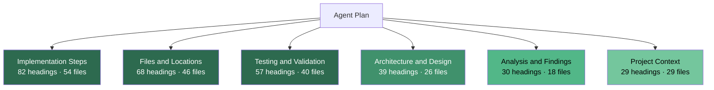
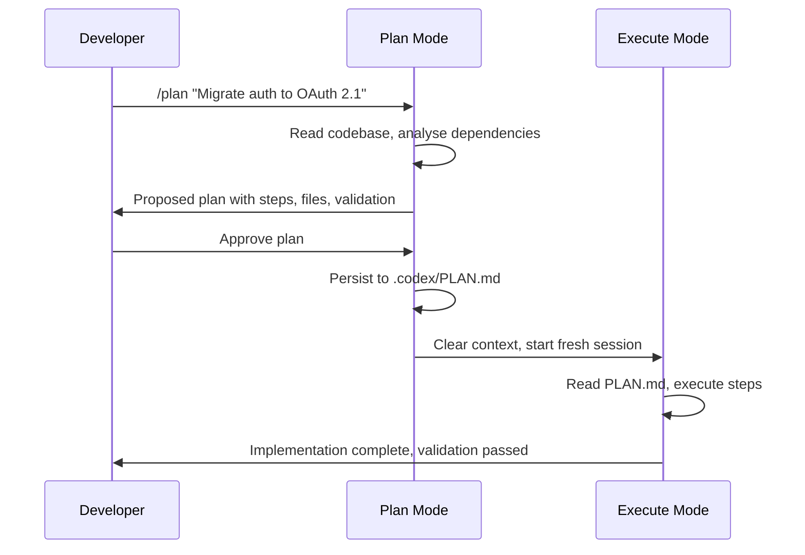

# Agent Plans and the Task Artifact Gap: What 85 Plan Files Reveal About How Developers Actually Guide Coding Agents — and How to Structure Your Codex CLI Plans


---

Everyone knows that AGENTS.md and CODEX.md set project-level context. But when you switch to plan mode — or write a plan file to `.codex/plans/` — what should actually go in it? Until now, the answer was folklore. A new empirical study mines 85 real-world Agent Plan files from GitHub repositories and reveals that three information categories dominate effective plans, most plans are ephemeral single-commit artifacts, and the gap between project-level context files and task-level guidance is wider than the tooling acknowledges.

## The Study: ESEM 2026

Abubakar et al. screened 36,710 GitHub repositories for Markdown plan files stored in tool-specific directories (`.cursor/plans/`, `.claude/plans/`, `.gemini/plans/`) [^1]. They found 85 plan files across just 10 repositories — a preservation rate of 0.027%. The scarcity itself is a finding: developers create plans locally but rarely commit them, treating them as disposable scaffolding rather than project documentation.

Of the 85 files, 72 came from `.cursor/plans/` and 13 from `.claude/plans/`. Zero files appeared in `.gemini/plans/` directories [^1]. The concentration was stark: 66 of the 85 files (77.6%) originated from a single repository (`forcedotcom/salesforcedx-vscode`), with one contributor authoring 64 of those 66 [^1].

## The Three Pillars of Effective Plans

The study's most actionable finding is the information category frequency analysis across 1,145 section headings. Three categories appeared in the majority of plan files and formed the core guidance pattern [^1]:

### 1. Implementation Steps (82 heading occurrences, 54 files)

The most frequent category. These sections describe concrete actions: update this file, remove that function, migrate this behaviour. They answer the question *what should the agent do?*

### 2. Files and Locations (68 occurrences, 46 files)

Specific packages, modules, test files, and schema paths requiring inspection or modification. These answer *where should the agent look?*

### 3. Testing and Validation (57 occurrences, 40 files)

Success criteria, test commands, and verification checks. These answer *how do we know it worked?*



The researchers propose a minimum viable plan check: any plan lacking one of these three categories is likely under-specified for operational guidance [^1]. This gives practitioners a lightweight readiness test before handing a plan to an agent.

## Plans Are Not AGENTS.md

A critical distinction the study draws is between *project-level context files* (AGENTS.md, CODEX.md, CLAUDE.md) and *task-level plan files*. The categories overlap only partially [^1]:

| Plan-Specific | Shared (Different Scope) |
|---|---|
| Implementation steps | Architecture and design |
| Files and locations | Testing and validation |
| Task breakdown | Tooling and build configuration |
| Analysis and findings | Design constraints |

Implementation steps, files and locations, and task breakdown have no parallel in AGENTS.md — they are inherently task-scoped [^1]. This means project context and task plans serve complementary rather than competing roles. You need both.

## The Ephemeral Artefact Problem

The study found that 78 of 85 plan files (91.8%) appeared in a single commit and were never revised [^1]. Only 7 files were touched across multiple commits. Most plan files carried no issue or pull-request references. The researchers characterise them as "ephemeral task records rather than intentionally maintained project artefacts" [^1].

This creates a knowledge loss problem. If the plan guided a successful refactoring, future developers (and future agent sessions) cannot learn from it. If the plan guided a failed attempt, there is no record of what was tried.

## What Developers Actually Plan For

Mapping plans to SWEBOK knowledge areas revealed the activity distribution [^1]:

| Activity | Plans | Percentage |
|---|---|---|
| Software Maintenance | 23 | 27.1% |
| Software Construction | 18 | 21.2% |
| Software Testing | 12 | 14.1% |
| Software Quality | 12 | 14.1% |
| Software Configuration Management | 10 | 11.8% |
| Software Engineering Process | 6 | 7.1% |
| Software Design | 5 | 5.9% |
| Software Security | 0 | 0.0% |

Maintenance dominates. The most common task-group was refactoring and migration (20 files), followed by testing and validation (12) and feature development (12) [^1]. Security-oriented plans were entirely absent — a gap worth noting given the emphasis on agent safety in recent research [^2].

## AI Co-Authorship Signals

43.1% of the commits containing plan files (31 of 72) included explicit AI co-authorship signals [^1]. The structural patterns were similar regardless of whether the plan was human-authored or AI-co-authored, suggesting that developers and agents converge on similar plan structures when the task is well-defined.

## Mapping to Codex CLI Plan Mode

Codex CLI's plan mode (`Shift+Tab` or `/plan`) implements the read-only exploration pattern that the study's plan files encode [^3]. The agent reads files, searches the codebase, and drafts a step-by-step plan without modifying anything. Once approved, the plan guides execution.

The study's three-pillar structure maps directly to how you should configure plan mode output:

### Structuring Plan Files in `.codex/plans/`

Based on the empirical evidence, a well-structured plan file should follow this template:

```toml
# ~/.codex/config.toml — plan mode configuration
plan_mode_reasoning_effort = "high"
model_reasoning_effort = "medium"
```

```markdown
# Plan: Migrate Authentication from JWT to OAuth 2.1

## Implementation Steps
1. Replace `jwt.verify()` calls in `src/auth/middleware.ts` with OAuth token introspection
2. Update `AuthConfig` interface in `src/types/auth.ts` to include OAuth client credentials
3. Remove deprecated `generateJWT()` from `src/auth/tokens.ts`
4. Add OAuth callback handler in `src/routes/auth.ts`

## Files and Locations
- `src/auth/middleware.ts` — primary authentication middleware
- `src/types/auth.ts` — type definitions requiring interface changes
- `src/auth/tokens.ts` — token generation (remove JWT, add OAuth helpers)
- `src/routes/auth.ts` — new callback route
- `tests/auth/` — all test files requiring updates

## Testing and Validation
- Run `npm test -- --grep "auth"` — all existing auth tests must pass or be updated
- Verify OAuth flow end-to-end: `curl -X POST /auth/callback`
- Check no JWT imports remain: `grep -r "jsonwebtoken" src/`
- Confirm token refresh works with expired tokens

## Architecture and Design
OAuth 2.1 chosen over OIDC to avoid unnecessary identity layer complexity.
Token introspection preferred over local validation for revocation support.

## Design Constraints
- Must remain backwards-compatible with existing session cookies for 2 weeks
- No new dependencies beyond `oauth4webapi` (already in lockfile)
```

### Using Plan Mode with Context Clearing

Codex CLI v0.147.0 supports persisting finalised plan output to `.codex/PLAN.md` and clearing context before implementation [^4]. This directly addresses the CCRM (Context-Contaminated Restart Model) finding that exploration context can contaminate execution [^5]. The workflow becomes:



### Named Profiles for Plan vs Execute

The study's finding that plan reasoning requires different depth than execution maps to Codex CLI's named profile system [^3]:

```toml
# ~/.codex/config.toml

[profile.architect]
model = "gpt-5.6-sol"
plan_mode_reasoning_effort = "high"
model_reasoning_effort = "low"

[profile.builder]
model = "gpt-5.6-terra"
plan_mode_reasoning_effort = "medium"
model_reasoning_effort = "medium"
```

Use `codex --profile architect` for complex planning tasks where the three-pillar structure matters most, and `codex --profile builder` for straightforward execution.

### Committing Plans: Breaking the Ephemeral Pattern

The study's finding that 91.8% of plans are single-commit artefacts suggests a missed opportunity. For non-trivial tasks, commit the plan alongside the implementation:

```bash
# After plan approval, before execution
git add .codex/plans/2026-08-09-oauth-migration.md
git commit -m "plan: OAuth 2.1 migration strategy

Covers: middleware replacement, type updates, callback handler,
test migration. Validated against existing auth test suite."
```

This creates an audit trail that future sessions — and future developers — can reference. AGENTS.md can then include a directive:

```markdown
## Planning Convention
Check `.codex/plans/` for existing plans before starting related work.
Reference completed plans in commit messages for traceability.
```

## The Minimum Viable Plan Checklist

Synthesising the study's findings into a practical checklist for Codex CLI users:

1. **Implementation steps present?** — Concrete actions, not vague goals. "Update `src/auth/middleware.ts` to use OAuth introspection" beats "migrate the auth system".
2. **Files and locations specified?** — Exact paths. The agent should not need to search for targets the developer already knows.
3. **Testing and validation defined?** — Specific commands and success criteria. "Run `npm test -- --grep auth`" beats "make sure tests pass".
4. **Architecture rationale included?** — Optional but valuable for complex tasks. Prevents the agent from making design decisions that contradict unstated assumptions.
5. **Constraints documented?** — Backwards-compatibility requirements, dependency restrictions, deadline-driven shortcuts.

Plans meeting criteria 1–3 are operationally complete. Plans meeting all five are robust against context loss and session boundaries.

## Limitations and Open Questions

The study's corpus is small (85 files, 10 repositories) with heavy concentration in a single Salesforce repository [^1]. The absence of `.gemini/plans/` files may reflect storage under alternative directories rather than non-use. The restriction to tool-specific directories means plans stored in `docs/plans/` or similar locations are invisible to the analysis.

The complete absence of security-oriented plans is noteworthy but may reflect the study's repository selection rather than a genuine gap in practice. Similarly, the study cannot capture locally stored plans that were never committed — and those may represent the majority of real usage.

⚠️ The 0.027% preservation rate should not be interpreted as a 0.027% usage rate. Community discussion and feature requests suggest plan creation is far more common than plan commitment [^4].

## Citations

[^1]: Abubakar, M.A., Mohsenimofidi, S., Lulla, J.L., Zhang, J.M., Treude, C., Baltes, S. & Galster, M. (2026). "An Exploratory Study of Agent Plans for Agentic AI Coding Tools in Open-Source Software." arXiv:2608.04661. Accepted at ESEM 2026 Emerging Results track. [https://arxiv.org/abs/2608.04661](https://arxiv.org/abs/2608.04661)

[^2]: Lin, J. et al. (2026). "DreamGuard: Risk-Aware World Model Runtime Guardrail for LLM Agents." arXiv:2608.05695. [https://arxiv.org/abs/2608.05695](https://arxiv.org/abs/2608.05695)

[^3]: OpenAI (2026). Codex CLI Documentation — Plan Mode and Named Profiles. [https://developers.openai.com/codex/models](https://developers.openai.com/codex/models)

[^4]: OpenAI (2026). "Plan / Spec Mode" — GitHub Discussion #7355. [https://github.com/openai/codex/discussions/7355](https://github.com/openai/codex/discussions/7355)

[^5]: Yang, C. (2026). "Context-Contaminated Restart Model." arXiv:2605.08563. [https://arxiv.org/abs/2605.08563](https://arxiv.org/abs/2605.08563)
