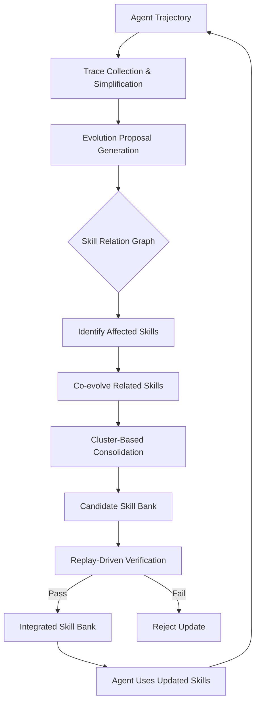
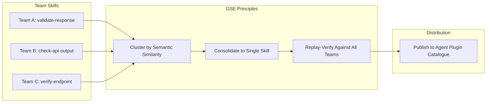

# GSE and the Skill Fragmentation Problem: Why Your Coding Agent's Learned Skills Overfit — and How Globalized Skill Evolution Maps to Codex CLI's Skill Architecture


---

Coding agents that learn from experience sound like the obvious next step. After watching an agent struggle through a bug-fix workflow, the natural instinct is to capture what worked and replay it next time. But a growing body of research shows that naïve skill evolution — the pattern where an agent distils trajectory-local lessons into skill files — produces skills that fragment, overfit, and silently conflict with each other.

GSE (Globalized Skill Evolution), published by Yang et al. on 6 August 2026 [^1], offers the first principled fix. The framework introduces a Skill Relation Graph, cluster-based consolidation, and replay-driven verification to produce skills that transfer across tasks rather than memorising one. The results are striking, and the architectural lessons map directly to how you should organise your Codex CLI skill library.

## The Fragmentation Problem

Every existing skill-evolution approach — Trace2Skill, CODESKILL [^2], Live-SWE-agent — treats skill updates as a sequence of local patches. An agent fails at a task, a post-mortem extracts a lesson, and that lesson becomes a new skill or amends an existing one. Repeat this a hundred times and three failure modes emerge:

1. **Overfitting**: Skills encode task-specific heuristics rather than generalisable capabilities. A skill learned from fixing a null-pointer exception in a Spring Boot controller bakes in assumptions about `@Autowired` injection that collapse when applied to a plain Java factory.

2. **Fragmentation**: The skill bank grows without consolidation. Two skills that address the same underlying capability — say, "validate method arguments before proceeding" — accumulate as separate entries with subtly different triggers, each consuming context tokens.

3. **Silent conflicts**: Skills that worked individually interfere when co-activated. A skill directing the agent to "always write unit tests before modifying production code" conflicts with another skill advising "minimise file touches to reduce merge-conflict risk."

GSE's evaluation quantifies this. On bug-revealing test generation across 108 buggy methods from Multi-SWE-Bench, the Trace2Skill baseline achieves F1 0.19 on OpenHands — barely better than human-written skills at F1 0.15 [^1]. The skills have learned, but they have learned the wrong things.

## How GSE Fixes It

GSE introduces three mechanisms that work in concert:

### Skill Relation Graph (SRG)

Rather than treating skills as independent documents, GSE maintains a directed graph G=(V,E) where nodes are skills and edges encode three relationship types [^1]:

- **Dependency**: Skill A relies on outputs or preconditions established by Skill B
- **Co-usage**: Skills A and B produce better outcomes when activated together in sequence
- **Conflict**: Skills A and B provide incompatible guidance and must not co-activate

When a skill update is proposed, the SRG identifies every related skill that might be affected and co-evolves them. This prevents the silent-conflict failure mode: if updating Skill A would break its relationship with Skill B, the framework detects and resolves the tension before integration.

### Cluster-Based Consolidation

Instead of merging each trajectory lesson directly into the skill bank, GSE groups locally validated proposals by the skills they affect, clusters new-skill proposals using semantic similarity of their rationales, and extracts common capability patterns from each cluster [^1]. The output is a candidate skill bank where overlapping lessons have been abstracted into a single, more general skill.

### Replay-Driven Verification

Before any consolidated skill enters the bank, GSE replays historical cases where the affected skills were previously activated. Only candidate banks that maintain or improve performance on these replay sets are accepted [^1]. This is the overfitting circuit-breaker: a skill that scores well on the task that generated it but degrades performance on earlier tasks gets rejected.



## The Numbers

GSE was evaluated on two tasks — bug-revealing test generation and false-positive bug report filtering — across OpenHands and mini-SWE-agent, using DeepSeek-V4-Flash as the underlying LLM [^1].

### Bug-Revealing Test Generation (108 methods, Multi-SWE-Bench)

| Agent | Method | Precision | Recall | F1 |
|---|---|---|---|---|
| OpenHands | Vanilla | 0.27 | 0.10 | 0.15 |
| OpenHands | Human-written skills | 0.33 | 0.10 | 0.15 |
| OpenHands | Trace2Skill | 0.31 | 0.14 | 0.19 |
| OpenHands | **GSE** | **0.35** | **0.28** | **0.31** |
| mini-SWE-agent | Vanilla | 0.41 | 0.10 | 0.16 |
| mini-SWE-agent | Trace2Skill | 0.41 | 0.22 | 0.29 |
| mini-SWE-agent | **GSE** | **0.55** | **0.29** | **0.38** |

### False-Positive Bug Report Filtering (500 reports, IndustrialBugs)

| Agent | Method | Precision | Recall | F1 |
|---|---|---|---|---|
| OpenHands | Vanilla | 0.27 | 0.72 | 0.39 |
| OpenHands | Trace2Skill | 0.29 | 0.84 | 0.43 |
| OpenHands | **GSE** | **0.55** | **0.95** | **0.70** |
| mini-SWE-agent | Vanilla | 0.26 | 0.53 | 0.35 |
| mini-SWE-agent | Trace2Skill | 0.25 | 0.84 | 0.39 |
| mini-SWE-agent | **GSE** | **0.30** | **0.97** | **0.46** |

The recall improvements are particularly telling. On OpenHands false-positive filtering, GSE achieves 0.95 recall versus Trace2Skill's 0.84 — the consolidated skills catch cases that fragmented, overfit skills miss [^1].

### Industrial Deployment

ByteDance deployed GSE on a proprietary coding agent for production false-positive filtering across 8 Go repositories (12.8–186.3 KLoC each). The F1 score jumped from 0.43 to 0.71 — a 61.4% improvement [^1]. This is not a benchmark artefact; it is a production gain on real code at scale.

### Ablation

The ablation study confirms both components contribute independently [^1]:

- Removing the SRG drops OpenHands false-positive F1 from 0.70 to 0.59
- Removing skill generalisation drops the same metric from 0.70 to 0.54
- Removing both collapses performance to near-baseline levels

## What This Means for Codex CLI

Codex CLI's skill architecture — SKILL.md files with progressive disclosure, four-scope precedence, and Agent Plugin distribution [^3] — is already well-positioned to benefit from GSE's principles. But most teams are not applying them. Here is how to close the gap.

### Map the SRG to Your Skill Directory

Codex CLI discovers skills through a BFS scan across four scopes: repository, user, admin, and system [^3]. Each skill is a directory containing a `SKILL.md` with YAML frontmatter (`name` and `description`) and optional scripts, references, and configuration [^3].

What this structure lacks is explicit relationship modelling. Two skills in the same repository scope might conflict, and you will not know until they co-activate and produce contradictory guidance.

**Practical fix**: maintain a `SKILL-RELATIONS.md` at the root of your `.agents/skills/` directory documenting dependency, co-usage, and conflict relationships. Use the `description` field in each `SKILL.md` to encode trigger exclusions:

```yaml
---
name: "argument-validation"
description: >
  Validates method arguments before proceeding with implementation.
  Use when implementing public API methods or service endpoints.
  DO NOT use alongside defensive-coding-style skill (conflict).
---
```

### Use Progressive Disclosure as a Consolidation Signal

Codex CLI's progressive-disclosure mechanism loads only skill names and descriptions into the context window initially, consuming at most 2% of the window or 8,000 characters [^3]. Full instructions load only when a skill is selected. If your skill library has grown beyond 30 entries and Codex is truncating descriptions, that is a consolidation signal — you have fragmented skills that should be clustered.

GSE's cluster-based consolidation groups skills by semantic similarity of their rationales [^1]. You can approximate this manually: review skills whose descriptions overlap, merge them into a single skill with a broader scope, and archive the originals.

### Implement Replay Verification with `codex exec`

GSE's replay-driven verification validates new skills against historical cases [^1]. In Codex CLI, you can replicate this with `codex exec`:

```bash
# Run a historical task with the updated skill bank
codex exec \
  --sandbox workspace-write \
  --model gpt-5.6-terra \
  "Reproduce and fix the null-pointer exception in UserService.java \
   using the skills in .agents/skills/"

# Compare output against known-good patch
diff expected-patch.diff actual-patch.diff
```

Build a library of regression test prompts — one per skill — and run them after any skill update. If a consolidated skill degrades performance on a task the original handled correctly, roll back.

### Configure Named Profiles for Skill-Sensitive Workflows

Different model tiers interact differently with skills. CODESKILL's evaluation shows that skill quality has higher leverage on weaker models [^2], and GSE's own results confirm this pattern: mini-SWE-agent benefits more from GSE's consolidation than OpenHands does on several metrics [^1].

In Codex CLI, use named profiles to match skill-loading behaviour to model capability:

```toml
# ~/.codex/config.toml

[profile.skill-evolution]
model = "gpt-5.6-terra"
approval_policy = "unless-allow-listed"

[profile.skill-light]
model = "gpt-5.6-luna"
approval_policy = "on-failure"
```

Reserve the Terra tier for skill-evolution workflows where the model needs to reason about inter-skill relationships. Use Luna for execution with a mature, consolidated skill bank where the skills themselves encode the reasoning.

### Leverage Agent Plugins for Portable Skills

Codex CLI v0.147.0 introduced portable Agent Plugins searchable across four catalogue scopes: local, personal, workspace, and remote [^4]. This distribution mechanism is the natural channel for sharing consolidated skills across teams.

The risk is distribution without consolidation. If three teams each publish their own "validate-api-response" skill to a shared remote catalogue, you have replicated the fragmentation problem at organisational scale. Apply GSE's principles before publishing: cluster semantically similar skills, verify the consolidated version against all contributing teams' test cases, and publish one canonical skill.



## The Broader Skill-Evolution Landscape

GSE arrives in a crowded field. CODESKILL (May 2026) uses reinforcement learning with hybrid rewards to train a skill-extraction policy, achieving a 9.69% pass-rate improvement over no-skill baselines [^2]. SkillComposer (June 2026) focuses on composing skills for both specification and generalisation [^5]. MetaSkill-Evolve (July 2026) applies two-timescale meta-learning to recursive self-improvement [^6].

What distinguishes GSE is its explicit treatment of inter-skill relationships and its insistence on replay verification before integration. The SRG is not just a modelling convenience — the ablation shows it contributes independently to performance [^1]. For Codex CLI users, this means skill management is not a filing problem; it is an engineering discipline that requires relationship tracking, consolidation, and regression testing.

## Key Takeaways

1. **Skill fragmentation is measurable**: GSE shows that naïve evolution (Trace2Skill) barely improves on human-written skills for test generation (F1 0.19 vs 0.15 on OpenHands) [^1]
2. **Consolidation unlocks recall**: Clustering semantically similar skills and abstracting common patterns lifts recall dramatically (0.84 → 0.95 on false-positive filtering) [^1]
3. **Replay verification prevents regression**: The ablation confirms that removing verification drops F1 by 0.16 on OpenHands [^1]
4. **Map GSE to Codex CLI**: Use `SKILL.md` descriptions for conflict documentation, progressive-disclosure warnings as consolidation signals, `codex exec` for replay verification, and Agent Plugin catalogues for controlled distribution [^3][^4]
5. **Production gains are real**: ByteDance's 61.4% F1 improvement on production Go code confirms this is not benchmark theatre [^1]

---

## Citations

[^1]: Yang, C., Tian, J., Wang, Z., Liu, X., Ye, M. & Chen, J. (2026). "Learning Globally Reusable Skills for Coding Agents." *arXiv preprint arXiv:2608.06153*. [https://arxiv.org/abs/2608.06153](https://arxiv.org/abs/2608.06153)

[^2]: CODESKILL (2026). "CODESKILL: Learning Self-Evolving Skills for Coding Agents." *arXiv preprint arXiv:2605.25430*. [https://arxiv.org/abs/2605.25430](https://arxiv.org/abs/2605.25430)

[^3]: OpenAI (2026). "Build Skills — Codex CLI Documentation." [https://learn.chatgpt.com/docs/build-skills](https://learn.chatgpt.com/docs/build-skills)

[^4]: OpenAI (2026). "Codex CLI Changelog — v0.147.0, 7 August 2026." [https://learn.chatgpt.com/docs/changelog](https://learn.chatgpt.com/docs/changelog)

[^5]: SkillComposer (2026). "SkillComposer: Learning to Evolve Agent Skills for Specification and Generalization." *arXiv preprint arXiv:2606.06079*. [https://arxiv.org/abs/2606.06079](https://arxiv.org/abs/2606.06079)

[^6]: MetaSkill-Evolve (2026). "MetaSkill-Evolve: Recursive Self-Improvement of LLM Agents via Two-Timescale Meta-Skill Evolution." *arXiv preprint arXiv:2607.05297*. [https://arxiv.org/abs/2607.05297](https://arxiv.org/abs/2607.05297)
