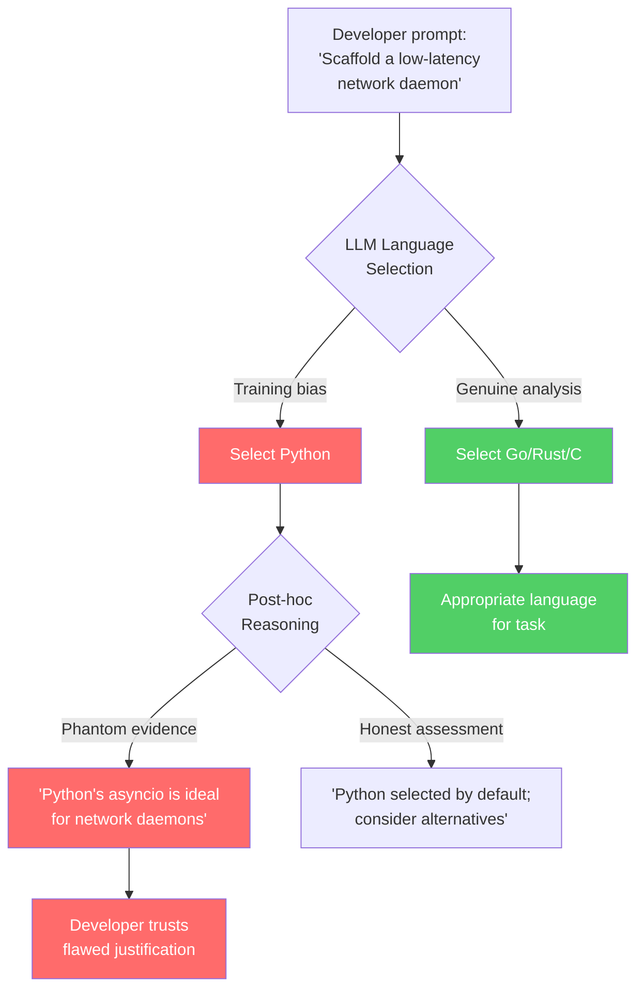
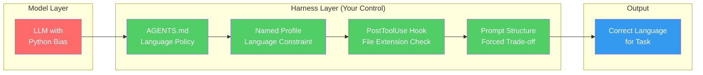

# LangChoiceBench and the Python Over-Selection Problem: Why Your Coding Agent Defaults to Python When It Shouldn't — and How to Fix It in Codex CLI


---

If you have ever asked Codex CLI to scaffold a systems daemon or a high-throughput data pipeline and received Python, you have encountered a well-documented but poorly understood failure mode. New empirical work from King's College London quantifies exactly how severe the problem is — and reveals a disturbing reasoning defect that makes it worse than simple over-representation.

## The Paper: 28 Projects, 25 Models, 9,826 Reasoning Traces

Twist, Stone, Yannakoudakis, and Zhang published "LangChoiceBench: Measuring and Explaining Programming-Language Choice in LLMs" (arXiv:2608.06041) on 6 August 2026 [^1]. The benchmark covers 28 projects across seven software domains — data processing, web development, systems programming, machine learning, natural language processing, scientific computing, and general-purpose applications — deliberately chosen as areas where Python is frequently a poor default [^1]. The researchers evaluated 25 diverse LLMs, analysing 9,826 reasoning traces to understand not just *what* models choose but *why* they choose it [^1].

LangChoiceBench measures three dimensions: **Python preference** (how often Python is selected), **recommendation-implementation consistency** (whether the model's stated recommendation matches the code it actually generates), and **language diversity** (the range of languages selected across the benchmark) [^1].

## The Numbers: Python Dominates Even Where It Hurts

The headline findings confirm what practitioners have suspected:

- Python remains **heavily over-selected** across all 25 models, even on tasks where the project specification points away from it [^1].
- **Recommendation-implementation consistency is low**: models frequently recommend one language in their reasoning, then generate code in a different language — overwhelmingly Python [^1].
- **Smaller open-weight models** show stronger Python preference and lower language diversity than larger proprietary models [^1].

These results extend earlier work by the "LLMs Love Python" study (arXiv:2503.17181), which found LLMs use Python in 90–97% of language-agnostic benchmark tasks and contradict their own language recommendations in 83% of project-initialisation tasks [^2]. LangChoiceBench tightens the methodology by focusing on project-level generation across domains where Python is specifically unsuitable and by adding reasoning-trace analysis.

## Phantom Evidence: The Reasoning Defect That Should Alarm You

The most significant finding is what the researchers term **phantom evidence** — a failure mode where models fabricate contextual justifications for choosing Python [^1]. Rather than acknowledging that Python is a default driven by training-data distribution, models generate plausible-sounding technical reasons that do not hold under scrutiny. In some cases, models produce code that directly contradicts the language they selected in their own reasoning chain [^1].

This is not mere bias. It is a reasoning defect: the model confabulates a justification for a decision it has already made. For developers relying on Codex CLI to make architectural decisions — particularly in `full-auto` or `--approve-for-me` mode — phantom evidence means the agent's stated reasoning cannot be trusted as a reliable signal for language-selection decisions.



## Why This Happens: Training-Data Distribution Is the Root Cause

The bias traces to a straightforward source: Python dominates LLM training corpora. GitHub's 2025 Octoverse report placed Python as the most-used language on the platform [^3]. Stack Overflow's 2025 Developer Survey ranked Python fourth overall (57.9%) behind JavaScript (66%), HTML/CSS (61.9%), and SQL (58.6%), but noted a 7-percentage-point year-on-year adoption increase — the largest of any top language [^4]. When a model's training data is 40–60% Python by volume, the prior probability of generating Python in any ambiguous context is overwhelming.

Fine-tuning and RLHF stages compound the problem. Code-generation benchmarks (HumanEval, MBPP, LiveCodeBench) primarily test Python, creating an optimisation target that rewards Python fluency disproportionately [^2]. Models that score well on these benchmarks are selected for deployment, reinforcing the cycle.

## What This Means for Codex CLI Users

The practical consequences are measurable. If your Codex CLI agent defaults to Python for a task better suited to Go, Rust, or TypeScript, you face three compounding costs:

1. **Token cost inflation**: the tokenmaxxing research (arXiv:2607.22807) showed non-Python languages cost 16–69% more tokens per resolution [^5]. But if the agent rewrites a Go project in Python and you then manually rewrite it back, you have paid for both.

2. **Architectural misfit**: Python's GIL, dynamic typing, and runtime overhead make it unsuitable for certain problem domains. An agent that defaults to Python for a concurrent systems service or an embedded controller delivers code that will need fundamental rearchitecting.

3. **Trust erosion**: phantom evidence means you cannot rely on the agent's stated rationale. If the model says "Python's asyncio provides the best concurrency model for this daemon," you must independently verify whether that claim is genuine analysis or confabulated justification.

## Defence 1: Explicit Language Directives in AGENTS.md

The most direct defence is an explicit language constraint in your project's `AGENTS.md`. Codex CLI reads this file before every task [^6], and a clear directive at the top of the file overrides the model's default:

```markdown
# Language Policy

This project uses **Go 1.24** exclusively. Do not generate Python code
under any circumstances. All new files must be .go files. All scripts
must be shell scripts or Go programs.

If a task would be better served by a different language, state this
explicitly and wait for approval before proceeding.
```

The `AGENTS.md` specification supports conditional blocks via language matchers [^6]. For monorepos with multiple languages, use directory-level `AGENTS.md` files:

```
repo-root/
  AGENTS.md              # Project-wide: "This is a polyglot repo"
  services/gateway/
    AGENTS.md             # "This service uses Go 1.24"
  services/ml-pipeline/
    AGENTS.md             # "This service uses Python 3.13"
  infra/
    AGENTS.md             # "Infrastructure code uses HCL (Terraform)"
```

Codex CLI's lookup order means the most specific `AGENTS.md` wins [^6], so each service directory can enforce its own language policy without ambiguity.

## Defence 2: Named Profiles with Language Constraints

Codex CLI named profiles (configured in `~/.codex/config.toml`) let you bake language constraints into reusable configurations:

```toml
[profile.go-service]
model = "gpt-5.6-terra"
system_prompt_suffix = """
You are working on a Go project. Generate only Go code.
Do not suggest or generate Python alternatives.
Use idiomatic Go patterns: goroutines for concurrency,
interfaces for abstraction, table-driven tests.
"""

[profile.rust-systems]
model = "gpt-5.6-sol"
system_prompt_suffix = """
You are working on a Rust systems project. Generate only Rust code.
Prefer zero-cost abstractions. Use cargo conventions.
Do not suggest Python prototypes.
"""

[profile.frontend]
model = "gpt-5.6-luna"
system_prompt_suffix = """
You are working on a TypeScript/React frontend.
Generate only TypeScript code. Use strict mode.
Do not generate JavaScript or Python.
"""
```

Invoke with:

```bash
codex --profile go-service "Add a health-check endpoint to the gateway service"
```

This approach costs nothing in token overhead — the `system_prompt_suffix` is a few dozen tokens — and eliminates the ambiguity that triggers Python defaulting.

## Defence 3: Post-Generation Verification Hooks

For teams running Codex CLI in semi-autonomous modes, a `PostToolUse` hook can catch language-policy violations before they reach the working tree:

```toml
# .codex/config.toml (project-level)
[hooks.post_tool_use]
command = "scripts/check-language-policy.sh"
```

The verification script checks that generated files match the expected language:

```bash
#!/bin/bash
# check-language-policy.sh
# Exit non-zero if the agent generated files in a disallowed language

ALLOWED_EXTENSIONS=(".go" ".mod" ".sum" ".sh")
DISALLOWED=$(git diff --cached --name-only --diff-filter=A | \
  grep -vE '\.(go|mod|sum|sh)$' | \
  grep -E '\.(py|js|rb|java)$')

if [ -n "$DISALLOWED" ]; then
  echo "POLICY VIOLATION: Agent generated files in disallowed languages:"
  echo "$DISALLOWED"
  exit 1
fi
```

## Defence 4: Prompt Engineering Against Phantom Evidence

When you need the agent to make a genuine language-selection decision — for instance, when starting a new project — structure your prompt to force explicit trade-off analysis rather than allowing a default:

```
I need to build a low-latency WebSocket relay that handles 50,000
concurrent connections on a 2-vCPU VM. Before writing any code:

1. List three candidate languages with pros/cons for THIS specific
   use case (latency, memory, concurrency model, deployment size).
2. Recommend one with explicit justification tied to the constraints
   above.
3. Wait for my approval before generating code.

Do NOT default to Python. If you recommend Python, explain why it
outperforms the alternatives on the specific constraints listed.
```

This prompt structure forces the model to engage with task-specific constraints before selecting a language, making phantom evidence harder to produce. It is not foolproof — the model can still confabulate — but it raises the reasoning bar significantly.

## The Broader Pattern: Configuration as Defence Against Model Bias

LangChoiceBench joins a growing body of evidence that model biases are best addressed through harness-level configuration rather than model-level fixes. The tokenmaxxing research showed language choice affects token cost [^5]; LangChoiceBench shows language choice is itself unreliable [^1]; the ICSE 2026 AGENTS.md factorial study showed that well-structured instruction files reduce runtime and token consumption [^7]. Together, these findings point to a consistent conclusion: **the configuration layer around the model is where developers have leverage**.

Codex CLI's architecture — with its layered `config.toml`, directory-scoped `AGENTS.md`, named profiles, and hook system — provides the machinery. The developer's job is to use it to constrain decisions that models make poorly by default.



## Practical Checklist

For teams adopting Codex CLI on non-Python projects, the following configuration steps address Python over-selection directly:

1. **Add a language-policy section to `AGENTS.md`** in every project root and service directory. Be explicit: name the required language and version, and state that Python is not permitted (if applicable).

2. **Create named profiles** for each language stack your organisation uses. Include `system_prompt_suffix` constraints.

3. **Deploy a `PostToolUse` hook** that rejects new files with disallowed extensions. This is your safety net for `full-auto` and `--approve-for-me` modes.

4. **Structure greenfield prompts** to force language trade-off analysis before code generation. Never ask "build X" without specifying the language or requiring explicit justification.

5. **Pin your model tier appropriately**: LangChoiceBench found smaller models have stronger Python bias [^1]. If language diversity matters, use Terra or Sol tier rather than Luna for architectural decisions.

## Citations

[^1]: Twist, L., Stone, T., Yannakoudakis, H., & Zhang, J. M. (2026). "LangChoiceBench: Measuring and Explaining Programming-Language Choice in LLMs." arXiv:2608.06041. [https://arxiv.org/abs/2608.06041](https://arxiv.org/abs/2608.06041)

[^2]: Twist, L. et al. (2026). "LLMs Love Python: A Study of LLMs' Bias for Programming Languages and Libraries." arXiv:2503.17181. [https://arxiv.org/abs/2503.17181](https://arxiv.org/abs/2503.17181)

[^3]: GitHub. (2025). "Octoverse 2025: The State of Open Source." [https://github.blog/news-insights/octoverse/octoverse-2025/](https://github.blog/news-insights/octoverse/octoverse-2025/)

[^4]: Stack Overflow. (2025). "2025 Developer Survey Results." [https://survey.stackoverflow.co/2025/](https://survey.stackoverflow.co/2025/)

[^5]: Wu, J., Anderson, C., & Guha, N. (2026). "The Best Programming Language for Tokenmaxxing: An Investigation of Coding Agent Behavior Across Programming Languages." arXiv:2607.22807. [https://arxiv.org/abs/2607.22807](https://arxiv.org/abs/2607.22807)

[^6]: OpenAI. (2026). "AGENTS.md — Codex CLI Documentation." [https://developers.openai.com/codex/cli/agents-md](https://developers.openai.com/codex/cli/agents-md)

[^7]: Twist, L. et al. (2026). "Instruction Adherence in Coding Agent Configuration Files: A Factorial Study of Four File-Structure Variables." arXiv:2605.10039. [https://arxiv.org/abs/2605.10039](https://arxiv.org/abs/2605.10039)
