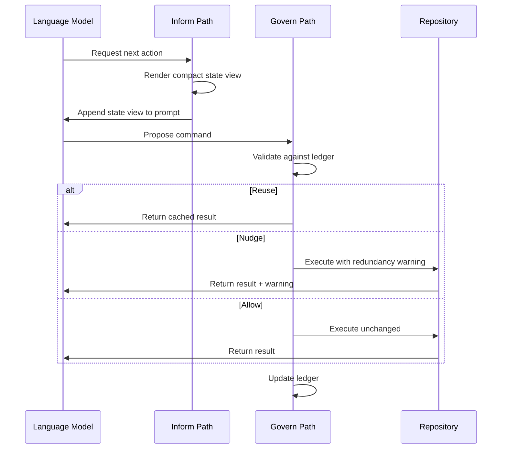
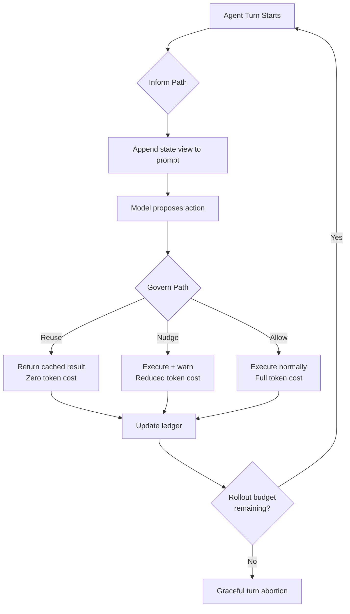

# Ledger and the Execution State Blindspot: Why Your Long-Horizon Coding Agent Forgets What It Already Knows — and How to Build an Inform-Govern Layer in Codex CLI


---

Your coding agent reads a file on turn 3, edits it on turn 11, then reads the exact same file again on turn 14 — not because it needs a fresh copy, but because nothing in its context tells it the earlier read is stale. That redundant re-read costs tokens, extends the session, and occasionally leads to decisions based on cached content that no longer matches the repository. Wang et al.'s Ledger system, published this week, puts hard numbers on this problem — and offers a deterministic fix that maps directly onto Codex CLI's hook architecture [^1].

## The Problem: Interaction History Is Not Execution State

Every coding agent scaffold — Codex CLI included — maintains a conversation history: a linear sequence of prompts, tool calls, and tool outputs. As sessions grow beyond a hundred turns, that history becomes an increasingly unreliable proxy for the repository's actual state. Wang et al. identify two concrete failure modes [^1]:

1. **Stale observations.** The agent read `src/parser.rs` forty turns ago. Since then, three edits have touched that file. Nothing in the prompt explicitly marks the earlier observation as invalid.

2. **Redundant re-execution.** The agent re-runs a `grep` it already ran, or re-reads a file that hasn't changed since its last read. Prior research shows failed trajectories are consistently longer than successful ones, despite defects being identified in 72–81% of failing runs — the additional length reflects effort spent re-covering ground already explored [^1].

The root cause is that interaction history records *what happened* but not *what is still true*. Context compaction — summarising history to fit the context window — compounds the issue by discarding the very details needed to distinguish current from stale observations [^2].

## Ledger: A Deterministic Runtime Layer

Ledger is not a model, a prompt template, or a learned summariser. It is a deterministic system that sits between the scaffold and the language model, maintaining an online execution ledger that tracks three elements [^1]:

- **Observation records**: file, portion returned, and change-counter values at observation time
- **Modification state**: per-file local change counters and a global repository change counter
- **Command records**: normalised command representations with operational categories (inspection, search, testing, modification)

The system operates at two boundaries of each agent step:



### The Inform Path

Before decision-making, the system appends a compact runtime state view to the prompt containing three components [^1]:

- A **fixed task anchor** (the original issue description)
- A **current focus** listing recently modified files
- An **observation index** showing which files have been viewed, their covered line ranges, and whether the content remains current

Freshness is determined by comparing stored change counters against current values — not by asking the model to judge. Content that has been invalidated by subsequent edits is explicitly marked as potentially stale.

### The Govern Path

Before command execution, the ledger validates proposals against its records with three possible outcomes [^1]:

- **Allow**: execute unchanged
- **Reuse**: suppress the command entirely and return a reference to the earlier equivalent result
- **Nudge**: execute but augment the observation with a redundancy warning

The governing policy applies reuse only to inspection and search commands when prior results remain valid. Test commands receive nudge treatment rather than reuse, preserving intentional re-runs — a sensible distinction that recognises tests can legitimately be re-executed after code changes.

## The Numbers

Wang et al. evaluate Ledger on 500 SWE-bench Verified instances across three model configurations [^1]:

| Model | Baseline Pass@1 | With Ledger | Δ | Cost Reduction |
|-------|-----------------|-------------|---|----------------|
| GPT-5 mini | 56.2% | 64.2% | +8.0 pp | −28.9% |
| MiniMax M2.5 | 75.8% | 81.0% | +5.2 pp | −31.8% |
| OpenAI Codex | 74.8% | 78.2% | +3.4 pp | −24.4% |

The improvements are statistically significant (McNemar's test, p<0.001 for GPT-5 mini, p<0.01 for MiniMax M2.5) [^1].

Token reductions are substantial: 53.1% fewer input tokens for MiniMax M2.5, and 33.1% for OpenAI Codex. Model calls dropped by 31.9% and 17.9% respectively [^1].

### Ablation: Inform vs Govern

The ablation study reveals complementary mechanisms [^1]:

| Component | GPT-5 mini Resolved | MiniMax M2.5 Resolved |
|-----------|--------------------|-----------------------|
| Baseline | 281/500 | 379/500 |
| Inform only | 320/500 | 385/500 |
| Govern only | 321/500 | 402/500 |
| Full system | 321/500 | 405/500 |

Govern contributes the larger and more consistent resolution gain. Inform is the main source of reductions in calls and input tokens. The two compose: neither subsumes the other.

## Mapping Ledger to Codex CLI

Codex CLI does not ship a built-in execution ledger, but its extensibility points let you build one. Here is how the Ledger architecture maps to current Codex CLI infrastructure (v0.147.0):

### 1. PostToolUse Hooks as the Govern Path

Codex CLI's `PostToolUse` hooks fire after every tool call completes, receiving the tool name, command, and output [^3]. A hook script can maintain an external ledger file and implement the reuse/nudge/allow logic:

```bash
#!/usr/bin/env bash
# hooks/posttooluse-ledger.sh
# Simplified govern-path implementation

LEDGER_FILE="${CODEX_SESSION_DIR:-/tmp}/.execution-ledger.json"
TOOL_NAME="$1"
COMMAND="$2"
OUTPUT="$3"

# Normalise command (strip leading cd, collapse whitespace)
NORMALISED=$(echo "$COMMAND" | sed 's/^cd [^;]*;//' | tr -s ' ')

# Check for exact prior execution with unchanged files
if jq -e --arg cmd "$NORMALISED" \
   '.commands[] | select(.normalised == $cmd and .valid == true)' \
   "$LEDGER_FILE" 2>/dev/null; then
    echo "NUDGE: This command was previously executed with identical results."
    echo "Prior output is still valid — consider whether re-execution is necessary."
fi

# Update ledger with new command record
jq --arg cmd "$NORMALISED" --arg tool "$TOOL_NAME" \
   '.commands += [{"normalised": $cmd, "tool": $tool, "valid": true, "turn": (now | floor)}]' \
   "$LEDGER_FILE" > "${LEDGER_FILE}.tmp" && mv "${LEDGER_FILE}.tmp" "$LEDGER_FILE"
```

### 2. AGENTS.md as the Inform Path

The inform path's compact state view can be approximated through AGENTS.md directives that instruct the model to maintain awareness of its own execution state [^4]:

```markdown
## Execution State Discipline

Before reading a file you have already read in this session:
1. Check whether you have modified that file since the last read.
2. If no modification occurred, use the previously observed content.
3. If a modification occurred, re-read only the modified sections.

Before running a search command (grep, find, glob):
1. Check whether the search target directory has been modified since the last identical search.
2. If unchanged, state "reusing prior search results" and proceed with the cached output.

Track your exploration state explicitly:
- Maintain a mental list of files read and their modification status.
- When compaction occurs, prioritise retaining file-modification state over raw content.
```

### 3. Context Compaction Configuration

Codex CLI's `model_auto_compact_token_limit` controls when automatic history compaction fires [^5]. The Ledger research shows that compaction destroys execution state — the very information most valuable for avoiding redundant work. Configure compaction to preserve state awareness:

```toml
# config.toml — preserve execution state through compaction
[model]
model_auto_compact_token_limit = 180000  # defer compaction

[compaction]
compact_prompt = """
Summarise the conversation, preserving:
1. All files read and their modification status (changed/unchanged since last read)
2. All search commands run and whether their results remain valid
3. The current task state and remaining work items
4. Any test results and whether they were run before or after the latest edit

Do NOT discard file observation records or modification tracking.
"""
```

### 4. Named Profiles for State-Aware Workflows

The Ledger findings show that weaker models benefit more from execution state tracking (GPT-5 mini gained +8.0 pp vs Codex's +3.4 pp) [^1]. This suggests model-dependent configuration:

```toml
# profiles/state-aware-luna.toml — for GPT-5.6 Luna on long sessions
[model]
model = "gpt-5.6-luna"
model_auto_compact_token_limit = 150000

[hooks]
# Aggressive state tracking for weaker models
posttooluse = "hooks/posttooluse-ledger.sh"
```

```toml
# profiles/state-aware-terra.toml — lighter touch for stronger models
[model]
model = "gpt-5.6-terra"
model_auto_compact_token_limit = 200000

[hooks]
posttooluse = "hooks/posttooluse-ledger.sh"
```

### 5. Rollout Token Budgets as a Complementary Mechanism

Codex CLI v0.147's rollout token budgets provide weighted token accounting and soft turn abortion [^6]. Combined with Ledger-style state tracking, you can ensure that token budget exhaustion is driven by productive work rather than redundant re-reads:



## What This Means in Practice

The Ledger research quantifies something many Codex CLI power users have intuited: long sessions degrade not because models get worse but because the scaffold stops telling the model what is still true. Three practical takeaways:

1. **State tracking is cheap, redundancy is expensive.** Ledger's deterministic ledger requires zero model calls to maintain, yet saves 24–32% of total session cost. A PostToolUse hook implementing even basic command deduplication would pay for itself within a few turns.

2. **Inform and govern serve different purposes.** Telling the model what is stale (inform) reduces token volume. Preventing redundant commands from executing (govern) improves resolution rates. You need both — AGENTS.md directives alone are insufficient without enforcement.

3. **Weaker models benefit most.** If you are routing Luna-tier work through Codex CLI's named profiles, state-aware hooks are not optional — they are the difference between GPT-5 mini's 56.2% and 64.2% resolution rate on the same benchmark. ⚠️ *Note: the GPT-5 mini results are from the paper's specific scaffold configuration and may not directly transfer to Codex CLI's scaffold without adaptation.*

## Limitations and Open Questions

Ledger tracks file-level freshness via change counters, which is coarser than the sub-path granularity explored in EA-Graph's artifact-anchored verification memory [^7]. A line-range-aware ledger could further reduce false staleness claims but would add implementation complexity.

The govern path's reuse policy is intentionally conservative — only inspection and search commands are eligible. Whether test commands should be reusable after verified no-change intervals remains an open question for production deployments.

Finally, the system's transfer to OpenAI Codex required only a thin adapter layer, but Codex CLI's hook architecture means the govern path cannot suppress tool execution entirely — it can only append advisory output. A deeper integration, perhaps via a PreToolUse hook that returns `reject` for provably redundant commands, would more faithfully implement the reuse mechanism.

## Citations

[^1]: Z. Wang, Y. Xu, C. Li, C. Peng, B. Adams, A. E. Hassan, and T.-H. Chen, "Turning Interaction History into Execution State: A Runtime Layer for Long-Horizon Coding Agents," arXiv:2608.00808, August 2026. [https://arxiv.org/abs/2608.00808](https://arxiv.org/abs/2608.00808)

[^2]: "Token Reduction Is Not Cost Reduction: What Prompt-Cache Economics Mean for Your Codex CLI Cost Strategy," Codex Knowledge Base, August 2026. Context compaction destroying cache hit rates and verbatim edit anchors.

[^3]: OpenAI, "Hooks — Codex CLI Documentation," 2026. [https://developers.openai.com/codex/hooks](https://developers.openai.com/codex/hooks)

[^4]: OpenAI, "AGENTS.md — Codex CLI Documentation," 2026. [https://developers.openai.com/codex/agents-md](https://developers.openai.com/codex/agents-md)

[^5]: S. Zhou, "Investigating how Codex context compaction works," 2026. [https://simzhou.com/en/posts/2026/how-codex-compacts-context/](https://simzhou.com/en/posts/2026/how-codex-compacts-context/)

[^6]: OpenAI, Codex CLI v0.147.0 release — rollout token budgets with shared accounting, weighted limits, and graceful turn abortion, August 2026. [https://github.com/openai/codex/releases](https://github.com/openai/codex/releases)

[^7]: K. Hsu, W. Chi, and R. Everett, "EA-Graph: Artifact-Anchored Verification Memory for Coding Agents," arXiv:2608.04278, August 2026. [https://arxiv.org/abs/2608.04278](https://arxiv.org/abs/2608.04278)
