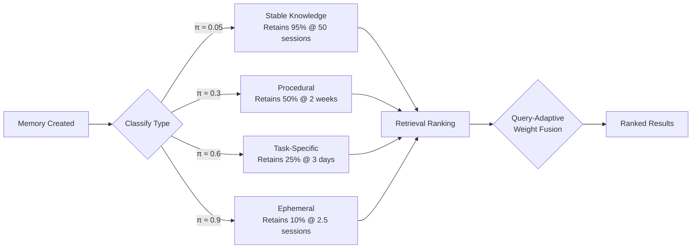
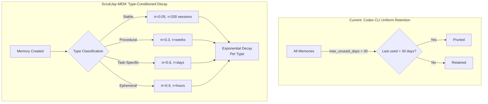

# ScrubJay-MEM and the Temporal Decay Problem: Why Your Coding Agent Treats Every Memory as Equally Fresh — and How Type-Conditioned Perishability Maps to Codex CLI's Retention Pipeline


---

Your coding agent remembers that you prefer tabs over spaces. It also remembers that yesterday's sprint planning moved the auth refactor to ticket PROJ-847. Six weeks from now, both memories sit at identical priority in the retrieval index. One is still useful. The other is noise — worse than noise, because it displaces something relevant.

This is the temporal decay problem: agent memory systems that lack type-conditioned perishability treat every stored fact as equally durable, flooding retrieval with stale context that degrades generation quality. Bhandari et al.'s ScrubJay-MEM framework, published on 5 August 2026, borrows from Western scrub jay cognition to solve it — and its architecture maps surprisingly well onto Codex CLI's existing two-phase memory pipeline[^1].

## The Biological Insight

Western scrub jays cache food across dozens of sites and recover items selectively based on what they stored, where they stored it, and how long ago[^2]. Critically, they adjust retrieval strategy based on item perishability: worms are recovered quickly (they rot), peanuts are recovered later (they don't). When jays learn that a food type decays faster than expected, they retroactively revise their recovery plans for existing caches without re-encoding them[^3].

ScrubJay-MEM formalises this into four principles for agent memory:

1. **Integrated What-Where-When binding** — each memory stores semantic content, task context, and temporal metadata as a single episodic trace
2. **Type-conditioned perishability** — decay rates vary by memory type, not by a uniform clock
3. **Retroactive revision** — new information updates existing memories' decay parameters without re-encoding
4. **Prospective caching** — memories are pre-loaded based on anticipated retrieval needs

## How ScrubJay-MEM Works

Each memory is stored as a 4-tuple[^1]:

```
m_i = (w_what, w_where, (t_i, τ_i), π_i)
```

Where `w_what` is the semantic content embedding, `w_where` is the task context encoding, `t_i` is the creation timestamp, `τ_i` is the estimated utility horizon (how long this type of memory stays useful), and `π_i ∈ (0,1]` is the perishability coefficient.

### The Perishability Taxonomy

The system classifies memories into four types with distinct decay profiles[^1]:

| Type | π Range | Utility Horizon | Coding Agent Example |
|------|---------|-----------------|---------------------|
| Stable Knowledge | 0.02–0.10 | 80–200 sessions | Language preferences, framework conventions |
| Procedural | 0.2–0.4 | Days to weeks | Build commands, deployment procedures |
| Task-Specific | 0.5–0.7 | Hours to days | Current branch context, ticket details |
| Ephemeral | 0.8–0.95 | 0.5–2.0 sessions | Meeting times, temporary workarounds |

Utility decays exponentially, conditioned on type:

```
U(m_i, t_q) = V_i · exp(-π_i · (t_q - t_i) / τ_i)
```

A stable-knowledge memory with `π = 0.05` retains 95% of its value after 50 sessions. An ephemeral memory with `π = 0.9` drops to 10% after just 2.5 sessions. Same formula, radically different behaviour — all driven by the perishability coefficient.

### Retrieval: Four-Signal Fusion

Rather than ranking memories by embedding similarity alone, ScrubJay-MEM fuses four signals with query-adaptive weights[^1]:

```
S(m_i, q, t_q) = α·sim(w_what, e_q)     # What: semantic relevance
               + β·sim(w_where, c_q)     # Where: task context match
               + γ·U(m_i, t_q)           # When: temporal utility
               + δ·Φ(m_i, G)             # Graph: episodic connections
```

The weights shift based on query content. A query containing "recent" or "today" boosts the When component. A query referencing a specific project boosts the Where component. This prevents the system from retrieving a semantically perfect but temporally stale memory when the developer needs current context.

### Retroactive Contextual Integration

When new information arrives that affects existing memories, ScrubJay-MEM updates them in a single LLM call — O(1) cost regardless of affected memory count[^1]. The system parses the new information into bounded deltas for value, perishability, and utility horizon, then applies them across all affected memories via vector operations.

This contrasts with A-MEM's O(N) approach, where every affected memory requires its own LLM call for rewriting[^4].

## The Empirical Evidence

### EventQA-64k Benchmark

On the EventQA-64k benchmark with a llama3.1:8b backbone[^1]:

| System | F1 | Exact Match |
|--------|-----|-------------|
| Mem0 | 58.92 | 36.00 |
| Qwen3-Embedding-4B | 58.49 | 36.60 |
| **ScrubJay-MEM** | **61.58** | **41.00** |

The +2.66 F1 gain over Mem0 concentrates on temporally perishable facts — exactly the category where coding agents struggle most.

### Temporal Generalisation Test

The paper introduces TGT, a benchmark measuring how well systems generalise to unseen retention intervals. The GenGap metric captures whether a system interpolates robustly or merely memorises calibrated time points[^1]:

| System | GenGap ↑ |
|--------|----------|
| Dense top-1 | −0.022 |
| Dense + recency | −0.046 |
| RAG-temporal | −0.018 |
| ScrubJay-MEM (no decay) | +0.019 |
| **ScrubJay-MEM (full)** | **+0.108** |

Ablating type-conditioned decay collapses GenGap by 5.7×, isolating the perishability mechanism as the critical generalisation driver.



## Where Codex CLI's Memory Pipeline Stands Today

Codex CLI's two-phase memory system (extraction → consolidation) already handles some temporal concerns, but through coarser mechanisms than ScrubJay-MEM proposes[^5][^6].

### What Codex CLI Does Well

**Phase 1 extraction** pulls durable insights from completed sessions. **Phase 2 consolidation** computes a diff against previous consolidation, filtering memories whose `last_usage` exceeds the `max_unused_days` window (default: 30 days)[^5]. Stage 1 outputs older than this threshold are pruned in batches, preventing unbounded SQLite growth.

The `[memories]` config section exposes the retention lever:

```toml
[memories]
max_unused_days = 30   # drives memory-extension cleanup (0..=365)
```

The diff-based forgetting algorithm surfaces removed entries — rollouts that previously ranked in the top-N but have dropped out[^5]. This is a form of recency-weighted pruning, though it operates at the session level rather than the individual-fact level.

### The Gap: Uniform Decay

Codex CLI's `max_unused_days` applies the same retention window to every memory regardless of type. A stable architectural preference ("we use PostgreSQL, not MySQL") and a sprint-specific task context ("the auth refactor is blocked on PROJ-847") both survive or die by the same 30-day clock.

ScrubJay-MEM's type-conditioned decay addresses this directly. The ephemeral sprint context would carry `π ≈ 0.7` and fade within days, while the architectural preference would carry `π ≈ 0.05` and persist for months — without manual curation.



## Practical Implications for Codex CLI Configuration

Until Codex CLI's memory system gains type-conditioned decay natively, you can approximate ScrubJay-MEM's perishability model through configuration and convention.

### 1. Separate Stable from Ephemeral in AGENTS.md

Move stable knowledge out of the memories layer entirely. Codex CLI's documentation is explicit: "team-wide coding standards, security policies, and architectural constraints belong in AGENTS.md or requirements.toml — not in the memory layer"[^6]. AGENTS.md is your `π ≈ 0` store — it never decays because it's version-controlled.

```markdown
<!-- AGENTS.md — stable knowledge, zero decay -->
## Architecture Constraints
- Primary database: PostgreSQL 17
- ORM: Prisma 6.x
- API style: GraphQL with Pothos schema builder
- All new services deploy to Cloud Run (not GKE)
```

### 2. Tune max_unused_days for Your Workflow Cadence

If your sprint cadence is two weeks, consider `max_unused_days = 21` rather than 30. This approximates task-specific decay by pruning memories that outlive a sprint plus buffer. For rapid iteration workflows, `max_unused_days = 14` is more aggressive but keeps the retrieval index tighter.

```toml
[memories]
max_unused_days = 21   # sprint cadence + one-week buffer
```

### 3. Use Named Profiles for Context Isolation

Named profiles let you segregate memory relevance by workflow type, approximating ScrubJay-MEM's Where-conditioned retrieval[^7]:

```toml
[profiles.scout]
model = "gpt-5.6-luna"
# Exploration tasks — ephemeral context dominates

[profiles.architect]
model = "gpt-5.6-terra"
model_reasoning_effort = "high"
# Design decisions — stable knowledge dominates
```

### 4. Manual Memory Hygiene via codex memory Commands

Periodically prune task-specific memories that have outlived their usefulness. The `codex memory delete` command lets you target individual entries. Combined with `codex memory list`, this approximates manual perishability scoring — labour-intensive, but effective for high-value memory stores.

## Limitations and Caveats

ScrubJay-MEM's gains concentrate on temporally perishable facts. Under stronger backbones (Qwen3:30b), dense retrieval matches performance on EventQA-64k[^1]. On conflict-resolution tasks requiring fact consolidation, flat retrieval actually outperforms type-conditioned decay because stale facts must remain visible for comparison.

⚠️ The TGT benchmark is novel and has not yet been independently replicated. The 20-instance evaluation set is small by current standards, though the 1,320-query coverage across five retention intervals provides reasonable statistical power.

⚠️ ScrubJay-MEM's type classifier relies on an LLM prompt with keyword-heuristic fallback. Misclassification of memory type would assign incorrect decay rates, potentially causing premature forgetting of important context or retention of stale facts.

## The Broader Pattern

ScrubJay-MEM joins a growing body of work recognising that memory management is not a solved problem for coding agents. EA-Graph addresses artifact-anchored verification freshness[^8]. The Oblivion framework proposes self-adaptive decay through activation patterns. ScrubJay-MEM contributes the specific insight that content type should determine decay rate — a principle that Western scrub jays evolved millions of years before we started building coding agents.

For Codex CLI users, the actionable takeaway is structural: separate your stable knowledge (AGENTS.md, requirements.toml) from your ephemeral context (memories), tune `max_unused_days` to match your actual workflow cadence, and watch for native type-conditioned decay when it arrives in the memory pipeline.

---

## Citations

[^1]: Bhandari, K. S., Wadhwani, A., Kumar, D., & Narang, P. (2026). "Caching for the Future: Scrub Jay Episodic Memory Principles for Agent Memory Systems." arXiv:2608.04746. [https://arxiv.org/abs/2608.04746](https://arxiv.org/abs/2608.04746)

[^2]: Clayton, N. S., & Dickinson, A. (1998). "Episodic-like memory during cache recovery by scrub jays." *Nature*, 395(6699), 272–274.

[^3]: Clayton, N. S., Yu, K. S., & Dickinson, A. (2003). "Interacting Cache Memories: Evidence for Flexible Memory Use by Western Scrub-Jays." *Journal of Experimental Psychology: Animal Behavior Processes*, 29(1), 14–22.

[^4]: Mem0 documentation (2026). "Codex CLI Memory: How It Works + What Mem0 Adds." [https://mem0.ai/blog/how-memory-works-in-codex-cli](https://mem0.ai/blog/how-memory-works-in-codex-cli)

[^5]: OpenAI (2026). Codex CLI Memory Internals: Two-Phase Extraction-Consolidation Pipeline. Codex CLI documentation. [https://developers.openai.com/codex/cli/features](https://developers.openai.com/codex/cli/features)

[^6]: Vaughan, D. (2026). "Codex CLI Memories: Native Session Persistence, Third-Party Memory MCP Servers, and Cross-Session Context Strategies." Codex Knowledge Base. [https://codex.danielvaughan.com/2026/05/01/codex-cli-memories-persistent-context-session-memory-ecosystem/](https://codex.danielvaughan.com/2026/05/01/codex-cli-memories-persistent-context-session-memory-ecosystem/)

[^7]: OpenAI (2026). Codex CLI Configuration Reference: Named Profiles. [https://learn.chatgpt.com/docs/config-file/config-reference](https://learn.chatgpt.com/docs/config-file/config-reference)

[^8]: Hsu, Chi, & Everett (2026). "EA-Graph: Artifact-Anchored Verification Memory for Coding Agents." arXiv:2608.04278. [https://arxiv.org/abs/2608.04278](https://arxiv.org/abs/2608.04278)
