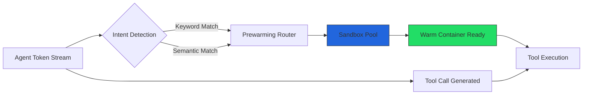
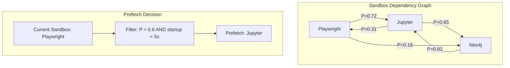
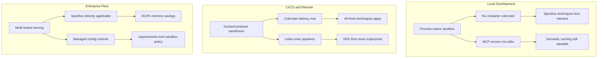

# SpecBox and the Sandbox Cold-Start Tax: Why Your MCP Tool Calls Stall — and What Speculative Prewarming Means for Codex CLI Agent Serving


---

Every developer who has wired an MCP server into Codex CLI knows the pause. The agent decides to invoke a tool — Playwright, Jupyter, a database connector — and the response hangs for a beat while the sandbox spins up. On a single turn the cost is barely noticeable. At scale, across multi-turn sessions with dozens of concurrent users, that beat compounds into a wall.

SpecBox, a runtime system published by Zhang et al. at Beihang University and the University of Sydney, attacks this problem head-on with speculative sandbox scheduling [^1]. The core insight: if you can predict which sandbox an agent will need *before* the model finishes generating its tool call, you can prewarm that sandbox and eliminate the cold-start penalty entirely. The results are striking — 2.9× P99 latency reduction versus on-demand provisioning, with 45.9% lower peak memory than permanently reserved sandboxes [^1].

This article maps SpecBox's three techniques to Codex CLI's sandbox architecture and asks: what would speculative prewarming look like for terminal-first agentic coding?

## The Fundamental Tension

Sandbox-isolated tool execution creates a resource allocation dilemma with exactly two bad options:

- **Reserved sandboxes** keep containers permanently warm. Latency is excellent; memory consumption is ruinous. At scale, you are paying for idle containers most of the time.
- **On-demand sandboxes** instantiate containers only when needed. Memory is efficient; latency spikes are brutal. At QPS=20, SpecBox's evaluation measured on-demand P99 latency at 257.2 seconds versus 88.7 seconds for speculative scheduling [^1].



Codex CLI sidesteps this at the single-user level because its sandbox model is process-native — Seatbelt on macOS, Landlock plus seccomp on Linux — not container-based [^2]. There is no Docker cold-start because there is no Docker. But the moment you move to `codex exec` in CI/CD pipelines, Docker-based MCP servers, or Codex Remote cloud execution, the tension reappears in full force [^3].

## Technique 1: Intent-Aware Sandbox Prewarming

SpecBox's first technique reads the LLM's token stream as it is being generated and predicts which tool the agent intends to call before the tool-call JSON is complete.

Two asynchronous routers run in parallel against the token stream [^1]:

| Router | Mechanism | Latency | Coverage |
|--------|-----------|---------|----------|
| Keyword | Token-by-token matching against tool-specific keyword profiles; fires when matched keywords hit threshold γ=2 | 323.0 ms | 95% |
| Semantic | TF-IDF sparse retrieval over tool descriptions | 2.1 ms | Micro-F1 0.970 |

The union policy (trigger on *either* router's signal) reduces average waiting latency to 124.45 ms with a 5% cold-start residual, versus 393.52 ms for the intersection policy that requires both signals [^1].

### Mapping to Codex CLI

Codex CLI's `PreToolUse` hooks already fire before tool execution. A speculative prewarming hook could inspect the agent's reasoning trace — exposed via the `reasoning` field in streaming responses — and trigger container preparation for MCP servers before the formal tool call arrives:

```toml
# config.toml — hypothetical prewarming hook
[hooks.pre_tool_use.mcp_prewarm]
command = "prewarm-mcp-sandbox --tool $TOOL_NAME"
match_tools = ["mcp::playwright", "mcp::jupyter", "mcp::neo4j"]
async = true
```

The `async = true` directive matters — the hook must not block the agent's token generation. This mirrors SpecBox's design where prewarming is fully decoupled from the inference path [^1].

## Technique 2: Stochastic Sandbox Prefetching

Intent detection handles the *current* turn. Prefetching handles the *next* turn. SpecBox constructs a Sandbox Dependency Graph (SDG) from historical agent trajectories and applies a first-order Markov model to predict which sandbox will be needed after the current tool completes [^1].

The transition probability with Laplace smoothing:

```
P(j|i) = (C(i,j) + α) / Σ_k(C(i,k) + α)    where α = 1
```

Candidates are filtered by a cost threshold (λ = 5 seconds startup time) and a probability threshold (τ = 0.6), with only the top-B=1 sandbox prefetched under a fixed budget. This reduced per-turn average latency from 540.06 ms to 97.14 ms over 10 turns, with cold-start counts dropping to 0.24–0.83 per turn versus 2.90 for reactive instantiation [^1].



### Mapping to Codex CLI

Codex CLI's `PostToolUse` hooks are the natural injection point. After a tool completes, a hook could consult a local transition model and prewarm the predicted next sandbox:

```bash
#!/bin/bash
# post-tool-use hook: prefetch next likely MCP sandbox
CURRENT_TOOL="$1"
NEXT_TOOL=$(predict-next-sandbox --current "$CURRENT_TOOL" --threshold 0.6)
if [ -n "$NEXT_TOOL" ]; then
    prewarm-mcp-sandbox --tool "$NEXT_TOOL" --async &
fi
```

For `codex exec` pipelines processing many sessions, the SDG could be trained on the team's historical trajectories stored in OpenTelemetry traces — Codex CLI already emits these via its observability integration [^4].

## Technique 3: Semantic Result Caching

Not every tool call requires fresh execution. SpecBox caches results from previous sandbox invocations and returns cached responses when a new invocation is semantically similar (cosine similarity ≥ 0.8) to a cached one [^1].

The hit rate is 37.4% versus 33.6% for exact-match caching — a modest improvement in coverage but with a 2.91× speedup in average waiting latency (412.78 ms reduced to 141.93 ms) [^1]. The key design choice is a conservative fallback: cache misses always execute the tool rather than attempting approximate results.

### Mapping to Codex CLI

MCP tool results in Codex CLI are already subject to `tool_output_token_limit` truncation [^5]. Adding a semantic cache layer before the MCP transport would require:

1. **Normalisation** — strip ephemeral parameters (timestamps, session IDs) from tool invocations
2. **Embedding** — compute a lightweight embedding of the normalised invocation
3. **Match** — compare against recent cache entries with a similarity threshold
4. **TTL** — respect tool-specific freshness requirements (a `grep` result from 30 seconds ago is stale; a `list-databases` result from 5 minutes ago is not)

This fits naturally into Codex CLI's MCP SDK 3.0.0 transport layer, which already supports middleware-style request processing [^6].

## The Zero-Copy Transport Bonus

SpecBox's fourth optimisation is often overlooked: out-of-band shared-memory transport for large artefacts. At 1 GB payload sizes, shared-memory zero-copy transfer achieves 5.97 ms versus 1,873.16 ms for JSON-RPC — a 313.55× reduction [^1].

For Codex CLI, the equivalent scenario is MCP servers that return large outputs — full test-suite logs, database dumps, or generated images. The current architecture passes everything through JSON-RPC stdio or HTTP transports. A shared-memory channel between Codex CLI and co-located MCP servers would eliminate serialisation overhead for these payloads entirely.

The MCP 2026-07-28 protocol revision, which Codex CLI v0.147.0 supports on an opt-in basis, introduces streamable HTTP transports that partially address this by enabling chunked responses, but does not yet specify shared-memory semantics [^6].

## What This Means in Practice

The SpecBox results demonstrate that the sandbox cold-start problem is *solvable* without permanent reservation. The 97.9% prewarming hit rate [^1] means that fewer than 3% of tool calls suffer a cold start when speculative scheduling is active.

For Codex CLI users, the practical implications split by deployment model:



| Deployment | Cold-start exposure | Most valuable SpecBox technique |
|-----------|--------------------|---------------------------------|
| Local `codex` TUI | Minimal (process sandbox) | Semantic result caching for MCP |
| `codex exec` in CI | Moderate (Docker MCP servers) | Intent-aware prewarming via hooks |
| Codex Remote | High (cloud containers) | Full speculative scheduling stack |
| Enterprise fleet | Highest (multi-tenant) | SDG prefetching with OpenTelemetry traces |

## Limitations and Open Questions

SpecBox evaluates on MCPBench trajectories averaging 6.4 steps per session with 2.96 tools per step [^1]. Codex CLI coding sessions routinely exceed 50 turns with heavier tool diversity. Whether the Markov model's prediction accuracy holds at that depth is untested. ⚠️

The semantic caching approach also raises correctness concerns for stateful tools. A `grep` invocation may return different results after a file edit, and the 0.8 similarity threshold cannot distinguish between identical queries against changed state. Any production implementation would need to incorporate filesystem change detection — which Codex CLI's sandbox already tracks through its modification records [^7].

## Conclusion

SpecBox proves that speculative scheduling can recover nearly all the latency of reserved sandboxes at less than half the memory cost. For Codex CLI, the path forward is hooks-based: `PreToolUse` for intent-aware prewarming, `PostToolUse` for dependency-graph prefetching, and MCP middleware for semantic caching. The infrastructure primitives already exist in Codex CLI v0.147.0 — what is missing is the speculative intelligence layer that SpecBox provides.

---

## Citations

[^1]: Zhang, Y., Wo, T., Wang, J., Sun, X., Zhang, M., Yuan, C., Li, L., Hu, C., Zomaya, A. Y. & Yang, R. (2026). "SpecBox: Speculative Sandbox Scheduling for Efficient LLM Agent Serving." arXiv:2607.23933v2. [https://arxiv.org/abs/2607.23933](https://arxiv.org/abs/2607.23933)

[^2]: Freeman, P. (2026). "A deep dive on agent sandboxes." [https://pierce.dev/notes/a-deep-dive-on-agent-sandboxes](https://pierce.dev/notes/a-deep-dive-on-agent-sandboxes)

[^3]: OpenAI (2026). "Non-interactive mode — Codex CLI." [https://developers.openai.com/codex/noninteractive](https://developers.openai.com/codex/noninteractive)

[^4]: OpenAI (2026). "Agent approvals & security — Codex CLI." [https://developers.openai.com/codex/agent-approvals-security](https://developers.openai.com/codex/agent-approvals-security)

[^5]: OpenAI (2026). "Codex CLI Configuration — config.toml reference." [https://developers.openai.com/codex/config](https://developers.openai.com/codex/config)

[^6]: OpenAI (2026). "Codex CLI v0.147.0 release notes." [https://github.com/openai/codex/releases/tag/rust-v0.147.0](https://github.com/openai/codex/releases/tag/rust-v0.147.0)

[^7]: OpenAI (2026). "Sandboxing — Codex CLI." [https://developers.openai.com/codex/concepts/sandboxing](https://developers.openai.com/codex/concepts/sandboxing)
