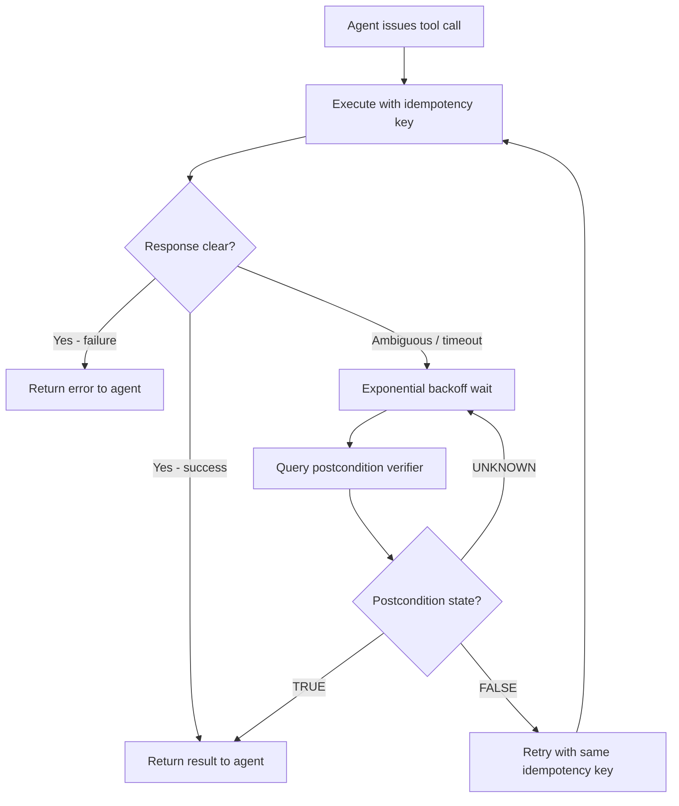
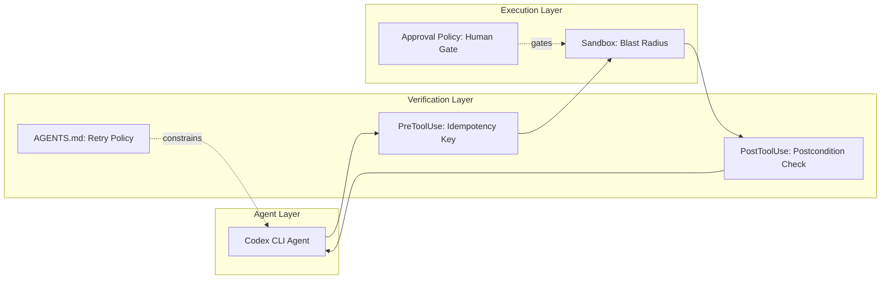

# Verified Tool Calls and the Non-Atomic Failure Gap: Why Your Coding Agent Retries Blindly — and How to Wire Postcondition Verification into Codex CLI


---

Every agent framework, Codex CLI included, treats tool calls as atomic: the command either succeeds or fails, and the agent reads the exit code and moves on. The trouble is that the real world does not honour that contract. A `curl` to an API times out after the server has already processed the request. A database migration reports success before the schema change propagates to read replicas. A CI pipeline returns HTTP 200 whilst half the test matrix is still running. Mansoor, Phadke, and Rana formalise this mismatch in *Verified Tool Calls Improve LLM Agent Reliability Under Non-Atomic Failures* (arXiv:2608.02645, July 2026) [^1], and the implications map directly onto how you configure Codex CLI's PostToolUse hooks, approval policy, and sandbox architecture.

## The Effect–Response Separation Problem

The paper's central insight is the distinction between the **effect channel** (what the tool actually did) and the **response channel** (what the agent observes). When these diverge, four failure modes emerge [^1]:

| Failure Mode | What Happens | Agent Consequence |
|---|---|---|
| **Timeout after dispatch** | Server processes the request; network timeout before response arrives | Agent retries → duplicate side effect |
| **Delayed visibility** | Action succeeds; verification reads stale state (eventual consistency) | Agent concludes failure → unnecessary retry |
| **Partial success** | Compound operation executes incompletely; API returns 200 with partial data | Agent assumes full success → silent data loss |
| **Stale conflict** | Concurrent modification changes state between read and write | Agent's action fails on precondition it cannot see |

Standard retry logic — the kind baked into most agent loops — makes all four worse. Retrying a timed-out-but-dispatched request doubles the side effect. Retrying against stale state compounds the conflict. The paper's experiments quantify the damage: at high fault injection rates, baseline agents produced duplicate side effects in **72–76%** of episodes [^1].

## The Verify-Before-Retry Architecture

The proposed solution is a lightweight wrapper around each tool call with three mechanisms [^1]:



### 1. Postcondition Verification

Each tool action defines a postcondition — a predicate over the world state that should hold if the action succeeded. The verifier returns one of three values: `TRUE`, `FALSE`, or `UNKNOWN` (for eventual consistency windows). Crucially, verifiers are read-only, so they can be called repeatedly without side effects [^1].

### 2. Idempotency Keys

Every execution attempt carries a deterministic key:

```
k = hash(agent_id, action_type, payload, timestamp_bucket)
```

When the target API supports idempotency, repeated requests with the same key produce at most one effect. This transforms retries from dangerous to safe [^1].

### 3. Verify-Before-Retry Logic

The critical design choice: **never retry without first checking whether the action already succeeded**. This is the inverse of how most agent frameworks operate, where the default is "retry on ambiguous failure" without any state verification.

## Results: Verification Beats Retry

The paper evaluated three strategies across two task templates with injected non-atomic faults at low, medium, and high rates [^1]:

| Strategy | Task Success (High Fault) | Duplicate Rate (High Fault) |
|---|---|---|
| Baseline (retry only) | 64% | 72% |
| Verification only | ~80% | ~20% |
| Full verify-before-retry | **100%** | **20%** |

The ablation is telling: **verification alone drives most of the improvement**. Adding retry on top of verification helps task success but does not further reduce duplicates. The implication for coding agents is clear — if you must choose one mechanism, choose postcondition verification over retry logic.

## Mapping to Codex CLI's Tool Architecture

Codex CLI already separates tool execution from result interpretation through its hook system. The paper's three mechanisms map onto existing Codex CLI primitives with varying degrees of native support.

### PostToolUse as Postcondition Verifier

The `PostToolUse` hook fires after every supported tool execution — shell commands, `apply_patch` file edits, and MCP tool calls [^2]. It receives the tool's stdout, stderr, and exit code as a JSON payload on stdin, and can return a `systemMessage` to steer the agent's next action [^3].

This is precisely the insertion point for postcondition verification. A PostToolUse hook can:

1. Parse the tool output for signs of ambiguous completion
2. Run a verification command (a read-only state check)
3. Return a `systemMessage` telling the agent whether the action actually succeeded

```toml
# hooks.toml — postcondition verifier for API calls
[[hooks]]
event = "PostToolUse"
command = "verify-api-postcondition"
match_tool = "shell"
```

```bash
#!/usr/bin/env bash
# verify-api-postcondition — reads PostToolUse JSON from stdin
INPUT=$(cat)
CMD=$(echo "$INPUT" | jq -r '.tool_input.command')
EXIT_CODE=$(echo "$INPUT" | jq -r '.tool_output.exit_code')

# Only verify API-calling commands with ambiguous results
if [[ "$CMD" == *"curl"* ]] && [[ "$EXIT_CODE" != "0" ]]; then
  # Extract the target resource and check its state
  RESOURCE_ID=$(echo "$CMD" | grep -oP 'resources/\K[a-z0-9-]+')
  if [ -n "$RESOURCE_ID" ]; then
    STATE=$(curl -s "https://api.example.com/resources/$RESOURCE_ID" | jq -r '.status')
    if [ "$STATE" = "active" ]; then
      echo '{"systemMessage": "Postcondition verified: resource is active despite timeout. Do NOT retry this operation."}'
      exit 0
    fi
  fi
fi
echo '{"decision": "approve"}'
```

The key constraint: PostToolUse in Codex CLI is **observe-only** — it cannot rewrite the tool output the agent sees [^3]. This means the verification result must be communicated as steering guidance via `systemMessage` rather than by replacing the tool response. Exit code 2 replaces the tool result entirely, giving stronger control [^3].

### PreToolUse as Idempotency Gate

The `PreToolUse` hook fires before tool execution and can block or modify the call [^2]. This is the natural point to inject idempotency key logic:

```bash
#!/usr/bin/env bash
# pretooluse-idempotency — inject idempotency headers into API calls
INPUT=$(cat)
CMD=$(echo "$INPUT" | jq -r '.tool_input.command')

if [[ "$CMD" == *"curl"* ]] && [[ "$CMD" != *"X-Idempotency-Key"* ]]; then
  # Generate deterministic key from command payload
  IDEM_KEY=$(echo "$CMD" | sha256sum | cut -d' ' -f1)
  MODIFIED_CMD=$(echo "$CMD" | sed "s/curl /curl -H 'X-Idempotency-Key: $IDEM_KEY' /")
  echo "{\"updatedCommand\": \"$MODIFIED_CMD\"}"
  exit 0
fi
echo '{"decision": "approve"}'
```

### AGENTS.md as Verification Policy

The paper's postcondition definitions — formal predicates over world state — translate naturally into AGENTS.md directives that constrain agent behaviour [^4]:

```markdown
## Tool Verification Policy

When any shell command involving external APIs returns a non-zero exit code
or a timeout, you MUST:

1. Run a read-only verification command to check postcondition state
2. If the postcondition is satisfied, do NOT retry the original command
3. If the postcondition is not satisfied, retry exactly once
4. Never retry a command more than once without explicit user approval
```

This leverages the agent's instruction-following capability to implement verify-before-retry at the reasoning level, complementing the programmatic hooks.

### Sandbox as Blast Radius Limiter

Codex CLI's sandbox architecture provides a structural backstop against the worst consequence of non-atomic failures: uncontrolled duplicate side effects [^5]. The sandbox restricts filesystem writes to the working directory and blocks network access by default. For tasks involving external APIs, the `network` sandbox profile permits outbound connections but the `approval_policy` configuration can require user confirmation for commands matching specific patterns [^5]:

```toml
# config.toml — require approval for state-mutating API calls
[approval_policy]
shell_commands = [
  { pattern = "curl.*-X POST", approval = "always" },
  { pattern = "curl.*-X PUT", approval = "always" },
  { pattern = "curl.*-X DELETE", approval = "always" },
  { pattern = "curl.*-X GET", approval = "auto" },
]
```

This ensures that even if the verify-before-retry logic fails, state-mutating operations cannot execute without human oversight.

## The Broader Pattern: Verification-Aware Tool Design

The paper's findings have implications beyond individual PostToolUse hooks. The Codex CLI v0.147.0 release introduced `--approve-for-me`, which delegates approval to an automated review process [^6]. In a verification-aware design, this reviewer becomes the natural location for postcondition checks — the automated reviewer verifies not just whether the command *should* run, but whether a previous invocation *already succeeded*.

The MCP 2026-07-28 protocol's multi-round request support [^6] also aligns with the verify-before-retry pattern. An MCP server can hold a multi-step exchange within one logical request, enabling the server itself to implement postcondition verification internally rather than requiring the agent to manage the retry loop.



## Limitations and Open Questions

The paper evaluated with only two task templates and a simulated environment using Gemini Flash-Lite [^1]. Real-world coding agent tasks involve far more diverse tool interactions — filesystem operations, Git commands, build systems, test runners — each with their own non-atomic failure modes. The postcondition engineering cost is non-trivial: every tool action needs a bespoke verifier, and incomplete verifiers can cause misclassification [^1].

For Codex CLI users, the practical question is whether the overhead of writing PostToolUse verification hooks justifies the reliability gain. For local filesystem operations within the sandbox, non-atomic failures are rare — file writes are effectively atomic on modern filesystems. The benefit concentrates on **external API interactions** via MCP servers or shell commands that reach beyond the sandbox boundary, exactly the operations where Codex CLI's approval policy already demands caution.

## Key Takeaways

1. **Tool calls are not atomic** — timeouts, eventual consistency, and partial success create a gap between what the agent observes and what actually happened
2. **Verification beats retry** — checking postconditions before retrying reduces duplicate side effects by 52 percentage points at high fault rates [^1]
3. **PostToolUse hooks are the natural verification point** in Codex CLI — they fire after every tool execution and can steer the agent via `systemMessage`
4. **Idempotency keys belong in PreToolUse** — inject them before execution so retries are inherently safe
5. **AGENTS.md encodes the retry policy** — instruction-following implements verify-before-retry at the reasoning layer
6. **The sandbox limits blast radius** — even when verification fails, sandbox constraints prevent uncontrolled side effects

## Citations

[^1]: Mansoor, I.K., Phadke, A. & Rana, P. (2026). "Verified Tool Calls Improve LLM Agent Reliability Under Non-Atomic Failures." *arXiv:2608.02645*. [https://arxiv.org/abs/2608.02645](https://arxiv.org/abs/2608.02645)

[^2]: OpenAI. (2026). "Hooks — Codex CLI Documentation." *ChatGPT Learn*. [https://developers.openai.com/codex/hooks](https://developers.openai.com/codex/hooks)

[^3]: Vaughan, D. (2026). "Codex CLI Hooks: Complete Guide to Events, Policy Engines and Production Patterns." *Codex Knowledge Base*. [https://codex.danielvaughan.com/2026/04/15/codex-cli-hooks-complete-guide-events-policy-patterns/](https://codex.danielvaughan.com/2026/04/15/codex-cli-hooks-complete-guide-events-policy-patterns/)

[^4]: OpenAI. (2026). "Codex CLI Guide 2026: Setup, Sandbox, AGENTS.md & MCP." *ChatGPT Learn*. [https://developers.openai.com/codex/guides](https://developers.openai.com/codex/guides)

[^5]: OpenAI. (2026). "Sandbox and Approval Policies — Codex CLI." *DeepWiki*. [https://deepwiki.com/openai/codex/2.4-sandbox-and-approval-policies](https://deepwiki.com/openai/codex/2.4-sandbox-and-approval-policies)

[^6]: OpenAI. (2026). "Release 0.147.0 — openai/codex." *GitHub*. [https://github.com/openai/codex/releases/tag/rust-v0.147.0](https://github.com/openai/codex/releases/tag/rust-v0.147.0)
