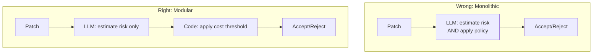

# When Policies Change Probabilities: What Modular Decision Theory Means for Your Codex CLI Auto-Review Configuration


---

Your coding agent's auto-reviewer is quietly lying to you about risk — not because the model is broken, but because you asked it to estimate probability and make a policy decision in the same breath.

A study published on 2 August 2026 by Kudum et al. demonstrates that when LLM code reviewers are told about the costs of getting it wrong, their reported failure probabilities shift by up to 9.6 percentage points — even when the patch and evidence are identical [^1]. That is not a calibration quirk. It is a structural conflation of beliefs and preferences, and it has direct implications for how you configure Codex CLI's `--approve-for-me` flag and Guardian auto-review pipeline.

## The Problem: Policy Contaminates Probability

Classical Bayesian decision theory separates two concerns cleanly. First, estimate the probability of failure given evidence. Second, apply a cost-weighted threshold to decide whether to accept or reject [^1]. The rejection threshold is:

```
τ(C) = C_FR / (C_FA + C_FR)
```

where `C_FA` is the cost of a false accept and `C_FR` is the cost of a false reject. At equal costs, `τ = 0.50`. At a 10:1 false-accept penalty, `τ ≈ 0.091` — you should reject anything above roughly 9% estimated failure probability [^1].

The study tested four deployed LLM reviewers — DeepSeek-V4-Pro, Grok-4.3, Mistral-medium-3.5, and GPT-5.5/Codex (via Codex CLI 0.145.0 with medium reasoning) — across 15,792 responses on 720 candidate patches drawn from 360 SWE-rebench issues [^1]. The experiment was simple: present the same patch with the same evidence, but change only the policy prompt from equal-cost to 10:1 false-accept penalty. If probability estimation were properly separated from policy, the reported failure probability should remain constant.

It did not. Mean probability shifts per system:

| Reviewer | Probability Shift (pp) | Exact Agreement Between Prompts |
|---|---|---|
| DeepSeek-V4-Pro | −6.8 | 31.0% |
| Grok-4.3 | +0.1 | 11.5% |
| Mistral-medium-3.5 | −7.9 | 11.0% |
| GPT-5.5/Codex | −9.6 | 8.5% |

GPT-5.5/Codex exhibited the largest shift — nearly 10 percentage points — and the lowest agreement between identical-evidence calls under different policies [^1]. Every reviewer except Grok performed worse under the high-cost policy than a strategy that simply rejects all patches. The policy information intended to improve decisions actively degraded the probability estimates those decisions depended on.

## The Fix: Modular Separation

The authors propose a three-stage modular pipeline that enforces the belief-cost separation architecturally rather than hoping the LLM respects it [^1]:

```mermaid
flowchart LR
    A[Patch + Evidence] --> B[Risk-Only Reviewer<br/>No policy info]
    A --> C[Independent Monitor<br/>Gemini 3.5 Flash]
    B --> D[Logistic Fusion<br/>p̂ = σ β₀ + βᵣzᵣ + βₘzₘ]
    C --> D
    D --> E[Coded Controller<br/>Apply τ C threshold]
    E --> F{Accept / Reject}
```



1. **Risk-only reviewer** — the LLM reports failure probability without any policy information in the prompt
2. **Independent monitor** — a separate model (Gemini 3.5 Flash, pinned 19 May 2026) supplies an independent failure score with sensitivity 0.545 and specificity 0.650 [^1]
3. **Coded controller** — cost-derived thresholds are applied in deterministic code, outside the LLM entirely

At equal costs, the modular pipeline accepted 58–68% of patches across reviewers while reducing mean loss by 0.073 per issue [^1]. At 10:1 false-accept costs, every variant converged on reject-all — which is the correct decision-theoretic outcome when the monitor's discriminative power is insufficient to justify acceptance at that cost ratio.

## Why This Matters for Codex CLI's Auto-Review

Codex CLI's Guardian auto-review system already implements a version of this modular separation — and understanding the paper's findings helps you configure it properly.

### The Architecture You Already Have

OpenAI's auto-review system, formally documented at alignment.openai.com, uses GPT-5.4 Thinking (low reasoning) as a dedicated reviewer subagent, separate from the task-execution agent [^2]. This is the independent-reviewer principle from the paper, instantiated in production:

- The **task agent** (GPT-5.6 Terra/Sol) focuses on code generation
- The **reviewer agent** (GPT-5.4 Thinking) evaluates each sandbox-boundary-crossing action against five risk categories: data exfiltration, irreversible deletion, security degradation, untrusted code execution, and malicious instruction following [^2]
- Rejections include rationale, enabling the task agent to find safer alternatives — OpenAI reports that "Codex often recovers on its own by finding a safer way to make progress" [^2]

The system achieves 99.1% approval on escalated actions (99.93% effective across all actions), with 90.3% overeagerness recall, 99.3% prompt injection recall, and 96.1% MonitoringBench recall [^2]. Interruptions decrease roughly 200× compared to manual approval [^2].

### Configuring for Modular Separation

The paper's findings suggest specific configuration patterns for Codex CLI v0.147.0:

**1. Use `--approve-for-me` with workspace-write sandbox**

The `--approve-for-me` CLI flag, introduced in v0.147.0, routes pending approvals through auto-review in the workspace-write sandbox [^3]. This is the correct default for unattended runs: the reviewer assesses risk without the task agent's goal-directed bias contaminating the estimate.

```bash
codex --approve-for-me "refactor the auth module to use JWT"
```

**2. Layer granular approval policies to enforce cost separation**

The paper shows that mixing cost information with probability estimation degrades both. In `config.toml`, use granular policies to separate what gets auto-reviewed from what demands human judgement:

```toml
[auto_review]
approvals_reviewer = "auto_review"

[approval_policy]
granular = {
  request_permissions = "fail_closed",
  skill_script = "fail_closed",
  file_write = "auto_review",
  shell_command = "auto_review"
}
```

This keeps high-stakes categories (permission escalation, skill execution) out of the auto-review path entirely — enforcing a hard policy boundary in code rather than hoping the reviewer LLM correctly internalises a 10:1 cost ratio [^4].

**3. Use managed requirements for fleet-wide policy enforcement**

In enterprise deployments, administrators can set `auto_review.guardian_policy_config` in `requirements.toml` to override local review policies [^4]. This prevents individual developers from weakening the cost threshold — the organisational equivalent of the paper's "coded controller" applying thresholds outside the LLM.

```toml
# requirements.toml (admin-managed)
[auto_review]
guardian_policy_config = "strict"
```

**4. Do not embed cost rationale in AGENTS.md review directives**

This is the paper's central lesson applied to practice. If your `AGENTS.md` contains instructions like "be extra careful with database migrations because they are expensive to roll back," you are contaminating the reviewer's probability estimates with policy information. Instead:

```markdown
# AGENTS.md — review directives
## Risk Assessment
- Report estimated failure probability for each action
- Do not factor in rollback cost or blast radius

## Policy (enforced by config.toml, not by you)
- Database migrations: require human approval
- File writes to /src: auto-review permitted
```

The separation is structural: AGENTS.md tells the agent what to assess, `config.toml` tells the system what to do about it.

### The GPT-5.4 Deprecation Angle

As of 31 August 2026, GPT-5.4 and GPT-5.4 mini are deprecated for ChatGPT-authenticated Codex users [^3]. Since the auto-review system currently uses GPT-5.4 Thinking as its reviewer model, this migration deserves attention. The recommended replacements are GPT-5.6 Terra (for GPT-5.4) and GPT-5.6 Luna (for GPT-5.4 mini) [^3]. The paper's finding that GPT-5.5/Codex showed the largest probability shift (−9.6pp) under policy contamination suggests that newer, more capable models may be more susceptible to this conflation — making the modular separation even more important as you migrate.

## The Decision Framework

The paper gives you a simple diagnostic. If your auto-review system changes its risk estimates when you change the consequences of getting it wrong, your reviewer is conflating beliefs with preferences. The fix is architectural:



Codex CLI's Guardian architecture already provides the structural separation. The `--approve-for-me` flag activates it. Granular approval policies in `config.toml` enforce the cost thresholds in code. Managed `requirements.toml` prevents local overrides. The remaining work is on you: stop putting cost information in your prompts and AGENTS.md files, and let the architecture do what the paper proves LLMs cannot reliably do themselves.

## Practical Checklist

- [ ] Enable `--approve-for-me` for unattended runs instead of `--full-auto` (deprecated in v0.147.0) [^3]
- [ ] Audit AGENTS.md for cost/consequence language in risk-assessment sections
- [ ] Use `approval_policy.granular` to route high-stakes categories to human review [^4]
- [ ] Set `requirements.toml` fleet-wide policies for enterprise deployments [^4]
- [ ] After GPT-5.4 sunset (31 August), verify auto-review behaviour on GPT-5.6 Terra [^3]
- [ ] Monitor auto-review rejection rates — a sudden drop may indicate policy contamination

---

## Citations

[^1]: Kudum, R., Corbett, M., Paliwal, H., Fatima, R., Jiralerspong, T. & Sarangi, S. (2026). "When Policies Change Probabilities: Modular Decision-Making for LLM Code Review." arXiv:2608.02677. [https://arxiv.org/abs/2608.02677](https://arxiv.org/abs/2608.02677)

[^2]: OpenAI Alignment Team. (2026). "Auto-review of agent actions without synchronous human oversight." [https://alignment.openai.com/auto-review/](https://alignment.openai.com/auto-review/)

[^3]: OpenAI. (2026). "ChatGPT & Codex Changelog — v0.147.0 (7 August 2026)." [https://learn.chatgpt.com/docs/changelog](https://learn.chatgpt.com/docs/changelog)

[^4]: OpenAI. (2026). "Agent approvals & security — Codex CLI." [https://developers.openai.com/codex/agent-approvals-security](https://developers.openai.com/codex/agent-approvals-security)
