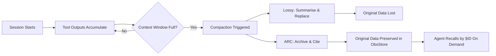
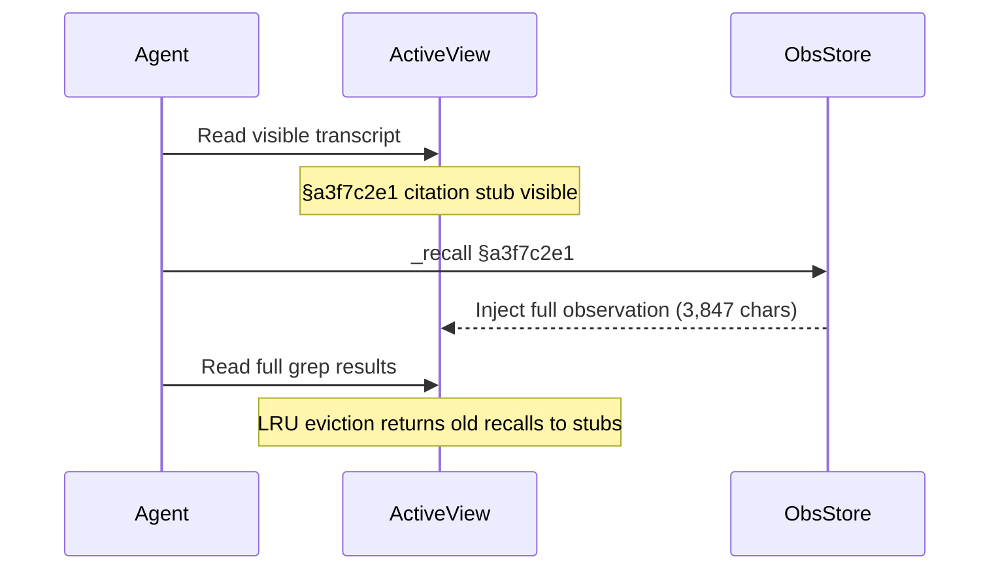
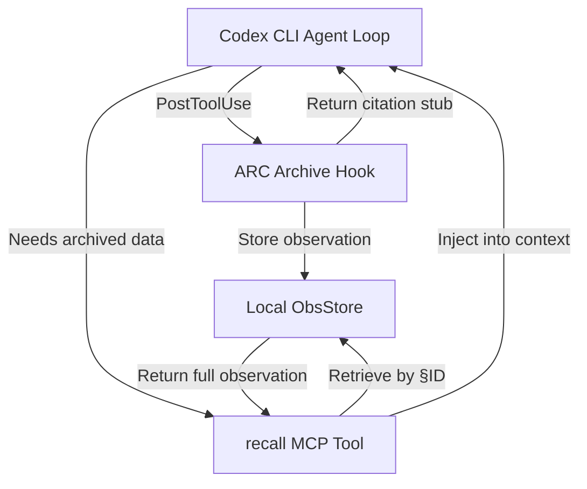

# Addressable Recall Compaction: Why Lossless Context Management Changes the Game for Codex CLI Long Sessions


---

Every coding agent eventually hits the wall. A session accumulates tool outputs — file reads, test results, build logs, grep results — until the context window fills and the agent must compact. Codex CLI handles this with a summarise-and-replace approach: the entire conversation goes to an LLM (or OpenAI's server-side `/responses/compact` endpoint), which produces a handoff summary that replaces the original history[^1]. Claude Code uses a three-tier progressive mechanism with tool-result trimming and a nine-section structured summary[^2].

Both approaches are **lossy**. Once the summary replaces the original transcript, specific tool outputs — the exact error message from line 847, the precise test failure stack trace, the grep result that located the bug — are gone. If the agent needs that information three turns later, it must re-execute the tool call. This costs time, tokens, and sometimes produces different results if the codebase has changed.

Dang et al. published **Addressable Recall Compaction (ARC)** on 27 July 2026, presenting a compaction framework that is provably lossless at the system level while maintaining a bounded active context view[^3]. The implications for long-session coding agents like Codex CLI are significant.

## The Compaction Problem in Three Sentences

An LLM agent's context window has a fixed token budget *L*. Tool observations grow linearly with session length. Every existing compaction strategy either discards information permanently (sliding window), paraphrases it lossily (LLM summary), compresses it into structured state (JSON extraction), or retrieves it probabilistically (RAG). None guarantee exact recovery of arbitrary historical observations.



## How ARC Works

ARC decouples **storage** from **presentation** through three components.

### 1. Append-Only Observation Store

Every tool observation is hashed (SHA-1 over the action signature and output) and stored with an 8-character hexadecimal identifier[^3]. The store is append-only: nothing is overwritten or deleted during task execution. Full observation content, command signatures, return codes, creation step numbers, and recall bookkeeping metadata are all preserved.

```toml
# Conceptual ObsStore entry (not Codex CLI config — illustrative)
[observation.a3f7c2e1]
command = "grep -rn 'fn parse_manifest' src/"
return_code = 0
step = 42
content_hash = "sha1:9c4e8f..."
content_length = 3847
```

### 2. Bounded Active View with Citation Stubs

When compaction triggers, observations longer than a retention threshold *ρ* are replaced in the visible transcript with **citation stubs** containing the identifier, head/tail previews, and a recall hint[^3]. Short observations remain inline. The active view stays bounded at *K* ≤ *L* tokens regardless of how many turns have elapsed.

A citation stub might look like:

```
§a3f7c2e1 — grep results for 'fn parse_manifest' (3,847 chars)
  Head: src/loader.rs:142: pub fn parse_manifest(path: &Path) -> Result<Manifest> {
  Tail: src/tests/loader_test.rs:89:     assert!(parse_manifest(&bad_path).is_err());
  → recall §a3f7c2e1 for full content
```

### 3. On-Demand Recall

The agent issues `_recall §id` to retrieve archived observations. Valid recalls inject the full content back into the transcript; invalid identifiers return nearest-match suggestions[^3]. Per-step limits (default *r* = 2) and a materialised-recall budget constrain how much recalled content occupies the active view at once. Least-recently-used recalled bodies revert to citation stubs when budgets are exceeded.



## The Numbers

Dang et al. evaluated ARC on Qwen3-8B (16k context) and Qwen3-32B (32k context) against five baselines[^3]:

| Method | Needle-in-Haystack (8B) | Needle-in-Haystack (32B) | LongBench-v2 Hard (8B) | LongBench-v2 Hard (32B) |
|--------|------------------------|-------------------------|----------------------|------------------------|
| Full Context | Fails at overflow | Fails at overflow | Fails at overflow | Fails at overflow |
| Sliding Window | 60.43% | 93.47% | 24.73% | 30.67% |
| LLM Summary | 67.23% | 90.80% | 25.83% | 27.50% |
| Structured State | 55.77% | 85.33% | 23.37% | 27.97% |
| RAG Memory | 79.57% | 96.67% | 24.43% | 29.50% |
| **ARC** | **99.00%** | **99.80%** | **27.47%** | **32.47%** |

The needle-in-haystack results are striking: ARC achieves near-perfect exact-answer accuracy because it never discards the needle — it archives and cites it[^3]. The LongBench-v2 margins are smaller (+1.64 to +1.80 points) because reasoning errors, not recall failures, dominate at that level.

Hardware efficiency matters too. ARC reduced HBM bandwidth traffic by 38.8% (8B) and 73.5% (32B) relative to sliding window on LongBench tasks, with proportionally lower wall-clock decoding time[^3].

### Formal Guarantee

ARC provides a system-level theorem: if the method assigns injective occurrence identifiers, stores observations verbatim before compaction, maintains bounded active-view budgets, and enforces *K* ≤ *L* before each model call, then model input contains at most *K* tokens independent of elapsed turns, and any stored observation can be exactly recovered without re-executing the original action[^3]. A complementary lower-bound proof establishes that worst-case exact recovery requires external memory growing linearly with history — matching ARC's append-only approach to first order.

## Where Codex CLI Stands Today

Codex CLI's compaction architecture uses two paths[^1]:

1. **Local path**: the client calls an LLM to generate a handoff summary.
2. **Remote path**: the client calls OpenAI's `/responses/compact` endpoint, which returns an AES-encrypted opaque blob.

Both are lossy. The remote path has been particularly fragile — reports indicate approximately 80% compaction failure rate with GPT-5.5 as of May 2026[^4]. The `model_auto_compact_token_limit` parameter (180k–244k depending on model) controls when compaction triggers, but once triggered, original observations are permanently replaced.

Colaco and Lahjouji's rate–distortion analysis of memory compaction formalises exactly why this matters: every lossy compaction is a rate–distortion decision about what to retain versus discard, and attention-magnitude plus recency heuristics fail predictably by discarding information before queries are known[^5]. The repeated compaction that agents actually perform across long sessions is almost never measured against coordinated budget axes.

## Mapping ARC to Codex CLI

ARC is not integrated into Codex CLI today. But its architecture maps cleanly onto existing extension points.

### PostToolUse Hooks as the Observation Store Entry Point

Codex CLI's `PostToolUse` hooks fire after every tool execution[^6]. A hook implementation could intercept tool outputs, hash them, store them in a local append-only store (a SQLite database or content-addressed directory), and inject a citation stub into the conversation in place of lengthy outputs.

```bash
# Conceptual PostToolUse hook for ARC-style archival
#!/usr/bin/env bash
# Fires after each tool call; archives observations exceeding threshold
OBSERVATION="$TOOL_OUTPUT"
CHAR_COUNT=${#OBSERVATION}
THRESHOLD=2000

if [ "$CHAR_COUNT" -gt "$THRESHOLD" ]; then
  HASH=$(echo -n "$OBSERVATION" | sha1sum | cut -c1-8)
  echo "$OBSERVATION" > "$HOME/.codex/obs-store/$HASH"
  echo "§$HASH — ${TOOL_NAME} output (${CHAR_COUNT} chars)"
  echo "  Head: $(echo "$OBSERVATION" | head -3)"
  echo "  Tail: $(echo "$OBSERVATION" | tail -3)"
  echo "  → recall §$HASH for full content"
else
  echo "$OBSERVATION"
fi
```

### MCP Server as Recall Interface

An MCP server could expose a `recall` tool that the agent calls to retrieve archived observations. The server reads from the local observation store and returns full content, respecting per-recall length caps and materialised-recall budgets.



### AGENTS.md Recall Directives

The AGENTS.md file could instruct the agent to use `_recall` when it encounters citation stubs rather than re-executing tools:

```markdown
## Context Management Rules

- When you see a citation stub (§XXXXXXXX), use the `recall` tool to retrieve
  the full observation rather than re-running the original command.
- Prefer recalling archived observations over re-executing potentially
  state-changing operations.
- After recalling, extract what you need promptly — recalled content will
  revert to citation stubs when the recall budget is exceeded.
```

### Named Profiles for Compaction Strategy

Codex CLI's named profiles could offer compaction strategy selection:

```toml
# ~/.codex/profiles/long-session.toml
[model]
model_auto_compact_token_limit = 200000

[compaction]
# Hypothetical ARC-mode configuration
strategy = "arc"
observation_store_path = "~/.codex/obs-store"
retention_threshold_chars = 2000
recall_budget_chars = 16000
per_recall_cap_chars = 8000
max_recalls_per_step = 2
```

## The Compaction Trap Revisited

The existing Codex CLI compaction articles in this knowledge base have documented the **compaction trap**: sessions that compact too aggressively lose critical context, leading to repeated work, wrong assumptions, and wasted tokens[^1]. ARC offers a structural solution rather than a tuning exercise.

The key insight is separation of concerns. Current compaction conflates two distinct problems:

1. **Presentation**: keeping the active context within the token budget.
2. **Preservation**: retaining historical information for potential future use.

ARC solves both simultaneously. The active view stays bounded. The observation store retains everything. The recall mechanism bridges them on demand. No tuning of summary quality, no gambling on what the agent might need later, no re-executing tools to recover lost information.

## Limitations and Open Questions

ARC was evaluated on Qwen3-8B and Qwen3-32B only[^3]. Generalisation to other model families — particularly the o3/o4-mini models that Codex CLI uses by default — remains unvalidated. The citation stub overhead (head/tail previews, recall hints) consumes tokens that could otherwise hold useful content. And the paper's benchmarks, while rigorous, do not include repository-level coding tasks where tool outputs span thousands of lines of code.

The rate–distortion framework from Colaco and Lahjouji[^5] identifies a deeper challenge: attention-magnitude and recency signals consistently drive retention decisions across all compaction methods, but these signals are fundamentally limited because they discard information before future queries are known. ARC sidesteps this by never discarding — but the recall budget imposes its own rate–distortion trade-off on what is materialised versus cited at any given moment.

For Codex CLI specifically, the server-side `/responses/compact` endpoint would need modification to support an ARC-like architecture. The current opaque-blob approach means the client cannot maintain a local observation store that survives compaction. An alternative is to implement ARC entirely client-side through hooks and MCP servers, treating the server-side compaction as a fallback for the summarised portions of the transcript that contain no tool observations.

## What This Means for Your Workflow

If you run long Codex CLI sessions — multi-hour refactoring, large migration tasks, extensive debugging — you have experienced the compaction trap. You have watched the agent forget the test failure it diagnosed twenty turns ago and re-run the entire test suite to rediscover it.

ARC demonstrates that this is not an inherent limitation of bounded context windows. It is a limitation of lossy compaction strategies. The formal guarantee — exact recovery of any historical observation without re-execution, within a bounded active view — is precisely what long-session coding agents need.

The practical path for Codex CLI is an observation-store MCP server paired with PostToolUse archival hooks. The pieces exist today. The integration does not — yet.

---

## Citations

[^1]: Zhou, S. "Investigating how Codex context compaction works." *Simon's Dream Universe*, 2026. [https://simzhou.com/en/posts/2026/how-codex-compacts-context/](https://simzhou.com/en/posts/2026/how-codex-compacts-context/)

[^2]: Justin3go. "Shedding Heavy Memories: Context Compaction in Codex, Claude Code, and OpenCode." 9 April 2026. [https://justin3go.com/en/posts/2026/04/09-context-compaction-in-codex-claude-code-and-opencode](https://justin3go.com/en/posts/2026/04/09-context-compaction-in-codex-claude-code-and-opencode)

[^3]: Dang, T., Ichikawa, Y., Fatima, S. & Shirahata, K. "Addressable Recall Compaction for Long Context-Window Control in AI Agents." *arXiv:2607.25066*, 27 July 2026. [https://arxiv.org/abs/2607.25066](https://arxiv.org/abs/2607.25066)

[^4]: Codex CLI GitHub Issue #23875. "Codex Desktop drops approvals_reviewer=auto_review after context compaction/resume." [https://github.com/openai/codex/issues/23875](https://github.com/openai/codex/issues/23875)

[^5]: Colaco, A.G. & Lahjouji, N. "What to Keep, What to Forget: A Rate–Distortion View of Memory Compaction in LLMs and Agents." *arXiv:2607.08032*, 9 July 2026. [https://arxiv.org/abs/2607.08032](https://arxiv.org/abs/2607.08032)

[^6]: OpenAI. "Agent approvals & security." *ChatGPT Learn*, 2026. [https://learn.chatgpt.com/docs/agent-approvals-security](https://learn.chatgpt.com/docs/agent-approvals-security)
