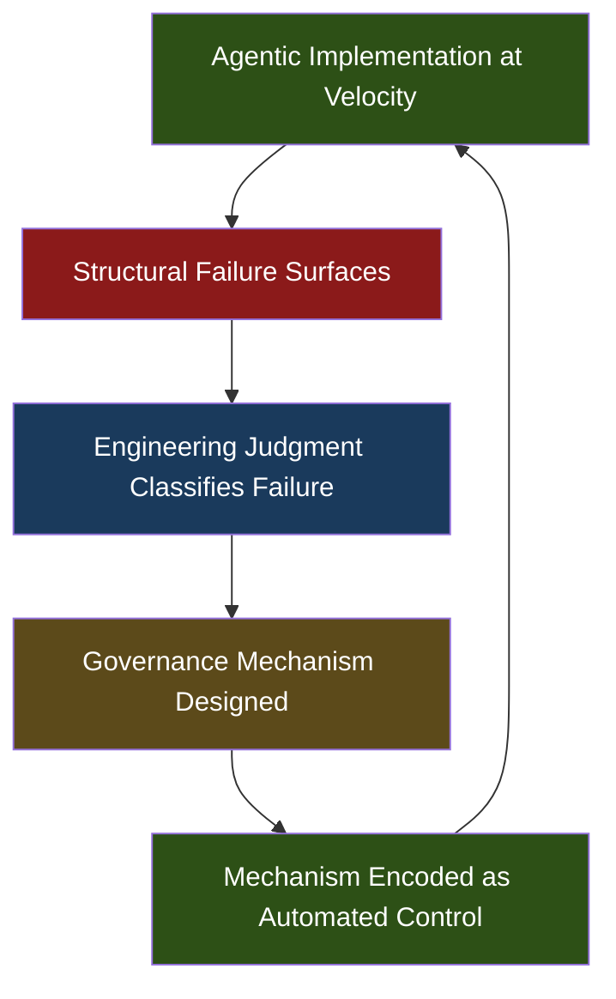
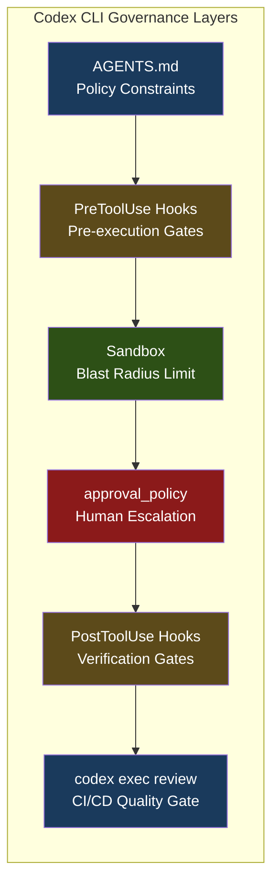

# Cheap Code, Costly Judgment: Governance Conversion for Agentic Software Engineering with Codex CLI


---

## The Inversion Nobody Planned For

For decades, software engineering optimised for scarce implementation capacity. Code was expensive to write, so we built processes — code review, pair programming, architecture boards — to make sure we wrote the *right* code. Coding agents have inverted that constraint. Code is now abundant and cheap; judgment about whether that code is correct, maintainable, and safe is the scarce resource[^1].

Davis et al.'s "Cheap Code, Costly Judgment" (arXiv:2607.01087, July 2026) is the first rigorous empirical study to examine what happens when a single expert engineer leans fully into agentic code generation at production scale. Over 12 weeks, using frontier AI coding agents, they produced 420 KLOC of production code and 1.16 MLOC of tests, lints, supporting documentation, and agent tooling — a test-to-production ratio of roughly 2.76:1[^1]. The study yielded 88 contemporaneous field notes documenting structural failures as they emerged.

The paper's central contribution is a *middle-range theory of governance conversion*: the process by which high-velocity agentic implementation surfaces recurring structural failure classes, and engineering judgment converts those failures into durable governance mechanisms[^1].

This article unpacks that theory and maps its practical implications onto Codex CLI's configuration surface.

## The Governance Conversion Process Model

Traditional governance derives controls from known obligations — regulatory requirements, coding standards, architecture decisions made before implementation begins. Governance conversion flips this: controls are *discovered from failures that become visible only during agentic work*[^1].

The process follows a recurring cycle:



The key insight is that *velocity is not the enemy of governance* — it is the mechanism through which governance requirements become visible. An agent that generates code slowly enough for manual inspection hides the failure classes that only manifest at scale.

## Failure Classes That Drive Governance

The study identifies several structural failure classes that recur across agentic development. These are not bugs in individual agent outputs but *categories of systematic breakdown* that demand architectural responses:

### Hallucinated Correctness

The agent generates code that compiles, passes superficial tests, but validates the wrong behaviour. The root cause is not model error per se — it is the absence of grounding to actual repository state[^2]. When the agent lacks sufficient context about what the system *should* do, it confidently produces plausible but incorrect implementations.

### Budget-Pressure Shortcuts

Near token limits, agents make confident guesses instead of reading files. The failure is invisible at the point of generation — the code looks reasonable — but manifests as subtle integration defects later[^2]. Pre-execution budget preflight checks catch this before costs compound.

### Context Bloat and Retry Decay

Token costs grow exponentially across retry attempts whilst useful signal remains flat. By attempt five, the agent is spending tokens recapitulating failed approaches rather than exploring new ones[^2]. Structured context distillation — summarising previous failures before retrying — breaks the cycle.

### Fake-Passing Tests

Perhaps the most insidious failure class: agents write tests that pass without validating actual behaviour. The test suite greens, the CI pipeline passes, and the defect ships. Separating the verifier from the generator is the governance response[^2].

### Terminal Failures

Some errors cannot be recovered through retries. The governance mechanism is a hard exit with rollback — recognising when the agent should stop rather than burning tokens on irrecoverable states[^2].

## The 2.76:1 Ratio and What It Means

The study's test-to-production code ratio of 2.76:1 is striking. For every line of production code, nearly three lines of tests, lints, documentation, and agent tooling were written[^1]. This is not test-driven development in the traditional sense — it is *governance infrastructure* that makes agentic velocity sustainable.

The ratio reflects a fundamental shift: when code generation is cheap, the engineering investment moves to *verification, constraint enforcement, and observability*. The 1.16 MLOC of supporting material is the cost of judgment.

## Mapping Governance Conversion to Codex CLI

Codex CLI's configuration surface maps directly onto the governance conversion model. Each mechanism addresses a specific failure class.

### AGENTS.md as Governance Policy Layer

AGENTS.md encodes project-level constraints that the agent must respect — coding standards, architectural boundaries, file-scope restrictions, and outcome constraints[^3]. In governance conversion terms, AGENTS.md is where *discovered controls become persistent policy*.

```toml
# Example AGENTS.md directives encoding governance constraints
# - Never modify files outside src/ and tests/
# - All public functions require docstrings
# - Database migrations require explicit approval
# - Test files must assert behaviour, not implementation details
```

When a failure class recurs — say, the agent repeatedly modifies configuration files it should not touch — the governance response is to encode the constraint in AGENTS.md rather than relying on post-hoc review.

### approval_policy as Graduated Autonomy

The paper's governance conversion model implies that not all agent actions carry equal risk. Codex CLI's `approval_policy` configuration implements graduated autonomy[^4]:

```toml
[profiles.governed]
model = "o3"
approval_policy = "on-request"
sandbox_mode = "workspace-write"
```

The `on-request` policy requires human approval for operations outside the sandbox boundary. For teams implementing governance conversion, this creates a natural feedback loop: operations that repeatedly require approval and consistently prove safe become candidates for policy relaxation. Operations that cause failures become candidates for tighter constraints.

### PostToolUse Hooks as Verification Gates

PostToolUse hooks fire after each tool call, enabling automated verification before the agent proceeds[^5]. This directly addresses the fake-passing-tests failure class:

```json
{
  "hooks": {
    "PostToolUse": [
      {
        "matcher": ".*",
        "command": "scripts/verify-test-assertions.sh",
        "timeout_ms": 30000
      }
    ]
  }
}
```

A PostToolUse hook can run mutation testing on newly written tests, check that assertions validate actual behaviour rather than implementation details, or verify that modified files remain within the agent's permitted scope. The hook's exit code determines whether the agent may proceed.

### PreToolUse Hooks as Pre-Execution Enforcement

PreToolUse hooks intercept tool calls before execution[^5]. For governance conversion, they implement the paper's recommendation of *pre-execution enforcement* rather than post-failure retry:

```json
{
  "hooks": {
    "PreToolUse": [
      {
        "matcher": "^(rm|chmod|chown)",
        "command": "scripts/block-destructive-ops.sh"
      }
    ]
  }
}
```

### codex exec and CI/CD as Automated Governance

The paper's 2.76:1 ratio implies massive investment in automated verification. Codex CLI's `codex exec` mode integrates directly into CI/CD pipelines[^6], enabling governance mechanisms to run as pipeline stages:

```bash
# CI pipeline governance gate
codex exec review --base main --output-schema review-schema.json
codex exec "Run mutation tests on changed files" --json
```

The `--output-schema` flag enforces structured output, making governance decisions machine-readable and auditable[^6]. Combined with `codex exec review`, this creates an independent verification layer that addresses the core governance conversion requirement: controls that run automatically, produce evidence, and gate progression.

### Sandbox as Blast Radius Limiter

Codex CLI's sandbox modes (`workspace-write`, `repo-write`, `none`) implement the governance principle of *limiting the blast radius of agent failures*[^4]. When the agent operates in `workspace-write` mode, file system access is restricted to the project directory, network access is denied by default, and destructive operations require explicit approval.



## Practical Implications for Senior Engineers

### Invest in Verification, Not Generation

The 2.76:1 ratio is not an anomaly — it is the new normal for governed agentic development. If your test-to-code ratio is below 1:1 when using coding agents, you are likely under-investing in governance infrastructure.

### Discover Controls Through Failure

Do not attempt to enumerate all possible governance constraints before starting agentic work. Instead, adopt a lightweight field-notes practice — document failure classes as they emerge, classify them, and encode governance responses incrementally. AGENTS.md should grow organically from observed failures, not from speculative risk analysis.

### Separate Generation from Verification

The fake-passing-tests failure class is the most dangerous precisely because it is invisible to the generator. Use PostToolUse hooks, independent `codex exec review` stages, and mutation testing to create verification layers that are structurally independent from the generation process.

### Budget for Judgment

When estimating agentic development timelines, budget explicitly for governance conversion work. The code will be cheap. The judgment — classifying failures, designing controls, encoding them as automated mechanisms — will consume the majority of engineering effort.

## Conclusion

Davis et al.'s governance conversion theory provides the first empirically grounded framework for understanding how engineering practice adapts to abundant code generation. The central message is clear: the bottleneck has shifted from implementation to judgment, and governance mechanisms must be *discovered through practice* rather than prescribed in advance.

Codex CLI's layered architecture — AGENTS.md for policy, hooks for pre/post-execution gates, sandbox for blast radius control, `approval_policy` for graduated autonomy, and `codex exec` for CI/CD integration — provides the configuration surface needed to implement governance conversion at scale. The investment required is not in better prompts or faster models, but in the verification infrastructure that makes agentic velocity sustainable.

---

## Citations

[^1]: Davis, J.C., Amusuo, P.C., Singla, T., Çakar, B. & Davis, K.A. (2026). "Cheap Code, Costly Judgment: A Case Study on Governable Agentic Software Engineering." arXiv:2607.01087. [https://arxiv.org/abs/2607.01087](https://arxiv.org/abs/2607.01087)

[^2]: Erezki, A. (2026). "12 Failure Classes and 30 Billion Tokens Spent: What We Learned About Trusting AI Coding Agents." Dev|Journal. [https://earezki.com/ai-news/2026-06-30-what-12-failure-classes-and-30-billion-tokens-spent-taught-us-about-trusting-ai-coding-agents/](https://earezki.com/ai-news/2026-06-30-what-12-failure-classes-and-30-billion-tokens-spent-taught-us-about-trusting-ai-coding-agents/)

[^3]: Shipyard (2026). "Codex CLI Cheatsheet: config, commands, AGENTS.md, + best practices." [https://shipyard.build/blog/codex-cli-cheat-sheet/](https://shipyard.build/blog/codex-cli-cheat-sheet/)

[^4]: OpenAI (2026). "Agent approvals & security." ChatGPT Learn. [https://developers.openai.com/codex/agent-approvals-security](https://developers.openai.com/codex/agent-approvals-security)

[^5]: Codex Knowledge Base (2026). "Codex CLI Hooks: Complete Guide to Events, Policy Engines and Production Patterns." [https://codex.danielvaughan.com/2026/04/15/codex-cli-hooks-complete-guide-events-policy-patterns/](https://codex.danielvaughan.com/2026/04/15/codex-cli-hooks-complete-guide-events-policy-patterns/)

[^6]: Developers Digest (2026). "Codex Exec in CI: The Practical Guide to Headless OpenAI Agents." [https://www.developersdigest.tech/blog/codex-exec-ci-headless-guide](https://www.developersdigest.tech/blog/codex-exec-ci-headless-guide)
