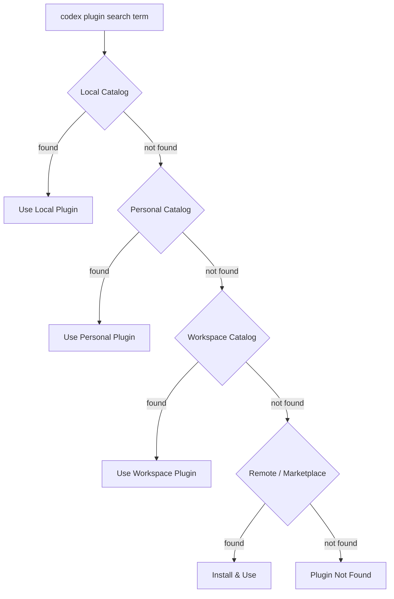
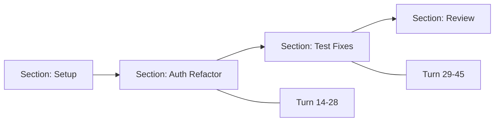

# Codex CLI v0.147.0: Portable Agent Plugins, Multi-Catalog Federation, and the --approve-for-me Flag


---

Codex CLI v0.147.0, released on 7 August 2026, is the most feature-dense stable release since v0.143.0 landed in July [^1]. Three headline additions — portable Agent Plugins with federated catalog search, the `--approve-for-me` automatic-review flag, and persistent conversation sections — collectively reshape how teams distribute, govern, and navigate agentic coding sessions. This article unpacks each feature, walks through practical configuration, and flags the security hardening that accompanied the release.

## Portable Agent Plugins and Catalog Federation

### The Problem: Plugin Sprawl Across Scopes

Since the plugin system stabilised in v0.117.0 [^2], plugins have lived in one of two places: the user's home directory (`~/.codex/plugins/`) or the project workspace (`.codex/plugins/`). Teams working across multiple repositories had no clean way to share a curated set of plugins without copying directories or maintaining symlinks — a pattern that v0.147.0 explicitly breaks by skipping symlinks during plugin installation as a security hardening measure [^1].

### The Solution: Four-Tier Catalog Hierarchy

v0.147.0 introduces a unified plugin discovery engine that merges results from four catalog tiers, searched in precedence order:

| Tier | Location | Scope |
|------|----------|-------|
| **Local** | Project-embedded plugins | Repository-specific |
| **Personal** | `~/.codex/plugins/` | User-scoped, machine-local |
| **Workspace** | `.codex/plugins/` | Project-scoped, team-shared |
| **Remote** | OpenAI marketplace + custom registries | Organisation-wide |

The `/plugins` TUI and `codex plugin marketplace search` command now merge results across all four tiers, deduplicating by plugin name and surfacing the highest-precedence match first [^1].



### Configuring Remote Catalogs

Custom remote catalogs are declared in your project or user `config.toml`:

```toml
[plugins]
enabled = true
marketplace_roots = [
  "https://plugins.internal.example.com",
  "https://marketplace.openai.com"
]
auto_update = false
update_check_interval_hours = 24
```

The `marketplace_roots` array accepts any registry that implements the Codex plugin catalog API. The catalog item limit was raised to 2,048 in this release, up from the previous 512, accommodating larger enterprise registries [^1].

### CLI Workflow

```bash
# Browse the merged catalog in the TUI
/plugins

# Search across all configured catalogs
codex plugin marketplace search "terraform"

# Install from the best-matching catalog
codex plugin install terraform-drift

# List installed plugins with their source catalog
codex plugin list

# Update all installed plugins
codex plugin update
```

### Plugin Isolation Hardening

v0.147.0 tightens security in three important ways:

1. **Symlink skipping** — plugin installation now skips symlinks entirely, preventing symlink-traversal attacks that could escape the plugin directory [^1].
2. **Network denial on policy failure** — if a plugin's policy update fails (e.g. a malformed `requirements.toml`), network access is denied rather than falling back to permissive defaults [^1].
3. **Strict tool name collision errors** — two plugins registering the same tool name now produces a hard error rather than silently shadowing. This is configured centrally via the new tool registry collision policy [^1].

These mitigations address real supply-chain risks. A Snyk audit of 3,984 agent skills found that 13.4% contained critical security issues including credential theft payloads [^3], and Liu et al.'s research demonstrated payload-less semantic compliance hijacking with attack success rates up to 77.67% for confidentiality breaches and 67.33% for remote code execution, with a 0% detection rate by existing skill-scanning tools [^4]. Codex's approach — deny-by-default isolation, hard collision errors, and symlink prohibition — raises the bar significantly.

## The `--approve-for-me` Flag

### From Manual Gates to Automatic Review

Every Codex CLI session includes an approval layer: when the agent wants to run a shell command, modify a file, or call an external API, the user is prompted to approve or deny. This is essential for safety but creates friction in CI/CD pipelines, batch operations, and unattended sessions.

The `--approve-for-me` flag routes each approval request through an automatic review pass rather than interrupting the user [^1]. The review adjudicates the request against the active sandbox mode and approval policy, then approves or refuses on your behalf.

```bash
# Run a task with automatic review in workspace-write sandbox
codex --approve-for-me --sandbox workspace-write \
  "refactor the authentication module and run tests"

# Combine with exec for CI pipelines
codex exec --approve-for-me --sandbox workspace-write \
  --output-schema '{"type":"object","properties":{"passed":{"type":"boolean"}}}' \
  "run the full test suite and report pass/fail"
```

### Safety Boundaries

The flag does not bypass sandbox enforcement. The sandbox mode (`read-only`, `workspace-write`, or `danger-full-access`) remains enforced at the OS level via Bubblewrap (Linux) or the macOS sandbox [^5]. The automatic review operates *within* the sandbox — it cannot escalate permissions.

For cyber-capable models, v0.147.0 applies safer automatic-review defaults automatically [^1]. This means that even with `--approve-for-me`, high-risk operations (network access, credential file reads, process management) are refused unless explicitly permitted by the approval policy.

```toml
# config.toml — approval policy for automatic review
[approval_policy]
# Allow file writes in workspace, deny network by default
sandbox_mode = "workspace-write"

[approval_policy.network]
# Allowlist specific domains for automatic approval
allowed = ["api.github.com", "registry.npmjs.org"]
```

### When to Use It

| Scenario | Recommendation |
|----------|---------------|
| Interactive development | Leave off — review commands yourself |
| CI/CD pipelines | Use with `workspace-write` sandbox |
| Batch refactoring | Use with explicit approval policy |
| Untrusted codebases | Never use — review everything manually |

## Persistent Conversation Sections

### The Long-Transcript Problem

Extended Codex sessions — multi-hour refactoring runs, complex debugging sessions — produce transcripts that are difficult to navigate. Scrolling through hundreds of turns to find a specific decision point wastes time and context.

v0.147.0 introduces persistent, manually ordered conversation sections [^1]. You can group related turns into named sections, reorder them, and browse long transcripts incrementally without loading the entire history.



The implementation stores sections in the SQLite state database alongside paginated thread history, ensuring that section metadata survives session restarts and can be queried incrementally [^1].

## Additional v0.147.0 Changes Worth Noting

### Cursor Skill Migration

Teams migrating from Cursor can now import Cursor-managed skills and synchronise changes to imported conversations without creating duplicates [^1]. The import preserves working directories and detects used connectors, making cross-tool migration significantly less painful.

### MCP 2026-07-28 Protocol Support

The opt-in MCP 2026-07-28 protocol brings paginated discovery, multi-round requests, and non-breaking server startup to Codex sessions [^6]. The MCP SDK was upgraded to 3.0.0 in this release [^1].

### Secret Redaction

Secrets and bearer tokens are now redacted from displayed commands and replayed conversation history [^1]. This is a basic but important hygiene improvement — previous versions could leak tokens in terminal scrollback or shared session recordings.

### Breaking Change: `--full-auto` Removed

The deprecated `codex exec --full-auto` flag has been removed. Use `--sandbox workspace-write` instead [^1]. If your CI scripts still reference `--full-auto`, they will fail on v0.147.0.

```bash
# Before (broken)
codex exec --full-auto "run tests"

# After
codex exec --sandbox workspace-write "run tests"
```

## Upgrade Checklist

For teams upgrading to v0.147.0:

1. **Replace `--full-auto`** — search your CI configs for `--full-auto` and replace with `--sandbox workspace-write`.
2. **Audit plugin symlinks** — any symlinked plugins will be silently skipped. Move them to proper plugin directories.
3. **Review tool name collisions** — if two plugins register the same tool, the session will now fail to start. Resolve collisions or disable one plugin.
4. **Configure `marketplace_roots`** — if you run an internal plugin registry, add it to `config.toml`.
5. **Test `--approve-for-me`** — if you plan to use automatic review in CI, test it against your approval policy in a staging environment first.

## Conclusion

v0.147.0 is a maturity release. The plugin system graduates from "works on my machine" to a federated, security-hardened distribution mechanism. The `--approve-for-me` flag unblocks CI/CD automation without compromising sandbox integrity. And conversation sections address the growing-pain reality that coding agent sessions now routinely run for hours. Together, these changes move Codex CLI closer to the infrastructure-grade tooling that enterprise adoption demands.

## Citations

[^1]: OpenAI, "Release 0.147.0 — openai/codex," GitHub, 7 August 2026. [https://github.com/openai/codex/releases/tag/rust-v0.147.0](https://github.com/openai/codex/releases/tag/rust-v0.147.0)

[^2]: Blake Crosley, "Codex CLI Guide 2026: Setup, Sandbox, AGENTS.md & MCP," blakecrosley.com, 2026. [https://blakecrosley.com/guides/codex](https://blakecrosley.com/guides/codex)

[^3]: BeyondScale, "LLM Plugin Security: Agent Skill Supply Chain Attacks," beyondscale.tech, 2026. [https://beyondscale.tech/blog/llm-agent-skill-marketplace-poisoning](https://beyondscale.tech/blog/llm-agent-skill-marketplace-poisoning)

[^4]: Liu, X., Zhao, Y., Hu, X. & Xia, X., "Exploiting LLM Agent Supply Chains via Payload-less Skills," arXiv:2605.14460, May 2026. [https://arxiv.org/abs/2605.14460](https://arxiv.org/abs/2605.14460)

[^5]: OpenAI, "Codex CLI Security Architecture," OpenAI Documentation, 2026. [https://openai.com/codex/docs/security](https://openai.com/codex/docs/security)

[^6]: OpenAI, "MCP 2026-07-28 Specification," OpenAI Documentation, July 2026. [https://spec.modelcontextprotocol.io/2026-07-28/](https://spec.modelcontextprotocol.io/2026-07-28/)
