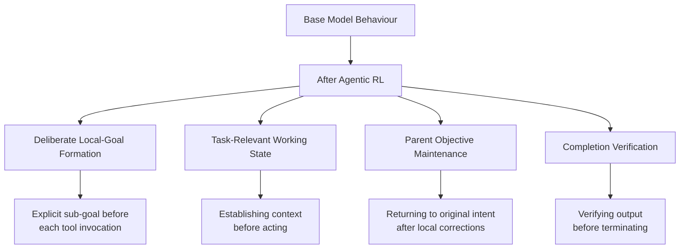
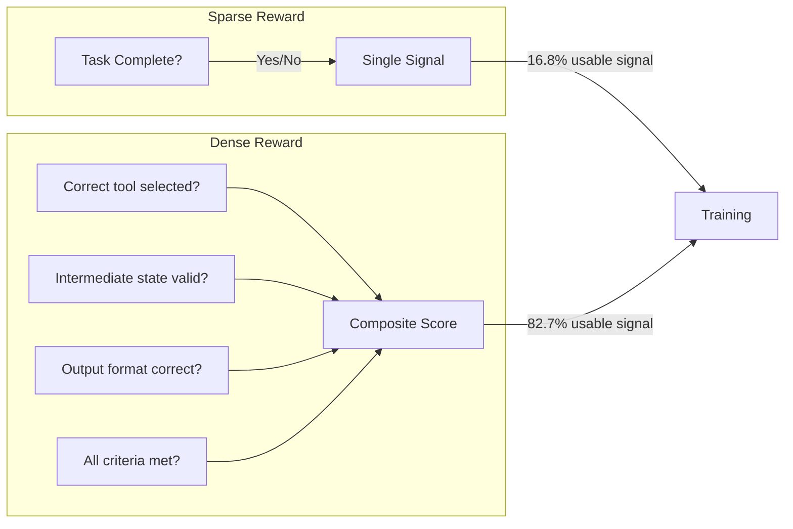

# Cross-Benchmark Generalization in Agentic RL: Why Training on Office Tasks Makes Coding Agents Better — and What It Means for Codex CLI Model Selection


---

A persistent question in agentic AI is whether reinforcement learning on tool-use tasks produces genuine behavioural skills or merely benchmark-specific overfitting. Mehta et al.'s recent work on cross-benchmark generalization [^1] provides the clearest evidence yet that agentic RL can produce transferable capabilities — including transfer *into* software engineering from non-coding training environments. For Codex CLI users, the implications touch model selection, profile configuration, and how to think about the models powering your workflows.

## The Experiment: Agentic RL Without Coding Tasks

The researchers fine-tuned Qwen3.5-122B-A10B (a mixture-of-experts model) using LoRA (rank 32, alpha 32) across a two-stage pipeline: supervised fine-tuning (SFT) followed by reinforcement learning with GSPO as the advantage estimator [^1]. The training environment — Surge AI's Long-Horizon Multi-Tool Agent Tasks — spans 27 categories covering spreadsheets, terminal operations, calendar APIs, search, and file systems [^2]. Tasks require 25–40+ tool-calling turns and 80K–100K tokens per completion, all exposed via MCP servers with deterministic Python graders [^2].

Critically, the training set contained **no software engineering tasks**. No SWE-bench instances, no code generation, no repository navigation. Every external benchmark was entirely disjoint from training data, and none influenced hyperparameter tuning or checkpoint selection [^1].

## Results: Transfer Is Real and Measurable

The trained model demonstrated improvements across five external evaluations at greedy pass@1 [^1]:

| Benchmark | Domain | Improvement |
|-----------|--------|-------------|
| Toolathlon | Multi-tool office tasks | +9.6 pp |
| SWE-Bench Pro | Software engineering | +5.8 pp |
| τ²-Bench | Airline customer service | +5.3 pp |
| BFCL-V4 | Function calling | +3.5 pp |
| Terminal-Bench 2 | Terminal operations | +2.8 pp |

The in-distribution holdout improved by +17.3 pp, confirming the pipeline works; the gap between that figure and the external gains (3.5–9.6 pp) quantifies genuine transfer versus environment-specific learning [^1].

At pass@4, the trained model exceeded GPT-5.5 (medium reasoning) on BFCL-V4: 72.2% versus 69.4% [^2]. On Toolathlon and τ²-Bench at pass@1, performance sat within roughly 1 pp of GPT-5.5 (medium reasoning) [^2].

## The Behavioural Patterns That Transfer

The paper identifies four recurring behavioural patterns that emerged from RL training without explicit reward targeting [^1] [^2]:



### Parallel tool invocation

The trained model began issuing multiple independent tool calls simultaneously, reducing sequential query redundancy and mitigating context-window exhaustion on extended tasks [^2]. This is precisely the behaviour that Codex CLI's tool-calling architecture already supports — and that benefits most from models trained to exercise it.

### Task closure discipline

Base and SFT-only models frequently terminated after evidence-gathering without executing final output steps. The RL-trained model completed multi-step workflows end-to-end, including required artifact production [^2]. In Codex CLI terms, this maps directly to the difference between an agent that investigates a bug and one that investigates *and patches* it.

### Parent objective maintenance

During local corrections — fixing a typo discovered mid-task, recovering from a wrong assumption — the trained model consistently returned to the original high-level objective rather than drifting [^1]. This resonates with Codex CLI's goal mode, which maintains the original user intent across subagent invocations.

### Working state establishment

Before acting, the trained model proactively gathered relevant context, read configuration files, and verified assumptions — behaviours that map to the exploration phase in structured Codex CLI workflows [^1].

## Why Dense Rewards Matter More Than You Think

A key technical insight: switching from sparse binary rewards (task passed / failed) to dense per-criterion scoring dramatically improved training signal quality. For the 122B model, usable training signal increased from 16.8% to 82.7% of tasks, with average per-task reward rising from 0.30 to 0.51 [^2].

This finding has direct implications for anyone building evaluation harnesses for Codex CLI workflows. Binary pass/fail testing leaves most of the signal on the table. Per-criterion grading — checking intermediate outputs, verifying correct tool selection, scoring partial completions — produces far richer feedback, whether for model training or for your own `codex exec` automation pipelines.



## Implications for Codex CLI Model Selection

### The generalist advantage is real

The cross-benchmark transfer results suggest that models trained on diverse agentic tasks — even non-coding ones — develop transferable skills that improve coding performance [^1]. This validates the broad model training strategies behind models like GPT-5.4 and o4-mini, which Codex CLI currently supports [^3]. When selecting models via `config.toml`, this research suggests that general agentic capability may matter as much as coding-specific benchmarks.

### Named profiles for task-appropriate models

Codex CLI's named profiles [^4] let you match model capabilities to task requirements:

```toml
# ~/.codex/config.toml

# Default: strong general-purpose model
model = "gpt-5.4"
model_reasoning_effort = "medium"

[profiles.long-horizon]
# Long-horizon tasks benefit from models with
# strong task-closure and parallel tool invocation
model = "o4-mini"
model_reasoning_effort = "high"

[profiles.quick-fix]
# Short tasks where speed matters more than
# deep agentic behaviour
model = "gpt-5.4-mini"
model_reasoning_effort = "low"
```

Activate with:

```bash
codex --profile long-horizon "refactor the authentication module"
codex -p quick-fix "fix the typo in README.md"
```

### Evaluating agentic capability, not just code quality

The standard approach to model evaluation focuses on code correctness. This research suggests evaluating *agentic* behaviours separately: does the model establish working context before acting? Does it verify completions? Does it maintain parent objectives during local corrections? These behaviours are orthogonal to code quality and directly affect real-world task completion rates.

## Wiring Dense Evaluation into Codex CLI Workflows

You can approximate dense reward evaluation in your own Codex CLI automation using `codex exec` with `--output-schema` and PostToolUse hooks:

```bash
codex exec \
  --sandbox workspace-write \
  --output-schema '{"type":"object","properties":{"files_modified":{"type":"array"},"tests_passed":{"type":"boolean"},"lint_clean":{"type":"boolean"}}}' \
  "implement the feature described in TASK.md"
```

A PostToolUse hook in `AGENTS.md` can enforce per-criterion verification:

```markdown
## PostToolUse Hooks

After every file write:
1. Run the relevant test suite — report pass/fail per test
2. Run the linter — report violations by category
3. Verify the change aligns with the original task description

If any criterion fails, diagnose and fix before proceeding.
Do not consider the task complete until all criteria pass.
```

This mirrors the dense reward structure that proved essential for effective RL training: each criterion provides an independent signal rather than collapsing everything into a single binary outcome.

## The SFT Prerequisite: Base Models Need a Floor

An underappreciated finding: pure RL from the base model failed entirely. The base Qwen3.5-122B-A10B couldn't generate adequate reward signals to sustain RL training, requiring an SFT stage first to expand the solvable task surface area [^2]. This has a practical analogy in Codex CLI usage: throwing a complex, multi-step task at an agent without any scaffolding (AGENTS.md directives, structured prompts, example workflows) often produces the same failure mode — the model can't find the path to partial success, so it thrashes.

The fix in both cases is the same: provide enough structure to establish a baseline competence, then let the model's learned behaviours handle the rest. In Codex CLI, that structure lives in your AGENTS.md file and project-level configuration.

## Limitations and Open Questions

The gap between in-distribution gains (+17.3 pp) and external transfer (3.5–9.6 pp) is substantial. Environment-specific overfitting remains real, and the authors acknowledge that stronger base models likely require less SFT pre-training [^2]. The evaluation was also limited to pass@1 and pass@4 — production Codex CLI workflows often involve iterative refinement rather than single-shot generation, where different behavioural patterns may dominate.

⚠️ The paper's SWE-Bench Pro and Terminal-Bench 2 results were reported in the initial paper abstract [^1] but detailed breakdowns for these benchmarks have not yet appeared in publicly available supplementary material. The forthcoming technical paper promises detailed ablations and per-category trajectory analysis [^2].

## Key Takeaways

1. **Agentic RL produces transferable skills.** Training on office tasks improved software engineering performance by +5.8 pp on SWE-Bench Pro, with zero coding tasks in the training set [^1].

2. **Dense rewards beat sparse rewards dramatically.** Per-criterion grading increased usable training signal from 16.8% to 82.7% — apply the same principle to your Codex CLI evaluation harnesses [^2].

3. **Four behavioural patterns transfer across domains:** deliberate goal formation, working state establishment, parent objective maintenance, and completion verification. These are the behaviours to look for when evaluating models for Codex CLI use [^1].

4. **Model selection should weight agentic capability.** General agentic training produces genuine coding improvements. Don't select models solely on coding benchmarks — evaluate their tool-use and long-horizon behaviours too.

5. **Structure enables learning.** Just as SFT was a prerequisite for effective RL, AGENTS.md directives and named profiles are prerequisites for effective Codex CLI agent behaviour on complex tasks.

---

## Citations

[^1]: Mehta, S., Ritchie, L., Panavas, L. & Chen, E. (2026). "Cross-Benchmark Generalization in Long-Horizon Agents." arXiv:2608.00181. [https://arxiv.org/abs/2608.00181](https://arxiv.org/abs/2608.00181)

[^2]: Surge AI. (2026). "Cross-Benchmark Generalization for Long-Horizon Agentic Tasks." Surge AI Blog. [https://surgehq.ai/blog/cross-benchmark-generalization-for-long-horizon-agentic-tasks](https://surgehq.ai/blog/cross-benchmark-generalization-for-long-horizon-agentic-tasks)

[^3]: OpenAI. (2026). "Codex CLI Releases." GitHub. [https://github.com/openai/codex/releases](https://github.com/openai/codex/releases)

[^4]: OpenAI. (2026). "Agent approvals & security." ChatGPT Learn / Codex Documentation. [https://developers.openai.com/codex/agent-approvals-security](https://developers.openai.com/codex/agent-approvals-security)
