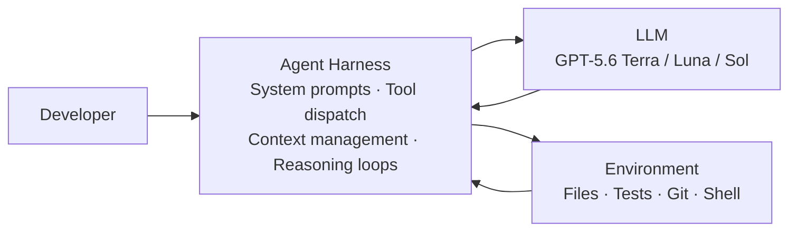
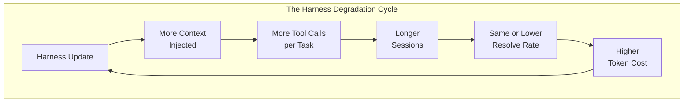
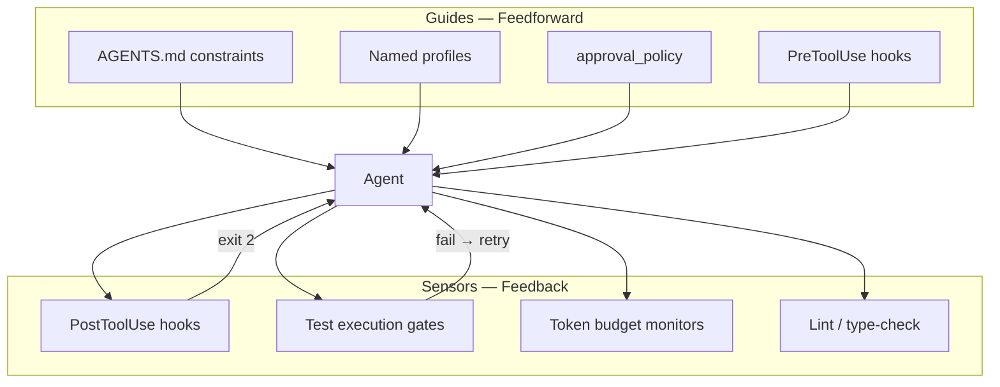

# Don't Blame the Model: How Scaffolding Evolution Shapes Coding Agent Quality — and What It Means for Codex CLI Users


---

When your Codex CLI session suddenly produces worse patches after an upgrade, the instinct is to blame the model. A new paper from Ben Sghaier et al. demonstrates that this attribution is frequently wrong: the *agent harness* — the middleware layer orchestrating prompts, tools, context, and reasoning loops — is the more likely culprit [^1]. The finding has immediate, practical consequences for anyone running Codex CLI in production.

## The Agent Harness Layer

Every coding agent is a composition of two independent systems: the underlying language model and the harness that wraps it. The harness handles system prompt construction, tool dispatch, context window management, iterative reasoning loops, and output formatting. Böckeler's framing captures it precisely: **Agent = Model + Harness** [^2]. When you run `codex`, the Rust binary *is* the harness. The model is whatever sits behind the API endpoint.



The problem is that harnesses evolve at extreme velocity whilst models update on a slower cadence. Ben Sghaier et al. measured release rates across five major open-source agent harnesses and found they ship 13–28× more frequently than mature developer tools [^1]:

| Harness | Releases/week | Commits/day |
|---------|--------------|-------------|
| OpenCode | 18.0 | 34.2 |
| **Codex CLI** | **12.4** | **13.0** |
| Gemini CLI | 10.3 | 21.0 |
| Qwen Code | 10.0 | 19.9 |
| OpenHands CLI | 1.5 | 2.8 |
| *VS Code (baseline)* | *0.8* | *47.9* |
| *GitHub CLI (baseline)* | *0.6* | *4.8* |

Codex CLI ships roughly 12 releases per week [^1]. At that pace, any upgrade could change your effective agent quality without the model changing at all.

## The Controlled Experiment

The study's core contribution is methodological: fix the model, vary only the harness, measure quality. They evaluated 35 sequential releases of Qwen Code CLI (v0.0.10 through v0.10.3) against 50 stratified SWE-bench Verified tasks with dual runs per task — 3,500 total executions — using a locally-hosted Qwen3-Next-80B model via vLLM [^1].

### Effectiveness: No Trend

Resolve rates fluctuated between 23% and 39% across releases with **no statistically significant improvement** (Spearman ρ=0.208, p=0.231) [^1]. An early version (v0.0.14) achieved the 39% peak; later, far more sophisticated versions never recovered it. The disconnect between patch *generation* (52–94% of tasks) and patch *correctness* (23–39%) is striking — the harness gets better at producing patches but not at producing *correct* ones.

### Efficiency: Steady Degradation

Token consumption increased 70% from early to later releases (391K → 668K tokens per task), confirmed by a strong upward trend (Spearman ρ=0.743, p<0.0001) [^1]. Unresolved tasks consumed 2.7× more tokens (697.7K vs. 258.7K) and required 1.8× more tool invocations (12.95 vs. 7.2 calls) [^1]. The harness traps the model in unproductive edit–test–read loops, burning budget without improving outcomes.



### Architectural Risk Zones

The study mapped commits to a 10-component reference architecture and identified which zones carry the highest regression risk [^1]:

- **High risk:** LLM Provider layer (prompt templates, API parameters) and Context Management layer (what the model sees and when)
- **Low risk:** Security and Extensibility layers (plugins, sandboxing)

This maps directly to Codex CLI's architecture. Changes to system prompt construction or context compaction logic are far more likely to cause quality regressions than changes to the plugin system or sandbox enforcement.

## The Overfitting Caveat

A complementary study from the Allen Institute for AI adds an important caveat: automatic harness evolution — where the harness optimises itself against a benchmark — does not consistently outperform simple test-time scaling and exhibits limited generalisation when tested on held-out tasks [^3]. The evolved harnesses overfit to the search benchmark. This matters because some Codex CLI workflows (particularly those using self-improving AGENTS.md patterns) risk the same trap.

## The Self-Evolution Frontier

Zhou et al. survey the emerging class of *self-evolving* coding agents that update their own harness components — memory, skills, tools, or collaboration structures — from prior interactions [^4]. Whilst promising, the Ben Sghaier findings suggest caution: more evolution does not automatically mean more quality. Without rigorous regression testing, self-evolution can amplify the degradation cycle.

## What This Means for Codex CLI Users

### 1. Pin Your Harness Version

Treat Codex CLI upgrades the same way you treat dependency upgrades: test before deploying to production workflows.

```toml
# In your CI/CD pipeline or team setup script
# Pin to a known-good version
[tool.codex]
version = "0.146.1"  # Tested against your codebase
```

When a new version ships, run your own evaluation before adopting it. The paper shows that even minor harness changes can swing resolve rates by 16 percentage points [^1].

### 2. Benchmark Your Harness, Not Just Your Model

Create a local evaluation set of representative tasks from your codebase. Run it against each Codex CLI upgrade before rolling out.

```bash
# Simple harness regression test
for task in tasks/*.md; do
  codex exec --model gpt-5.6-terra \
    --sandbox workspace-write \
    "$(cat "$task")" 2>&1 | tee "results/$(basename "$task" .md).log"
done

# Compare resolve rates and token consumption
python3 evaluate_results.py results/ --baseline results-v0.146.1/
```

Track both effectiveness (did it solve the task?) *and* efficiency (how many tokens did it burn?). A version that solves the same tasks at 70% higher cost is a regression [^1].

### 3. Isolate High-Risk Configuration Changes

The architectural risk analysis tells you where to focus review effort. In Codex CLI terms:

- **High-risk changes:** Modifications to your system prompt (`AGENTS.md`), model selection (`--model`), context compaction settings, or approval policy
- **Low-risk changes:** Plugin additions, sandbox mode changes, MCP server configuration

```markdown
<!-- AGENTS.md — version-controlled, reviewed like production code -->
# Version: 2026-08-10-v3
# Validated against: eval-set-v12, resolve rate 34%, avg tokens 285K

## Instructions
- Run tests after every file edit
- Never modify files outside the target module
- If tests fail twice on the same file, stop and report
```

### 4. Monitor Token Efficiency as a First-Class Metric

The study found that failed tasks consume 2.7× more tokens [^1]. A sudden spike in token consumption is a leading indicator of harness regression, often visible before resolve-rate drops become statistically significant.

```bash
# Track token consumption per task over time
codex exec --model gpt-5.6-terra \
  --sandbox workspace-write \
  --json-output \
  "Fix the failing test in auth_service.py" \
  | jq '.usage.total_tokens' >> metrics/token-trend.jsonl
```

### 5. Apply Böckeler's Guide/Sensor Framework

Structure your harness controls as feedforward *guides* (things that steer before the agent acts) and feedback *sensors* (things that check after it acts) [^2]:



Computational sensors (linters, type checkers, test runners) are cheap and deterministic — run them on every tool call via PostToolUse hooks. Inferential sensors (LLM-based review) are expensive — reserve them for integration gates [^2].

## The Broader Lesson

The paper's core paradox deserves emphasis: despite thousands of commits monthly and continuous sophisticated refinements, harness quality — measured by actual bug-fixing capability — remains stagnant or regresses, whilst operational costs escalate [^1]. The hyper-churn release pattern (10–18 releases weekly) does not correlate with quality improvement.

For Codex CLI users, the practical takeaway is straightforward: **version-control your harness configuration, benchmark it against your own codebase, and treat upgrades as potentially breaking changes until proven otherwise.** The model is rarely the problem. The scaffolding usually is.

## Citations

[^1]: Ben Sghaier, O., Li, H., Adams, B. & Hassan, A.E. (2026). "Don't Blame the Large Language Model: How Agent Harness Evolution Shapes Coding Agent Quality." *arXiv:2607.03691*. [https://arxiv.org/abs/2607.03691](https://arxiv.org/abs/2607.03691)

[^2]: Böckeler, B. (2026). "Harness Engineering for Coding Agent Users." *Martin Fowler's Blog*, 2 April 2026. [https://www.martinfowler.com/articles/exploring-gen-ai/harness-engineering.html](https://www.martinfowler.com/articles/exploring-gen-ai/harness-engineering.html)

[^3]: Wang, Y., Zhu, H., Hu, Z., Yuan, Y., Chen, Z., Senthil, S., Hajishirzi, H., Tsvetkov, Y., Dasigi, P. & Xiao, T. (2026). "Rethinking the Evaluation of Harness Evolution for Agents." *arXiv:2607.12227*. [https://arxiv.org/abs/2607.12227](https://arxiv.org/abs/2607.12227)

[^4]: Zhou, H., Hu, H., Shang, Y. & Zhang, Q. (2026). "Self-Evolving Coding Agents." *arXiv:2608.03392*. [https://arxiv.org/abs/2608.03392](https://arxiv.org/abs/2608.03392)

[^5]: Codex CLI Releases. OpenAI. [https://github.com/openai/codex/releases](https://github.com/openai/codex/releases)

[^6]: OpenAI (2026). "Codex Changelog." [https://developers.openai.com/codex/changelog](https://developers.openai.com/codex/changelog)
