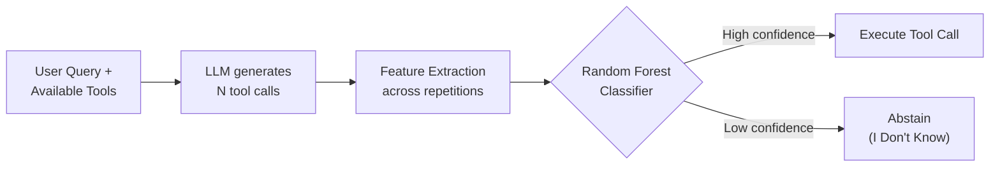
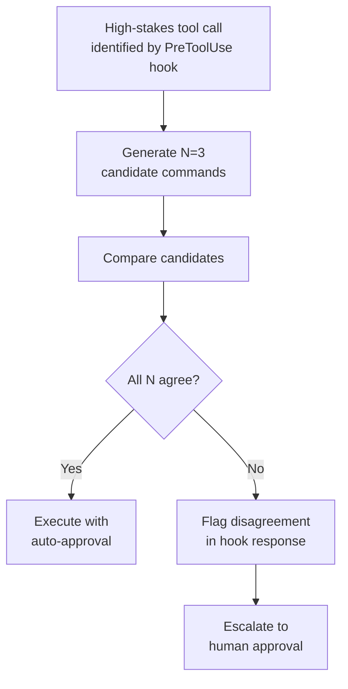

# The IDK Filter and the Confident Hallucination Problem: Why Your Coding Agent Calls the Wrong Tool With Full Confidence — and How Uncertainty-Aware Filtering Maps to Codex CLI


---

Your coding agent calls `rm -rf /tmp/build` when it should have called `mkdir -p /tmp/build`. It does so with absolute confidence. No hesitation, no hedging, no fallback. The model's internal certainty about wrong tool calls is indistinguishable from its certainty about correct ones — and that's the problem nobody's toolchain addresses.

Three recent papers converge on a single insight: **measuring uncertainty in tool-calling decisions is not just possible, it's cheap enough for production**. The implications for how you configure Codex CLI's approval pipeline are significant.

## The Confident Hallucination Gap

When an LLM generates natural language, uncertainty usually manifests as hedging ("perhaps", "it might be"). When it generates a function call, there's no such signal. The output is a structured JSON object — a tool name and parameters — and it's either right or wrong. There's no syntactic room for doubt.

Broecker et al.'s "I Don't Know" Filter (IDK Filter) [^1] formalises this gap. They demonstrate that when you ask the same model to generate the same function call five times, **incorrect calls show measurably higher variance** across repetitions. The model doesn't know it's wrong, but its outputs betray the uncertainty its interface hides.

The finding aligns with two complementary lines of work:

- **Uncertainty Quantification for LLM Function-Calling** (Ye et al.) [^2] shows that standard multi-sample uncertainty methods like Semantic Entropy — which work well for natural language QA — actually underperform simpler single-sample approaches for function calls. The structural properties of tool-call outputs (parseable as ASTs, with typed parameters) enable tighter uncertainty estimates than free-form text.

- **TRUST: Uncertainty-Aligned Reinforcement Learning** (Zhou et al.) [^3] finds that standard RL fine-tuning for tool use *weakens* the separation between correct and incorrect decisions, making overconfident errors more likely. Their uncertainty-preserving reward design maintains the gap that the IDK Filter exploits.

## How the IDK Filter Works

The IDK Filter operates as a three-stage pipeline that sits between the model and tool execution:



### The IDK Score

Rather than treating abstention as failure, Broecker et al. introduce a metric that rewards it:

```
IDKS = (C - I) / N
```

Where `C` is correct calls, `I` is incorrect calls, and `N` is total calls. Abstentions are neutral — neither rewarded nor penalised. This shifts the optimisation target from "always answer" to "answer correctly or don't answer at all" [^1].

### Three Feature Tiers

The classifier extracts features at three levels of model access [^1]:

| Tier | Access Required | Features | Production Feasibility |
|------|----------------|----------|----------------------|
| **Whitebox** | Model internals | Activation patterns, hidden states | Self-hosted models only |
| **Greybox** | Log probabilities | Token-level confidence scores | OpenAI API, local models |
| **Blackbox** | Generated text only | Embedding distances across repetitions | Any provider |

The critical finding: even blackbox features (comparing text embeddings of repeated outputs) improve the IDK Score. On the APIGen benchmark, Llama-3.2-3B moved from 0.342 baseline to 0.541 with full features — a 58% improvement in net-correct tool calling [^1].

### Cross-Model Transfer

Classifiers trained on one model transfer to others with only slight performance drops [^1]. A filter trained on Phi-4-mini's uncertainty patterns works on Qwen2.5-3B, suggesting that uncertainty manifests similarly across architectures when the task is structured function calling.

## Complementary Evidence: Internal Representations

Healy et al.'s work on internal representations [^4] approaches the same problem from inside the model. Their framework detects tool-selection hallucinations — wrong tool, malformed parameters, simulated outputs — by examining internal representations during the generation forward pass itself. Detection accuracy reaches 86.4% with minimal computational overhead [^4].

The three hallucination modes they identify map directly to coding agent failures:

1. **Wrong tool selection** — calling `write_file` when `patch_file` was appropriate
2. **Malformed parameters** — correct tool, incorrect arguments (wrong file path, missing flags)
3. **Simulated execution** — generating a plausible output string instead of actually calling the tool

## What This Means for Codex CLI

Codex CLI doesn't implement an IDK Filter natively, but its hook architecture and approval pipeline provide the infrastructure to build one.

### PreToolUse as the Interception Point

The `PreToolUse` hook fires before every Bash tool call, receiving the tool name and full command as a JSON payload on stdin [^5]. A hook script can inspect the call, approve it, modify it, or deny it:

```bash
#!/bin/bash
# idk-filter-hook.sh — lightweight uncertainty gate
# Receives JSON on stdin: {"tool": "bash", "command": "..."}

INPUT=$(cat)
COMMAND=$(echo "$INPUT" | jq -r '.command')

# Call uncertainty estimation service
CONFIDENCE=$(curl -s "http://localhost:8901/score" \
  -d "{\"command\": \"$COMMAND\"}" | jq -r '.confidence')

if (( $(echo "$CONFIDENCE < 0.4" | bc -l) )); then
  # Low confidence: escalate to human approval
  echo '{"action": "deny", "reason": "IDK filter: confidence below threshold"}'
else
  echo '{"action": "approve"}'
fi
```

This pattern maps directly to the IDK Filter architecture: the hook intercepts the tool call, queries a lightweight classifier, and gates execution based on the confidence score.

### Approval Policy as Cost-Threshold Enforcement

The IDK Score's insight — that incorrect calls should cost more than abstentions — maps to Codex CLI's `approval_policy` configuration [^5]:

```toml
# config.toml — uncertainty-aware approval tiers
[approval_policy]
# Low-risk read operations: auto-approve
read = "auto"
# Write operations: require approval if confidence is uncertain
write = "on-request"
# Destructive operations: always require human review
destructive = "always"
```

The `approval_policy.granular` setting in v0.147.0 enables per-category thresholds [^6], letting you apply stricter gates to high-consequence tool calls while auto-approving reads — the same asymmetric cost model that the IDK Score formalises.

### AGENTS.md as an Abstention Directive

The IDK Filter's key behavioural shift — preferring abstention over confident-but-wrong execution — can be encoded as an AGENTS.md directive:

```markdown
## Tool Call Policy

When uncertain about which command to run, STOP and ask.
Do not guess file paths — verify with `ls` or `find` first.
Do not assume package managers — check the project's lockfile.
Never run destructive commands without confirming the target exists.
```

This maps to the paper's finding that explicit instruction to abstain reduces incorrect calls without significantly reducing correct ones [^1].

### Model Routing for Uncertainty Separation

Zhou et al.'s TRUST finding [^3] — that standard RL weakens uncertainty separation — has implications for model selection. Codex CLI's named profiles allow routing by task sensitivity:

```toml
# Exploration tasks: use a model with better uncertainty calibration
[profiles.explore]
model = "gpt-5.6-terra"
approval_policy = "on-request"

# Execution tasks: use a faster model with strict approval
[profiles.execute]
model = "gpt-5.6-luna"
approval_policy = "always"
```

The rationale: larger models (Terra tier) show better-calibrated uncertainty signals [^2], making them more suitable for exploratory tool calls where wrong choices are costly. Smaller models (Luna tier) can be paired with stricter approval gates to compensate for weaker self-knowledge.

## The Repeated-Call Pattern

The IDK Filter's core mechanism — generating multiple candidate calls and comparing variance — suggests a practical pattern for high-stakes Codex CLI operations:



Broecker et al. found that baseline performance degraded ~10% by the fifth repetition, but the filter's improvement increased [^1]. The sweet spot for production appears to be 3–5 repetitions — enough variance signal without excessive latency.

### The Confident-Wrong Blind Spot

The IDK Filter has an acknowledged limitation: **consistently wrong outputs fool it** [^1]. If the model always generates the same incorrect command with high confidence, repeated sampling won't catch it. This is where Healy et al.'s internal-representation approach [^4] complements the filter — it can detect hallucinations even when the model is consistently wrong, because the internal activations still differ from correct-generation patterns.

For Codex CLI, this argues for layered defence:

1. **PreToolUse hook** — consistency check via repeated generation (IDK Filter pattern)
2. **PostToolUse hook** — postcondition verification (did the command achieve its goal?)
3. **approval_policy** — human escalation for unresolvable uncertainty
4. **Sandbox** — blast radius containment when all filters fail

## Practical Takeaways

**If you run Codex CLI in `--approve-for-me` mode**, you're relying entirely on Guardian's auto-review to catch wrong tool calls. The IDK Filter research suggests this single layer is insufficient — confident-but-wrong calls look identical to confident-and-correct ones from the outside.

**If you write PreToolUse hooks**, consider the repeated-generation pattern for destructive operations. The computational cost is 3–5× for the gated calls only, not for every tool invocation.

**If you configure AGENTS.md**, add explicit abstention directives. The research consistently shows that models which are instructed to say "I don't know" produce fewer incorrect tool calls without meaningfully reducing correct ones.

**If you select models for different tasks**, prefer larger models for exploratory tool calling where uncertainty calibration matters, and pair smaller models with stricter approval gates.

The broader lesson: the tool-calling interface's structured output format — which makes function calls so useful — also strips away the uncertainty signals that natural language preserves. Until models natively expose calibrated confidence for structured outputs, external filtering is the pragmatic defence.

---

## Citations

[^1]: Broecker, S., del Rosario, M., Selitser, B. & Strohmer, T. (2026). "The 'I Don't Know' Filter: Enhancing Agentic Reliability in Function Calling." arXiv:2607.04034. [https://arxiv.org/abs/2607.04034](https://arxiv.org/abs/2607.04034)

[^2]: Ye, Z., Aichberger, L., Kirchhof, M., Williamson, S., Zappella, L., Gal, Y., Blaas, A. & Golinski, A. (2026). "Uncertainty Quantification for LLM Function-Calling." arXiv:2604.22985. [https://arxiv.org/abs/2604.22985](https://arxiv.org/abs/2604.22985)

[^3]: Zhou, Y., Zeng, L., Lu, X., Xie, W., Liu, D., Yan, J. & Shao, J. (2026). "Exploring Agentic Tool-Calling Decisions via Uncertainty-Aligned Reinforcement Learning." arXiv:2606.06976. [https://arxiv.org/abs/2606.06976](https://arxiv.org/abs/2606.06976)

[^4]: Healy, K., Srinivasan, B., Madathil, V. & Wu, J. (2026). "Internal Representations as Indicators of Hallucinations in Agent Tool Selection." arXiv:2601.05214. [https://arxiv.org/abs/2601.05214](https://arxiv.org/abs/2601.05214)

[^5]: Codex CLI Hooks Reference — PreToolUse & PostToolUse hook architecture. [https://agenticcontrolplane.com/blog/codex-cli-hooks-reference](https://agenticcontrolplane.com/blog/codex-cli-hooks-reference)

[^6]: OpenAI (2026). Codex CLI v0.147.0 Release Notes — approval_policy.granular, --approve-for-me, Agent Plugin search. [https://www.gradually.ai/en/changelogs/codex-cli/](https://www.gradually.ai/en/changelogs/codex-cli/)
