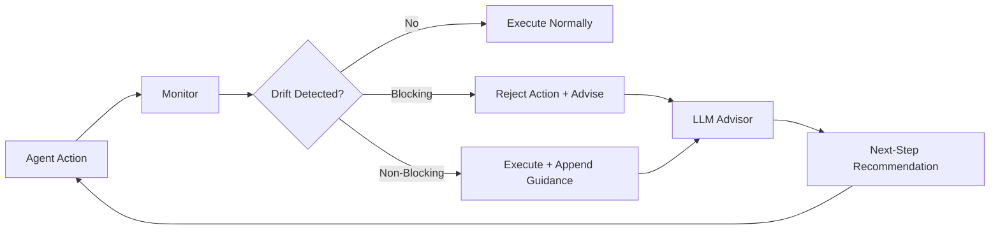

# LivePlan and Online Corrective Steering: Why Deterministic Drift Detection Plus LLM Advisory Beats Global Replanning — and How to Wire It into Codex CLI


---

## The Drift Problem in Long Coding Sessions

Every senior developer who has run a coding agent on a non-trivial issue has watched the same failure mode unfold: the agent starts well, localises the bug, then drifts. It repeats failed commands, patches files it has not yet read, or submits without running tests. The trajectory looks purposeful at each step, but the cumulative path diverges from the plan.

Liu et al. formalise this in *Online Monitoring and Corrective Steering of Programming Agents* (August 2026), introducing **LivePlan** — a two-component system that separates deterministic trajectory monitoring from LLM-powered advisory [^1]. The core insight: you do not need an expensive language model to *detect* drift. You need one only to *correct* it.

## How LivePlan Works

LivePlan sits between the agent's action loop and the environment. It constructs two trajectory representations incrementally:

- **Graphectory** — a directed graph of actions where nodes are tool calls and edges capture transitions. Back-edges (self-loops, repeated action sequences) signal oscillation.
- **Langutory** — a phase-annotated sequence that tracks which stage of the plan the agent is executing (localisation, reproduction, patching, validation).

A **deterministic, rule-based monitor** evaluates these representations against configurable signals. No LLM call is needed for detection [^1].



### Blocking vs Non-Blocking Drifts

LivePlan distinguishes two categories of drift signal:

**Blocking drifts** prevent execution entirely:

| Signal | Description |
|--------|-------------|
| Plan Violation | Skipping required phases |
| Premature Patching | Writing a patch before localisation completes |
| Skip Patching | Attempting to finalise without producing a patch |
| Skip Validation | Submitting before running tests |

**Non-blocking drifts** allow execution but append corrective guidance:

| Signal | Description |
|--------|-------------|
| Thought Oscillation | Repeated reasoning without forward progress |
| Action Oscillation | Repeated execution loops or self-loops in Graphectory |
| Long Stagnation | More than 7 consecutive steps in the same phase |
| Repeated Action | Back-edge detected in the action graph |

When a drift fires, the monitor invokes an **LLM advisor** with a narrow context window: the issue description, a recent trajectory slice, and a predefined drift hint. The advisor returns a *next-step recommendation* — not a full replan [^1]. This is cheaper and more targeted than global plan regeneration.

## The Numbers

Liu et al. evaluated LivePlan across three executor models on SWE-bench Verified and SWE-bench Pro-Python, using 7,752 trajectories [^1]:

### SWE-bench Pro-Python

| Executor | Baseline | + LivePlan | Improvement |
|----------|----------|------------|-------------|
| DeepSeek-V3 | 21.76% | 34.09% | +12.33pp |
| Gemini-2.5-Flash | 13.17% | 28.41% | +15.24pp |
| MiniMax-M2.5 | 52.50% | 57.95% | +5.45pp |

### SWE-bench Verified

| Executor | Baseline | + LivePlan | Improvement |
|----------|----------|------------|-------------|
| DeepSeek-V3 | 38.20% | 49.40% | +11.20pp |
| Gemini-2.5-Flash | 37.80% | 48.40% | +10.60pp |
| MiniMax-M2.5 | 74.20% | 79.20% | +5.00pp |

Two findings stand out. First, the largest gains appear on weaker models — Gemini-2.5-Flash sees +15.24pp on Pro-Python versus +5.45pp for MiniMax-M2.5. The monitor compensates for models that drift more frequently. Second, the advisor cost is negligible: \$0.01–\$0.06 per instance on average [^1].

### Ablation: Why LivePlan Beats Alternatives

The ablation study on DeepSeek-V3 (SWE-bench Pro-Python) isolates what matters [^1]:

| Approach | Resolution Rate | Delta |
|----------|----------------|-------|
| Vanilla SWE-agent | 21.76% | — |
| SAGE (global replan) | 18.79% | −2.97pp |
| Predefined Advice only | 25.00% | +3.24pp |
| Periodic Advisor (SWE-PRM-style) | 28.79% | +7.03pp |
| **LivePlan** | **34.09%** | **+12.33pp** |

SAGE — which regenerates the entire plan on drift detection — actually *hurts* performance. Global replanning introduces its own instability. Periodic advisory (calling the LLM every N steps regardless) works but wastes compute: it triggers on ~99.6% of trajectories versus LivePlan's ~93.9% [^1]. The deterministic monitor acts as a precision filter, calling the advisor only when structural evidence of drift exists.

## Mapping LivePlan to Codex CLI

LivePlan's architecture maps directly onto Codex CLI's hook system. The key primitives are `PostToolUse` hooks for monitoring, exit code 2 for steering, and the separation between deterministic checks and LLM-powered advice [^2].

### PostToolUse Hooks as Deterministic Monitor

Codex CLI fires `PostToolUse` after every tool execution — Bash commands, `apply_patch` edits, and MCP tool calls [^2]. A hook that exits with code 2 injects its `stderr` content as corrective context the agent sees, effectively steering the next action without undoing what already ran [^2].

This is LivePlan's non-blocking drift pattern: execute, detect, advise.

```json
{
  "hooks": {
    "PostToolUse": [
      {
        "matcher": ".*",
        "hooks": [
          {
            "type": "command",
            "command": "python3 .codex/hooks/drift-monitor.py",
            "timeout": 10,
            "statusMessage": "Checking for trajectory drift"
          }
        ]
      }
    ]
  }
}
```

The `drift-monitor.py` script receives the tool name, input, and response via `stdin` as JSON [^2]. It maintains a local action log (the Graphectory equivalent) and checks for the signals LivePlan identifies:

```python
#!/usr/bin/env python3
"""Lightweight drift monitor for Codex CLI PostToolUse hooks."""
import json, sys
from pathlib import Path

LOG = Path("/tmp/codex-trajectory.jsonl")
STAGNATION_THRESHOLD = 7
MAX_REPEATS = 3

def load_history():
    if not LOG.exists():
        return []
    return [json.loads(l) for l in LOG.read_text().splitlines() if l.strip()]

def detect_drift(history, current):
    # Action oscillation: same command repeated
    recent = [h["tool_input"] for h in history[-MAX_REPEATS:]]
    if len(recent) == MAX_REPEATS and len(set(recent)) == 1:
        return "action_oscillation", f"Repeated identical action {MAX_REPEATS} times"

    # Stagnation: too many steps without phase change
    if len(history) >= STAGNATION_THRESHOLD:
        phases = [h.get("phase", "unknown") for h in history[-STAGNATION_THRESHOLD:]]
        if len(set(phases)) == 1:
            return "stagnation", f"Stuck in '{phases[0]}' for {STAGNATION_THRESHOLD} steps"

    return None, None

def main():
    payload = json.loads(sys.stdin.read())
    current = {
        "tool_name": payload.get("tool_name", ""),
        "tool_input": json.dumps(payload.get("tool_input", "")),
        "phase": classify_phase(payload),
    }

    history = load_history()
    drift_type, reason = detect_drift(history, current)

    # Append to log
    with LOG.open("a") as f:
        f.write(json.dumps(current) + "\n")

    if drift_type:
        # Exit 2 = steering signal; stderr becomes agent context
        print(reason, file=sys.stderr)
        sys.exit(2)

    sys.exit(0)

def classify_phase(payload):
    tool = payload.get("tool_name", "")
    inp = json.dumps(payload.get("tool_input", "")).lower()
    if "grep" in inp or "find" in inp or "rg " in inp:
        return "localisation"
    if "test" in inp or "pytest" in inp or "npm test" in inp:
        return "validation"
    if tool == "apply_patch" or "patch" in inp:
        return "patching"
    return "exploration"

if __name__ == "__main__":
    main()
```

### PreToolUse Hooks as Blocking Monitor

For blocking drifts — premature patching, skipping validation — use `PreToolUse` hooks. When the hook returns `permissionDecision: "deny"`, the action is rejected before execution [^2]:

```json
{
  "hooks": {
    "PreToolUse": [
      {
        "matcher": "apply_patch",
        "hooks": [
          {
            "type": "command",
            "command": "python3 .codex/hooks/phase-gate.py",
            "timeout": 5,
            "statusMessage": "Verifying phase order"
          }
        ]
      }
    ]
  }
}
```

The phase gate checks whether localisation has occurred before allowing a patch — directly implementing LivePlan's "Premature Patching" blocking signal.

### AGENTS.md as Phase Policy

LivePlan's Langutory assumes a known phase sequence. In Codex CLI, encode this in `AGENTS.md` [^3]:

```markdown
## Issue Resolution Protocol

Follow this phase sequence strictly:
1. **Localisation** — Read the issue, search the codebase, identify affected files
2. **Reproduction** — Write or run a failing test that demonstrates the bug
3. **Patching** — Apply the minimal fix
4. **Validation** — Run the full test suite; confirm the fix and no regressions
5. **Submission** — Only after validation passes

Do NOT skip phases. Do NOT patch before reproducing.
```

This gives the deterministic monitor its phase definitions and gives the agent explicit structural guardrails.

### LLM Advisor via Model Tiering

LivePlan pairs cheap executors with stronger advisors (GPT-5.2-Codex advising DeepSeek-V3) [^1]. In Codex CLI, replicate this with named profiles:

```toml
# ~/.codex/config.toml — everyday executor
[profile.default]
model = "gpt-5.6-luna"

# Advisor profile for complex steering
[profile.advisor]
model = "gpt-5.6-terra"
```

When the drift monitor detects a non-trivial issue, the PostToolUse hook can shell out to `codex exec --profile advisor "Given this trajectory and drift: ... What should the next step be?"` to get targeted advice [^4]. The advisor cost stays low because it fires only on detected drift, not on every step.

### Hyperparameter Tuning

LivePlan's key hyperparameters translate to hook configuration:

| LivePlan Parameter | Value | Codex CLI Equivalent |
|-------------------|-------|---------------------|
| Cooling period (θc) | 5 steps | Rate-limit advisor calls in `drift-monitor.py` |
| Stagnation threshold (θp) | 7 steps | `STAGNATION_THRESHOLD` in the monitor script |
| Max blocking interventions (θi) | 5 consecutive | Counter in `phase-gate.py` before escalating to human |

## Complementary Research

LivePlan's deterministic monitoring aligns with two adjacent findings:

**TACT** (arXiv:2605.05980) detects overthinking and overacting in coding agents through activation steering in the model's residual stream [^5]. Where LivePlan monitors *behavioural* signals externally, TACT monitors *internal* model states. Both confirm that drift is detectable before it becomes unrecoverable.

**SWE-PRM** (arXiv:2509.02360) uses periodic process reward models to score trajectory quality at fixed intervals [^6]. LivePlan's ablation shows that event-driven monitoring (fire on drift evidence) outperforms periodic monitoring (+12.33pp vs +7.03pp) — the same pattern Codex CLI developers should follow when designing hook-based steering.

## Practical Implications

Three takeaways for Codex CLI practitioners:

1. **Separate detection from correction.** Deterministic checks are fast, cheap, and sufficient to identify when something has gone wrong. Reserve LLM calls for deciding what to do about it.

2. **Do not replan globally.** SAGE's negative result (−2.97pp) confirms what experienced developers intuit: throwing away the plan and starting over usually makes things worse. Targeted next-step advice is more effective.

3. **Weaker models benefit most.** If you are running GPT-5.6 Luna for cost efficiency, a drift monitor with Terra-tier advisory catches the errors Luna's lighter reasoning misses — for an additional \$0.01–\$0.06 per instance.

## Citations

[^1]: Liu, S., Dehghan, S., Kim, J.Y., Ganhotra, J., Hirzel, M. & Jabbarvand, R. (2026). "Online Monitoring and Corrective Steering of Programming Agents." arXiv:2608.06701. [https://arxiv.org/abs/2608.06701](https://arxiv.org/abs/2608.06701)

[^2]: OpenAI (2026). "Codex CLI Hooks Documentation." [https://learn.chatgpt.com/docs/hooks](https://learn.chatgpt.com/docs/hooks)

[^3]: OpenAI (2026). "AGENTS.md — Codex CLI Documentation." [https://learn.chatgpt.com/docs/agents-md](https://learn.chatgpt.com/docs/agents-md)

[^4]: OpenAI (2026). "Codex CLI Configuration — Named Profiles." [https://learn.chatgpt.com/docs/configuration](https://learn.chatgpt.com/docs/configuration)

[^5]: Chen, Y. et al. (2026). "TACT: Mitigating Overthinking and Overacting in Coding Agents via Activation Steering." arXiv:2605.05980. [https://arxiv.org/abs/2605.05980](https://arxiv.org/abs/2605.05980)

[^6]: Wang, Y. et al. (2025). "When Agents go Astray: Course-Correcting SWE Agents with PRMs." arXiv:2509.02360. [https://arxiv.org/abs/2509.02360](https://arxiv.org/abs/2509.02360)
