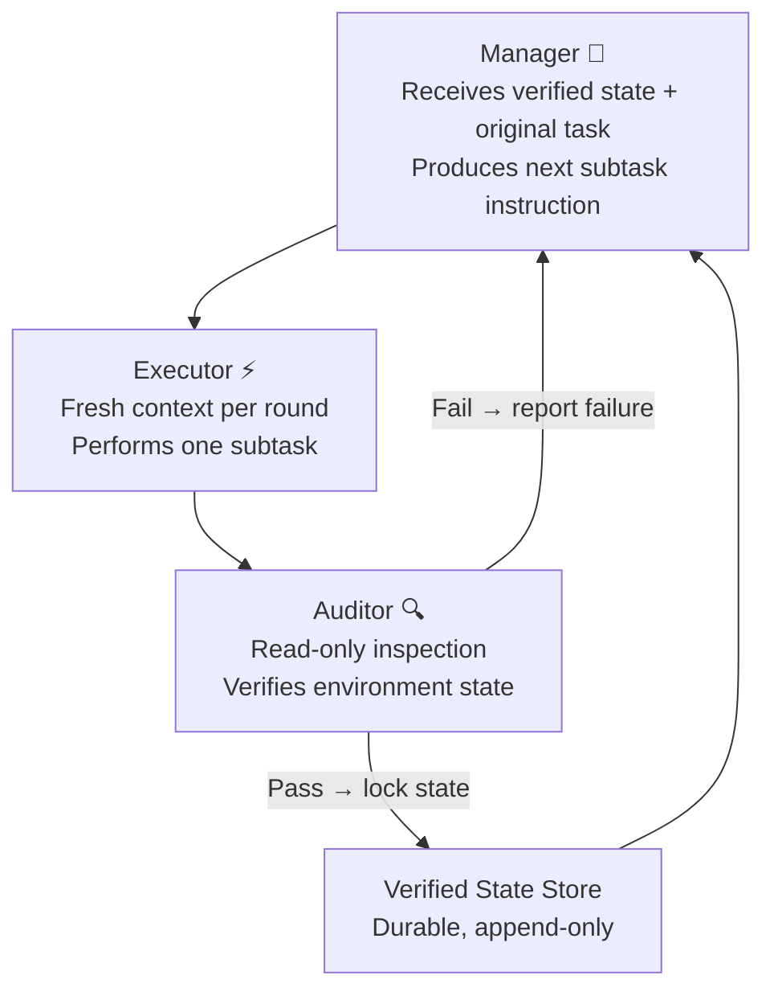
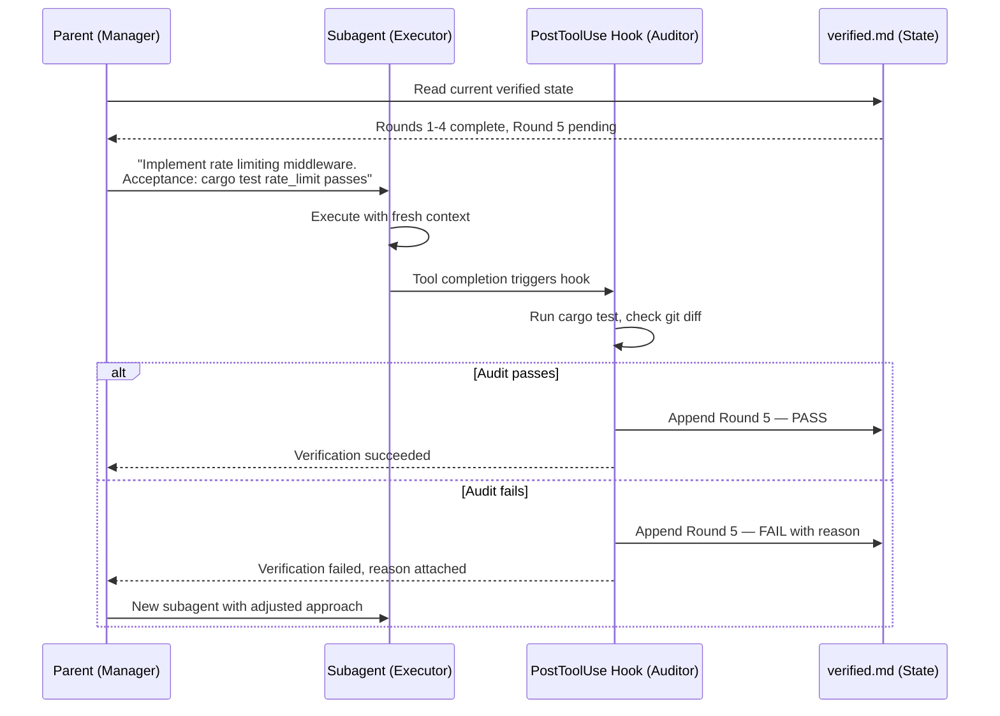

# LongHorizon-Harness and the Manage-Execute-Audit Loop: Why Fresh-Context Execution with Verified State Beats Growing a Single Session — and How to Wire It into Codex CLI


---

Long-running coding sessions rot. Not because models forget — because growing context windows accumulate noise faster than signal. Every failed attempt, every exploratory dead end, every verbose tool output stays in the transcript, subtly steering subsequent decisions. The result is context drift: a gradual misalignment between what the agent believes it has accomplished and what actually exists on disc [^1]. Sixty-five per cent of enterprise AI agent failures trace back to context drift or memory loss rather than raw capability limitations [^2].

LongHorizon-Harness, published on 3 August 2026 by Ma et al. [^3], reframes the problem. Instead of building ever-smarter compaction into a single session, it externalises task state entirely, verifies it independently, and gives every execution step a fresh context. The result: a Qwen model jumps from 51.8% to 80.7% on WeaveBench and from 69.7% to 77.2% on Terminal-Bench 2.1 — with no model retraining [^3].

This article unpacks the architecture, maps each component to Codex CLI primitives, and shows how to adopt the pattern today.

## The Core Insight: Separate State from Execution

Traditional agent sessions conflate three concerns into a single context window:

1. **Planning** — deciding what to do next
2. **Execution** — doing it
3. **Verification** — confirming it worked

As the session grows, all three degrade together. A compacted summary of turn 12 may omit the constraint that makes turn 47 succeed or fail. The agent cannot tell the difference between "I tried this and it failed" and "this approach is invalid" once the original evidence has been summarised away.

LongHorizon-Harness separates these concerns into three roles, each operating with its own context:



The critical constraint: **audit reports are the only cross-round memory** [^3]. The executor's transcript is discarded after each round. The manager never sees raw execution logs — only the auditor's verified summary of what actually changed in the environment.

## Three Roles, Three Design Decisions

### Manager: Durable Planning, Fresh Each Round

The manager receives the original task description and the accumulated verified state. It produces a single, specific next-step instruction — not a multi-step plan. This eliminates the "stale plan" failure mode where early planning decisions persist long after circumstances have changed.

In Codex CLI terms, the manager maps to the **parent agent** in a multi-agent v2 session. The parent holds the high-level objective and delegates subtasks to workers [^4].

### Executor: Disposable Computation

Each executor round starts with a clean context containing only the subtask instruction and necessary file references. This is the pattern Codex CLI already implements through **subagent isolation**: each subagent receives a fresh context window, preventing context pollution from the parent's accumulated history [^4].

The key insight is that executors are deliberately cheap and disposable. A failed execution round costs one context window. The verified state from prior rounds remains intact — the system only loses the unverified attempt.

### Auditor: Independent Verification

The auditor inspects the actual environment — files on disc, test results, system state — rather than trusting the executor's claims. This is the component most coding agent architectures lack. Without independent verification, a session that believes it wrote correct code (because the model said so) may have actually introduced a subtle regression that compounds across subsequent rounds.

## Benchmark Results: Harness Engineering Outweighs Model Selection

The paper's central finding challenges a common assumption. Running identical models with only the harness changed:

| Benchmark | Baseline | With Harness | Improvement |
|-----------|----------|--------------|-------------|
| WeaveBench (114 GUI+CLI tasks) | 51.8% | 80.7% | +28.9pp |
| Terminal-Bench 2.1 | 69.7% | 77.2% | +7.5pp |
| OSWorld 2.0 (108 desktop tasks) | 2.8% | 8.3% | 3.0× |

For context, the current Terminal-Bench 2.1 leaderboard has GPT-5.6 Sol at 89.5% and Claude Opus 5 at 89.1% [^5]. The harness alone closes a meaningful fraction of the gap between a mid-tier model and the frontier — without changing the model.

The companion paper EvoHarness-RL by Ning et al. [^6] takes the concept further: training agents to learn when to read, update, and consolidate external state via reinforcement learning, achieving 96.9% on ALFWorld with Qwen3-8B. The trajectory is clear — harness policies are becoming a first-class optimisation target.

## Mapping to Codex CLI

LongHorizon-Harness provides native Codex CLI integration through its `AgentAdapter` pattern [^3]. But you do not need the full framework to adopt the architecture. Each component maps to existing Codex CLI primitives:

### 1. Manager → Parent Agent with AGENTS.md Constraints

Your `AGENTS.md` in the project root acts as the manager's persistent instructions. Define the task decomposition strategy and verified-state format:

```markdown
## Long-Horizon Task Protocol

When executing multi-step tasks:
1. Read `.lh-state/verified.md` before planning the next step
2. Delegate each subtask to a subagent with explicit acceptance criteria
3. After each subtask, verify the result independently before updating state
4. Never assume a subtask succeeded — check the environment
```

### 2. Executor → Subagent with Fresh Context

Codex CLI subagents already provide fresh-context isolation. The key is to keep subtask instructions precise and self-contained:

```bash
# Parent agent delegates a single, verifiable subtask
codex --model gpt-5.6-terra \
  --approval-mode on-request \
  "Create src/auth/token_validator.rs implementing the validate_jwt function. \
   It must pass: cargo test --lib auth::token_validator"
```

Each subagent starts clean. No accumulated context from prior rounds. No dead-end exploration from previous attempts polluting the token budget.

### 3. Auditor → PostToolUse Hooks + Independent Verification

The auditor role maps to Codex CLI's `PostToolUse` hooks. After each tool execution, a hook can independently verify the result:

```toml
# .codex/config.toml
[hooks.post_tool_use]
command = "bash .codex/hooks/verify-step.sh"
timeout_ms = 30000
```

```bash
#!/bin/bash
# .codex/hooks/verify-step.sh
# Independent verification: check tests pass, no regressions

# Run the test suite
if ! cargo test --quiet 2>/dev/null; then
  echo "AUDIT FAIL: Tests do not pass after this change"
  exit 1
fi

# Check for uncommitted state drift
if git diff --stat HEAD | grep -q "unexpected"; then
  echo "AUDIT FAIL: Unexpected file modifications detected"
  exit 1
fi

echo "AUDIT PASS: Environment verified"
exit 0
```

### 4. Verified State → Persistent Markdown File

The verified state store is simply a file that survives across subagent contexts:

```markdown
<!-- .lh-state/verified.md -->
# Verified State — Feature: JWT Authentication

## Round 1 — PASS (2026-08-10T09:12:00Z)
- Created `src/auth/mod.rs` with module structure
- `cargo check` passes with no errors
- 0 test failures

## Round 2 — PASS (2026-08-10T09:14:30Z)
- Implemented `validate_jwt` in `src/auth/token_validator.rs`
- 4/4 unit tests pass
- No regressions in existing test suite (147 tests)

## Round 3 — FAIL (2026-08-10T09:17:00Z)
- Attempted refresh token rotation
- 2 test failures in `auth::refresh` — expired token edge case
- State NOT locked. Retrying with different approach.
```

The parent agent reads this file before each delegation. Failed rounds are recorded but do not pollute the next executor's context.

## The Manage-Execute-Audit Loop in Practice

Here is how a full cycle works with Codex CLI's multi-agent v2:



## Why This Matters More Than Better Compaction

Context compaction — the approach Codex CLI, Claude Code, and OpenCode all use for long sessions [^7] — works by summarising old turns to reclaim token budget. It is a necessary optimisation. But it has a fundamental limitation: **compaction is lossy**. The summary may omit the constraint, the error message, or the design decision that matters twenty turns later.

The Manage-Execute-Audit pattern sidesteps the problem entirely. Executors never accumulate enough context to need compaction. The verified state store is append-only and human-readable. The manager operates on facts, not summaries of summaries.

This does not mean compaction is obsolete — it remains essential within individual executor rounds that themselves grow large. But for the cross-round architecture, verified state replaces compacted history.

## Configuration: LongHorizon-Harness with Codex CLI

For teams wanting the full framework rather than a manual implementation:

```bash
# Install
uv tool install lh-harness

# Initialise in your project
cd /path/to/project
lh-harness init
```

The generated `.lh-harness/config.toml` configures the agent backend:

```toml
[run]
agent = "codex"
model = "gpt-5.6-sol"
workspace = "."
max_rounds = 30
dashboard = true

[run.timeouts]
manager = 600
cli_executor = 1800
auditor = 600

[run.roles.cli_executor]
model = "gpt-5.6-terra"  # Cheaper model for execution
```

Note the role-specific model assignment: Sol for planning and auditing, Terra for execution. This matches Codex CLI's model tiering — Sol (\$5/\$30 per million tokens) for complex reasoning, Terra (\$2/\$12) for straightforward implementation tasks [^8].

## When to Use This Pattern

The Manage-Execute-Audit pattern adds overhead per round (three agent invocations instead of one). It pays for itself when:

- **Tasks exceed ~50 turns** — context drift becomes measurable
- **Tasks span multiple files or subsystems** — execution state is too complex for one context
- **Reliability matters more than speed** — the independent audit catches regressions the executor misses
- **You need recoverability** — a crashed session can resume from the last verified state

For short, focused tasks (under 20 turns), a single Codex CLI session with standard compaction remains the pragmatic choice.

## Key Takeaways

1. **Context drift is a state management problem**, not a model capability problem. Better models do not fix architectures that conflate planning, execution, and verification.

2. **Fresh-context execution with verified state** outperforms growing-context sessions by 7.5–28.9 percentage points on established benchmarks, with no model changes [^3].

3. **Codex CLI already has the primitives**: subagent isolation provides fresh context, PostToolUse hooks provide independent verification, and AGENTS.md provides persistent instructions. The pattern is wiring them together intentionally.

4. **Harness engineering is the new frontier**. The gap between a mid-tier model with a good harness and a frontier model with a naive harness is narrowing. Invest accordingly.

---

## Citations

[^1]: Codex CLI freezes near auto-compaction threshold and drifts with very large context windows. GitHub Issue #19116, openai/codex. [https://github.com/openai/codex/issues/19116](https://github.com/openai/codex/issues/19116)

[^2]: Agent Context Engineering 2026: Sliding Windows, Hierarchical Summarization, and Memory Offloading for Long-Running Production Tasks. AgentMarketCap, April 2026. [https://agentmarketcap.ai/blog/2026/04/11/agent-context-engineering-sliding-windows-memory-2026](https://agentmarketcap.ai/blog/2026/04/11/agent-context-engineering-sliding-windows-memory-2026)

[^3]: Ma, Z., Huang, H., Zou, S., Wang, Y., Yang, S., Hu, Y., Wei, F., & Chu, X. (2026). LongHorizon-Harness: Advancing Long-Horizon Agents for Real-World Tasks. arXiv:2608.01964. [https://arxiv.org/abs/2608.01964](https://arxiv.org/abs/2608.01964)

[^4]: OpenAI. Codex CLI Multi-Agent V2 Documentation. ChatGPT Learn, 2026. [https://developers.openai.com/codex/changelog](https://developers.openai.com/codex/changelog)

[^5]: Terminal-Bench 2.1 Leaderboard, August 2026. MorphLLM. [https://www.morphllm.com/best-ai-coding-agents-2026](https://www.morphllm.com/best-ai-coding-agents-2026)

[^6]: Ning, X., Fu, D., Wei, T., et al. (2026). EvoHarness-RL: Learning Self-Evolving Runtime Harness for Long-Horizon LLM Agents. arXiv:2608.05446. Accepted to LLA@COLM 2026. [https://arxiv.org/abs/2608.05446](https://arxiv.org/abs/2608.05446)

[^7]: Context Compaction Deep Dive: How Codex CLI, Claude Code, and OpenCode Manage Long Sessions. Codex Knowledge Base, April 2026. [https://codex.danielvaughan.com/2026/04/14/context-compaction-deep-dive-codex-cli-claude-code-opencode/](https://codex.danielvaughan.com/2026/04/14/context-compaction-deep-dive-codex-cli-claude-code-opencode/)

[^8]: OpenAI. GPT-5.6: Frontier Intelligence That Scales with Your Ambition. July 2026. [https://openai.com/index/gpt-5-6/](https://openai.com/index/gpt-5-6/)
