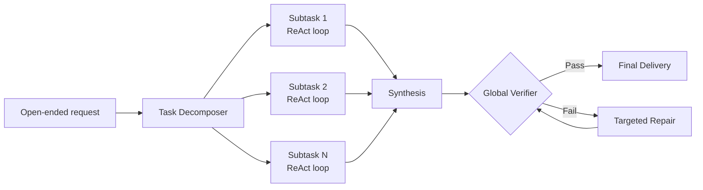
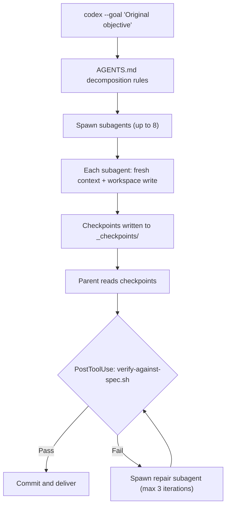

# OneDayAgent and the Long-Horizon Harness: Why Decompose-Verify-Repair Beats Growing a Single Session — and How to Wire It into Codex CLI


---

## The Long-Horizon Problem in Practice

Every practitioner who has run Codex CLI on a genuinely complex task — a cross-module refactoring, a multi-file feature with database migration, or a day-long research-to-implementation pipeline — has watched context quality degrade. The agent forgets constraints stated forty messages ago, re-reads files it already summarised, or drifts from the original intent. This is not a model problem; it is a *harness* problem.

Zheng et al.'s OneDayAgent (arXiv:2608.05013, August 2026) provides the clearest evidence yet that the fix is architectural, not parametric [^1]. Their three-capability harness — decompose, execute with managed memory, verify-and-repair against original intent — lifts scores on the 104-task AgentIF-OneDay benchmark from 0.645 (Manus) and 0.799 (AutoClaw) to **0.821**, and crucially transfers across five backend LLMs from three model families without any model-specific tuning [^1].

The practical question for Codex CLI users: does the existing tooling already support this pattern, and where are the gaps?

---

## What OneDayAgent Actually Does

The harness addresses three failure modes that compound in long sessions:

1. **Goal drift** — the agent optimises for the current subtask and loses sight of global constraints.
2. **State loss** — intermediate results vanish after context compaction or are never persisted.
3. **Context overflow** — accumulated observations push the model past its effective attention budget.

OneDayAgent's answer is a three-stage pipeline:



### Decomposition

The decomposer converts an open-ended request into 2–4 bounded subtasks (88 of 104 tasks in the benchmark). Each subtask receives the global intent as read-only context plus a focused local objective [^1]. Single-subtask tasks average 20.6 minutes; five-subtask tasks average 117.2 minutes — but with preserved accuracy [^1].

### Execution Memory

Three mechanisms prevent state loss during execution:

- **Summarised truncation** — large tool observations are compressed into bounded evidence before entering the context window.
- **Subtask state passing** — compact checkpoints transfer verified artefacts between subtasks, avoiding full-context replay.
- **Automatic context compression** — when accumulated tokens exceed 90% of the context budget, the harness generates an LLM summary with a deterministic fallback if the LLM summary itself fails [^1].

Of the 104 evaluation tasks, 35 triggered automatic compression. The authors report zero correlation between compression count and score degradation [^1] — strong evidence that the mechanism is genuinely lossless in practice.

### Global Verification and Repair

After synthesis, a verifier checks the final artefact against the *original* request, not just the last subtask's objective. Of 104 tasks, 95 passed on the first attempt; 9 entered repair, with 6 recovered and only 3 remaining as failures [^1].

The ablation study quantifies each module's contribution:

| Variant | Score | Latency (min) |
|---------|-------|---------------|
| DIRECT (no decomposition, no verification) | 0.771 | 27.6 |
| DECOMP only | 0.804 | 38.1 |
| VERIFY only | 0.804 | 29.7 |
| FULL (both) | 0.821 | 53.6 |

Verification achieves the same score gain as decomposition with 67% less latency overhead [^1]. This has direct implications for Codex CLI users deciding where to invest harness effort.

---

## Backend Transferability: The Harness Matters More Than the Model

OneDayAgent's most striking finding is cross-backend performance. The identical harness, with no tuning, runs across five LLMs:

| Model | Score | Latency (s) |
|-------|-------|-------------|
| GLM-5.2 (744B) | 0.821 | 3216.8 |
| Gemini-3.1-Pro | 0.743 | 1281.6 |
| Qwen 397B-A17B | 0.708 | 964.5 |
| Qwen 3.6-27B | 0.613 | 1280.5 |
| Qwen 3.5-9B | 0.624 | 1895.2 |

Different models induce distinct "execution styles" under the same workflow — repair rates range from 18% to 56.7% across backends [^1]. The implication is clear: investing in harness engineering yields portable gains that survive model upgrades and migrations, while model-specific prompt tuning does not.

---

## Mapping OneDayAgent to Codex CLI

Codex CLI already ships most of the building blocks. The challenge is wiring them together deliberately.

### Task Decomposition → Subagents

Codex shipped subagents to general availability in March 2026 [^2]. A manager agent decomposes tasks into subtasks and spawns up to 8 child agents in parallel cloud sandboxes [^2]. Each child operates with a fresh, uncompacted context window — precisely the "bounded subtask with global intent" pattern OneDayAgent prescribes.

The key configuration in `AGENTS.md`:

```markdown
## Task Decomposition

When the task involves more than two files or crosses module boundaries:
1. Decompose into independent subtasks of 2-4 units
2. Spawn a subagent per subtask with the global objective as read-only context
3. Each subagent must write its deliverable to the workspace before terminating
4. The parent agent verifies all deliverables against the original request
```

### Execution Memory → Context Compaction + Workspace Artefacts

Codex CLI's context compaction triggers when accumulated tokens exceed a configurable threshold (default: 90% of the model's effective window) [^3]. After compaction, Codex injects a lead-in message and re-reads up to 5 recently edited files within a 50,000-token budget [^3].

OneDayAgent's "subtask state passing" maps directly to the workspace filesystem. Subagents write checkpoints — a `verified-state.md` or structured JSON — that the parent reads after each child completes. This is not automatic; it requires an explicit `AGENTS.md` directive:

```markdown
## State Persistence

After completing each subtask, write a checkpoint to `_checkpoints/<subtask-name>.json`
containing:
- Files created or modified (paths only)
- Assertions verified (test names + pass/fail)
- Remaining blockers (if any)

The parent agent reads all checkpoints before synthesis.
```

Configure the compaction threshold in `config.toml` for long sessions:

```toml
[model]
model_auto_compact_token_limit = 180000  # trigger earlier on GPT-5.6 Terra
```

### Global Verification → PostToolUse Hooks + Goal Mode

OneDayAgent's verification step checks the final deliverable against the original intent. In Codex CLI, this maps to two mechanisms:

**PostToolUse hooks** run after every tool invocation and can enforce invariants:

```toml
[hooks.post_tool_use.verify_deliverable]
command = "bash scripts/verify-against-spec.sh"
on_fail = "stop"
```

**Goal mode** (`/goal`) persists the original objective across sessions and compaction boundaries [^4]. When context is compacted, the goal survives as a first-class citizen — exactly the "global intent as read-only context" that OneDayAgent's verifier references.

```bash
codex --goal "Implement OAuth2 PKCE flow across auth-service, gateway, and frontend. \
All three must pass integration tests before the task is complete."
```

### Targeted Repair → Sandbox Isolation + Iteration Caps

OneDayAgent's repair loop re-executes only the failing subtask, not the entire pipeline. In Codex CLI, this maps to spawning a fresh subagent in `--sandbox workspace-write` mode with the verification failure report as input:

```markdown
## Repair Protocol

When verification fails:
1. Identify the failing subtask from the checkpoint diff
2. Spawn a new subagent with:
   - The original global objective
   - The specific failure report
   - Access only to files modified by the failing subtask
3. Cap repair iterations at 3 (cost efficiency)
4. If repair fails after 3 attempts, escalate to human review
```

---

## The Practical Decompose-Verify-Repair Recipe

Combining the mappings above into a concrete workflow:



### Named Profile for Long-Horizon Tasks

```toml
# ~/.codex/profiles/long-horizon.toml
[model]
provider = "openai"
model = "gpt-5.6-terra"
model_auto_compact_token_limit = 180000
reasoning_effort = "high"

[agent]
max_subagents = 8
sandbox = "workspace-write"

[hooks.post_tool_use.verify]
command = "bash scripts/verify-against-spec.sh"
on_fail = "stop"
```

Activate with:

```bash
codex --profile long-horizon --goal "Multi-day feature implementation"
```

---

## Where the Gaps Remain

OneDayAgent exposes three capabilities Codex CLI does not yet provide natively:

1. **Automatic decomposition** — Codex subagents must be explicitly spawned; the model decides *whether* to decompose based on `AGENTS.md` instructions, but there is no built-in decomposition planner that analyses task complexity and generates a subtask graph.

2. **Structured checkpoint protocol** — State passing between subagents relies on filesystem conventions. There is no first-class checkpoint API that the parent agent can query programmatically.

3. **Global verification against original intent** — PostToolUse hooks can run arbitrary scripts, but there is no built-in mechanism that automatically diffs the final state against the `/goal` objective using LLM-based evaluation. This requires a custom script today.

These are solvable with `AGENTS.md` directives and shell scripts, but native support — particularly for structured checkpoints and intent-aware verification — would reduce the harness engineering burden significantly.

---

## Key Takeaways

OneDayAgent's 0.821 score on AgentIF-OneDay, achieved identically across five backend LLMs without tuning, makes a compelling case: **harness architecture dominates model selection for long-horizon tasks**. The verification-only ablation matching decomposition's score gain at 67% lower latency suggests that if you implement only one thing, implement verification against original intent.

For Codex CLI practitioners, the decompose-verify-repair pattern is already achievable today through subagents, context compaction, PostToolUse hooks, and goal mode. The missing pieces — automatic decomposition planning, structured checkpoints, and intent-aware verification — are engineering work, not research problems. Wire them into your `AGENTS.md` and named profiles, and your long-horizon tasks will stop degrading at the forty-message mark.

---

## Citations

[^1]: Zheng, J., Fang, X., Zhang, J., Gui, Z., Chen, H., & Zhang, N. (2026). "OneDayAgent: Towards a Long-Horizon Harness for Autonomous Agents." arXiv:2608.05013. [https://arxiv.org/abs/2608.05013](https://arxiv.org/abs/2608.05013)

[^2]: OpenAI. (2026). "Codex CLI Subagents — General Availability." Codex CLI documentation. [https://developers.openai.com/codex/changelog](https://developers.openai.com/codex/changelog)

[^3]: OpenAI. (2026). "Context Compaction Architecture." Codex CLI documentation. [https://learn.chatgpt.com/docs/codex](https://learn.chatgpt.com/docs/codex)

[^4]: OpenAI. (2026). "Goal Mode for Multi-Session Persistence." Codex CLI changelog. [https://developers.openai.com/codex/changelog](https://developers.openai.com/codex/changelog)

[^5]: Zheng, X., Xu, H., Zhang, Y., et al. (2026). "AgentIF-OneDay: A Task-level Instruction-Following Benchmark for General AI Agents in Daily Scenarios." arXiv:2601.20613. [https://arxiv.org/abs/2601.20613](https://arxiv.org/abs/2601.20613)

[^6]: Vaughan, D. (2026). "Context Compaction Deep Dive: How Codex CLI, Claude Code, and OpenCode Manage Long Sessions." Codex Knowledge Base. [https://codex.danielvaughan.com/2026/04/14/context-compaction-deep-dive-codex-cli-claude-code-opencode/](https://codex.danielvaughan.com/2026/04/14/context-compaction-deep-dive-codex-cli-claude-code-opencode/)
