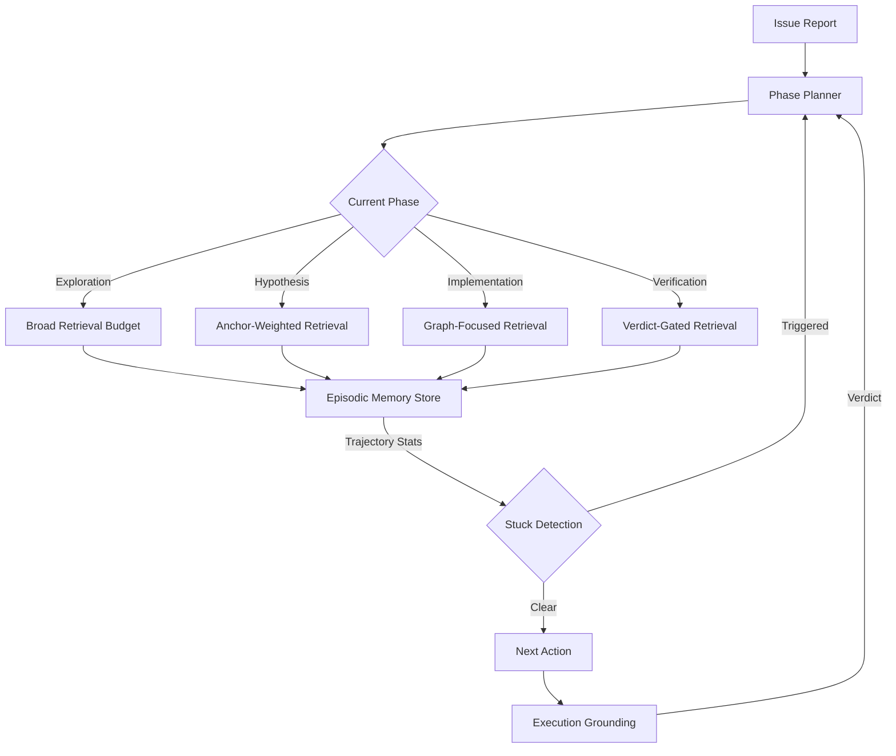

# PMCoder and the Plan-Memory Coupling: Why Bidirectional Phase-Aware Retrieval Beats Flat Context — and How to Wire It into Codex CLI


---

## The Problem: State Loss Kills Long Repair Sessions

Anyone who has watched a coding agent grind through a forty-step debugging session knows the failure mode: relevant diagnosis from step twelve has scrolled out of the context window by step thirty, so the agent re-explores the same dead end, applies the same broken edit, or quietly gives up with an empty patch. The root cause is not insufficient reasoning — it is state loss compounded by self-verification bias, where the model declares the fix complete without running the reproduction script [^1].

Zhang, Zhang and Huang quantify this in **PMCoder** (arXiv:2608.06811, 7 August 2026), a system that couples a hierarchical phase planner with an episodic memory store [^1]. The coupling is bidirectional: the current plan phase controls *what* gets retrieved from memory, and trajectory statistics accumulated in memory trigger *when* the plan is revised. On SWE-bench Verified the result is +25 resolved issues (+5.0 pp) over the unaugmented baseline, with failed-action recurrence halved and empty-patch exits cut to a third [^1].

This article unpacks the architecture, walks through the evidence, and maps every component to a concrete Codex CLI primitive.

---

## The PMCoder Architecture

PMCoder's design rests on three pillars: a deterministic phase planner, an episodic memory store with phase-conditioned retrieval, and an execution grounding layer that replaces self-reported verdicts with script-derived pass/fail signals.



### Phase Planner

The planner maintains a deterministic state machine with four ordered phases: **Exploration**, **Hypothesis**, **Implementation**, and **Verification**, plus a back-track event for recovery [^1]. At episode start a single LLM call decomposes the issue into typed sub-tasks, each tagged with a target phase. Subsequent phase detection is rule-based — analysing shell commands and model reasoning without burning additional inference calls [^1].

### Episodic Memory

Each memory node stores structured metadata: message role, recency identifier, compressed content, summary, edit status, and affected files [^1]. Retrieval uses maximal-marginal-relevance (MMR) selection under a budgeted token limit. Relevance fuses two signals: an IDF-weighted lexical score over anchor words and a graph-proximity score in a code-structure file graph [^1].

The critical design choice is **phase-conditioned retrieval**. Exploration phases use larger, diversity-favouring budgets to cast a wide net. Implementation phases narrow to smaller, graph-focused budgets that surface only the files around the edit site [^1]. This prevents the context window from filling with irrelevant exploration artefacts during the edit phase — precisely the failure that flat-context baselines exhibit.

### Execution Grounding

Rather than trusting the model's self-reported completion claims, PMCoder reruns issue-reproduction scripts after each file modification. Verdicts (pass/fail) update the internal plan state without blocking agent actions [^1]. For Python files, compile checks catch corrupted edits before errors compound. Recovery follows delta-debugging principles: restore to a clean state, then re-fix [^1].

---

## The Evidence

### Headline Numbers

On SWE-bench Verified with Qwen3-Coder-30B across three runs [^1]:

| Configuration | Resolved | Rate | Change |
|---|---|---|---|
| Baseline | 142.3 | 28.5% | — |
| PMCoder | 167.3 | 33.5% | +25.0 (+5.0 pp) |

Confidence interval: [+14.3, +35.7], p < 0.001 [^1].

### Ablation: The Coupling Is the Point

A 2×2 factorial ablation reveals the interaction effect [^1]:

| Configuration | Resolved | Rate |
|---|---|---|
| Neither | 142.3 | 28.5% |
| Plan only | 148.7 | 29.7% |
| Memory only | 150.7 | 30.1% |
| Plan + Memory | 167.3 | 33.5% |

The coupled system resolves 10.3 more issues than the sum of the individual components would predict (F(1,8) = 10.92, p = 0.011) [^1]. Planning alone adds modest structure; memory alone preserves evidence; but only when the plan *controls* retrieval and accumulated evidence *triggers* replanning do you get the super-additive gain.

### Behavioural Signatures

The trajectory-level analysis shows where the gains come from [^1]:

| Metric | Baseline | PMCoder | Ratio |
|---|---|---|---|
| Failed-action recurrence | 0.0137 | 0.0069 | 0.50× |
| Empty-patch exits | 8.3% | 2.7% | 0.33× |
| Context-window exhaustion | 6.7% | 3.0% | 0.45× |
| Revert-then-refix recoveries | 2.89 | 4.23 | 1.46× |

The agent fails less, gives up less, exhausts context less, and recovers from corruption more. These are state-management improvements, not reasoning improvements — exactly what the architecture targets.

### Generalisation

The pattern holds across models and frameworks [^1]:

- **DeepSeek-V4-Flash**: 341 → 357 (+3.2 pp)
- **Claude Haiku 4.5**: 313 → 327 (+2.8 pp)
- **OpenHands port** (Qwen): 146 → 169 (+4.6 pp)
- **TerminalWorld** (non-SE benchmark): 5/20 → 7/20

---

## Complementary Research

PMCoder's execution grounding aligns with Arjmandi's concurrent work on **self-verifying agent instruments** (arXiv:2608.04066) [^2]. That paper dissociates commitment drift (losing the goal) from binding drift (misunderstanding the current state) and shows that ablating the commitment mechanism flips goal-abandonment from 0.00 to 1.00 while binding error stays flat [^2]. PMCoder's phase planner effectively functions as a commitment mechanism: the deterministic phase state machine prevents the agent from wandering off-goal, while the episodic memory addresses binding drift by keeping evidence retrievable.

The specification grounding work of Haeri (arXiv:2607.06636) further confirms that test effectiveness for LLM code improves when grounded in specifications rather than self-generated assertions [^3] — the same principle PMCoder applies when it uses reproduction-script verdicts instead of model self-reports.

---

## Mapping PMCoder to Codex CLI

Every PMCoder component has a natural Codex CLI counterpart.

### Phase Planner → Plan Mode + AGENTS.md Phase Policy

Codex CLI's plan mode already implements a structured phase progression: **Plan** (read-only analysis), **Pair** (human-approved edits), and **Execute** (autonomous implementation) [^4]. To replicate PMCoder's four-phase state machine, encode phase policy in `AGENTS.md`:

```markdown
## Issue Resolution Phases

1. **Exploration** — Read files, run grep, understand the codebase. No edits.
2. **Hypothesis** — Identify root cause. Write a one-paragraph diagnosis before proceeding.
3. **Implementation** — Apply the fix. One logical change per commit.
4. **Verification** — Run the reproduction script. Only declare success on a passing exit code.

If verification fails, revert to a clean state and return to Hypothesis.
Do NOT declare an issue resolved without a passing verification script.
```

This gives the model deterministic phase awareness without additional LLM calls — the same rule-based phase detection PMCoder uses [^1].

### Episodic Memory → PostToolUse Hooks + Structured Observation Log

Codex CLI's PostToolUse hooks fire after every tool execution, making them the natural entry point for memory capture [^5]. A lightweight hook can append structured observations to a persistent log:

```bash
#!/usr/bin/env bash
# .codex/hooks/post-tool-use.sh
# Append structured observation to episodic memory log

PHASE=$(cat .codex/current-phase.txt 2>/dev/null || echo "exploration")
TIMESTAMP=$(date -u +%Y-%m-%dT%H:%M:%SZ)
TOOL="$CODEX_TOOL_NAME"
EXIT_CODE="$CODEX_EXIT_CODE"
FILES_CHANGED=$(git diff --name-only HEAD 2>/dev/null | tr '\n' ',' | sed 's/,$//')

cat >> .codex/episodic-memory.jsonl << EOF
{"ts":"$TIMESTAMP","phase":"$PHASE","tool":"$TOOL","exit":"$EXIT_CODE","files":"$FILES_CHANGED","summary":"$(echo "$CODEX_TOOL_OUTPUT" | head -5 | tr '\n' ' ' | cut -c1-200)"}
EOF
```

Phase-conditioned retrieval maps to `AGENTS.md` directives that instruct the model to consult different portions of the memory log depending on the current phase:

```markdown
## Memory Retrieval Policy

- During **Exploration**: scan the full episodic-memory.jsonl for breadth.
- During **Implementation**: filter episodic-memory.jsonl to entries matching
  the files you are editing (graph-focused retrieval).
- During **Verification**: retrieve only entries with exit codes != 0
  and the original hypothesis summary.
```

### Execution Grounding → PostToolUse Verification Gate

PMCoder's execution grounding — running reproduction scripts rather than trusting self-reports — maps directly to a PostToolUse hook that gates on test outcomes [^5]:

```bash
#!/usr/bin/env bash
# .codex/hooks/verify-after-edit.sh
# Run reproduction script after any file edit, exit 2 to steer

if [ "$CODEX_TOOL_NAME" = "write" ] || [ "$CODEX_TOOL_NAME" = "edit" ]; then
  if [ -f tests/reproduce_issue.py ]; then
    python tests/reproduce_issue.py > /tmp/verdict.txt 2>&1
    if [ $? -ne 0 ]; then
      echo "VERDICT: FAIL — issue not resolved" >> .codex/episodic-memory.jsonl
      echo "Verification failed. Review the reproduction output before proceeding."
      exit 2  # Steer the agent, do not block
    else
      echo "VERDICT: PASS" >> .codex/episodic-memory.jsonl
    fi
  fi
fi
```

Exit code 2 provides corrective steering — the agent receives the failure signal and adjusts, mirroring PMCoder's verdict-driven plan updates [^1] [^5].

### Stuck Detection → Trajectory Analysis in AGENTS.md

PMCoder triggers replanning when edit counts and repeated actions cross thresholds [^1]. In Codex CLI, encode this as an `AGENTS.md` directive:

```markdown
## Stuck Detection Rules

If you have:
- Applied 3+ edits to the same file without a passing verification, STOP.
  Revert to the last known-good state and re-diagnose from Hypothesis.
- Received the same error message 2+ times in succession, STOP.
  Consult episodic-memory.jsonl for alternative approaches tried earlier.
- Consumed >60% of context without reaching Implementation, STOP.
  Summarise findings so far and request a fresh-context continuation.
```

### Model Tiering → Named Profiles

PMCoder's cross-model results suggest the plan-memory coupling works across capability tiers [^1]. In Codex CLI, use named profiles to route phases to appropriate models:

```toml
# ~/.codex/profiles/issue-resolver.toml
[model]
default = "gpt-5.6-terra"        # Balanced tier for exploration/hypothesis
implementation = "gpt-5.6-terra"  # Same tier, cost-effective
verification = "gpt-5.6-luna"    # Cheap tier for script execution
```

---

## When to Use This Pattern

The plan-memory coupling is most valuable for **multi-step debugging and issue resolution** — tasks where:

1. The fix requires understanding scattered across multiple files
2. Several hypotheses must be tested and discarded before finding the root cause
3. The session is long enough that relevant context scrolls out of the window
4. Verification requires running an actual reproduction script, not just reading the diff

For quick, single-file fixes, the overhead is unnecessary. For greenfield feature work, the phase structure may be too rigid. But for the kind of gnarly, repository-spanning bug fix that occupies a senior developer's afternoon, coupling planning with episodic memory is the difference between the agent solving the problem and the agent spinning until context exhaustion.

---

## Key Takeaways

1. **Bidirectional coupling is super-additive**: planning alone adds +1.2 pp; memory alone adds +1.6 pp; coupled, they add +5.0 pp. The interaction is statistically significant [^1].
2. **Execution grounding is non-negotiable**: post-edit verdicts appear in 90% of resolved cases versus 28% of unresolved ones. Self-reports are unreliable [^1].
3. **Phase-conditioned retrieval prevents context pollution**: broad retrieval during exploration, narrow retrieval during implementation [^1].
4. **The gains are in state management, not reasoning**: halved action recurrence, one-third the empty-patch rate, near-halved context exhaustion [^1].
5. **Codex CLI already has the primitives**: plan mode for phase structure, PostToolUse hooks for memory capture and verification, AGENTS.md for phase policy, named profiles for model tiering.

---

## Citations

[^1]: Zhang, J., Zhang, Y. & Huang, Y. (2026). "Coupling Planning with Episodic Memory in LLM Agents for Software Issue Resolution." arXiv:2608.06811. [https://arxiv.org/abs/2608.06811](https://arxiv.org/abs/2608.06811)

[^2]: Arjmandi, M. (2026). "The LLM Proposes, the Executive Disposes: A Self-Verifying Agent Instrument that Dissociates Commitment Drift from Binding Drift in Long-Horizon Agents." arXiv:2608.04066. [https://arxiv.org/abs/2608.04066](https://arxiv.org/abs/2608.04066)

[^3]: Haeri, A. (2026). "Specification Grounding Drives Test Effectiveness for LLM Code." arXiv:2607.06636. [https://arxiv.org/abs/2607.06636](https://arxiv.org/abs/2607.06636)

[^4]: OpenAI (2026). "Codex CLI Plan Mode Documentation." [https://codex.danielvaughan.com/2026/03/27/planning-mode-in-practice/](https://codex.danielvaughan.com/2026/03/27/planning-mode-in-practice/)

[^5]: OpenAI (2026). "Codex CLI Hooks Documentation — PreToolUse and PostToolUse." [https://codex.danielvaughan.com/2026/03/26/codex-cli-cicd-non-interactive/](https://codex.danielvaughan.com/2026/03/26/codex-cli-cicd-non-interactive/)

[^6]: Zhang, H. et al. (2026). "SpecBox: Speculative Sandbox Scheduling for Efficient LLM Agent Serving." arXiv:2607.23933. [https://arxiv.org/abs/2607.23933](https://arxiv.org/abs/2607.23933)
