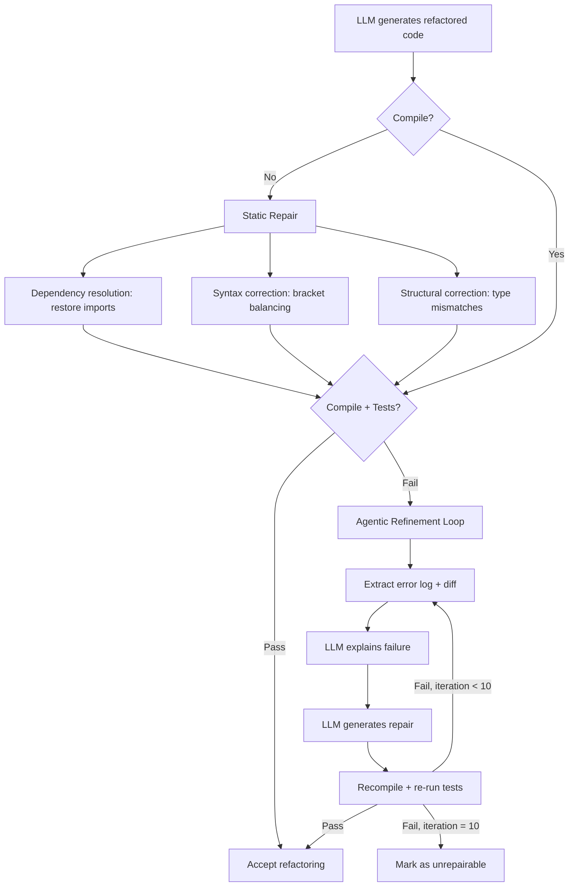
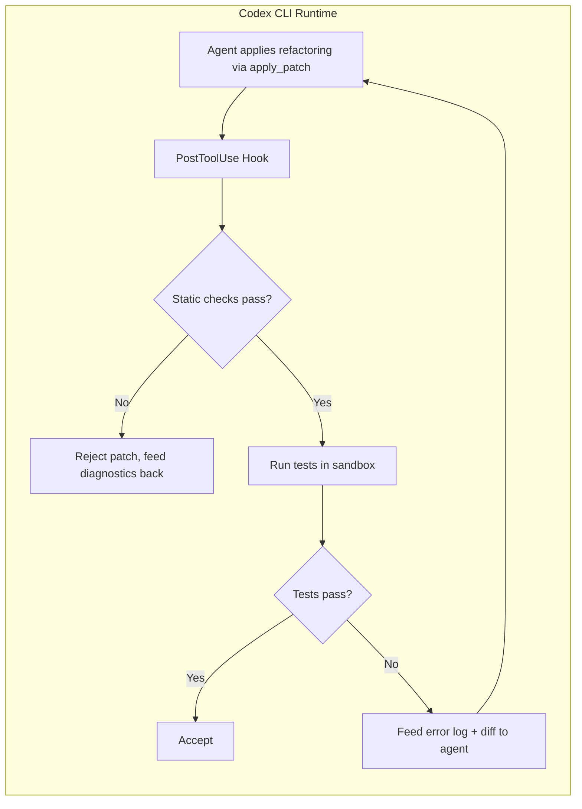

# RefactorAssist and the Refactoring Reliability Gap: Why 1 in 4 LLM Refactorings Fail Silently — and How Test-Driven Agentic Repair Maps to Codex CLI


---

You ask your coding agent to extract a method, rename a variable, or inline a class. It produces clean-looking code. The diff is plausible. But when you run the tests, one in four refactorings fails — and the failure categories are systematic, not random.

Cordeiro, Noei and Zou's *RefactorAssist* (arXiv:2608.00924, August 2026) [^1] quantifies this gap across 10,000 method-test pairs from 10 open-source Java projects, then closes it with a two-stage pipeline: deterministic static repair followed by iterative test-driven agentic refinement. The architecture maps directly onto Codex CLI's hook system, sandbox execution and AGENTS.md policy layer.

## The Eight Failure Modes

The study evaluated four models (GPT-4o, Claude Sonnet, Qwen2.5-Coder-32B, StarCoder2) on method-level and class-level refactorings [^1]. Pass@1 rates ranged from 66.1% (StarCoder2) to 80.8% (GPT-4o) — meaning even the best model breaks roughly one in five refactorings.

Manual analysis of 300 randomly sampled failures, validated with a Cohen's kappa of 0.78, revealed eight categories [^1]:

| Failure Category | Share |
|---|---|
| Context misunderstanding / hallucination | 24.3% |
| Incorrect or inconsistent renaming | 15.3% |
| Adding new functionality or variables | 13.7% |
| Code incompleteness | 11.3% |
| Syntax and structural errors | 9.7% |
| Edge cases not handled | 9.0% |
| Improper type handling | 8.7% |
| Variables outside scope | 8.0% |

The dominant mode — context misunderstanding — accounts for nearly a quarter of all failures. The model hallucinates methods that do not exist, introduces unnecessary abstractions, or misreads the dependency graph. Few-shot prompting does not help: the Kruskal-Wallis test across 0-shot to 5-shot configurations yields p=0.969 [^1]. The problem is structural, not prompt-shaped.

## The Two-Stage Pipeline

RefactorAssist splits repair into a deterministic first pass and an agentic second pass.



### Stage 1: Static Repair

Three deterministic passes address the mechanically fixable failures [^1]:

1. **Dependency resolution** — restores removed imports that the refactored code still requires.
2. **Syntax correction** — stack-based validation ensures balanced brackets and parentheses.
3. **Structural correction** — identifies type mismatches and incompatible method signatures.

This stage alone lifts the cumulative pass rate from 68.4% to 80.3% — an 11.9 percentage point gain with zero LLM calls [^1].

### Stage 2: Agentic Refinement

Failures surviving static repair enter an iterative loop capped at 10 iterations. Each iteration provides the LLM with four inputs [^1]:

- **Error log**: compiler diagnostics, test failure messages, stack traces.
- **Unified diff**: the delta between original and current refactored version.
- **Failure explanation**: a separate LLM call diagnoses *why* the test failed and proposes a fix plan.
- **Project context**: dependent classes, type declarations and method definitions retrieved from the repository.

The explanation step is critical. An ablation using Scott-Knott ESD clustering shows that explanation-aware configurations (GPT-4o or Claude as the diagnostic model) repair 66.7–70.8% of remaining failures, versus 39.7% for diff-plus-error-log alone and 23.6–25.6% for single-input baselines [^1].

Surprisingly, adding retrieval-augmented generation (RAG) to the loop *reduces* final repair rates — from 70.8% to 67.3% with GPT-4o [^1]. The extra context introduces noise that the refinement model cannot reliably filter. ⚠️ This finding challenges the assumption that more repository context always helps.

The cumulative pass rate climbs to 93.4% after 10 iterations under default configuration, and 94.2% under the optimal GPT-4o explanation configuration [^1].

### Diminishing Returns

The largest gains occur in the first three iterations [^1]:

| Stage | Cumulative Pass Rate |
|---|---|
| Original LLM output | 68.4% |
| After static repair | 80.3% |
| After iteration 1 | 85.1% |
| After iteration 3 | 89.7% |
| After iteration 10 | 93.4% |

Iterations 4–10 collectively add only 3.7 percentage points. A practical deployment can cap at 3 iterations and capture most of the value.

## Mapping to Codex CLI

RefactorAssist's architecture maps onto Codex CLI's existing primitives without requiring new features.



### PostToolUse as the Verification Gate

Codex CLI's `PostToolUse` hook fires after every `apply_patch` invocation [^2]. A refactoring-verification hook can implement Stage 1 in a shell script:

```bash
#!/usr/bin/env bash
# .codex/hooks/post-refactor-verify.sh
# Runs after apply_patch; performs static checks + test execution

INPUT=$(cat)
TOOL=$(echo "$INPUT" | jq -r '.tool')

if [ "$TOOL" != "apply_patch" ]; then
  echo '{"decision":"approve"}'
  exit 0
fi

# Stage 1: Static checks
cd "$PROJECT_ROOT"
if ! ./gradlew compileJava 2>/tmp/compile-errors.log; then
  ERRORS=$(cat /tmp/compile-errors.log | tail -20)
  echo "{\"decision\":\"reject\",\"reason\":\"Compilation failed. Fix these errors before proceeding:\\n${ERRORS}\"}"
  exit 0
fi

# Stage 2: Run affected tests
if ! ./gradlew test 2>/tmp/test-errors.log; then
  ERRORS=$(cat /tmp/test-errors.log | tail -30)
  echo "{\"decision\":\"reject\",\"reason\":\"Tests failed after refactoring. Error log:\\n${ERRORS}\"}"
  exit 0
fi

echo '{"decision":"approve"}'
```

When the hook rejects the patch, Codex receives the error diagnostics as context and attempts a repair — replicating RefactorAssist's agentic refinement loop natively within the agent's existing reasoning cycle [^2].

### AGENTS.md as the Refactoring Policy Layer

RefactorAssist's finding that context misunderstanding causes 24.3% of failures suggests the agent needs explicit scope constraints. An `AGENTS.md` directive can enforce these [^3]:

```markdown
## Refactoring Rules

- NEVER add new methods, variables or functionality during a refactoring.
  A refactoring must preserve observable behaviour exactly.
- NEVER remove imports without first verifying no other code in the file
  references them.
- When renaming, grep the entire repository for usages before applying
  the rename. Update ALL references.
- After every refactoring, run `./gradlew test` and verify zero new
  failures before proceeding.
- If tests fail after 3 repair attempts, stop and ask the developer.
```

This directly addresses the top three failure categories (context misunderstanding, incorrect renaming, added functionality) by encoding them as explicit prohibitions.

### Sandbox as the Blast Radius Limiter

Codex CLI's `workspace-write` sandbox mode [^4] provides the isolation RefactorAssist assumes: the agent can modify project files and run tests but cannot access the network or modify system state. This means a malformed refactoring cannot escape the project boundary, and the test suite runs in a reproducible environment.

### Named Profiles for Refactoring Workflows

A dedicated refactoring profile can encode the iteration budget, model routing and approval policy:

```toml
# ~/.codex/profiles/refactor.toml
[model]
default = "o3"                    # Strong reasoning for repair diagnosis
fallback = "o4-mini"              # Cost-effective for simple fixes

[sandbox]
mode = "workspace-write"

[approval_policy]
mode = "auto-edit"                # Auto-approve file edits
manual_review = ["rm", "git"]     # Gate destructive operations

[hooks.post_tool_use]
script = ".codex/hooks/post-refactor-verify.sh"
```

Activate with `codex --profile refactor "Extract the payment validation logic into a separate PaymentValidator class"`.

### The RAG Warning

RefactorAssist's counter-intuitive finding that RAG *hurts* repair accuracy [^1] has a direct Codex CLI implication: when using MCP servers that inject repository context (semantic search tools, code graph servers), the additional context can degrade iterative repair quality. For refactoring tasks, consider disabling or limiting MCP tool results to only the directly affected files rather than broad repository searches.

## Practical Takeaways

1. **Static checks first, LLM second.** Import restoration, bracket balancing and type-mismatch detection are deterministic and free. Apply them before spending tokens on agentic repair.

2. **Cap iterations at 3.** RefactorAssist shows 89.7% cumulative pass rate at iteration 3 versus 93.4% at iteration 10 — the marginal gain does not justify the 3× cost increase.

3. **Separate diagnosis from repair.** Using a strong model (o3, GPT-5.6 Terra) for failure explanation and a cheaper model for code generation replicates RefactorAssist's best configuration at lower cost [^1].

4. **Scope-constrain via AGENTS.md.** Encoding the "refactoring must preserve behaviour" invariant as an explicit directive addresses the largest single failure category.

5. **Be cautious with RAG in repair loops.** More context is not always better — the noise-to-signal ratio matters more in iterative refinement than in initial generation.

## What RefactorAssist Does Not Address

The study evaluates only Java projects with existing test suites [^1]. Codebases without tests — or with weak tests — cannot benefit from the agentic refinement loop. The complementary work on mutation-score gating (Wang et al., *AssertMate*, arXiv:2608.05822 [^5]) and test-suite auditing (Mu et al., arXiv:2608.01715 [^6]) addresses this gap by ensuring the test suite is strong enough to serve as a refactoring oracle.

The 94.2% cumulative pass rate under optimal configuration still leaves 5.8% of refactorings unrepairable within 10 iterations. For production-critical refactorings, the human-in-the-loop remains essential — and Codex CLI's `approval_policy` provides exactly that gate.

## Citations

[^1]: Cordeiro, J., Noei, S. & Zou, Y. (2026). "RefactorAssist: Agentic Refinement for Reliable Code Refactoring." arXiv:2608.00924. [https://arxiv.org/abs/2608.00924](https://arxiv.org/abs/2608.00924)

[^2]: OpenAI (2026). "Codex CLI Hooks: Complete Guide to Events, Policy Engines and Production Patterns." [https://codex.danielvaughan.com/2026/04/15/codex-cli-hooks-complete-guide-events-policy-patterns/](https://codex.danielvaughan.com/2026/04/15/codex-cli-hooks-complete-guide-events-policy-patterns/)

[^3]: OpenAI (2026). "Codex CLI Guide 2026: Setup, Sandbox, AGENTS.md & MCP." [https://openai.com/codex/docs](https://openai.com/codex/docs)

[^4]: OpenAI (2026). "Codex CLI Verification Patterns: Seven Strategies for Ensuring Agent-Generated Code Actually Works." [https://codex.danielvaughan.com/2026/06/09/codex-cli-verification-patterns-ensuring-agent-generated-code-correctness-hooks-review-testing/](https://codex.danielvaughan.com/2026/06/09/codex-cli-verification-patterns-ensuring-agent-generated-code-correctness-hooks-review-testing/)

[^5]: Wang, Y. et al. (2026). "Agent-Based Test Assertion Generation via Diverse Perspective Aggregation." arXiv:2608.05822. [https://arxiv.org/abs/2608.05822](https://arxiv.org/abs/2608.05822)

[^6]: Mu, F. et al. (2026). "Coding Agents as Test-Suite Auditors: Finding What Official Suites Miss While Approaching What They Catch." arXiv:2608.01715. [https://arxiv.org/abs/2608.01715](https://arxiv.org/abs/2608.01715)
