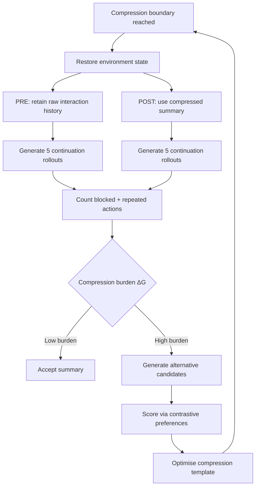
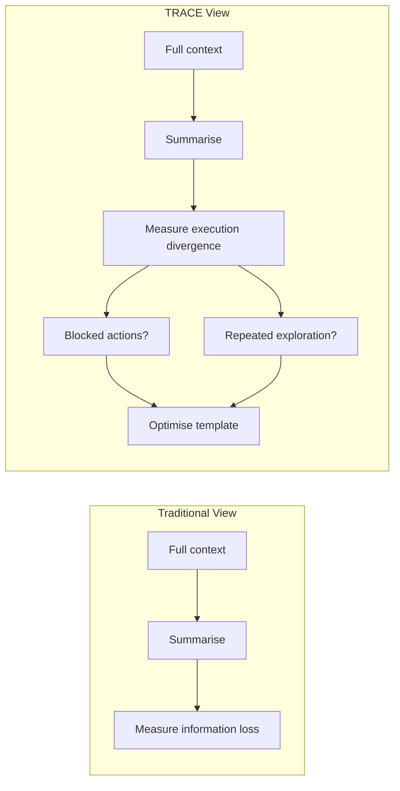

# TRACE and the Context Compression Instability Problem: Why Summarisation Breaks Long-Horizon Agents — and How Boundary-Local Verification Fixes It for Codex CLI


---

Every senior developer who has pushed Codex CLI through a long refactoring session knows the moment: the agent starts repeating work it already did, or worse, silently drops a constraint it was reliably following five minutes ago. The culprit is almost always context compaction — the automatic summarisation that fires when token usage crosses `model_auto_compact_token_limit` [^1]. A new empirical study, *Toward Reliable Context Compression for Long-Horizon Agents* (Min et al., August 2026), finally quantifies exactly how and why compression destabilises agent behaviour, then proposes TRACE, a verifier-guided framework that closes much of the gap — without retraining a single model [^2].

## The Compression Tax Nobody Measured

Context compression is not optional for long-horizon work. Codex CLI's auto-compact fires when token usage reaches roughly 90% of the model's context window — 180K tokens for `o3`, configurable via `model_auto_compact_token_limit` in `config.toml` [^1]. The problem is that every compression event is also a potential behavioural cliff.

Min et al. ran 4,640 paired rollouts across 590 compression boundaries on AppWorld, a stateful API-use benchmark where agents interact with persistent simulated applications through API calls [^2]. Their findings are sobering:

| Failure mode | Magnitude |
|---|---|
| Blocked/error actions at first post-compression step | +0.108 vs pre-compression baseline |
| Repeated exploration (refetching already-executed actions) | +0.031 initially, rising thereafter |
| Correct terminal completion (2K budget) | 37.3% for summaries vs 68.1% for FIFO truncation |
| Behavioural divergence from full history | 0.233 (compressed) vs 0.149 (uncompressed) |

The last row is the most telling. Compressed summaries diverge from full-context behaviour nearly as much as omitting recent updates entirely (0.289). Compression does not just lose information — it *attenuates recent interaction updates*, causing the agent to act as if the last several tool calls never happened [^2].

## Why Existing Approaches Fall Short

Min et al. evaluated seven compression baselines against an uncompressed reference (85.7% accuracy, 77.4% Pass² reliability on 168 tasks) [^2]:

| Method | Accuracy | Pass² | Pass@2 |
|---|---|---|---|
| No compression | 85.7% | 77.4% | 94.0% |
| FIFO truncation | 63.7% | 53.0% | 74.4% |
| LLMLingua-2 (token pruning) | 68.2% | 57.7% | 78.6% |
| Prompting-O (OpenClaw) | 71.4% | 59.5% | 83.3% |
| Prompting-H (Hermes) | 65.2% | 49.4% | 81.0% |
| ACON-UT (Microsoft guidelines) | 62.5% | 44.6% | 80.4% |
| ACON-UTCO | 62.2% | 47.0% | 77.4% |

Pass² — the fraction of tasks solved in *both* of two independent runs — is the critical metric here. It captures multi-run reliability, and the gap between Pass@2 and Pass² widens substantially under compression. A method that occasionally solves a task but cannot do so consistently is useless for production workflows [^2].

The counterintuitive finding: FIFO truncation (simply dropping the oldest turns) sometimes outperforms sophisticated summarisation at moderate budgets, because it preserves *verbatim* recent context rather than risking lossy paraphrase [^2].

## TRACE: Verifier-Guided Compression Without Retraining

TRACE introduces *boundary-local verification* — evaluating each compression event at the exact point where the summary replaces raw history, rather than attributing terminal task outcomes to all intermediate summaries [^2].



The process works in four stages:

### 1. Paired closed-loop continuations

At each compaction boundary, TRACE restores the identical environment state and generates agent rollouts under two conditions: PRE (retaining raw history) and POST (using the summary). Five samples per rendering at early boundaries, three at later ones, each capped at five actions [^2].

### 2. Regression detection

Two observable signals are tracked: *blocked actions* (triggering the environment's native error contract) and *repeated actions* (matching canonicalised tool-call signatures from before the boundary). The compression-induced burden is defined as ΔG = E[G(POST)] − E[G(PRE)] [^2].

### 3. Preference-guided prompt optimisation

A frozen proposer model receives the downstream system prompt, the incumbent compression template, and contrastive summary pairs (highest-scoring vs lowest-scoring) — but crucially, *never sees* the rollout actions, observations, or error details. It generates five candidate template revisions, preserving schema structure while revising natural-language instructions [^2].

### 4. Development selection

The full pipeline runs twice per task on a held-out development split. The template maximising Pass² is selected [^2].

## Results: Closing the Compression Gap

TRACE achieved 77.1% accuracy and 67.3% Pass² — improving over the best baseline (Prompting-O) by 5.7 points in accuracy and 7.8 points in Pass² [^2].

The cross-model transfer result is particularly striking. The template optimised with MiniMax-M3 transferred to Kimi-K2.7-Code without additional optimisation [^2]:

| Metric | TRACE (Kimi) | No compression (Kimi) | Prompting-O (Kimi) |
|---|---|---|---|
| Accuracy | 84.5% | 82.7% | 46.1% |
| Pass² | 79.2% | 73.8% | 33.3% |
| Pass@2 | 89.9% | 91.7% | 58.9% |

On medium-difficulty tasks, TRACE *exceeded* uncompressed performance by 20.8 points in Pass², suggesting that well-optimised compression can actually regularise agent behaviour by removing noisy early-session context [^2].

## What This Means for Codex CLI

Codex CLI's auto-compact mechanism uses a single summarisation prompt to compress the entire conversation history when token usage exceeds the configured threshold [^1]. The TRACE findings suggest several concrete improvements.

### Tune the compact prompt for action preservation

Codex CLI exposes `compact_prompt` in `config.toml` for inline customisation of the summarisation prompt [^1]. The TRACE results show that generic summarisation prompts (like the ACON guidelines) perform *worse* than FIFO truncation. A compact prompt should explicitly preserve:

- The current task state and active file paths
- Recent tool-call results verbatim (not paraphrased)
- Active constraints from `AGENTS.md` or system instructions

```toml
# config.toml — optimised compact prompt
compact_prompt = """
Summarise this session as a structured handoff. PRESERVE VERBATIM:
1. Current task objective and acceptance criteria
2. All file paths modified in the last 5 tool calls
3. All test results and error messages from the last 3 tool calls
4. All active constraints from AGENTS.md
5. Current working hypothesis and next planned action
OMIT: exploratory dead ends, superseded hypotheses, redundant observations.
"""
```

### Use PostToolUse hooks to detect compression drift

The TRACE paper's regression signals — blocked actions and repeated exploration — are directly observable via Codex CLI's `PostToolUse` hooks [^3]. A hook that tracks tool-call signatures can detect when the agent re-executes a canonically identical operation, signalling that compression has erased the record of the previous execution:

```bash
#!/bin/bash
# .codex/hooks/post_tool_use.sh
CALL_SIG=$(echo "$CODEX_TOOL_NAME:$CODEX_TOOL_ARGS" | sha256sum | cut -d' ' -f1)
HISTORY_FILE=".codex/tool_call_history.log"

if grep -q "$CALL_SIG" "$HISTORY_FILE" 2>/dev/null; then
    echo "WARNING: Repeated tool call detected post-compaction" >&2
    echo "This may indicate compression-induced context loss" >&2
    exit 2  # steering signal to agent
fi
echo "$CALL_SIG" >> "$HISTORY_FILE"
```

### Pin constraints outside the compaction window

The governance decay problem — where compaction silently erases safety constraints — compounds the instability TRACE identifies [^4]. Constraints that live only in the conversation history are vulnerable to summarisation loss. The mitigation is architectural: place constraints in `AGENTS.md` (which is re-injected at every turn) rather than relying on the agent remembering instructions from early in the session [^3].

```markdown
# AGENTS.md — constraints pinned outside compaction
## Constraints (always active)
- Never modify files outside src/ and tests/
- Run test suite after every file modification
- Maintain backward compatibility with public API
```

### Consider raising the compaction threshold for critical work

The TRACE results show that compression reliably degrades Pass² even with optimised prompts. For tasks where multi-run consistency matters — production deployments, security-sensitive refactoring — raising `model_auto_compact_token_limit` or breaking the task into smaller subtasks (each with a fresh context window) may be more reliable than accepting compaction losses [^1] [^5]:

```toml
# config.toml — higher threshold for critical sessions
model_auto_compact_token_limit = 220000  # delay compaction
model_context_window = 245000
```

## The Broader Pattern: Compression as Execution Risk

The TRACE paper reframes context compression from a cost-optimisation problem to an *execution risk* problem. The key insight is that evaluating compression quality requires examining its effect on the agent's *next actions*, not just information retention. A summary that preserves all facts but reorganises them in a way that shifts attention weights can still produce blocked actions and repeated exploration [^2].



For Codex CLI users running long sessions, the practical implication is clear: treat every compaction event as a potential behavioural discontinuity. Monitor for repeated tool calls, pin critical constraints outside the compaction window, and when reliability matters more than token cost, prefer fresh-context subtasks over a single compressed marathon session [^5].

## Citations

[^1]: OpenAI, "Codex CLI Context Compaction: Architecture, Configuration, and Managing Long Sessions," Codex CLI documentation, March 2026. [https://codex.danielvaughan.com/2026/03/31/codex-cli-context-compaction-architecture/](https://codex.danielvaughan.com/2026/03/31/codex-cli-context-compaction-architecture/)

[^2]: G. Min, L. Wu, M. Darbari, C. Chen, and L. Hong, "Toward Reliable Context Compression for Long-Horizon Agents: An Empirical Study of Execution Instability," arXiv:2608.06503, August 2026. [https://arxiv.org/abs/2608.06503](https://arxiv.org/abs/2608.06503)

[^3]: OpenAI, "Codex CLI Hooks Documentation," Codex CLI docs, 2026. [https://developers.openai.com/codex/hooks](https://developers.openai.com/codex/hooks)

[^4]: G. Min et al., "Governance Decay: How Context Compaction Silently Erases Safety Constraints in Long-Horizon LLM Agents," arXiv:2606.22528, June 2026. [https://arxiv.org/abs/2606.22528](https://arxiv.org/abs/2606.22528)

[^5]: H. Chen, Y. Zhu, Y. Zhang, and J. Li, "CoACT: Action-Preserving Observation Compression for Coding Agents," arXiv:2607.02911, July 2026. [https://arxiv.org/abs/2607.02911](https://arxiv.org/abs/2607.02911)
