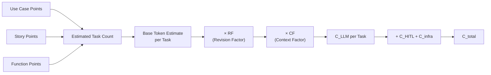
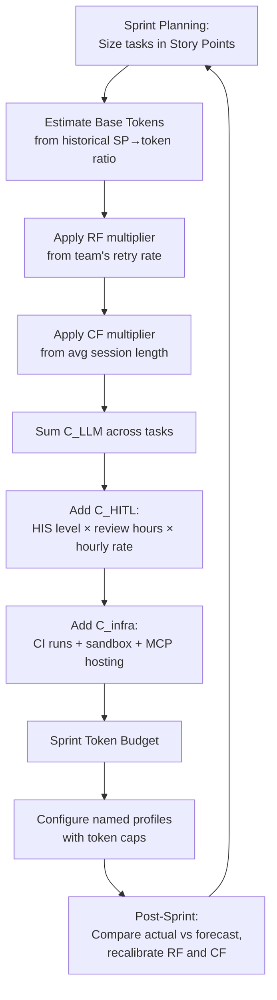

# ACEM and the End of COCOMO for Agentic Work: Why Traditional Cost Estimation Breaks Down — and How to Forecast Codex CLI Token Budgets with the Revision Factor


---

Every engineering organisation running Codex CLI at scale faces the same question: how much will this sprint cost in tokens? The traditional answer — size the work in story points or function points, multiply by a human-effort factor — no longer applies. Human labour is not the primary cost driver when an autonomous agent does the implementation. Token consumption is. And token consumption is stochastic, context-dependent, and amplified by retries.

El-Ramly's ACEM (Agentic Cost Estimation Model), published as arXiv:2608.02582 on 3 August 2026 [^1], offers the first formal framework for estimating costs in this new regime. This article unpacks the model, maps it to Codex CLI's configuration surface, and provides a practical forecasting workflow.

## Why COCOMO II Breaks for Agentic Work

COCOMO II decomposes effort into person-months driven by source lines of code and 17 cost drivers — team capability, platform volatility, schedule pressure [^2]. Every driver assumes a human doing the work. When a coding agent resolves a task, the dominant cost dimensions shift:

- **LLM token consumption** replaces developer hours as the primary expenditure.
- **Human-in-the-Loop oversight** replaces implementation effort with review, approval, and correction effort.
- **Infrastructure costs** — sandbox orchestration, MCP server hosting, CI runners — become non-trivial line items.

Bai et al. demonstrated this empirically: agentic tasks consume 1,000× more tokens than code chat, input tokens (not output) drive cost, and identical tasks can vary by up to 30× in total tokens across runs [^3]. That variance alone invalidates any deterministic estimation model built for human developers.

## The ACEM Framework

ACEM decomposes total agentic development cost into three additive dimensions [^1]:

```
C_total = C_LLM + C_HITL + C_infra
```

Each component introduces constructs specific to agentic dynamics.

### LLM Cost: The Revision Factor and Context Factor

The LLM cost component models token consumption across all agent actions — planning, tool calls, reasoning, retries, and context replay:

```
C_LLM = Σ (tokens_input × rate_input + tokens_output × rate_output) × RF × CF
```

Two multipliers capture agentic-specific cost amplification:

**Revision Factor (RF)** models the token overhead from output rejection and task retries. When an agent produces incorrect code, the correction cycle replays accumulated context plus the failed attempt plus the error feedback. Each retry iteration increases token consumption super-linearly. Ben Sghaier et al. measured this directly: failed tasks consume 2.7× the tokens and 1.8× the tool calls of successful ones [^4].

**Context Factor (CF)** captures the escalating token cost as accumulated context grows within a session. Early in a session, input tokens are modest. As the conversation accumulates tool outputs, file contents, and reasoning traces, each subsequent turn replays an ever-larger prefix. The cost curve is not linear — it accelerates as the session approaches the compaction threshold.

### HITL Cost: The Intensity Score

ACEM introduces a four-level Human-in-the-Loop Intensity Score (HIS) [^1]:

| Level | Description | Codex CLI Mapping |
|-------|-------------|-------------------|
| 0 — Autonomous | No human review required | `approval_policy = "full-auto"` ⚠️ removed in v0.147.0; use `--approve-for-me` with Guardian auto-review |
| 1 — Spot-check | Periodic sampling of agent output | `approval_policy = "unless-allow-listed"` with broad allowlists |
| 2 — Gate-review | Human approves every state-mutating action | `approval_policy = "on-failure"` or default `"unless-allow-listed"` |
| 3 — Pair-program | Continuous human co-piloting | `suggest` mode or `approval_policy = "always"` |

Higher HIS levels reduce token waste from undetected errors (lower RF) but increase human labour cost. The optimal HIS for a project depends on the ratio of human hourly cost to token cost per retry cycle.

### Infrastructure Cost

Infrastructure cost covers sandbox provisioning, MCP server hosting, CI execution triggered by agent commits, and storage for conversation logs. For Codex CLI, this maps to:

- Sandbox overhead: Landlock/Seatbelt kernel enforcement is negligible; Docker-based sandboxes or Codex Remote cloud instances carry measurable cost [^5].
- MCP server hosting: each `mcp_servers` entry in `config.toml` runs a persistent process.
- CI costs: agents that commit frequently trigger more pipeline runs.

## Bridging Traditional Metrics to Token Estimates

ACEM's most practical contribution is its mapping from conventional sizing metrics to token forecasts [^1]:



The bridge works because story points, use case points, and function points all correlate with task complexity — and task complexity correlates with token consumption. Bai et al.'s token prediction experiments showed that models can estimate their own consumption with moderate accuracy before execution [^3], suggesting that a calibrated base-token-per-story-point ratio is feasible once an organisation collects a few sprints of data.

## Configuring Codex CLI for Cost-Aware Sessions

Several `config.toml` parameters directly influence the cost factors ACEM describes.

### Controlling the Context Factor

The CF escalates as context accumulates. Two levers manage this:

```toml
# ~/.codex/config.toml
model_auto_compact_token_limit = 200000   # trigger compaction earlier
tool_output_token_limit = 16384           # cap per-tool output ingestion
```

Lowering `model_auto_compact_token_limit` forces earlier compaction, resetting the context accumulation curve at the expense of potential information loss. Lowering `tool_output_token_limit` prevents large file reads or verbose tool outputs from inflating context [^5].

### Controlling the Revision Factor

The RF escalates with retries. Codex CLI's hook system provides two intervention points:

```toml
# PostToolUse hook: fail fast on test failures instead of retrying blindly
[[hooks.post_tool_use]]
command = "python3 scripts/verify-patch.py"
on_failure = "stop"   # exit code 1 halts the session
```

A `PostToolUse` hook that runs verification after each tool invocation catches errors early, preventing the agent from accumulating failed attempts in context. The `on_failure = "stop"` directive is critical — it prevents runaway retry loops that multiply RF.

### Named Profiles for Budget Tiers

Named profiles let teams encode ACEM's HIS levels as switchable configurations:

```toml
# ~/.codex/profiles/cost-sensitive.toml
model = "gpt-5.6-luna"
model_reasoning_effort = "medium"
approval_policy = "unless-allow-listed"
sandbox_mode = "workspace-write"
```

```toml
# ~/.codex/profiles/high-autonomy.toml
model = "gpt-5.6-terra"
model_reasoning_effort = "high"
sandbox_mode = "workspace-write"
```

The `cost-sensitive` profile uses Luna (the smaller, cheaper model) with medium reasoning — targeting HIS level 2 tasks where human gates catch errors. The `high-autonomy` profile uses Terra for complex tasks where higher upfront token spend reduces RF through better first-pass accuracy [^6].

```bash
# Select profile at session start
codex --profile cost-sensitive "Fix the pagination bug in src/api/users.rs"
```

## A Practical Forecasting Workflow

Combining ACEM with Codex CLI's telemetry produces a calibrated forecasting loop:



**Step 1: Collect baseline data.** Run `ccusage` [^5] or parse session JSON logs to extract tokens-per-task for completed work. Group by story-point size.

**Step 2: Calculate your team's RF.** Divide total tokens consumed (including retries) by tokens consumed on first-pass successes. A team with good AGENTS.md policies and strong PostToolUse verification might see RF ≈ 1.3. A team without guardrails might see RF ≈ 3.0.

**Step 3: Calculate your CF.** Compare token cost of the first tool call in a session to the last. The ratio approximates the context growth multiplier. Teams using aggressive compaction (200K threshold on a 400K window) will see CF ≈ 1.4; teams running to window limits will see CF ≈ 2.5+.

**Step 4: Forecast.** Multiply base-tokens-per-SP × sprint SP total × RF × CF for C_LLM. Add HITL and infrastructure costs.

**Step 5: Recalibrate.** After each sprint, compare forecast to actual. Adjust RF and CF. The model improves with data — exactly as COCOMO II improved with calibration, but on a fundamentally different cost surface.

## Limitations and Open Questions

ACEM is presented as a theoretical framework awaiting empirical validation [^1]. Several questions remain:

- **RF stability across models.** Does the revision factor hold constant when switching from GPT-5.6-Terra to Claude Sonnet 4.6? Different models have different first-pass accuracy rates, and RF is model-dependent. ⚠️ No cross-model RF calibration data exists yet.
- **CF under compaction.** The context factor assumes monotonic growth. Compaction resets the context but may lose critical information, increasing RF. The interaction between CF reduction and RF increase under compaction is not modelled.
- **Multi-agent sessions.** Codex CLI's subagent spawning (`max_threads`, `max_depth`) creates parallel cost streams. ACEM's additive model does not account for coordination overhead tokens between agents. ⚠️ Multi-agent cost modelling remains unaddressed.
- **Prompt cache interaction.** Codex CLI sessions benefit from prompt caching (cached input tokens cost ~50% less). CF should arguably incorporate cache hit rates, which TokenPilot's research shows can reach 79.2% with prefix stabilisation [^7].

## Conclusion

COCOMO II served software engineering for decades because its cost drivers matched reality: human effort scaled with complexity. In agentic software engineering, the cost drivers are tokens, retries, context growth, and oversight intensity. ACEM provides the first formal vocabulary for this new cost surface — Revision Factor, Context Factor, HITL Intensity Score — and maps it to the sizing metrics organisations already collect.

For Codex CLI practitioners, the immediate action is straightforward: start measuring your RF and CF from session telemetry, encode your HIS level in named profiles, and use PostToolUse hooks to keep RF as close to 1.0 as your verification infrastructure allows. The teams that forecast accurately will be the ones that treat token budgets with the same rigour they once applied to developer headcount.

## Citations

[^1]: El-Ramly, M. (2026). "ACEM: A Cost Estimation Model for Agentic Software Engineering." arXiv:2608.02582v2. [https://arxiv.org/abs/2608.02582](https://arxiv.org/abs/2608.02582)

[^2]: Boehm, B. W. et al. (2000). *Software Cost Estimation with COCOMO II.* Prentice Hall. The foundational reference for COCOMO II's 17 cost drivers and person-month decomposition.

[^3]: Bai, L. et al. (2026). "How Do AI Agents Spend Your Money? Analyzing and Predicting Token Consumption in Agentic Coding Tasks." arXiv:2604.22750. [https://arxiv.org/abs/2604.22750](https://arxiv.org/abs/2604.22750)

[^4]: Ben Sghaier, O. et al. (2026). "Don't Blame the Large Language Model: How Agent Harness Evolution Shapes Coding Agent Quality." arXiv:2607.03691. [https://arxiv.org/abs/2607.03691](https://arxiv.org/abs/2607.03691)

[^5]: OpenAI. (2026). Codex CLI documentation and changelog. Configuration reference for `config.toml`, `tool_output_token_limit`, `model_auto_compact_token_limit`, sandbox modes, and session telemetry. [https://developers.openai.com/codex/changelog](https://developers.openai.com/codex/changelog)

[^6]: OpenAI. (2026). "GPT-5.4 and GPT-5.4 mini retirement notice — August 31 2026." GPT-5.6-Terra and GPT-5.6-Luna replace GPT-5.4 and GPT-5.4-mini respectively for ChatGPT-authenticated Codex sessions. [https://x.com/OpenAIDevs/status/2083301245390143831](https://x.com/OpenAIDevs/status/2083301245390143831)

[^7]: Xu, H. et al. (2026). "TokenPilot: Optimizing Token Consumption in Agentic Pipelines." arXiv:2606.17016. Dual-granularity context management achieving 79.2% cache hit rate through prefix stabilisation and lifecycle-aware eviction. [https://arxiv.org/abs/2606.17016](https://arxiv.org/abs/2606.17016)
