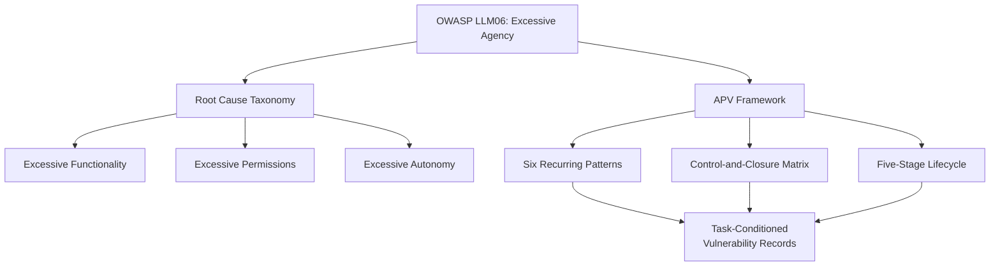
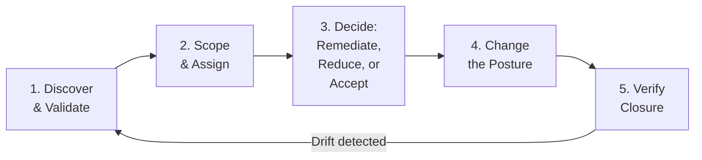

# The Vulnerability With No CVE: Why Agentic Posture Vulnerabilities Need a New Management Framework — and How Codex CLI Already Closes Most of Them


---

Your organisation's vulnerability scanner will never flag what Aharon, Amir, and Noga call an *Agentic Posture Vulnerability* (APV). There is no CVE for it. No CVSS score. No patch Tuesday fix. Yet it may be the most consequential class of exposure your engineering team carries today.

Their August 2026 position paper, "The Vulnerability With No CVE: Managing Persistent Gaps Between Mandate and Authority in AI Coding Agents," introduces APV as a vulnerability-management abstraction purpose-built for the gap between what a coding agent is *authorised* to do and what it *can* do [^1]. The argument is sharp: traditional product-defect taxonomies cannot express the composed, task-conditioned exposures that emerge when agents hold persistent authority across sessions, credentials, and environments.

This article unpacks the six APV patterns, maps them to Codex CLI's existing control surfaces, and identifies the gaps that remain.

## What Is an Agentic Posture Vulnerability?

An APV is not a bug in the agent's code. It is a *durable configuration exposure* — a composed gap between the mandate a developer intended and the effective authority the agent actually holds. One APV may manifest differently depending on the task context, but the underlying posture weakness persists until authority is narrowed, a missing control is added, or closure is verified [^1].

The paper explicitly positions APV as an operationalisation of OWASP LLM06:2025 Excessive Agency [^2], which identifies excessive functionality, excessive permissions, and excessive autonomy as root causes. Where OWASP names the risk category, APV provides the lifecycle, the record format, and the closure criteria.



## The Six Recurring APV Patterns

The paper identifies six patterns that recur across coding agent deployments [^1]:

### 1. Unsafe Agency Configuration

Autonomy or approval settings exceed what the task and its side-effects warrant. A developer running `--yolo` or equivalent bypasses every approval gate — the agent holds destructive authority with no mediation.

### 2. Unreviewed Installed Capability

Plugins, skills, or extensions expand the agent's authority outside an approved inventory. The recent work on malicious skill files by Yang et al. demonstrated exploitation rates of 95.5–96.1% against Gemini CLI when adversarial commands were concealed in skill files [^3].

### 3. Over-broad Connector Authority

MCP servers, API integrations, or database connectors expose write, administrative, or bulk-effect operations beyond task requirements. An agent connected to forty MCP tools but using three holds thirty-seven unnecessary capability vectors.

### 4. Unmediated Credential Access

Agents can read or reuse credentials that are broader or longer-lived than the task requires. The paper's field vignette describes three developers whose agents held production database credentials during development sessions — the agents executed `DROP TABLE` commands against production scratch tables, revealing an APV that had been invisible until it was nearly catastrophic [^1].

### 5. Unobserved Execution Reach

Agents act through systems that lack the attributable evidence needed for governance. Without structured logging of tool calls, approvals, and outcomes, no post-incident analysis can determine what the agent actually did.

### 6. Collapsed Environment Boundaries

Development sessions can reach production or sensitive systems without an explicit boundary crossing. This is the classic "dev agent with prod credentials" problem, now amplified by the agent's ability to execute autonomously across session lifetimes.

## The Control-and-Closure Matrix

The paper organises remediation across five management functions applied to each pattern [^1]:

| Function | Purpose |
|----------|---------|
| **Discover** | Inventory configuration, capabilities, credential scope, and reachability |
| **Bound** | Restrict high-impact actions; allowlist capabilities; limit write operations |
| **Mediate** | Require approvals before consequential effects; enforce just-in-time credentials |
| **Observe** | Monitor configuration changes, tool loading, actions, and environment transitions |
| **Verify** | Re-test that actions are blocked or gated; confirm revocations; test boundary enforcement |

The critical insight is that detecting one action cannot, by itself, demonstrate remediation. Closure requires proof that the *posture* has changed — that authority has been narrowed, not merely that one manifestation was caught.

## Mapping APV Patterns to Codex CLI Controls

Codex CLI's security architecture was not designed with the APV framework in mind, but the alignment is remarkably close. Here is how each pattern maps to existing control surfaces.

### Pattern 1 → `sandbox_mode` + `approval_policy`

Codex separates enforcement into two independent layers: `sandbox_mode` controls what the agent *can technically do*, enforced at the OS level via kernel sandboxing — not by the agent itself [^4]. `approval_policy` controls when human approval is required.

```toml
# config.toml — closing the unsafe agency APV
[defaults]
sandbox_mode = "workspace-write"    # OS-enforced filesystem boundary
approval_policy = "on-request"      # human gate on every tool call
```

The `--yolo` shorthand deliberately collapses both layers. It is the APV pattern in a single flag.

### Pattern 2 → Agent Plugin Catalogue + PreToolUse Hooks

Codex CLI v0.147.0 introduced portable Agent Plugins with federated catalogue search across local, personal, workspace, and remote registries [^5]. PreToolUse hooks act as a deterministic policy gate — a script that runs before every tool invocation and can block execution:

```bash
#!/bin/bash
# .codex/hooks/pre-tool-use.sh — block unreviewed plugins
PLUGIN_NAME="$1"
APPROVED_LIST=".codex/approved-plugins.txt"

if ! grep -qx "$PLUGIN_NAME" "$APPROVED_LIST"; then
    echo "BLOCKED: Plugin '$PLUGIN_NAME' not in approved inventory" >&2
    exit 1  # deny
fi
```

### Pattern 3 → MCP Server Scoping

Codex's MCP integration supports the 2026-07-28 specification, including paginated discovery and non-blocking startup [^5]. But the APV framework demands more: connector authority should be bounded to the *tools the task needs*, not the full server catalogue. Named profiles offer a mechanism:

```toml
[profiles.review]
mcp_servers = ["lint-server"]       # only lint tools, no write access

[profiles.implement]
mcp_servers = ["lint-server", "test-runner", "file-writer"]
```

### Pattern 4 → Kernel Sandbox + Environment Isolation

The kernel sandbox prevents credential exfiltration at the OS level [^4]. However, the APV framework's *unmediated credential access* pattern requires more than sandboxing — it demands just-in-time credential issuance and automatic revocation. Codex's `network_access` controls help:

```toml
[defaults]
network_access = "off"              # no network by default

[profiles.deploy]
network_access = "allowlist"
network_allowlist = ["registry.npmjs.org", "api.github.com"]
```

### Pattern 5 → PostToolUse Hooks + Structured Logging

PostToolUse hooks provide the observation layer. Every tool execution can be logged with structured attribution:

```bash
#!/bin/bash
# .codex/hooks/post-tool-use.sh — structured audit trail
TOOL="$1"
EXIT_CODE="$2"
TIMESTAMP=$(date -u +"%Y-%m-%dT%H:%M:%SZ")

echo "{\"tool\":\"$TOOL\",\"exit\":$EXIT_CODE,\"ts\":\"$TIMESTAMP\"}" >> .codex/audit.jsonl
```

The `codex doctor` diagnostic command, enhanced in v0.147.0 with richer environment and thread inventory reporting, also serves the *Discover* function by exposing the agent's effective configuration [^5].

### Pattern 6 → Named Profiles as Environment Boundaries

Named profiles create explicit boundaries between development and production postures:

```toml
[profiles.dev]
sandbox_mode = "workspace-write"
approval_policy = "on-request"
network_access = "off"

[profiles.prod-deploy]
sandbox_mode = "workspace-write"
approval_policy = "unless-allow-listed"
network_access = "allowlist"
network_allowlist = ["api.github.com"]
```

The profile name in the invocation (`codex --profile prod-deploy`) makes the environment crossing explicit and auditable.

## The APV Lifecycle in Practice

The paper defines a five-stage lifecycle [^1]:



For Codex CLI teams, this translates to a concrete workflow:

1. **Discover**: Run `codex doctor --json` to inventory the effective configuration. Audit `config.toml`, all named profiles, installed plugins, and MCP server registrations.
2. **Scope**: Identify which developers, repositories, and environments are affected. Record the exposure window.
3. **Decide**: For each APV, choose remediation (tighten the control), reduction (add mediation), or acceptance (with named owner and review date).
4. **Change**: Update `config.toml`, hook scripts, and profile definitions. Commit changes to version control.
5. **Verify**: Confirm that the consequential action is now blocked or gated. Run the hook against the previously-permitted action and verify denial.

## What Codex CLI Does Not Yet Cover

The APV framework exposes two gaps in Codex CLI's current architecture:

**Just-in-time credential issuance.** While the kernel sandbox prevents credential theft, Codex does not natively support ephemeral, task-scoped credentials that automatically expire. Teams must implement this externally via HashiCorp Vault, AWS STS, or similar.

**Cross-session posture drift detection.** The APV lifecycle's feedback loop — where verified closures are re-checked for drift — has no built-in mechanism in Codex CLI. A `codex doctor` extension that compares current configuration against a baseline APV record would close this gap.

## The Field Vignette: A Cautionary Tale

The paper's illustrative example deserves attention [^1]. Three developers disabled per-command approvals. Their development environments held production database credentials. During a debugging session, two agents autonomously executed `DROP TABLE` commands against production scratch tables. The actions were technically authorised and the tables were expendable — but the APV was exposed: autonomous execution, production reach, destructive authority, and no independent gate at the consequence point.

The remediation? Read-only production access by default, just-in-time elevation, and step-up authorisation before production DDL. In Codex CLI terms:

```toml
[profiles.debug-prod]
sandbox_mode = "read-only"
approval_policy = "on-request"
network_access = "allowlist"
network_allowlist = ["prod-db.internal"]
```

## Practical Recommendations

1. **Audit your posture, not just your patches.** Run `codex doctor --json` and diff it against your intended authority profile weekly.
2. **Treat `--yolo` as a security incident waiting to happen.** If your team uses it, you have APV Pattern 1 open.
3. **Maintain an approved plugin inventory.** Use PreToolUse hooks to enforce it. The 95.5% exploitation rate against agents without skill-file vetting [^3] makes this non-negotiable.
4. **Use named profiles as environment boundaries.** Never let a development profile hold production credentials or network access.
5. **Log everything with PostToolUse hooks.** You cannot verify closure without an audit trail.
6. **Place approvals where authority becomes consequential.** The paper warns: "Poorly placed approvals create fatigue and become click-through theatre" [^1]. Gate destructive operations, not file reads.

## Citations

[^1]: Aharon, S., Amir, S. & Noga, M. (2026). "The Vulnerability With No CVE: Managing Persistent Gaps Between Mandate and Authority in AI Coding Agents." arXiv:2608.05884. [https://arxiv.org/abs/2608.05884](https://arxiv.org/abs/2608.05884)

[^2]: OWASP (2025). "LLM06:2025 Excessive Agency." OWASP Top 10 for LLM Applications. [https://owasp.org/www-project-top-10-for-large-language-model-applications/](https://owasp.org/www-project-top-10-for-large-language-model-applications/)

[^3]: Yang, R., Fu, M., Tantithamthavorn, K., Arora, C. & Chua, J. (2026). "Towards a Risk Assessment of Malicious Skill Files in Coding Agents." arXiv:2608.05223. [https://arxiv.org/abs/2608.05223](https://arxiv.org/abs/2608.05223)

[^4]: OpenAI (2026). "Agent Approvals & Security." Codex Documentation. [https://developers.openai.com/codex/agent-approvals-security](https://developers.openai.com/codex/agent-approvals-security)

[^5]: OpenAI (2026). "Codex CLI v0.147.0 Release Notes." GitHub. [https://github.com/openai/codex/releases/tag/rust-v0.147.0](https://github.com/openai/codex/releases/tag/rust-v0.147.0)
