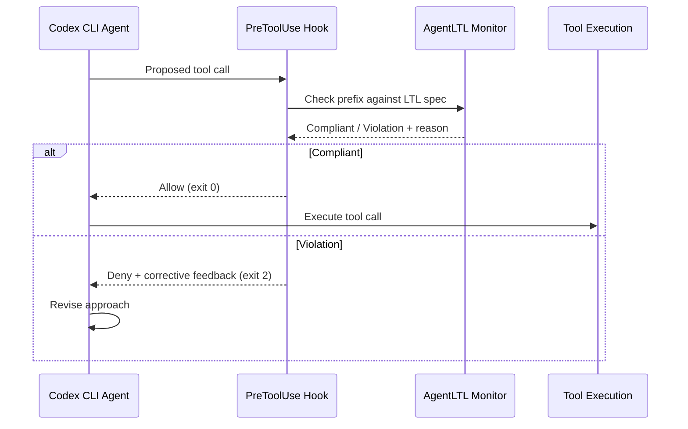
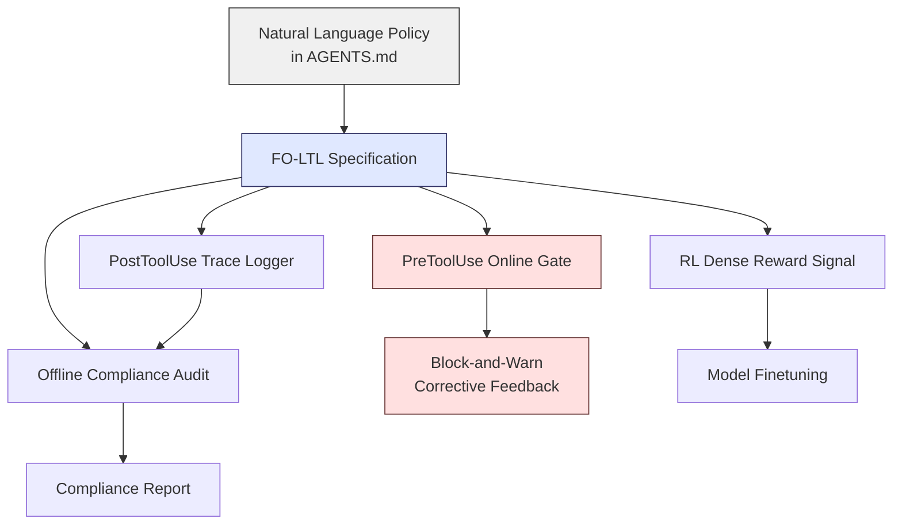

# AgentLTL and Temporal Logic for Procedural Compliance: Why Deterministic Trace Verification Beats LLM Judges — and How to Wire It into Codex CLI


---

## The Problem with Judging Agent Behaviour

Most evaluation of tool-using LLM agents still falls into one of two camps: final-answer correctness (did the agent produce the right output?) or LLM-as-judge scoring (did a second model think the trace looked reasonable?). Neither captures *how* an answer was produced [^1]. In regulated, safety-critical, or enterprise environments the procedure itself is part of correctness — a clinical triage agent that skips a contraindication check has failed even if the final diagnosis happens to be right.

Elkoussy and Perez's AgentLTL framework, published in July 2026, attacks this gap head-on by expressing procedural rules as First-Order Linear Temporal Logic (FO-LTL) formulae over agent traces and yielding a deterministic, judge-free compliance score [^1]. A single specification drives three use cases: **measuring** compliance on completed traces, **enforcing** constraints via online tool-call gating, and **training** agents through dense reward signals derived from the same formulae.

The implications for Codex CLI users are direct. Codex already provides the hook architecture — `PreToolUse`, `PostToolUse`, and `SessionStart` events — that can serve as the enforcement surface for temporal-logic policies. What has been missing is a principled way to express and verify those policies. AgentLTL provides that language.

---

## How AgentLTL Works

### The Specification Language

AgentLTL derives from FO-LTL and expresses constraints across four categories [^1]:

| Category | What It Captures | LTL Operators |
|---|---|---|
| **Ordering** | Required action sequences ("authenticate before data access") | □ (always), ○ (next) |
| **Branching** | Conditional paths based on state or outcome | □(p → ◇q) |
| **Iteration** | Loop bounds, retry limits, polling frequency | U (until), bounded ◇ |
| **Grounding** | Links abstract specs to concrete tool implementations | First-order quantification |

A specification might read: "if the agent calls `search_database`, it must have previously called `authenticate`; and after any `write_file`, a `run_tests` call must eventually follow before the session ends." In FO-LTL this becomes a conjunction of temporal formulae that can be mechanically checked against any execution trace.

### Offline Trace Verification

Given a completed trace — an ordered sequence of tool calls with their parameters and return values — AgentLTL extracts the relevant predicates, maps them against the specification, and produces a compliance score. No LLM judge, no prompt engineering, no stochastic variation between evaluation runs [^1].

### Online Block-and-Warn

For live enforcement, AgentLTL checks each prefix of the trace as the agent executes. Before a tool call fires, the monitor determines whether completing that call would make it impossible to satisfy any remaining temporal constraint. If so, it **blocks** the call and returns a warning message explaining the violation and suggesting alternatives [^1]. This is structurally identical to what Codex CLI's `PreToolUse` hook does when it returns a deny decision.



### Finetuning with Compliance Rewards

The compliance score serves as a dense reward signal for reinforcement learning. Rather than a sparse binary "task succeeded / failed", each temporal constraint contributes granular feedback. Finetuning with this reward yielded **+38 percentage points in accuracy** and **+17.5 percentage points in compliance** on held-out patterns, including unseen tool-name aliases [^1]. This suggests models acquire genuine procedural understanding rather than memorising surface-level tool sequences.

---

## Benchmark Results

AgentLTL was evaluated across 12 workflow templates and 7 language models under three harness configurations [^1]:

| Harness Mode | Effect |
|---|---|
| **Unconstrained** | Baseline — no enforcement |
| **Block-and-warn** | Online gating with corrective feedback |
| **Finetuned** | Model trained with compliance reward |

Block-and-warn harnessing improved compliance on **five of seven models** without any model modification — purely through runtime enforcement [^1]. The finetuned models showed the largest gains, demonstrating that the same specification language that measures and enforces compliance can also teach it.

This mirrors the complementary MANTRA framework (Anand et al., May 2026), which automatically synthesises SMT-validated compliance benchmarks from natural-language manuals and tool schemas [^2]. Where MANTRA generates the test cases, AgentLTL provides the verification and enforcement engine — the two are naturally composable.

---

## Mapping AgentLTL onto Codex CLI

Codex CLI's hook system already provides the mechanical infrastructure for temporal-logic enforcement. Here is how each AgentLTL capability maps to existing Codex primitives.

### PreToolUse as the Online Gate

The `PreToolUse` hook fires before every tool call and can deny execution by returning a structured decision or exiting with code 2 [^3]. An AgentLTL monitor wraps naturally into this hook:

```json
{
  "hooks": {
    "PreToolUse": [
      {
        "command": "python3 /path/to/ltl_monitor.py",
        "timeout_ms": 2000,
        "description": "AgentLTL temporal compliance gate"
      }
    ]
  }
}
```

The monitor script maintains a trace log (appending each tool call), checks the proposed call against the LTL specification, and returns the deny decision with a reason when a violation is detected:

```bash
# ltl_monitor.py receives tool call details on stdin
# Maintains trace state in /tmp/codex-trace.jsonl
# Returns deny decision to stderr on exit 2
echo "Blocked: run_tests must precede deploy per ordering constraint O-3" >&2
exit 2
```

### PostToolUse for Trace Logging

The `PostToolUse` hook captures completed tool calls with their results, building the trace log that offline verification analyses at session end [^3]. This enables retrospective compliance auditing even when online enforcement is not active:

```json
{
  "hooks": {
    "PostToolUse": [
      {
        "command": "python3 /path/to/trace_logger.py",
        "timeout_ms": 1000,
        "description": "Append tool call + result to trace log"
      }
    ]
  }
}
```

### AGENTS.md as the Policy Source

AgentLTL specifications need a version-controlled home. Codex CLI's `AGENTS.md` file is the natural location — it already serves as the governance document for agent behaviour and is read at session start [^4]. Embedding temporal constraints in a structured section ensures they travel with the repository:

```markdown
## Temporal Compliance Policy

### Ordering Constraints
- O-1: `authenticate` must precede any `database_query`
- O-2: `run_tests` must follow any `write_file` before session end
- O-3: `run_tests` must precede `deploy`

### Iteration Constraints
- I-1: Maximum 3 retry attempts for any failing tool call
- I-2: `search` calls bounded to 5 per task

### Branching Constraints
- B-1: If `lint_check` returns errors, `write_file` must follow before `commit`
```

A pre-processing step in the `SessionStart` hook can parse these constraints into FO-LTL formulae that the `PreToolUse` monitor then enforces throughout the session.

### Named Profiles for Graduated Enforcement

Codex CLI's named profiles allow different enforcement levels per context. A `strict` profile enables online block-and-warn for production repositories; a `permissive` profile logs violations without blocking for exploratory work [^4]:

```toml
[profile.strict]
model = "gpt-5.6-terra"
approval_policy = "on-request"

[profile.permissive]
model = "gpt-5.6-luna"
approval_policy = "unless-allow-listed"
```

The `ltl_monitor.py` script reads the active profile and adjusts its enforcement mode accordingly — blocking in strict mode, warning in permissive mode.

---

## Why This Matters: From Ad-Hoc Hooks to Formal Policies

The shift from imperative hook scripts ("block `rm -rf`") to declarative temporal specifications ("authentication must precede data access, and tests must follow writes") is significant for three reasons:

1. **Composability.** Temporal formulae compose through conjunction. Adding a new constraint does not require modifying existing hook logic — you append a formula to the specification [^1].

2. **Verifiability.** Because FO-LTL has well-understood model-checking algorithms, you can formally verify that your specification is satisfiable before deploying it. MANTRA's SMT-based validation ensures constraint sets are internally consistent [^2].

3. **Trainability.** The same specification that gates tool calls at runtime can generate dense rewards for finetuning. If you run a local model through Codex CLI, you can use compliance traces to improve that model's procedural adherence over time [^1].



---

## Practical Constraints and Caveats

**⚠️ Hook bypass.** Codex CLI's `PreToolUse` hook can be circumvented if the model writes and executes a script directly rather than calling a named tool. Treat hook-based enforcement as a useful guardrail, not a complete security boundary [^3].

**⚠️ Specification authoring.** Writing correct FO-LTL specifications requires familiarity with temporal logic. The MANTRA pipeline can auto-generate specifications from natural-language manuals [^2], but hand-authored specifications need careful validation.

**⚠️ Performance overhead.** Online LTL model-checking adds latency to each tool call. For complex specifications, the `timeout_ms` setting in hooks.json needs tuning to avoid blocking the agent loop. The AgentLTL paper does not report latency figures for the online monitor ⚠️.

**⚠️ State persistence.** The trace log must persist across context compaction events. If Codex CLI compacts the context mid-session, the hook's external trace file (e.g., `/tmp/codex-trace.jsonl`) preserves the full history that the in-context trace may lose.

---

## Getting Started

For teams wanting to experiment with temporal compliance in Codex CLI today:

1. **Define constraints** in a `## Temporal Compliance Policy` section of your `AGENTS.md`.
2. **Write a lightweight monitor** that maintains a trace log and checks proposed tool calls against ordering rules. Start with simple precedence constraints before moving to full FO-LTL.
3. **Wire into hooks.json** with `PreToolUse` for enforcement and `PostToolUse` for logging.
4. **Audit traces** at session end by running the offline verifier against the trace log.
5. **Iterate** — review violation logs, refine constraints, and gradually tighten enforcement as confidence grows.

The gap between "we have hooks" and "we have formal compliance" is smaller than it looks. AgentLTL provides the theoretical foundation; Codex CLI provides the execution surface.

---

## Citations

[^1]: Elkoussy, L. and Perez, J. (2026) "AgentLTL: A Trace-Verification Framework for Measuring, Enforcing, and Training Procedural Compliance in Tool-Using LLM Agents." *arXiv:2607.02599*. Available at: [https://arxiv.org/abs/2607.02599](https://arxiv.org/abs/2607.02599)

[^2]: Anand, A., Chatzi, I., Raha, R. and Schmuck, A.-K. (2026) "MANTRA: Synthesizing SMT-Validated Compliance Benchmarks for Tool-Using LLM Agents." *arXiv:2605.06334*. Available at: [https://arxiv.org/abs/2605.06334](https://arxiv.org/abs/2605.06334)

[^3]: OpenAI (2026) "Hooks – Codex CLI." *OpenAI Developer Documentation*. Available at: [https://developers.openai.com/codex/hooks](https://developers.openai.com/codex/hooks)

[^4]: OpenAI (2026) "Codex CLI Configuration Reference." *OpenAI Developer Documentation*. Available at: [https://developers.openai.com/codex/configuration](https://developers.openai.com/codex/configuration)
