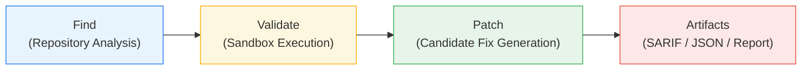
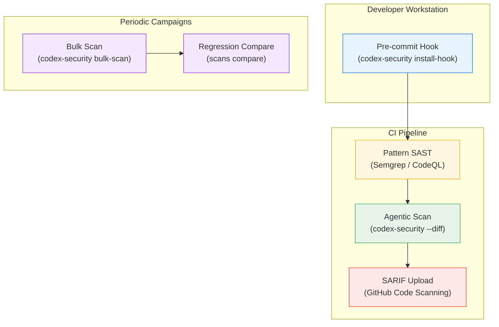

# Codex Security CLI Goes Open Source: The Find-Validate-Patch Pipeline That Replaces Your SAST Noise


---

On 13 July 2026, OpenAI open-sourced the Codex Security CLI and its TypeScript SDK under Apache 2.0 as `@openai/codex-security` [^1]. Previously a closed plugin codenamed "Aardvark" available only inside the Codex chat interface, the standalone CLI turns agentic vulnerability scanning into something you can wire into pre-commit hooks, CI gates, and bulk-scan campaigns — without ever opening a browser.

This article walks through the architecture, practical configuration, CI integration patterns, and the trade-offs you need to understand before pointing it at production repositories.

## Why Another Security Scanner?

Traditional SAST tools — Semgrep, CodeQL, Bandit — match patterns. They are fast, deterministic, and offline. They also produce extraordinary volumes of false positives because they cannot reason about reachability across call graphs, framework conventions, or runtime configuration [^2].

Codex Security takes a fundamentally different approach: it is an **agentic contextual analyser** that uses frontier models (defaulting to `gpt-5.6-sol` with extra-high reasoning effort) to evaluate multi-file attack paths and assess whether a vulnerability is genuinely reachable [^1]. The trade-off is explicit: you lose determinism and offline capability, but gain semantic depth that pattern matchers cannot provide.

The correct deployment model is **complementary, not replacement**. Run your deterministic linters for the commodity checks; run Codex Security for the deep, cross-module findings that pattern matchers miss.

## Architecture: Find, Validate, Patch

The scanning pipeline has three discrete stages:



1. **Find** — The model ingests the codebase (or a diff scope) and identifies candidate vulnerabilities, ranking them by severity and reachability.
2. **Validate** — Each candidate is tested in a sandboxed environment to eliminate false positives before they reach a human. This is the key differentiator: validation happens before reporting, not after.
3. **Patch** — For validated findings, the model generates candidate fixes with evidence chains explaining the vulnerability and the remediation rationale.

Every completed scan produces four mandatory artefacts [^3]:

| Artefact | Purpose |
|---|---|
| `scan-manifest.json` | Target, scope, and producer metadata |
| `findings.json` | Vulnerability records with evidence chains |
| `coverage.json` | Reviewed surfaces, exclusions, completeness status |
| `report.md` | Human-readable summary |

## Getting Started

### Installation and Authentication

```bash
# Install globally or use npx
npm install -g @openai/codex-security

# Interactive login (stores credentials locally)
npx @openai/codex-security login

# Or set an environment variable for CI
export OPENAI_API_KEY="sk-..."
```

Requirements: Node.js 22.13.0+ and Python 3.10+ [^1].

### Your First Scan

```bash
# Scan the current repository
npx @openai/codex-security scan .

# Scan only changes against main
npx @openai/codex-security scan . --diff origin/main --head HEAD

# Preview configuration without API calls
npx @openai/codex-security scan . --dry-run
```

### Model and Cost Control

The default model is `gpt-5.6-sol` with `xhigh` reasoning effort — powerful but expensive. For routine PR scans, consider dropping to `gpt-5.6-terra`:

```bash
npx @openai/codex-security scan . \
  --model gpt-5.6-terra \
  --max-cost 5
```

The `--max-cost` flag caps spend per scan in USD, preventing runaway costs during deep analysis [^4].

## CI/CD Integration

### Exit Code Contract

Codex Security uses a three-value exit code scheme that prevents silent failures:

| Exit Code | Meaning |
|---|---|
| `0` | Scan complete, no findings above threshold |
| `1` | Findings at or above `--fail-on-severity` threshold |
| `2` | Scan incomplete or errored — cannot assert safety |

The exit-2 contract is critical: an incomplete scan must never silently pass a pipeline gate.

### GitHub Actions Example


```yaml
name: Security Scan
on:
  pull_request:
    branches: [main]

jobs:
  codex-security:
    runs-on: ubuntu-latest
    steps:
      - uses: actions/checkout@v4
        with:
          fetch-depth: 0  # Full history for diff

      - uses: actions/setup-node@v4
        with:
          node-version: 22

      - name: Scan PR diff
        env:
          OPENAI_API_KEY: ${{ secrets.OPENAI_API_KEY }}
        run: |
          npx @openai/codex-security scan . \
            --diff origin/main --head ${{ github.sha }} \
            --output-dir /tmp/codex-security/${{ github.run_id }} \
            --model gpt-5.6-terra \
            --max-cost 5 \
            --fail-on-severity high \
            --auth api-key

      - name: Export SARIF
        if: always()
        run: |
          npx @openai/codex-security export \
            /tmp/codex-security/${{ github.run_id }} \
            --export-format sarif \
            --source-root ${{ github.workspace }} \
            --output /tmp/results.sarif

      - name: Upload SARIF
        if: always()
        uses: github/codeql-action/upload-sarif@v3
        with:
          sarif_file: /tmp/results.sarif
```


### Key CI Design Principles

1. **Freeze the commit SHA** — prevent HEAD drift mid-scan by checking out a specific ref.
2. **Use `--diff`** — scanning only the PR diff reduces cost and noise dramatically.
3. **Output outside the worktree** — scan results contain source excerpts and reproduction steps; store them in `/tmp` or a separate artefact path to prevent accidental commit [^4].
4. **Separate exit codes** — handle exit 1 (policy failure) and exit 2 (scan error) differently in your pipeline logic.

## SARIF Export and Platform Integration

SARIF (Static Analysis Results Interchange Format) is the bridge to native security dashboards on GitHub, GitLab, and Azure DevOps:

```bash
npx @openai/codex-security export /path/to/scan \
  --export-format sarif \
  --source-root /path/to/repo \
  --output results.sarif
```

Once uploaded, findings appear inline on pull requests as code annotations — the same experience developers get from CodeQL or Semgrep, but backed by agentic reasoning rather than pattern matching [^1].

## Pre-Commit Hooks

For local development, the `install-hook` command adds a pre-commit scanner that checks staged and unstaged changes:

```bash
npx @openai/codex-security install-hook
```

The hook respects `core.hooksPath`, does not replace existing hooks, and blocks commits with findings at or above the configured severity threshold [^4]. This catches high-severity issues before they reach the remote, reducing the cost of CI-stage scanning.

## Bulk Scanning and Scan Comparison

For organisations managing hundreds of repositories, `bulk-scan` accepts a CSV inventory:

```bash
npx @openai/codex-security bulk-scan repos.csv \
  --output-dir /data/security-scans \
  --max-cost 10
```

The CSV format supports per-repository prompt customisation via a `prompt` column, and campaigns are resumable — interrupted scans pick up where they left off.

For regression tracking across releases, `scans compare` automatically matches findings by root cause:

```bash
npx @openai/codex-security scans compare SCAN_ID_BEFORE SCAN_ID_AFTER
```

This surfaces new, persisting, and resolved findings without manual diff work.

## Knowledge Base Integration

The `--knowledge-base` flag ingests threat models, architecture documents, or security policies (Markdown, PDF, Word) to give the scanner architectural context:

```bash
npx @openai/codex-security scan . \
  --knowledge-base threat-model.md \
  --knowledge-base security-policy.pdf
```

This is where the agentic approach truly diverges from pattern matching: the model can reason about whether a finding violates your specific security requirements, not just generic vulnerability signatures [^4].

## TypeScript SDK

For programmatic integration — custom dashboards, scheduled scanning services, or orchestration layers — the SDK provides typed interfaces:

```typescript
import { CodexSecurity } from "@openai/codex-security";

const security = new CodexSecurity();

// Preflight check validates credentials and configuration
await security.preflight();

const result = await security.run(".", {
  mode: "deep",
  workers: 2,
  maxDiscoveryRuns: 10,
  stopAfterNoNew: 3,
});

console.log(`Report: ${result.reportPath}`);
console.log(`Findings: ${result.findingsCount}`);

await security.close();
```

The SDK supports `AbortSignal` for cancellation, making it suitable for integration into larger orchestration workflows [^1].

## Multi-Provider Support

Although the default backend is OpenAI, the CLI supports alternative inference providers [^4]:

- **Amazon Bedrock** — uses models like `openai.gpt-5.6-luna` with standard AWS credential chains
- **Fireworks AI** — supports Qwen models for cost-sensitive scanning
- **OpenRouter** — aggregated model access

This flexibility means organisations locked into specific cloud providers can still use the scanning pipeline without routing traffic through OpenAI directly.

## Operational Boundaries

Before adopting Codex Security, understand what it is not:

- **Not deterministic** — the same codebase may produce different findings across runs. This matters for compliance evidence.
- **Not offline** — every scan requires API access. Air-gapped environments cannot use it.
- **Not a replacement for SAST** — it complements pattern matchers; it does not supersede them for commodity checks.
- **Not self-verifying** — the tool produces evidence but does not independently verify its own remediations. High-severity patches require human review [^3].

The `coverage.json` artefact reports "complete" status for selected scan areas only, not a repository-wide vulnerability guarantee.

## Where Codex Security Fits in a Layered Defence



The optimal configuration runs deterministic SAST first (fast, cheap, high recall for known patterns), then Codex Security for the semantic layer (slower, costlier, but catches what patterns miss). Pre-commit hooks catch the worst offenders before code leaves the workstation; periodic bulk scans audit the full estate.

## Conclusion

The open-sourcing of `@openai/codex-security` fills a genuine gap in the security toolchain: the space between what pattern matchers can find and what requires human security review. The find-validate-patch pipeline, SARIF integration, and severity-gated exit codes make it CI-ready, while the TypeScript SDK enables custom orchestration for teams with specific workflow requirements.

The key discipline is treating it as a complement to — not a replacement for — deterministic tools. Run your linters. Then run the agent. Review what the agent finds. That layered approach is the only one that makes engineering sense.

---

## Citations

[^1]: OpenAI, "Codex Security CLI & TypeScript SDK," GitHub repository, [github.com/openai/codex-security](https://github.com/openai/codex-security), Apache 2.0, open-sourced July 2026.

[^2]: ExplainX, "Codex Security CLI Open Source — July 2026," [explainx.ai/blog/openai-codex-security-cli-sdk-open-source-july-2026](https://www.explainx.ai/blog/openai-codex-security-cli-sdk-open-source-july-2026), July 2026.

[^3]: TrilogyAI, "OpenAI Open-Sourced the Codex Security CLI," Substack, [trilogyai.substack.com/p/openai-codex-security-cli](https://trilogyai.substack.com/p/openai-codex-security-cli), July 2026.

[^4]: Oflight Inc., "OpenAI Codex Security CLI: AI Vulnerability Scanning Guide," [oflight.co.jp/en/columns/openai-codex-security-cli-guide-2026](https://www.oflight.co.jp/en/columns/openai-codex-security-cli-guide-2026), 2026.

[^5]: OpenAI, "Codex Security CLI Reference," ChatGPT Learn, [learn.chatgpt.com/docs/security/cli/reference](https://learn.chatgpt.com/docs/security/cli/reference), 2026.
