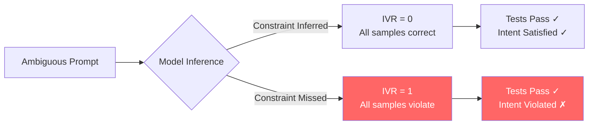
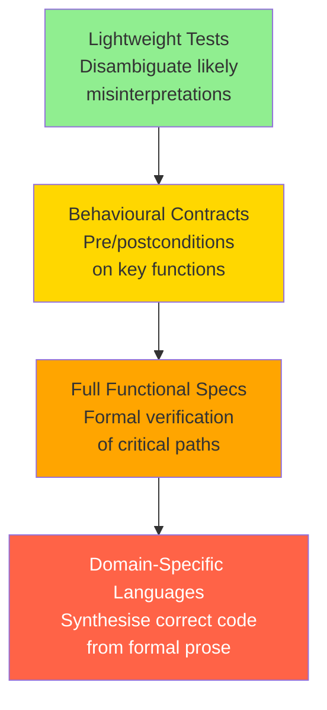

# DevIntent and the Implicit Intent Violation Problem: Why Your Coding Agent Passes Every Test but Builds the Wrong Thing — and How to Defend Against It in Codex CLI


---

## The Pass-Rate Illusion

Every senior developer has experienced the sinking realisation: the code passes every test, yet it does the wrong thing. When a human colleague writes that code, you catch the misunderstanding in review. When a coding agent writes it at machine speed, the misunderstanding scales.

Haing, Vidra, and Setty quantified this gap in *DevIntent* (August 2026), introducing the **Intent Violation Rate (IVR)** — the fraction of LLM-generated solutions that pass all stated tests yet fail hidden constraint tests encoding unstated developer intent [^1]. Their results are stark: Claude Sonnet 4.6 achieved a 94.3% pass rate on stated tests but violated intent on **54.5%** of problems. GPT-4.1 passed 92.7% of stated tests while violating intent on **63.5%** of problems. High functional correctness masks systematic intent violations.

This is not a minor calibration issue. It is a structural property of how LLMs interact with incomplete specifications — which is to say, nearly all real-world specifications.

## The Bimodal Cliff

DevIntent's most striking finding is the **bimodal distribution** of per-problem IVR. Across five samples per problem, 95.7% of Claude's qualifying problems and 91.3% of GPT-4.1's showed IVR values concentrated at the poles — either 0 (all samples captured the hidden intent) or 1 (all samples missed it) [^1]. There is almost no middle ground.

This near-deterministic pattern means intent violation is not stochastic noise that averaging or re-sampling will fix. Both independently trained models either fully infer an unstated constraint or completely ignore it. The implication for coding agents is profound: if your prompt omits a constraint that the model cannot reliably infer, **every** generated solution will violate it.



## The Constraint Hierarchy

DevIntent's benchmark decomposes each problem into up to four constraint tiers:

| Constraint | Description | Claude Failure Rate | GPT-4.1 Failure Rate |
|-----------|-------------|--------------------|--------------------|
| C1 | Stated (visible to model) | 5.7% | 7.3% |
| C2 | First hidden constraint | 42.9% | 44.1% |
| C3 | Second hidden constraint | 28.9% | 34.7% |
| C4 | Third hidden constraint | 15.4% | 21.5% |

Failure rates decline monotonically from C2 to C4, suggesting the first constraint stripped from a prompt — typically the most central behavioural assumption — is the one most likely to be violated [^1]. Consider HumanEval/34: the gold prompt says "return sorted unique elements in ascending order." The ambiguous version says "return unique elements." Every solution from both models removed duplicates but ignored sorting. The sorting requirement was so implicit to the developer that they would never think to test for it — until production breaks.

## From Measurement to Mitigation

DevIntent measures the problem. Two complementary lines of work address solutions.

### Making Assumptions Visible: AssumptionMiner

Wu's *AssumptionMiner* (July 2026) treats implicit assumptions as a first-class output of code generation [^2]. Rather than burying inferred constraints inside generated code, it emits a structured **assumption layer** alongside each solution — a record of every inferred constraint and design decision. An AST-based dependency graph enables targeted regeneration when a developer revises an assumption, modifying only the affected code regions rather than regenerating from scratch.

On a benchmark of 180 ambiguous tasks with 676 annotated assumptions, AssumptionMiner's confidence-weighted ensemble achieved an F1 of 0.816 for assumption extraction — a 3.6× improvement over the strongest offline baseline [^2]. The key insight: if you cannot eliminate implicit assumptions, surface them for review.

### The Intent Formalization Spectrum

Lahiri's position paper *Intent Formalization: A Grand Challenge for Reliable Coding in the Age of AI Agents* (March 2026) frames the broader challenge [^3]. The gap between informal natural-language requirements and precise programme behaviour — the **intent gap** — has always plagued software engineering. AI-generated code amplifies it to unprecedented scale.

Lahiri proposes a spectrum of formalization intensity:



The practical takeaway: you need not write Z specifications for every function. Even lightweight disambiguation tests — the kind DevIntent's hidden constraints represent — catch the majority of intent violations.

## Mapping to Codex CLI

DevIntent's findings translate directly into defensive patterns for Codex CLI workflows. The goal is to close the intent gap before the agent generates code, not after.

### 1. AGENTS.md as Intent Specification

The most effective defence is to make implicit constraints explicit in `AGENTS.md`. DevIntent's bimodal distribution tells us that omitted constraints produce consistent violations — so the fix is not to hope the model infers your intent, but to state it.

```toml
# .agents.md — project-level intent constraints

## Sorting and Ordering
- All collection-returning functions MUST return elements in ascending order unless explicitly documented otherwise
- Dictionary/map outputs MUST use insertion-order preservation; never assume hash ordering

## Error Handling
- Functions accepting external input MUST validate and raise ValueError, not silently coerce
- Empty-input edge cases MUST return the type's zero value, not None

## Naming and Style
- All public functions MUST include type annotations for parameters and return values
- Test functions MUST follow the pattern test_<function>_<scenario>
```

These are precisely the C2-level constraints DevIntent found most frequently violated. Encoding them in `AGENTS.md` converts implicit intent into explicit policy that survives across every Codex CLI session.

### 2. PostToolUse Hooks as Intent Verification Gates

Codex CLI's `PostToolUse` hooks can enforce intent constraints that tests alone miss. A hook script can run after every file write to verify structural properties:

```bash
#!/bin/bash
# hooks/verify-intent.sh — PostToolUse hook for intent verification

FILE="$1"

# Check: all public functions have type annotations
if [[ "$FILE" == *.py ]]; then
    MISSING=$(grep -n "^def " "$FILE" | grep -v "->")
    if [ -n "$MISSING" ]; then
        echo "INTENT VIOLATION: Public functions missing return type annotations:"
        echo "$MISSING"
        exit 2  # exit 2 = steer agent to fix
    fi
fi

# Check: no bare except clauses (implicit error handling intent)
if grep -qn "except:" "$FILE" 2>/dev/null; then
    echo "INTENT VIOLATION: Bare except clause violates error-handling policy"
    exit 2
fi

exit 0
```

The exit code 2 convention steers the agent to fix the violation rather than continuing, acting as an automated intent enforcement layer [^4].

### 3. Acceptance Criteria in Prompts

DevIntent's methodology — stripping constraints from prompts and encoding them as hidden tests — suggests the inverse practice: **always include acceptance criteria in your prompts**. Rather than asking Codex to "write a function that returns unique elements," specify the full behavioural contract:

```
Write a function that returns unique elements from a list.

Acceptance criteria:
- Elements MUST be returned in ascending sorted order
- Original list MUST NOT be mutated
- Empty input returns empty list (not None)
- Duplicates determined by value equality, not identity
```

This is spec-driven development applied to agent prompts [^5]. Each criterion is a disambiguating constraint that prevents the bimodal cliff — the model cannot miss what is explicitly stated.

### 4. Named Profiles for Verification Intensity

Codex CLI's named profiles allow tiered verification based on task criticality:

```toml
# ~/.codex/config.toml

[profile.strict]
model = "gpt-5.6-terra"
approval_policy = "on-change"
# Run intent verification hooks on every file write

[profile.exploratory]
model = "gpt-5.6-luna"
approval_policy = "unless-allow-listed"
# Lighter verification for prototyping
```

For code destined for production, the strict profile enforces full intent verification. For exploratory work, lighter constraints reduce friction without abandoning guardrails entirely.

### 5. The AssumptionMiner Pattern via Plan Mode

Codex CLI's plan mode offers a natural integration point for the AssumptionMiner pattern. Before generating code, ask the agent to enumerate its assumptions:

```
Before writing any code, list every assumption you are making about:
1. Input validation and edge cases
2. Output ordering and formatting
3. Error handling behaviour
4. Performance constraints
5. Side effects and mutation

Present these as a numbered list. I will confirm or correct each before you proceed.
```

This manual protocol mirrors AssumptionMiner's structured assumption layer, using the conversational interface as the review mechanism. The bimodal distribution finding tells us this step is not paranoia — it is the single most effective intervention against systematic intent violations.

## The Broader Implication

DevIntent's 49-problem pilot is small, and the authors acknowledge limitations including single-annotator bias, single temperature setting, and Python-only scope [^1]. But the structural finding — the bimodal cliff — is too consistent across two independently trained frontier models to dismiss. It confirms what experienced developers already know intuitively: the hardest bugs are not in the code but in the specification.

For Codex CLI users, the practical lesson is clear. The agent will execute your instructions with impressive fidelity. The question is whether your instructions capture your actual intent. AGENTS.md, acceptance criteria, PostToolUse hooks, and explicit assumption enumeration are not overhead — they are the specification layer that closes the gap between what you said and what you meant.

The pass rate is not the metric that matters. The intent violation rate is.

## Citations

[^1]: Haing, S., Vidra, N., & Setty, S. (2026). "DevIntent: How Much Does LLM-Generated Code Violate Developer Intent?" arXiv:2608.07614. [https://arxiv.org/abs/2608.07614](https://arxiv.org/abs/2608.07614)

[^2]: Wu, J. (2026). "AssumptionMiner: Extracting, Tracing, and Revising Implicit Assumptions in LLM Code Generation." arXiv:2607.22898. [https://arxiv.org/abs/2607.22898](https://arxiv.org/abs/2607.22898)

[^3]: Lahiri, S.K. (2026). "Intent Formalization: A Grand Challenge for Reliable Coding in the Age of AI Agents." arXiv:2603.17150. Microsoft Research. [https://arxiv.org/abs/2603.17150](https://arxiv.org/abs/2603.17150)

[^4]: OpenAI. (2026). Codex CLI Documentation: Hooks and Event System. [https://github.com/openai/codex](https://github.com/openai/codex)

[^5]: Vaughan, D. (2026). "Spec-Driven Development with Codex: Writing Specifications Before Code." Codex Knowledge Base. [https://codex.danielvaughan.com/2026/03/28/spec-driven-development-codex/](https://codex.danielvaughan.com/2026/03/28/spec-driven-development-codex/)
