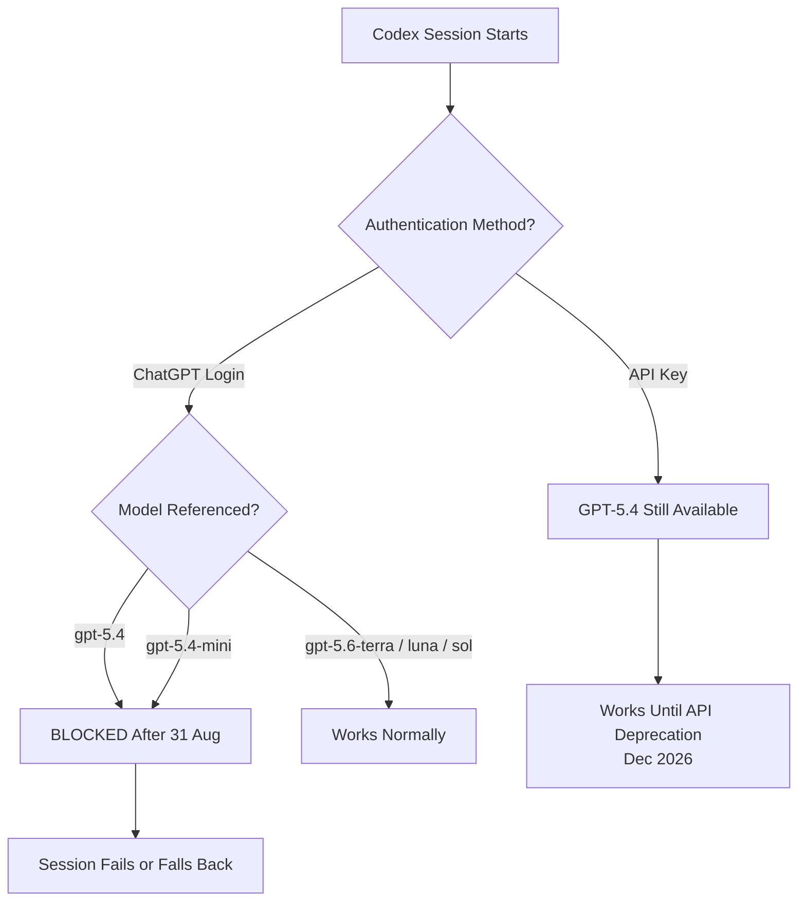
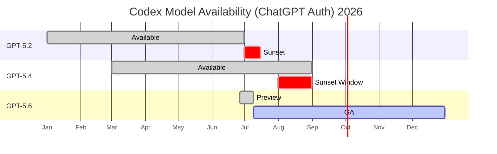

# GPT-5.4 Retires from Codex on 31 August: A Migration Checklist for Config, Agents, and Scheduled Tasks


---

On 31 July 2026, the Codex changelog announced that GPT-5.4 and GPT-5.4 mini will cease to be available in Codex for users signed in with ChatGPT on 31 August 2026 [^1]. That gives you twenty days. If your workflows still reference either model — in `config.toml`, custom agents, `codex exec` scripts, or scheduled tasks — they will break silently or require manual intervention after the cutoff.

This article explains exactly what is changing, maps the replacement models, and provides concrete configuration recipes to complete the migration before the deadline.

## What Is Changing — and What Is Not

The retirement affects a specific authentication path. If you sign into Codex with your ChatGPT account (the default for desktop app, CLI, and IDE extension users on consumer and Plus plans), GPT-5.4 and GPT-5.4 mini will no longer be selectable or executable after 31 August [^1].

If you authenticate with an OpenAI API key, both models remain available on the API and in Codex sessions authenticated that way [^1]. Enterprise customers who have provisioned API keys for their teams are unaffected in the short term, though the broader API deprecation timeline means GPT-5.4 will eventually sunset there too [^2].



## The Replacement Map

The GPT-5.6 family shipped to general availability on 9 July 2026 with three tiers: Sol, Terra, and Luna [^3]. The mapping from GPT-5.4 is straightforward:

| Retiring Model | Replacement | Input / Output per 1M Tokens | Change |
|---|---|---|---|
| `gpt-5.4` | `gpt-5.6-terra` | \$2.00 / \$12.00 | 20% cheaper, stronger [^4] |
| `gpt-5.4-mini` | `gpt-5.6-luna` | \$0.20 / \$1.20 | 73–80% cheaper, stronger [^4] |

These are not renamed models. GPT-5.6 Terra and Luna are distinct model generations that score higher than their GPT-5.4 predecessors on every major coding benchmark [^3]. Luna alone beats Claude Opus 4.8 on both the Artificial Analysis Coding Agent Index (74.6 vs 72.5) and DeepSWE (67.2% vs 59.0%) [^4]. The migration is not a compromise — it is a strict upgrade.

## Where Model References Hide

Before editing configuration files, audit everywhere a model slug can appear. The following checklist covers the common locations:

### 1. User-Level Configuration

```toml
# ~/.codex/config.toml
model = "gpt-5.4"  # ← Change to "gpt-5.6-terra"
```

This is the global default. Every Codex session that does not specify a model inherits it [^5].

### 2. Project-Level Configuration

```toml
# .codex/config.toml (in repository root)
model = "gpt-5.4-mini"  # ← Change to "gpt-5.6-luna"
```

Project configs override user defaults. Check every repository you work in regularly [^5].

### 3. Named Profiles

Named profiles live in `~/.codex/agents/` or as separate `*.config.toml` files. Any profile that pins a model needs updating:

```toml
# ~/.codex/review.config.toml
model = "gpt-5.4"          # ← "gpt-5.6-terra"
review_model = "gpt-5.4"   # ← "gpt-5.6-terra"
```

### 4. Custom Agents

Custom agent definitions can specify a model. If you have built agents that hardcode `gpt-5.4` or `gpt-5.4-mini`, update them:

```toml
# ~/.codex/agents/my-reviewer/agent.toml
model = "gpt-5.4-mini"  # ← "gpt-5.6-luna"
```

### 5. Scheduled Tasks (Automations)

Scheduled tasks defined in the Codex desktop app or via `codex exec` inherit the model from your configuration at execution time. If your global config still references GPT-5.4 when a scheduled task fires after 31 August, the task will fail [^1].

```bash
# CI/CD or cron scripts using codex exec
codex exec --model gpt-5.4 --sandbox workspace-write "Run tests"
# ↓ Change to:
codex exec --model gpt-5.6-terra --sandbox workspace-write "Run tests"
```

### 6. CI/CD Pipelines and Scripts

Search your repositories for hardcoded model strings:

```bash
grep -rn "gpt-5.4" ~/.codex/ .codex/ .github/ scripts/ Makefile
```

### 7. Environment Variables

If you set `CODEX_MODEL` or pass `--model` via environment configuration in containers or CI runners, update those too.

## Configuration Recipes

### Minimal Migration — Single User

Replace the model in your user config and verify:

```toml
# ~/.codex/config.toml
model = "gpt-5.6-terra"
```

Then confirm in the CLI:

```bash
codex --version  # Ensure v0.146.1+ for full GPT-5.6 support
codex             # Start a session, check the model indicator in the TUI
```

### Tiered Model Strategy

The GPT-5.6 family is designed for tiered routing. A practical configuration uses Luna as the workhorse, Terra for complex tasks, and Sol for the hardest problems [^3]:

```toml
# ~/.codex/config.toml
model = "gpt-5.6-luna"           # Default: fast, cheap
```

```toml
# ~/.codex/review.config.toml
model = "gpt-5.6-terra"          # Code review: balanced
```

```toml
# ~/.codex/architect.config.toml
model = "gpt-5.6-sol"            # Architecture: flagship
model_reasoning_effort = "high"
```

Switch at runtime with the `/model` slash command or `codex --model gpt-5.6-sol` when launching a session.

### Enterprise Team Migration

For teams managing shared configurations, update the project-level `.codex/config.toml` in every repository and push the change. This ensures that any team member who has not updated their personal config still gets a working model:

```toml
# .codex/config.toml (committed to repository)
model = "gpt-5.6-terra"
```

## Known Gotchas

### Reasoning Effort Does Not Propagate to Automations

A known issue (tracked as openai/codex#13536) means that `model_reasoning_effort` set in your global `config.toml` does not propagate to scheduled task sessions — they run at medium effort regardless [^6]. This is unchanged by the model migration, but worth noting: if you relied on GPT-5.4's default reasoning behaviour in automations, test that the replacement model at medium effort still meets your quality bar.

### The `--full-auto` Flag Is Gone

As of v0.147.0, `codex exec --full-auto` has been removed entirely [^1]. If your migration scripts or CI pipelines still use it, replace with `--sandbox workspace-write` and an appropriate approval flag:

```bash
# Old (broken):
codex exec --full-auto "Deploy staging"

# New:
codex exec --sandbox workspace-write -a auto-review "Deploy staging"
```

### Cache Invalidation

GPT-5.6 models use a different cache namespace than GPT-5.4. Prompt caching benefits you have accumulated under GPT-5.4 will not carry over. First sessions after migration may be slightly slower and more expensive as the cache warms [^3].

## Verifying the Migration

After updating all configurations, run a quick verification:

```bash
# 1. Check your effective config
codex config show

# 2. Confirm no GPT-5.4 references remain
grep -rn "gpt-5.4" ~/.codex/

# 3. Run a simple test task
codex exec --model gpt-5.6-terra --sandbox workspace-write \
  "List the files in this directory and explain what each does"

# 4. Test scheduled tasks manually
codex exec --model gpt-5.6-luna --sandbox workspace-write \
  "echo Migration test successful"
```

## Timeline and Context

This is the third model sunset cycle for Codex CLI users in 2026. The June–July cycle retired GPT-5.2 and GPT-5.3-Codex [^2]. The pattern is accelerating: each generation now has a roughly four-to-five month window before the consumer-auth sunset begins. Teams should build model migration into their regular maintenance cadence rather than treating each sunset as an emergency.



## What to Do Today

1. **Run the grep.** Find every `gpt-5.4` reference in your `~/.codex/`, project `.codex/` directories, CI configs, and scripts.
2. **Replace the slugs.** `gpt-5.4` → `gpt-5.6-terra`, `gpt-5.4-mini` → `gpt-5.6-luna`.
3. **Test your automations.** Run every scheduled task and `codex exec` script manually once to confirm they work with the new model.
4. **Commit project configs.** Push updated `.codex/config.toml` to shared repositories so teammates inherit the fix.
5. **Consider tiered routing.** If you have been using GPT-5.4 for everything, now is a good time to adopt Luna as your default and Terra/Sol for complex work — Luna at \$0.20/\$1.20 per million tokens is dramatically cheaper than GPT-5.4 was [^4].

The migration is mechanical and the replacement models are strictly better. The only risk is missing a reference and having a workflow fail silently on 1 September. Spend thirty minutes now; save yourself a debugging session later.

## Citations

[^1]: OpenAI, "ChatGPT & Codex Changelog — 31 July 2026," [https://learn.chatgpt.com/docs/changelog](https://learn.chatgpt.com/docs/changelog)

[^2]: OpenAI, "Deprecations — OpenAI API," [https://developers.openai.com/api/docs/deprecations](https://developers.openai.com/api/docs/deprecations)

[^3]: OpenAI, "GPT-5.6: Frontier intelligence that scales with your ambition," [https://openai.com/index/gpt-5-6/](https://openai.com/index/gpt-5-6/)

[^4]: Artificial Analysis, "GPT-5.6 has landed," [https://artificialanalysis.ai/articles/gpt-5-6-has-landed](https://artificialanalysis.ai/articles/gpt-5-6-has-landed)

[^5]: Codex CLI Documentation, "Models," [https://learn.chatgpt.com/docs/models](https://learn.chatgpt.com/docs/models)

[^6]: OpenAI Codex GitHub Issue #13536, "Reasoning effort does not propagate to automation sessions," [https://github.com/openai/codex/issues/13536](https://github.com/openai/codex/issues/13536)
