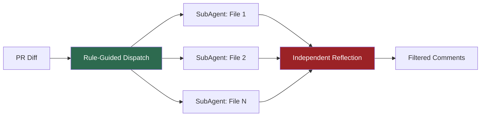
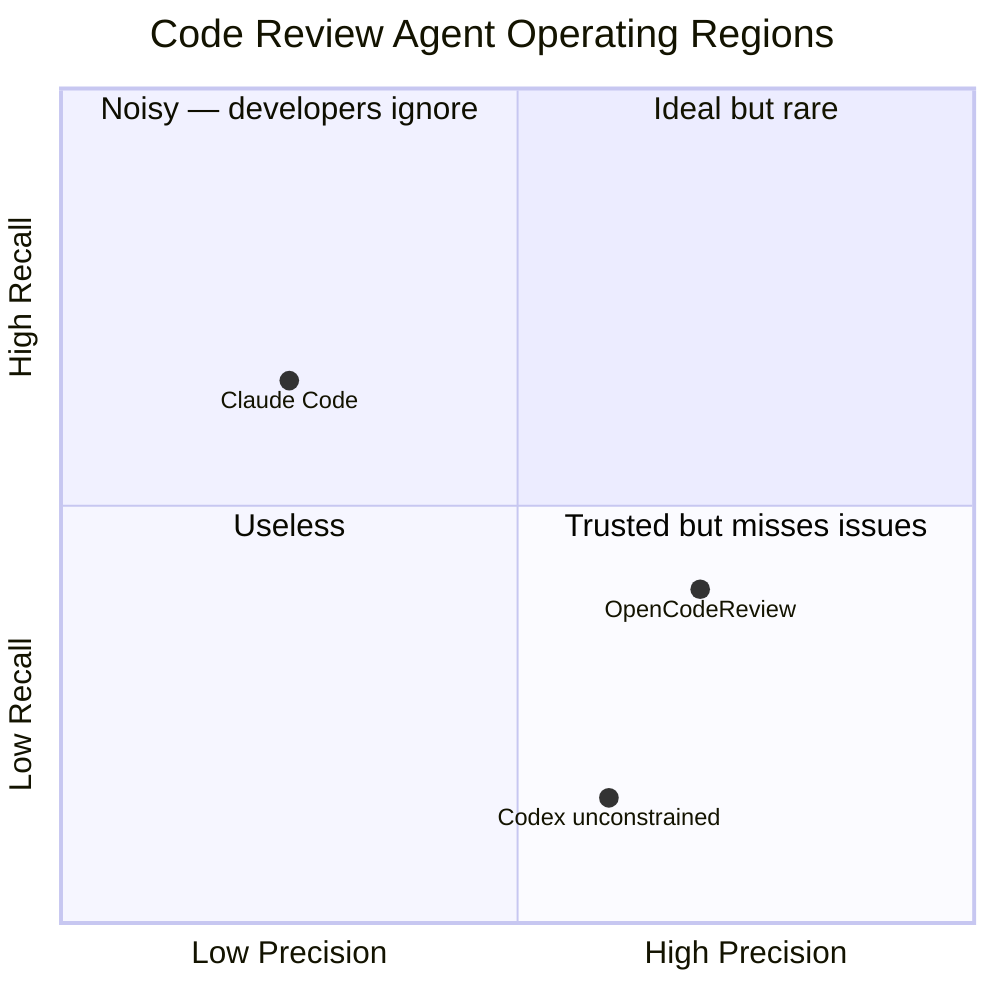

# OpenCodeReview and the Determinism Dividend: Why Rule-Guided Dispatch Plus Independent Reflection Beats Unconstrained Agent Review — and How to Wire It into Codex CLI


---

## The Code Review Agent Precision Crisis

Every team that has deployed an LLM-powered code reviewer has hit the same wall: the agent flags everything, developers learn to ignore it, and within weeks the review channel becomes noise. Industry measurements put the signal-to-noise ratio of unconstrained agent review below 30 per cent[^1]. The problem is not the model — it is the harness.

OpenCodeReview, published by Alibaba on 10 August 2026 (arXiv:2608.09290), offers a compelling structural answer: inject determinism at every stage where non-determinism adds no value, and reserve LLM reasoning only for the semantic judgement that static analysis cannot reach[^2]. The result is 2.17× higher SEM-F1 than Claude Code on the same underlying model, while consuming 5–15× fewer tokens[^2].

This article unpacks the three-stage deterministic architecture, examines the AACR-Bench evaluation that backs the claims, and maps each mechanism to Codex CLI's existing configuration surfaces.

---

## Three Stages of Determinism Injection

OpenCodeReview's core insight is that unconstrained agent review wastes most of its token budget on decisions that do not require intelligence: which files to review, which tools to invoke, and whether a generated comment actually survives contact with the diff. The framework decomposes review into three stages, each with a distinct determinism strategy[^2].



### Stage 1: Rule-Guided Dispatch

Rather than letting the LLM decide which files to examine and what to look for, dispatch is governed by a four-tier priority chain[^2]:

1. **Ad-hoc rules** — per-invocation overrides (e.g. "focus on security in this PR")
2. **Project-level rules** — stored in the repository (`.codereview/rules/`)
3. **User-global rules** — in the reviewer's home directory
4. **Built-in system rules** — language-specific defaults

Each changed file is deterministically mapped to the most specific applicable rule via glob-based path patterns. Rules are natural-language documents with structured checklists covering correctness, security, performance, maintainability, and test coverage[^2]. This eliminates the exploratory overhead that dominates unconstrained agents — no more burning tokens to figure out what to look at.

### Stage 2: Grounded File Review

Each file gets its own SubAgent running a bounded ReAct loop. The critical constraint: instead of unrestricted shell access, the agent gets exactly six tools[^2]:

| Tool | Bound |
|------|-------|
| `file_read` | Max 500 lines |
| `file_find` | Max 100 results |
| `code_search` | Max 100 matches, 10s timeout |
| `file_read_diff` | Current file diff |
| `code_comment` | Emit a review finding |
| `task_done` | Signal completion |

Each tool has hard output limits. The iteration cap defaults to 30, with context compression triggered at 60% and 80% utilisation thresholds[^2]. This prevents the token snowball effect — where an unconstrained agent reads an entire repository into its context window before producing a single comment.

File-level parallelism means each SubAgent operates independently with its own context window, avoiding the monolithic context accumulation that plagues single-agent reviewers.

### Stage 3: Independent Reflection

The final stage is the most counterintuitive: a separate reflector examines every generated comment against the diff alone — without access to the agent's tool-augmented exploration[^2]. This asymmetric information boundary is the key design choice.

The reflector applies falsification-first logic: it removes comments directly contradicted by diff evidence, but never generates new findings[^2]. It is a high-precision, conservative filter that catches the hallucinated comments that tank developer trust.

---

## AACR-Bench: A Proper Evaluation

The paper evaluates against AACR-Bench, a benchmark comprising 200 real-world pull requests from 50 open-source repositories across 10 programming languages, with 1,505 expert-verified comments validated through three rounds of cross-validation by over 80 senior engineers[^2][^3].

The primary metric is SEM-F1: the harmonic mean of semantic precision (fraction of generated comments matching ground truth) and semantic recall (fraction of ground-truth issues found). Matching uses LLM-based semantic judgement rather than exact string comparison[^2].

### Results Across Six LLM Backends

| Model | OpenCodeReview SEM-F1 | Claude Code SEM-F1 | Codex SEM-F1 | Token Ratio |
|-------|----------------------|--------------------|--------------|--------------------|
| Claude 4.6 Opus | **25.10%** | 11.57% | — | 15× fewer |
| GPT-5.5 | **21.00%** | — | 8.36% | ~1× |
| Qwen3.7-Max | **21.20%** | 12.17% | — | 8× fewer |
| Claude 4.8 Opus | **17.90%** | 14.13% | — | — |
| DeepSeek-V4-Pro | **17.90%** | 10.93% | — | — |
| GLM-5.1 | **20.40%** | 11.93% | — | — |

OpenCodeReview achieves the highest SEM-F1 across all six backends[^2]. The precision–recall trade-off is revealing: OpenCodeReview clusters in the high-precision, moderate-recall region (25–38% precision, 12–20% recall), while Claude Code splits between high-recall-low-precision and moderate-precision-low-recall regimes[^2].

The token efficiency story is equally stark. Claude 4.6 Opus under OpenCodeReview consumes 385K tokens per benchmark run versus 5,664K for Claude Code — a 15× reduction[^2]. The savings come from three sources: rule-guided dispatch eliminates exploratory overhead, bounded tools prevent context saturation, and file-level parallelism avoids monolithic accumulation.

---

## Mapping to Codex CLI

Codex CLI already has the configuration surfaces to implement each of OpenCodeReview's three stages. The mapping is not hypothetical — every mechanism below uses documented, shipping features.

### Rule-Guided Dispatch via AGENTS.md

Codex CLI's layered `AGENTS.md` discovery provides a direct analogue to OpenCodeReview's four-tier rule chain[^4]:

```bash
repo-root/
├── AGENTS.md                    # Project-level rules (tier 2)
├── src/
│   └── auth/
│       └── AGENTS.md            # Directory-specific rules
├── .codex/
│   └── config.toml              # User-global settings (tier 3)
└── requirements.toml            # Fleet-wide enforcement (tier 4)
```

To encode review-specific dispatch rules:

```markdown
<!-- AGENTS.md -->
## Code Review Policy

When reviewing files matching `src/auth/**`:
- Focus on: authentication bypass, session fixation, credential exposure
- Severity threshold: flag all issues, not just critical

When reviewing files matching `**/*.test.*`:
- Focus on: assertion completeness, mock fidelity, edge case coverage
- Skip: formatting, naming conventions

When reviewing files matching `src/api/**`:
- Focus on: input validation, error handling, rate limiting
- Require: at least one security-relevant finding per changed endpoint
```

### Bounded Tool Access via Hooks

Codex CLI's `PreToolUse` hooks can enforce tool boundaries equivalent to OpenCodeReview's curated six-tool set[^4]:

```bash
#!/bin/bash
# .codex/hooks/pre-tool-use-review-bounds.sh
# Enforce bounded tool access during review sessions

TOOL_NAME="$1"
FILE_PATH="$2"

# Block unrestricted shell access during review
if [[ "$TOOL_NAME" == "shell" ]]; then
  COMMAND="$3"
  # Allow only bounded read operations
  if echo "$COMMAND" | grep -qE '(rm |mv |cp |chmod |chown|curl |wget )'; then
    echo "DENY: Destructive or network commands blocked during review"
    exit 1
  fi
fi

# Enforce file read limits (analogous to 500-line bound)
if [[ "$TOOL_NAME" == "read_file" ]]; then
  LINE_COUNT=$(wc -l < "$FILE_PATH" 2>/dev/null || echo 0)
  if [[ "$LINE_COUNT" -gt 500 ]]; then
    echo "WARN: File exceeds 500 lines; reading first 500 only"
    # exit 2 steers the agent to use a bounded read
    exit 2
  fi
fi
```

### Independent Reflection via Guardian Auto-Review

Codex CLI's Guardian auto-review subagent, available since v0.146.1, provides the structural equivalent of OpenCodeReview's independent reflector[^5]. The Guardian reviews tool outputs without access to the main agent's reasoning chain, applying its own judgement to filter hallucinated or contradicted findings.

Configure it via `config.toml`:

```toml
[auto_review]
enabled = true
model = "gpt-5.6-luna"           # Cheaper model for filtering
review_scope = "tool_outputs"     # Review generated comments only
falsification_first = true        # Remove contradicted findings

[approval_policy]
mode = "granular"
```

### Token Efficiency via Context Controls

OpenCodeReview's 5–15× token reduction maps to several Codex CLI controls[^4]:

```toml
# config.toml — review-optimised profile
[profiles.review]
model = "gpt-5.6-terra"
model_auto_compact_token_limit = 60000   # Compress at 60% utilisation
tool_output_token_limit = 8000            # Bounded tool outputs
```

The `tool_output_token_limit` directly enforces the bounded-output principle. The `model_auto_compact_token_limit` provides the context compression threshold that OpenCodeReview triggers at 60% and 80% utilisation[^2].

---

## The Precision–Recall Trade-Off for Practitioners



The practical implication is clear: for code review, precision matters more than recall[^1]. A reviewer that flags 10 genuine issues out of 15 comments is trusted; one that buries 20 genuine issues in 200 comments is ignored. OpenCodeReview's architecture systematically trades recall for precision through its bounded tools (preventing over-exploration) and independent reflection (filtering hallucinations).

For Codex CLI users, this means:

1. **Write explicit review rules in AGENTS.md** — every file glob with a specific checklist removes one source of non-determinism
2. **Bound your tool outputs** — set `tool_output_token_limit` aggressively during review workflows
3. **Enable Guardian auto-review** — the independent reflector pattern is the single highest-impact change
4. **Use file-level parallelism** — spawn subagents per file rather than reviewing monolithically

---

## What OpenCodeReview Gets Wrong

The paper has two notable gaps worth flagging:

**⚠️ Recall ceiling.** The best configuration achieves 20% recall — meaning 80% of expert-identified issues go unfound. The deterministic dispatch that drives precision also limits discovery of cross-file and architectural issues that require broader exploration. For teams where catching every security vulnerability matters more than reducing noise, the unconstrained approach may still be necessary as a complement.

**⚠️ AACR-Bench scope.** The benchmark covers 200 PRs across 10 languages, which is respectable but modest. The 80-engineer validation is strong, but the semantic matching via LLM judge (Qwen3-235B) introduces its own evaluation variance. Independent replication on a different benchmark would strengthen the claims[^3].

---

## Conclusion

OpenCodeReview's contribution is not a better model but a better harness. By injecting determinism at file dispatch, bounding tool access, and filtering through an independent reflector, it achieves 2.17× the review quality at a fraction of the token cost[^2]. The architecture translates directly to Codex CLI through AGENTS.md rule layering, PreToolUse hooks for tool bounding, Guardian auto-review for independent reflection, and context controls for token efficiency.

The broader lesson extends beyond code review: the highest-impact improvement to any agent workflow is often not a better model but a more deterministic harness that reserves LLM reasoning for the decisions that genuinely require it.

---

## Citations

[^1]: Augment Code, "Deep Code Review: Why Recall Beats Precision for Agents," 2026. [https://www.augmentcode.com/guides/deep-code-review-recall-vs-precision](https://www.augmentcode.com/guides/deep-code-review-recall-vs-precision)

[^2]: Z. Li, L. Zhang, X. Wu, Z. Zhuang, Y. Xu, B. Wang, S. Zhu, C. Wang, and G. Rong, "OpenCodeReview: Determinism over Non-Determinism for Cost-Effective Agent-Based Code Review," arXiv:2608.09290, August 2026. [https://arxiv.org/abs/2608.09290](https://arxiv.org/abs/2608.09290)

[^3]: Alibaba, "AACR-Bench: An Alibaba open-source multi-language benchmark for evaluating LLMs in repository-level automatic code review," GitHub, 2026. [https://github.com/alibaba/aacr-bench](https://github.com/alibaba/aacr-bench)

[^4]: OpenAI, "Codex CLI Documentation — Configuration Reference," 2026. [https://github.com/openai/codex](https://github.com/openai/codex)

[^5]: OpenAI, "Codex CLI v0.146.1 Release Notes," August 2026. [https://github.com/openai/codex/releases/tag/rust-v0.146.1](https://github.com/openai/codex/releases/tag/rust-v0.146.1)
