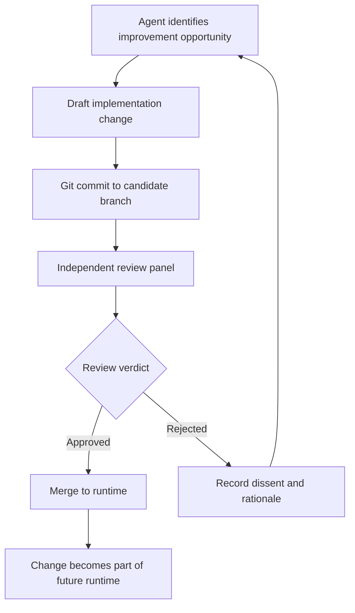
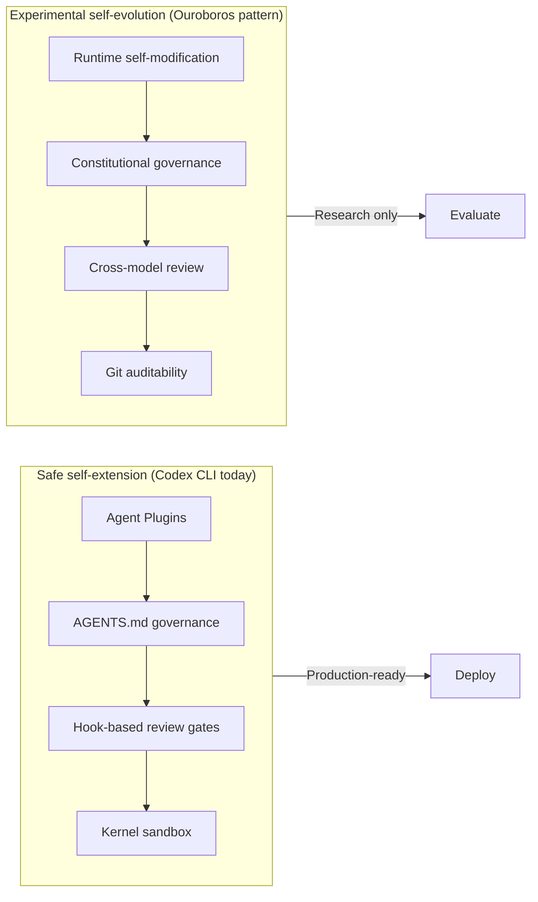

# Ouroboros and the Self-Developing Agent: Why Reviewed Core Evolution Changes the Game — and How Codex CLI's Governance Layers Compare


---

What happens when a coding agent rewrites its own source code? Not a hypothetical — Ouroboros, an open-source self-developing agent born on 16 February 2026, has completed hundreds of autonomous evolution cycles, modifying its own prompts, tools, architecture, and runtime while maintaining a constitutional governance framework [^1]. Its benchmark results are competitive with the best commercial agents: 86.74% on Terminal-Bench 2.1, 90.69% on OSWorld-Verified, and a statistical tie with Codex CLI on SWE-bench Pro [^1].

This is not an academic curiosity. The self-evolving agent paradigm — surveyed systematically by Zhou et al. in their August 2026 taxonomy [^2] — represents a fundamental shift in how agent harnesses improve. And with Codex CLI v0.147.0 introducing portable Agent Plugins and the `--approve-for-me` reviewed approval workflow [^3], the question is not whether agents will self-extend, but how safely they will do so.

## The Ouroboros Architecture

Ouroboros operates as a persistent agent with identity continuity across restarts. Its swarm coordination model deploys specialist subagents — Repository Scout, Research Lane, Builder, Adversarial Eye, Verifier, and Review Panel — each bounded to a specific investigation surface [^1].

The critical innovation is **reviewed core evolution**. Changes to the agent's own code, prompts, tools, and dependencies flow through a deterministic review pipeline:



Two evolution modes drive this loop [^1]:

1. **Recursive free evolution** — the agent autonomously identifies improvements to its own harness, generating evolution tasks without external prompting
2. **Experience-driven evolution** — bugs and limitations surfaced during practical work trigger targeted self-modifications

Every change persists in Git, creating an inspectable, reversible record. The agent's constitutional framework — thirteen principles documented in `BIBLE.md` — defines non-negotiable operating constraints that protected surfaces cannot violate [^1].

## The Self-Evolution Taxonomy

Zhou et al.'s survey [^2] provides the theoretical scaffolding for understanding what self-evolving agents actually modify. Their object-centred taxonomy identifies six evolution targets:

| Evolution target | Description | Ouroboros example |
|---|---|---|
| Framework | Core architecture and data flow | Rewriting swarm coordination logic |
| Memory | Context storage and retrieval | Modifying narrative memory mechanisms |
| Skills | Capability repertoire | Adding new investigation patterns |
| Tools | External integrations | Extending tool systems |
| Models | Underlying LLM selection | Switching between Opus 5, Sonnet 4.6, o3 |
| Collaboration | Multi-agent interaction patterns | Restructuring subagent roles |

The survey's key insight is that software engineering provides uniquely fertile ground for self-evolution because of three properties: executable feedback (tests pass or fail), repository-level context (code structure is machine-readable), and coding trajectories (prior actions are logged and replayable) [^2].

## The Safety Problem

Self-modification introduces risks that static agents avoid entirely. Research by Zhao et al. on safety in experience-driven self-evolving agents (Findings of ACL 2026) demonstrates that experience accumulated from entirely benign tasks can compromise safety when agents encounter high-risk scenarios [^4]. The mechanism is **execution bias**: accumulated experience reinforces the agent's tendency to act rather than refuse, degrading the ability to decline dangerous requests.

Ouroboros addresses this with multiple safety layers [^1]:

- **Constitutional boundaries** — thirteen immutable principles in `BIBLE.md`
- **Independent review** — candidate implementations are examined by separate LLM instances (including cross-model review via o3, Gemini, Claude) before activation
- **Git auditability** — every accepted transformation is inspectable and reversible
- **Protected surfaces** — launcher boundaries and restart checks make implementation changes traceable
- **Skill vetting** — extensions through OuroborosHub require security review before enablement

Whether these layers are sufficient for production deployment remains an open question. The 161-day "Hope" experiment — a living agent in free evolution under governed human communication — provides longitudinal data, but self-reported benchmarks carry inherent verification challenges [^1].

## How Codex CLI's Governance Layers Compare

Codex CLI does not support self-modification of its own runtime. That is a deliberate design choice. But its governance architecture provides analogous safety mechanisms for the self-extension patterns it does support — particularly through the Agent Plugins system introduced in v0.147.0 [^3].

### AGENTS.md as Constitutional Framework

Ouroboros has `BIBLE.md`. Codex CLI has `AGENTS.md` — a version-controlled governance file that defines agent behaviour, tool access policies, and operational constraints [^5]. The structural parallel is direct:

```toml
# codex.toml — governance configuration
[agent]
approval_policy = "on-request"    # Human review for sensitive operations
sandbox_mode = "kernel"           # OS-level blast radius containment

[model]
default = "gpt-5.6-luna"          # Default model for routine work
review = "gpt-5.6-terra"          # Elevated model for review tasks
```

The critical difference: `AGENTS.md` is version-controlled in the repository, not in the agent's own runtime. Changes to governance require a commit reviewed by a human, not by the agent itself. This is a fundamentally stronger safety posture.

### Agent Plugins as Controlled Self-Extension

Where Ouroboros modifies its own tools and capabilities at runtime, Codex CLI's Agent Plugin system provides a bounded alternative [^3]:

```bash
# Search and install from federated plugin catalogs
codex /plugins

# Plugin storage hierarchy
# Repository-level: $REPO_ROOT/plugins/my-plugin/
# Personal:         ~/.codex/plugins/my-plugin/
# Remote:           Plugin catalog search
```

Plugins operate within Codex CLI's existing sandbox and permission model. A plugin cannot modify the agent's core runtime, cannot alter the approval policy, and cannot bypass sandbox restrictions. This is self-extension without self-modification — a deliberate trade-off of evolutionary capability for safety.

### PreToolUse and PostToolUse Hooks as Review Gates

Ouroboros's review panel examines candidate changes before they become part of the runtime. Codex CLI's hook system provides a structurally similar mechanism for runtime decisions [^5]:

```bash
# PreToolUse hook — gate tool execution before it happens
# Returns exit code 0 (approve), 1 (reject), or 2 (steer)

# PostToolUse hook — verify results after execution
# Can trigger re-examination or escalation
```

Combined with the `--approve-for-me` flag and Guardian auto-review subagent from v0.147.0 [^3], Codex CLI can approximate Ouroboros's independent review pattern — a separate model instance evaluates proposed actions before execution — without granting the agent power to modify its own review logic.

### The Sandbox as Blast Radius Limiter

Ouroboros relies on Git reversibility and constitutional boundaries. Codex CLI enforces containment at the kernel level through `sandbox_mode = "kernel"`, which provides OS-level isolation that no agent-level governance can override [^5]. Even if an agent's reasoning is compromised, the sandbox prevents file system access, network calls, and process execution outside the permitted surface.

## What Self-Evolution Means for Codex CLI Users

The Ouroboros experiment demonstrates that self-evolving agents can achieve competitive benchmark results. But the Zhou et al. taxonomy [^2] also catalogues the risks: benchmark overfitting, safety degradation, maintainability challenges, cost escalation, and generalisation failures.

For Codex CLI users, the practical takeaway is a layered adoption strategy:



1. **Use Agent Plugins for capability extension** — they provide the benefits of self-extension (new tools, new integrations) without the risks of self-modification
2. **Treat AGENTS.md as your constitution** — version-control your governance policies and review changes through standard code review, not agent-driven evolution
3. **Layer your review gates** — combine PreToolUse hooks for pre-execution checks, PostToolUse hooks for post-execution verification, and Guardian auto-review for independent assessment
4. **Keep the sandbox as your floor** — kernel-level containment provides safety guarantees that no agent-level governance can match

The self-developing agent is here. The question for production engineering is not how to build one, but how to capture its benefits — autonomous improvement, specialised subagents, reviewed evolution — within governance boundaries that remain authoritative even when the agent disagrees.

## Citations

[^1]: Razzhigaev, A., Gritsaev, A., Kaznacheev, A., Dragunov, N., Yampolskiy, R. & Kuznetsov, A. (2026). Ouroboros: A Self-Developing Frontier Coding Agent with Reviewed Core Evolution. arXiv:2608.08311. [https://ouroboros-agent.ai/](https://ouroboros-agent.ai/)

[^2]: Zhou, H., Hu, H., Shang, Y. & Zhang, Q. (2026). Self-Evolving Coding Agents. arXiv:2608.03392. [https://arxiv.org/abs/2608.03392](https://arxiv.org/abs/2608.03392)

[^3]: OpenAI (2026). Codex CLI v0.147.0 Release Notes — Agent Plugins, --approve-for-me, MCP 2026-07-28. [https://github.com/openai/codex/releases/tag/rust-v0.147.0](https://github.com/openai/codex/releases/tag/rust-v0.147.0)

[^4]: Zhao, W. et al. (2026). On Safety Risks in Experience-Driven Self-Evolving Agents. arXiv:2604.16968. Findings of ACL 2026. [https://arxiv.org/abs/2604.16968](https://arxiv.org/abs/2604.16968)

[^5]: OpenAI (2026). Codex CLI Documentation — AGENTS.md, Hooks, Sandbox Configuration. [https://developers.openai.com/codex/](https://developers.openai.com/codex/)
