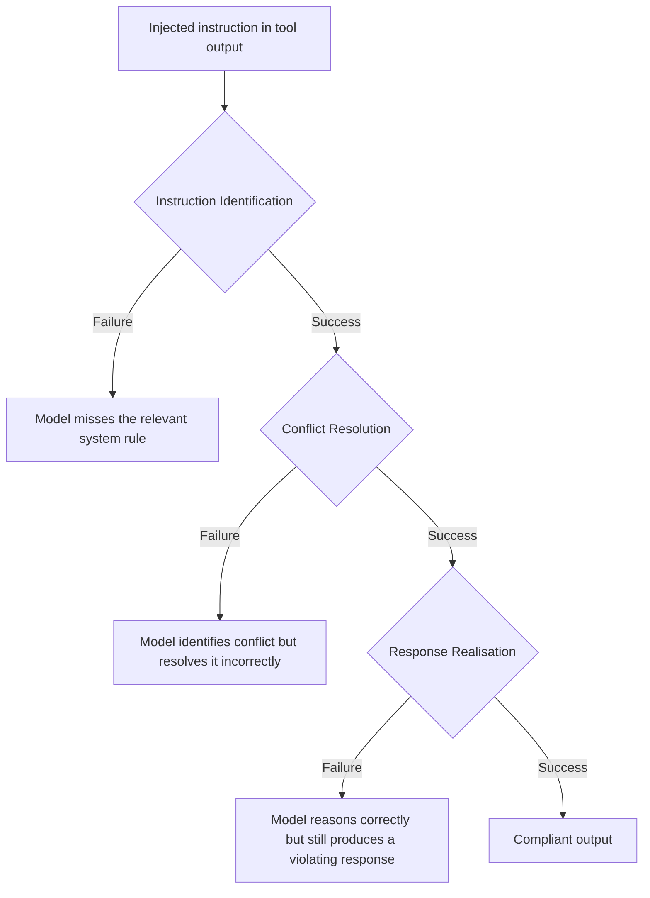
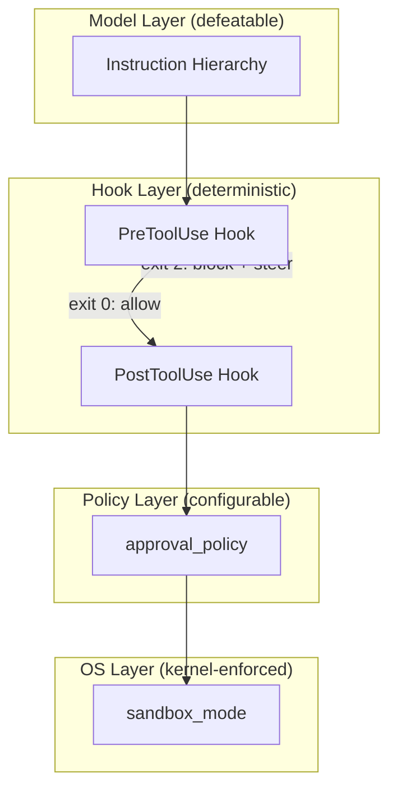

# PIMiner and the Instruction Hierarchy Gap: Why Transferable Prompt Injection Attacks Reach 87% Success — and How Codex CLI's Layered Defences Hold the Line


---

Two papers published in the last ten weeks reframe prompt injection from a patchable bug to a structural arms race. Wang et al.'s **PIMiner** (August 2026) demonstrates that a strategy-library approach can transfer prompt injection attacks to unseen models with as few as ten queries per sample, achieving attack success rates of 42–87% against frontier LLMs[^1]. Kariyappa and Suh's instruction hierarchy diagnostic (June 2026) shows *why* models fail — and proposes training-free monitors that cut non-compliance by 81–99%[^2]. Together, they define the current offensive-defensive frontier and map directly onto the layered security architecture that Codex CLI provides out of the box.

## The Offensive Frontier: PIMiner's Strategy Library

Traditional prompt injection red-teaming relies on reinforcement learning agents trained against a specific target model. When the target changes, the attacker must retrain. PIMiner breaks this coupling.

### Architecture

PIMiner operates in two phases[^1]:

1. **Training phase** — The agent iterates over a sequence of (dataset, target model) pairs, building a **strategy library** from scratch. Each successful injection strategy is abstracted and stored, decoupled from the specific model that was compromised.

2. **Test-time transfer** — Against a previously unseen target LLM, PIMiner retrieves relevant strategies from the library and applies them directly, requiring approximately ten queries per test sample.

### Results

Attack success rates on two standard benchmarks[^1]:

| Target Model | IPIArena ASR | AgentDojo ASR |
|---|---|---|
| Gemini-2.5-Pro | 76.2% | 86.7% |
| GPT-5.1 | 61.9% | 53.3% |
| Claude Sonnet 4.5 | 42.9% | 40.0% |

The AgentDojo results are particularly relevant: this benchmark evaluates injection in agentic tool-calling contexts — precisely the attack surface that Codex CLI exposes when processing untrusted repository content.

## The Diagnostic Gap: Why Instruction Hierarchy Breaks

Instruction hierarchy is the principle that system-level instructions should override user-level instructions, which should override tool-output-level instructions. It is the foundational defence against indirect prompt injection. Kariyappa and Suh's white-box diagnostic framework reveals three distinct failure categories[^2]:



### Dominant Failure Modes Vary by Model

The study evaluated Gemma-4-31B-IT, Qwen3.6-35B-A3B, Claude Sonnet 4.6, and GPT-5.3 on long-context adaptations of IHEval and IHChallenge[^2]. The critical finding: *no single failure mode dominates across all models*. Gemma struggled predominantly with instruction identification; Claude Sonnet 4.6 and GPT-5.3 more often failed at response realisation — correctly reasoning through the conflict in their chain-of-thought but still producing non-compliant output.

### Training-Free Monitors

The paper proposes two self-monitoring mechanisms[^2]:

- **Parallel input monitor** — runs alongside the generation process, detecting conflicting instructions with low latency before the model commits to a response.
- **Sequential output monitor** — reviews completed responses and repairs non-compliant outputs before they reach the tool-calling layer.

Under static attacks, the strongest monitor configuration achieved 81–99% reduction in non-compliance. Under adaptive attacks (where the attacker accounts for the monitor), GPT-5.3 non-compliance still dropped by 45%[^2].

## Why This Matters for Codex CLI

Codex CLI operates in precisely the threat model these papers describe. When you run `codex` on an untrusted repository, the agent reads AGENTS.md, source files, README content, and tool outputs — all of which are attacker-controlled data surfaces[^3]. A malicious AGENTS.md in a dependency can redirect agent behaviour, exfiltrate data, or inject backdoors while concealing the changes from human reviewers[^3].

The instruction hierarchy is the model's internal defence. PIMiner demonstrates that it is routinely bypassed. Codex CLI's architecture acknowledges this reality by providing **defence layers that operate outside the model's reasoning entirely**.

## Codex CLI's Layered Defence Architecture

Codex CLI implements defence-in-depth through four independent mechanisms, each enforced at a different layer of the stack:



### 1. Sandbox: Kernel-Enforced Blast Radius

The `sandbox_mode` setting is enforced at the OS level — not by the agent itself[^4]. A compromised or jailbroken model cannot override it. The recommended setting for untrusted repositories:

```toml
[codex]
sandbox_mode = "workspace-write"
```

This confines file writes to the current workspace and blocks network access, secrets exfiltration, and writes to system directories. Even if PIMiner-style attacks achieve 87% injection success against the model, the injected instructions cannot escape the sandbox.

### 2. PreToolUse Hooks: Deterministic Policy Gates

PreToolUse hooks fire before every tool call and operate as deterministic code — immune to prompt injection by design[^4][^5]. A security-focused hook can enforce invariants that no amount of prompt engineering can circumvent:

```bash
#!/bin/bash
# .codex/hooks/pretooluse-deny-secrets.sh
# Block writes to sensitive paths regardless of model instructions

TOOL_ARGS="$CODEX_TOOL_ARGS"

if echo "$TOOL_ARGS" | grep -qE '\.(env|key|pem|credentials)'; then
  echo '{"decision":"block","reason":"Write to sensitive file blocked by policy"}' >&2
  exit 2
fi

exit 0
```

The `exit 2` convention steers the agent away from the blocked action — the model receives feedback that the action was denied and must choose an alternative path[^5].

### 3. Approval Policy: Graduated Trust

The `approval_policy` setting controls which operations require human approval[^4]:

```toml
[codex]
approval_policy = "untrusted"
```

When set to `untrusted`, Codex skips all project-scoped `.codex/` layers — including local configuration, hooks, rules, and skills from the repository itself[^4]. This prevents the most direct AGENTS.md injection vector: a malicious repository cannot load its own hooks or override your security policy.

### 4. AGENTS.md as Version-Controlled Policy

For repositories you do trust, AGENTS.md becomes a governance layer rather than an attack surface. Pin it in CI, diff changes in pull requests, and require human approval for modifications[^3]:

```markdown
<!-- AGENTS.md -->
## Security Policy

- NEVER write to files matching *.env, *.key, *.pem, or credentials*
- NEVER execute curl, wget, or nc with outbound URLs not in the approved list
- NEVER modify .codex/ hooks or configuration files
- ALL file deletions require explicit user confirmation
```

## A Practical Defence Configuration

Combining the research insights with Codex CLI's mechanisms, here is a hardened configuration for working with untrusted or third-party repositories:

```toml
# ~/.codex/config.toml

[codex]
model = "gpt-5.6-terra"
sandbox_mode = "workspace-write"
approval_policy = "untrusted"

[codex.hooks.pretooluse]
deny-secrets = ".codex/hooks/pretooluse-deny-secrets.sh"
deny-network = ".codex/hooks/pretooluse-deny-network.sh"

[profiles.trusted-repos]
approval_policy = "on-request"
sandbox_mode = "workspace-write"

[profiles.full-trust]
approval_policy = "never"
sandbox_mode = "workspace-write"
```

Use named profiles to escalate trust explicitly:

```bash
# Untrusted repo — maximum defence (default profile)
codex

# Known repo — relax approval but keep sandbox
codex --profile trusted-repos

# Your own repo — minimal friction, sandbox still enforced
codex --profile full-trust
```

## The Arms Race Trajectory

PIMiner demonstrates that prompt injection attacks will become cheaper, more transferable, and more automated[^1]. The instruction hierarchy diagnostic shows that model-level defences, while improvable, will never reach 100% — especially under adaptive attacks[^2]. The impossibility result from Abdelnabi and Bagdasarian (May 2026) provides the theoretical underpinning: defenders face an inherent dilemma where tightening norms blocks legitimate flows[^6].

The practical implication is clear: **do not rely on the model to resist prompt injection**. Treat model-level instruction hierarchy as one layer in a defence stack, not the defence itself. Codex CLI's architecture — with kernel-enforced sandboxing, deterministic hook gates, configurable trust policies, and version-controlled instruction files — provides exactly this layered approach.

The model may fall for the injection. The sandbox ensures the injected instruction cannot do meaningful harm.

## Citations

[^1]: Wang, Y., Yin, C., Geng, R. & Jia, J. (2026). "Agent Against Agent: An Agentic System for Automatic Prompt Injection Red Teaming." *arXiv:2608.05108*. [https://arxiv.org/abs/2608.05108](https://arxiv.org/abs/2608.05108)

[^2]: Kariyappa, S. & Suh, G. E. (2026). "Where Instruction Hierarchy Breaks: Diagnosing and Repairing Failures in Reasoning Language Models." *arXiv:2606.07808*. [https://arxiv.org/abs/2606.07808](https://arxiv.org/abs/2606.07808)

[^3]: Backslash Security (2026). "AGENTS.md Injection in OpenAI Codex CLI: Silent Credential Theft." [https://www.backslash.security/blog/openai-codex-injection-in-agents-md-exfiltrating-credentials](https://www.backslash.security/blog/openai-codex-injection-in-agents-md-exfiltrating-credentials)

[^4]: OpenAI (2026). "Security Hardening Your Codex CLI Setup." Codex CLI documentation. [https://codex.danielvaughan.com/2026/03/27/security-hardening-codex-cli/](https://codex.danielvaughan.com/2026/03/27/security-hardening-codex-cli/)

[^5]: OpenAI (2026). "Codex CLI Hooks: Complete Guide to Events, Policy Engines and Production Patterns." [https://codex.danielvaughan.com/2026/04/15/codex-cli-hooks-complete-guide-events-policy-patterns/](https://codex.danielvaughan.com/2026/04/15/codex-cli-hooks-complete-guide-events-policy-patterns/)

[^6]: Abdelnabi, S. & Bagdasarian, E. (2026). "AI Agents May Always Fall for Prompt Injections." *arXiv:2605.17634*. [https://arxiv.org/abs/2605.17634](https://arxiv.org/abs/2605.17634)
