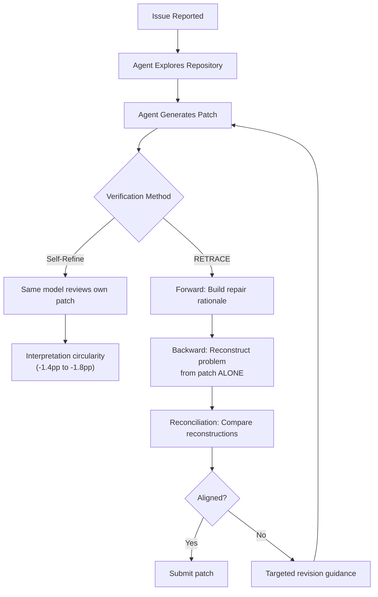

# RETRACE and Independent Patch Verification: Why Bidirectional Reconstruction Catches What Self-Refinement Misses — and How to Wire It into Codex CLI


---

Coding agents generate patches at impressive speed. They also generate patches that look plausible, pass a cursory self-review, and quietly miss the actual problem. The uncomfortable truth is that once a patch is produced, most agent frameworks offer no mechanism to independently verify whether it truly resolves the reported issue[^1]. Self-refinement — asking the same model to review its own work — suffers from interpretation circularity: the model re-reads the issue through the lens of the patch it just wrote, confirming its own assumptions rather than challenging them.

Li et al.'s RETRACE framework (arXiv:2608.08950, August 2026) attacks this gap with a deceptively simple insight: reconstruct the problem description from the patch alone, without showing the model the original issue, then compare the two[^1]. If the backward-reconstructed problem diverges from what was actually reported, the patch is addressing a phantom — and targeted revision guidance can fix it before the PR lands.

## The Verification Gap in Agent Workflows

Standard coding agent loops follow a predictable pattern: read issue, explore repository, generate patch, optionally self-review, submit. The self-review step, when it exists, typically asks the model to re-examine its patch against the original issue. This is the equivalent of asking a student to mark their own exam — useful for catching obvious errors, actively harmful for catching systematic misunderstandings.

The evidence bears this out. On SWE-bench Verified, Self-Refine (the standard "review your own patch" baseline) actually *degrades* performance: −1.4 percentage points with GPT-5-mini and −1.8pp with MiniMax M2.5[^1]. The model doubles down on its initial interpretation, polishing implementation details whilst the fundamental problem-patch alignment remains broken.



## How RETRACE Works: Three Stages

### Stage 1 — Forward Reconstruction

The forward stage builds an explicit repair rationale from the original issue and the agent's trajectory. It extracts three artefacts[^1]:

- **Evidence (E):** Repository evidence directly supporting the repair decisions, stripping out exploratory detours and abandoned hypotheses
- **Reasoning chain (r):** Logical steps connecting the reported issue to the intended repair, each grounded in the issue, evidence, or prior reasoning
- **Intended repair (s):** The target behaviour change, implementation location, and modification scope — crucially, *without assuming the candidate patch is correct*

### Stage 2 — Backward Reconstruction

Here is where the independence mechanism bites. The backward stage receives only the candidate patch and a backward trajectory view — the original issue is withheld entirely[^1]. It must independently infer:

1. **Patch interpretation:** What functional changes does this patch actually make?
2. **Trajectory-grounded interpretation:** What context disambiguates the implementation choices?
3. **Problem reconstruction (Î):** What problem does this patch *appear* to solve?

The withheld-issue design eliminates interpretation circularity. If the backward-reconstructed problem Î matches the original issue I, the patch genuinely addresses what was reported. If it diverges, the patch has drifted.

### Stage 3 — Reconciliation

The final stage performs structured comparison[^1]:

- **Issue alignment:** Semantic comparison of Î against I, producing "Same," "Partial," or "Different" verdicts
- **Patch-reasoning consistency:** Does the patch implement the intended repair from Stage 1?
- **Revision diagnosis:** Classifies mismatches as *implementation discrepancies* (incomplete patch realisation) or *reasoning discrepancies* (unsupported evidence links)
- **Action decision:** Submit, Revise-Patch, Revisit-Reasoning, or Revise-Both, with an ordered revision plan containing specific code locations and behavioural corrections

## The Numbers

RETRACE delivers consistent gains across models and scaffolds on SWE-bench Verified (500 issues)[^1]:

| Configuration | Baseline | RETRACE | Δ |
|---|---|---|---|
| GPT-5-mini (mini-SWE-agent) | 56.2% | 63.2% | **+7.0pp** |
| MiniMax M2.5 (mini-SWE-agent) | 75.8% | 79.4% | **+3.6pp** |
| GPT-5-mini (OpenHands) | 37.5% | 56.7% | **+19.2pp** |
| MiniMax M2.5 (OpenHands) | 62.5% | 70.0% | **+7.5pp** |

The ablation study on a 120-issue subset reveals why bidirectionality matters[^1]:

| Stage | Pass@1 | Δ from baseline |
|---|---|---|
| Baseline | 50.0% | — |
| Forward-only | 56.7% | +6.7pp |
| Backward-only | 56.7% | +6.7pp |
| Full RETRACE | 60.8% | **+10.8pp** |

Forward and backward stages catch complementary failure classes: forward-only resolves 6 issues that backward-only misses (reasoning errors), whilst backward-only catches 6 issues forward-only misses (patch drift). Full RETRACE resolves 7 additional issues that neither single-stage variant captures — a super-additive effect from reconciliation.

### Cost Parity

Despite the additional reasoning stages, RETRACE maintains cost parity through high prompt-cache hit rates[^1]:

| Model | Method | Tokens | Cache Hit | Cost/Issue |
|---|---|---|---|---|
| GPT-5-mini | Baseline | 26.3K | 45.6% | \$0.07 |
| GPT-5-mini | RETRACE | 60.6K | 90.8% | \$0.06 |
| MiniMax M2.5 | Baseline | 123.3K | 94.6% | \$0.07 |
| MiniMax M2.5 | RETRACE | 78.0K | 96.7% | \$0.05 |

The high cache hit rates arise because RETRACE's staged prompts reuse substantial portions of the original context. Net result: more verification, same cost.

## Wiring RETRACE Patterns into Codex CLI

RETRACE is a post-generation framework — it operates after the patch exists. This maps directly onto Codex CLI's PostToolUse hooks, which fire after every `apply_patch` or shell command[^2][^3].

### Pattern 1: Backward Reconstruction as a PostToolUse Gate

The core RETRACE insight — reconstruct the problem from the patch alone — can be approximated with a PostToolUse hook that intercepts patch applications and asks a verification question before allowing the agent to proceed:

```toml
# config.toml — RETRACE-inspired verification
[hooks.post_tool_use.retrace_verify]
matcher = "^apply_patch$"
command = "scripts/retrace-verify.sh"
```

The verification script captures the diff, passes it to a lightweight model (GPT-5.6-Luna via `codex exec`), and asks: "Given only this diff, what problem does it solve?" The answer is compared against the original issue. Exit code 2 steers the agent with targeted feedback[^2]:

```bash
#!/usr/bin/env bash
# scripts/retrace-verify.sh — backward reconstruction gate
DIFF=$(git diff HEAD)
if [ -z "$DIFF" ]; then exit 0; fi

RECONSTRUCTED=$(echo "$DIFF" | codex exec \
  --model gpt-5.6-luna \
  --output-schema '{"problem": "string", "confidence": "number"}' \
  "Given ONLY this diff, infer what problem it solves. Do NOT assume any context beyond the code changes.")

# Compare against issue context stored in .codex/current-issue.md
ALIGNMENT=$(codex exec --model gpt-5.6-luna \
  "Compare this reconstructed problem: $RECONSTRUCTED against the original issue in .codex/current-issue.md. Output ALIGNED or MISALIGNED with a one-line explanation.")

if echo "$ALIGNMENT" | grep -q "MISALIGNED"; then
  echo "RETRACE: Patch drift detected. Reconstructed problem diverges from original issue." >&2
  echo "Revision guidance: Re-read the original issue and verify your patch addresses it." >&2
  exit 2
fi
```

### Pattern 2: AGENTS.md as Reconciliation Policy

Embed the reconciliation discipline directly in your project's AGENTS.md[^3]:

```markdown
## Patch Verification Protocol

Before submitting any patch:
1. State the problem you believe this patch solves (forward reconstruction)
2. Read ONLY your diff — without re-reading the issue — and describe what problem the diff addresses (backward reconstruction)
3. Compare your two descriptions. If they diverge, diagnose whether the mismatch is in your reasoning or your implementation
4. Only submit when both descriptions align with the original issue
```

This leverages AGENTS.md as version-controlled governance — the verification protocol travels with the repository and applies to every agent session[^3].

### Pattern 3: Named Profiles for Tiered Verification

Not every patch warrants full bidirectional verification. Use Codex CLI named profiles to graduate the verification intensity[^4]:

```toml
# Quick tasks — forward-only verification
[profiles.quick]
model = "gpt-5.6-luna"
hooks.post_tool_use.verify = { matcher = "^apply_patch$", command = "scripts/forward-only-verify.sh" }

# Complex tasks — full RETRACE bidirectional verification
[profiles.careful]
model = "gpt-5.6-terra"
hooks.post_tool_use.verify = { matcher = "^apply_patch$", command = "scripts/retrace-verify.sh" }
```

Invoke with `codex --profile careful "Fix the race condition in the connection pool"` for high-stakes changes.

## Complementary Research

RETRACE's test-free verification approach complements several related lines of work:

- **OpenCodeReview** (arXiv:2608.09290) demonstrates that deterministic, rule-guided dispatch with independent reflection achieves 2.17× better SEM-F1 than unconstrained agent review[^5]. RETRACE's reconciliation stage functions as a structured form of independent reflection.
- **Codex CLI's existing verification patterns** — including PostToolUse exit-code-2 steering, Guardian auto-review (`--approve-for-me`), and sandbox-isolated test execution — provide the infrastructure hooks that RETRACE's staged architecture requires[^2][^4].

## When to Use This

RETRACE-style verification is most valuable when:

- **Test suites are incomplete** — the patch may pass existing tests whilst missing the actual issue
- **Issues are ambiguous** — multiple interpretations exist, and the agent may latch onto a plausible but incorrect one
- **Stakes are high** — production hotfixes, security patches, or changes to critical paths where "looks right" is insufficient
- **Context windows are large** — long trajectories increase the risk of the agent drifting from the original intent

The bidirectional reconstruction pattern costs nothing extra (cache hits absorb the token overhead) and catches failure modes that no amount of self-refinement will find. That is a trade worth making.

## Citations

[^1]: Li, C., Xu, Y., Wang, Z., Tan, S.H., & Chen, T.-H. (2026). "Independent Patch Verification for Coding Agents with a Bidirectional Reconstruct-and-Verify Framework." arXiv:2608.08950. [https://arxiv.org/abs/2608.08950](https://arxiv.org/abs/2608.08950)

[^2]: Codex CLI Hooks Reference — PostToolUse events, exit code 2 steering, and matcher configuration. [https://codex.danielvaughan.com/2026/04/15/codex-cli-hooks-complete-guide-events-policy-patterns/](https://codex.danielvaughan.com/2026/04/15/codex-cli-hooks-complete-guide-events-policy-patterns/)

[^3]: Codex CLI AGENTS.md — version-controlled governance and verification policy. [https://codex.danielvaughan.com/2026/05/07/codex-cli-official-workflow-recipes-nine-patterns-plan-review-developer-loop/](https://codex.danielvaughan.com/2026/05/07/codex-cli-official-workflow-recipes-nine-patterns-plan-review-developer-loop/)

[^4]: Codex CLI v0.147.0 Release Notes — Agent Plugins, --approve-for-me, named profiles. [https://github.com/openai/codex/releases/tag/rust-v0.147.0](https://github.com/openai/codex/releases/tag/rust-v0.147.0)

[^5]: Li, H., et al. (2026). "OpenCodeReview: Determinism over Non-Determinism for Cost-Effective Agent-Based Code Review." arXiv:2608.09290. [https://arxiv.org/abs/2608.09290](https://arxiv.org/abs/2608.09290)
