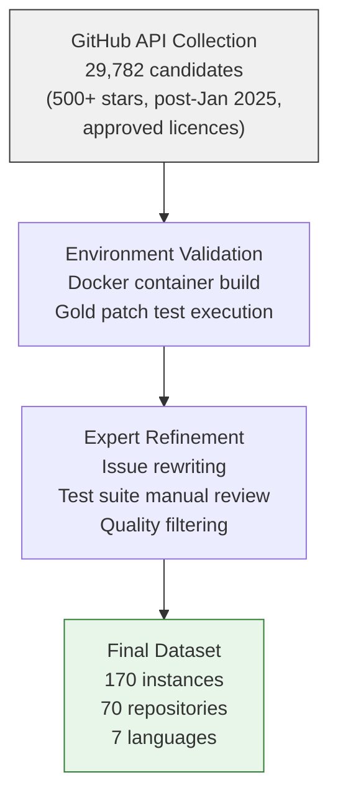
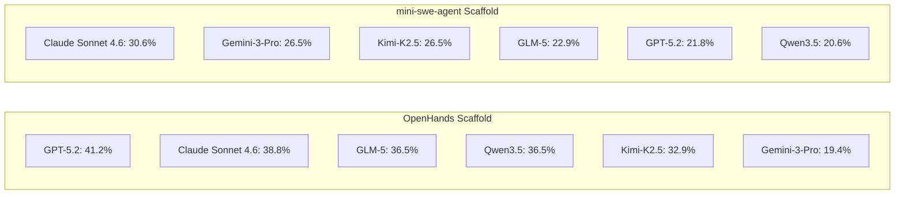

# SWE-Bench ProMax and the Multilingual Refactoring Challenge: Why Cross-File Coordination Exposes Coding Agent Limits — and What It Means for Codex CLI Polyglot Workflows


---

## The Benchmark Credibility Crisis

Coding agent benchmarks are in trouble. OpenAI's own audit of SWE-bench Verified found that 59.4% of the hardest unsolved problems contained flawed test cases — overly narrow tests rejecting correct solutions, or overly broad tests checking requirements never stated in the issue description [^1]. Add training data contamination (32.67% solution leakage [^1]) and the benchmark's value as a discriminating signal collapsed. OpenAI stopped reporting Verified scores entirely in early 2026 and recommended others follow suit [^1].

SWE-bench Pro addressed contamination by drawing from post-training commits, but its scope remained Python-only and its tasks still skewed toward single-file bug fixes — a narrow slice of what professional software engineering actually looks like.

Enter **SWE-Bench ProMax**.

## What SWE-Bench ProMax Actually Measures

Published at COLM 2026, SWE-Bench ProMax (Shi et al., arXiv:2608.09802) targets a specific, underserved capability: **large-scale, behaviour-preserving refactoring across multiple files in multiple languages** [^2].

The numbers tell the story immediately:

| Dimension | SWE-bench Verified | SWE-bench Pro | **SWE-Bench ProMax** |
|---|---|---|---|
| Languages | 1 (Python) | 1 (Python) | **7** (Python, Java, TypeScript, Go, C, C++, Rust) |
| Avg. files modified | ~1–2 | ~2–3 | **11.4** |
| Avg. LOC per patch | ~30–50 | ~50–100 | **261.6** |
| Avg. test files | ~1 | ~1–2 | **4.5** |
| Source repositories | 12 | ~20 | **70** |
| Total instances | 500 | 200+ | **170** |

Each instance averages 11.4 modified files and 261.6 lines of changed code — roughly 8,180 tokens per gold patch [^2]. These are not single-function bug fixes. They are coordinated refactoring operations that demand the agent understand dependency graphs, maintain behavioural equivalence, and navigate unfamiliar codebases in languages with fundamentally different type systems and build toolchains.

### Per-Language Breakdown

The benchmark deliberately spans system-level and application-level languages [^2]:

| Language | Instances | Avg. Files | Avg. LOC |
|---|---|---|---|
| Python | 29 | 10.6 | 299.8 |
| Java | 26 | 20.8 | 309.8 |
| TypeScript | 28 | 11.9 | 122.6 |
| Go | 23 | 16.0 | 227.4 |
| C | 20 | 17.9 | 424.1 |
| C++ | 22 | 21.4 | 196.3 |
| Rust | 22 | 14.5 | 284.8 |

Java and C++ tasks are the most demanding by file count (20.8 and 21.4 respectively), while C tasks produce the largest patches (424.1 LOC average). TypeScript tasks are the leanest at 122.6 LOC, but still touch nearly 12 files on average.

## The Curation Pipeline

The 170 instances survived a brutal three-stage filter from 29,782 initial candidates [^2]:



Critically, issue descriptions were rewritten from scratch to provide "precise, unambiguous specifications" — directly addressing the overly vague issues that plagued earlier benchmarks [^2]. Test suites underwent manual review to eliminate both overly restrictive tests (35.5% of Verified's unsolved instances) and overly permissive ones (18.8%) [^2].

## Agent Performance: 41.2% Ceiling

Two evaluation scaffolds were tested — **mini-swe-agent** (minimal: file viewing, editing, searching, bash) and **OpenHands** (richer sandboxed runtime) — each with a 300-step and \$10-cost limit per instance [^2].



Several observations stand out:

1. **The scaffold matters enormously.** GPT-5.2 tops OpenHands at 41.2% but drops to 21.8% on mini-swe-agent — nearly halved. The harness is not a neutral container; it is a co-author of the result [^2].

2. **Cost does not correlate with success.** Claude Sonnet 4.6 spends \$4.77 per instance for 38.8% on OpenHands, while GLM-5 achieves the same 36.5% for \$0.24 — a 20× cost difference for a 2.3 percentage point gap [^2]. Human analysis revealed that higher spending typically reflected "unproductive edit-revert cycles rather than genuine progress" [^2].

3. **No agent breaks 50%.** The best result (41.2%) means nearly 60% of well-specified, expert-curated refactoring tasks remain unsolved. This is an unsaturated benchmark by design.

## Why Refactoring Is Harder Than Bug Fixing

The gap between SWE-bench Pro resolve rates (65–70%+ for frontier models [^3]) and ProMax's 41.2% ceiling is not merely about difficulty scaling. Refactoring imposes qualitatively different demands:

- **Behavioural preservation**: every change must maintain semantic equivalence, which requires understanding the full call graph across the affected files
- **Cross-file dependency tracking**: moving a type definition in Go requires updating every import path; renaming a Java class touches every file that references it
- **Build system awareness**: C and C++ refactoring may require updating Makefiles, CMakeLists.txt, or header includes
- **Test adequacy judgement**: the agent must determine whether existing tests adequately cover the refactored paths

These are precisely the tasks where coding agents tend to enter edit-revert cycles — modifying a file, breaking a downstream dependency, reverting, trying a different approach, and burning tokens without progress.

## Implications for Codex CLI Polyglot Workflows

SWE-Bench ProMax's results have direct practical implications for anyone using Codex CLI on multilingual codebases.

### Model Selection by Language

The per-language performance variance (not broken out in the paper's public tables, but inferable from the scaffold gap) suggests that no single model dominates across all seven languages. Codex CLI's **named profiles** let you route by context:

```toml
# ~/.codex/config.toml

[profiles.rust-refactor]
model = "gpt-5.6-terra"
model_reasoning_effort = "high"

[profiles.ts-refactor]
model = "gpt-5.6-luna"
model_reasoning_effort = "medium"

[profiles.systems-refactor]
model = "gpt-5.6-sol"
model_reasoning_effort = "xhigh"
```

For C and C++ refactoring (the highest LOC per patch), the reasoning budget matters more. For TypeScript (lower LOC, more files), a faster model with medium reasoning may suffice.

### Subagent Decomposition for Cross-File Changes

ProMax tasks average 11.4 files — well within the range where Codex CLI's subagent system becomes necessary [^4]. For refactoring tasks touching 20+ files (Java and C++ averages), decompose into per-module agents:

```bash
# Decompose a large refactoring across subagents
codex --profile systems-refactor \
  "Refactor the storage module: rename StorageBackend to Store \
   across all 22 files in src/storage/ and update imports in \
   src/api/ and src/cli/. Preserve all existing behaviour."
```

The `AGENTS.md` file can encode refactoring constraints that prevent the edit-revert cycles ProMax exposed [^5]:

```markdown
## Refactoring Rules

- Before renaming any type, list ALL files that reference it
- Make changes in dependency order: definitions first, then consumers
- Run the build after each file group, not after all changes
- If a build fails, diagnose the specific import/reference error before reverting
- Never revert more than the last change without explicit approval
```

### Token Budget Awareness

ProMax's cost data — \$4.77 per instance for Claude Sonnet 4.6 versus \$0.24 for GLM-5 at comparable resolve rates — reinforces the importance of Codex CLI's token controls:

```toml
[profiles.refactor-budget]
model = "gpt-5.6-terra"
model_auto_compact_token_limit = 150000
tool_output_token_limit = 25000
```

The `model_auto_compact_token_limit` triggers context compaction before the window fills, reducing the risk of the agent losing track of which files it has already modified — a primary driver of the edit-revert cycles that inflate cost without improving outcomes.

### PostToolUse Verification Gates

The benchmark's emphasis on behavioural preservation maps directly to Codex CLI's hook system. A `PostToolUse` hook can enforce build-after-edit discipline:

```markdown
<!-- In AGENTS.md -->
## PostToolUse: apply_patch

After every file edit during a refactoring task:
1. Run the relevant build command for the modified file's language
2. If the build fails, report the error and stop — do not attempt further edits
3. If the build passes, proceed to the next file
```

This converts the "edit all files then discover breakage" anti-pattern into incremental verification — exactly the discipline that separates successful refactoring from token-burning cycles.

## The Broader Signal

SWE-Bench ProMax matters beyond its specific numbers because it reframes what we should expect from coding agents. The benchmark community's focus on single-file Python bug fixes created an illusion of near-human capability. ProMax's 41.2% ceiling on curated, well-specified, multi-file refactoring tasks is a more honest measure of where frontier agents actually stand in mid-2026.

For Codex CLI users, the practical takeaway is clear: multi-file refactoring across languages remains an area where human architectural judgement — encoded in `AGENTS.md` constraints, profile-based model routing, and incremental verification hooks — makes the difference between productive agent-assisted work and expensive edit-revert cycles.

---

## Citations

[^1]: OpenAI, "Why SWE-bench Verified No Longer Measures Frontier Coding Capabilities," openai.com, 2026. [https://openai.com/index/why-we-no-longer-evaluate-swe-bench-verified/](https://openai.com/index/why-we-no-longer-evaluate-swe-bench-verified/)

[^2]: Y. Shi, J. Xu, K. Fu et al., "SWE-Bench ProMax: Benchmarking Agents on Large-Scale Multilingual Code Refactoring," arXiv:2608.09802, August 2026. Published at COLM 2026. [https://arxiv.org/abs/2608.09802](https://arxiv.org/abs/2608.09802)

[^3]: SWE-bench Multilingual Leaderboard, swebench.com, 2026. [https://www.swebench.com/multilingual-leaderboard.html](https://www.swebench.com/multilingual-leaderboard.html)

[^4]: D. Vaughan, "Codex CLI Multi-File Editing Strategies: Coordinating Changes Across Large Pull Requests with apply_patch and Subagents," codex.danielvaughan.com, May 2026. [https://codex.danielvaughan.com/2026/05/03/codex-cli-multi-file-editing-strategies-apply-patch-subagents-coordinated-changes/](https://codex.danielvaughan.com/2026/05/03/codex-cli-multi-file-editing-strategies-apply-patch-subagents-coordinated-changes/)

[^5]: OpenAI, "AGENTS.md Specification," GitHub, 2026. [https://github.com/openai/codex](https://github.com/openai/codex)

[^6]: Codex CLI Configuration Reference, developers.openai.com, 2026. [https://developers.openai.com/codex/changelog](https://developers.openai.com/codex/changelog)
