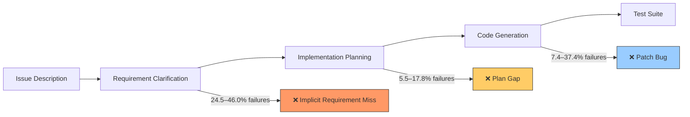
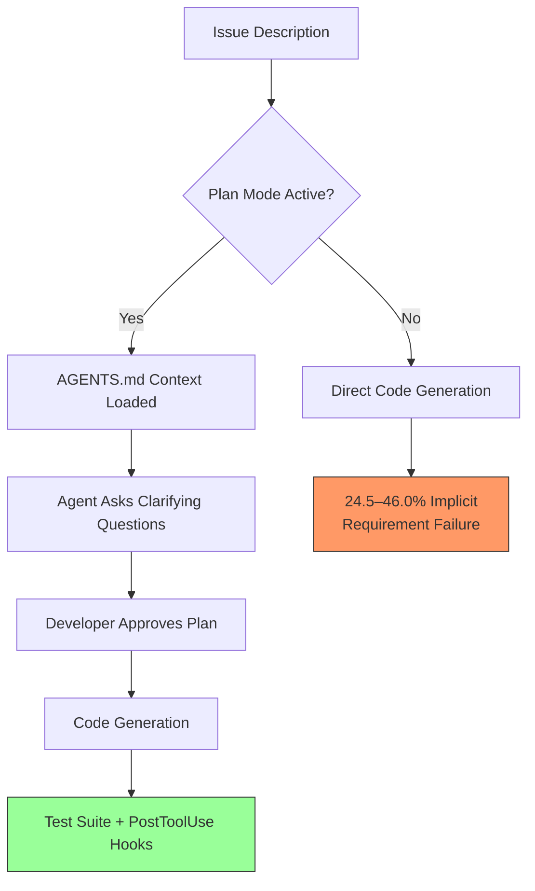

# SWE-RPG and the Requirement Clarification Bottleneck: Why Coding Agents Fail Before They Write a Single Line — and How Codex CLI's Plan Mode Closes the Gap


---

The coding agent community has spent two years optimising code generation. SWE-RPG, a benchmark published on 10 August 2026 by Zhou et al., argues we have been optimising the wrong stage. Across 163 tasks drawn from 31 production repositories, the single largest source of agent failure is not buggy patches or flawed plans — it is the failure to recover implicit requirements that the issue description never states [^1]. This article unpacks the benchmark, examines what it reveals about the requirement clarification gap, and maps its findings to Codex CLI's existing tooling for structured requirement elicitation.

## The Problem SWE-RPG Exposes

Existing benchmarks — SWE-bench Verified, SWE-bench Pro, Terminal-Bench — evaluate coding agents on a single axis: does the final patch pass the test suite? That binary metric hides a three-stage pipeline that every agent must traverse:

1. **Requirement clarification** — recovering the implicit constraints the issue omits.
2. **Implementation planning** — formulating which files to touch, in what order, under what constraints.
3. **Code generation** — translating the plan into a patch that passes tests without regressions.

SWE-RPG is the first benchmark to score each stage independently, with practitioner-validated ground-truth annotations at every level [^1].



The headline finding: **requirement clarification failures account for 24.5–46.0% of all agent runs**, dwarfing planning failures (5.5–17.8%) and code-generation failures (7.4–37.4%) [^1]. The bottleneck is not writing code. It is understanding what code to write.

## Inside the Benchmark

### Dataset Construction

The SWE-RPG corpus comprises 163 tasks from 31 repositories — 85 in Java, 78 in Python, split across 113 bug fixes and 50 feature additions [^1]. Average codebase size is 272.51K LOC, with 4.53 implicit clarification points per task. The construction pipeline screened over 2,000 PR-issue pairs, filtered to reproducible Docker environments, and underwent manual validation before synthesis of intermediate ground truths.

### The Six Clarification Dimensions

SWE-RPG evaluates requirement recovery across a practitioner-informed taxonomy of six dimensions:

| Dimension | Description | Agent Weakness |
|-----------|-------------|----------------|
| **C1: Functional Intent** | What the feature or fix should accomplish | Moderate |
| **C2: Business Semantics** | Domain-specific rules and business logic | Moderate |
| **C3: Technical Context** | Implementation environment, dependencies | Moderate |
| **C4: Interface/Protocol Specs** | API contracts, communication patterns | High |
| **C5: Code Structure/Naming** | Repository conventions, architectural patterns | High |
| **C6: Data-Structure Semantics** | Data invariants, structural relationships | High |

Agents consistently fail hardest on C4–C6 — the dimensions that require reading the existing codebase, not just the issue text [^1]. A developer encountering a bug report that says "the CSV export is broken" would instinctively check the existing export interface, the naming conventions in the module, and the data-structure invariants. Current agents skip straight to patch generation.

### Agent Performance

Zhou et al. tested three agent frameworks — Claude Code, Codex, and OpenCode — each paired with six LLM backends: Claude Sonnet 5, DeepSeek-V4-Pro, GLM-5.2, GPT-5.6-Terra, MiniMax-M3, and MoonshotAI-Kimi-K3 [^1].

| Agent + LLM | Resolve Rate |
|-------------|-------------|
| OpenCode + Kimi-K3 | 49.7% |
| Claude Code + Kimi-K3 | 49.1% |
| Codex + GPT-5.6-Terra | 33.7% |
| Codex + MiniMax-M3 | 17.8% |
| **Average** | **31.5%** |

The average resolve rate of 31.5% on a 163-task corpus is sobering. More importantly, agents with similar resolve rates exhibit different failure profiles — one may fail primarily on clarification, another on code generation — suggesting that a single-number leaderboard conceals actionable diagnostic information [^1].

## The Clarification Gap in Context

SWE-RPG does not exist in isolation. Three complementary papers from 2026 converge on the same diagnosis:

- **ClarifyCodeBench** (July 2026) demonstrated that ambiguity in requirements causes a measurable drop in functional correctness across all tested LLMs, and that interactive clarification before generation mitigates the problem [^2].
- **REAgent** (April 2026) introduced requirement-driven issue resolution, where the agent constructs structured "issue-oriented requirements" and iteratively refines low-quality specifications before attempting patch generation [^3].
- **Intent Formalization** by Lahiri (March 2026) framed the absence of formal specifications as the fundamental blocker for verification — tools remain idle without specifications to verify against [^4].

The pattern is clear: the field is converging on the view that the specification stage, not the generation stage, is the binding constraint.

## Mapping to Codex CLI

Codex CLI already provides three mechanisms that directly address the requirement clarification bottleneck. The question is whether developers are using them.

### Plan Mode as Clarification Gate

Plan mode (`/plan` or `Shift+Tab`) restricts the agent to read-only operations: it may explore the codebase, search for relevant context, and — critically — pose clarifying questions, but it cannot modify files or execute mutating commands until the developer approves a plan [^5].

This maps directly to SWE-RPG's three-stage pipeline. Plan mode forces the agent to perform requirement clarification (stage 1) and implementation planning (stage 2) before touching code (stage 3). The approval boundary between plan and execution is precisely the gate that SWE-RPG's data shows is most often skipped.

```toml
# config.toml — enforce plan-first for ambiguous work
[profile.clarify-first]
model = "gpt-5.6-terra"
approval_policy = "on-plan-approval"

# Force plan mode by default for this profile
default_mode = "plan"
```

### AGENTS.md as Implicit Requirement Specification

SWE-RPG's C5 (code structure/naming conventions) and C6 (data-structure semantics) dimensions are precisely the kind of implicit knowledge that `AGENTS.md` is designed to capture. A well-written `AGENTS.md` file pre-loads the agent with the repository's architectural invariants — the constraints that issue descriptions assume but never state [^5].

```markdown
<!-- AGENTS.md — encoding implicit requirements -->
# Repository Conventions

## Naming
- All service classes use `*Service` suffix; repositories use `*Repository`
- REST controllers map to `/api/v2/` prefix; no nested resources deeper than 2 levels

## Data Invariants
- All monetary amounts stored as `BigDecimal`, never `double`
- Timestamps in UTC; conversion to local time happens only at the presentation layer

## Interface Contracts
- Public API changes require OpenAPI spec update in `docs/api/`
- Internal interfaces use `@Internal` annotation; do not expose in public SDK
```

This is not documentation for developers — it is a specification for the agent, encoding exactly the implicit requirements that SWE-RPG shows agents miss most often.

### Structured Prompts with Acceptance Criteria

The third defence against the clarification gap is the prompt itself. SWE-RPG's data shows that agents given only an issue description fail to recover an average of 4.53 implicit clarification points per task [^1]. Including explicit acceptance criteria in the prompt forces the agent to address each dimension before generating code:

```bash
codex --profile clarify-first "
Fix the CSV export bug in #4217.

Before writing code, clarify:
1. What is the expected output format? (C1: Functional Intent)
2. Are there business rules for column ordering? (C2: Business Semantics)
3. Which CSV library version are we pinned to? (C3: Technical Context)
4. Does the export endpoint contract change? (C4: Interface Specs)
5. Follow the existing *Exporter naming convention (C5: Code Structure)
6. Preserve the BigDecimal precision invariant (C6: Data Semantics)
"
```

This prompt template maps one-to-one with SWE-RPG's six clarification dimensions. It transforms the agent from a code generator into a requirement analyst.



## Practical Implications

### For Individual Developers

The SWE-RPG data suggests a simple heuristic: **if the issue description is shorter than the patch, you probably need plan mode**. Short descriptions correlate with high implicit requirement density — the exact condition where agents fail most [^1].

### For Teams

Teams maintaining shared `AGENTS.md` files can use SWE-RPG's six dimensions as an audit checklist. Walk through C1–C6 and ask: does our `AGENTS.md` encode the conventions that a new team member (or agent) would need to know? If dimensions C4–C6 are absent, the agent is operating without the context it needs most.

### For Benchmark Designers

SWE-RPG's stage-separated evaluation methodology should become standard. Single-number resolve rates hide the diagnostic signal that developers need to improve their workflows. The field needs more benchmarks that score the thinking, not just the output.

## Limitations and Open Questions

SWE-RPG's 163-task corpus, whilst carefully curated, is small relative to SWE-bench Verified's scale. The Java/Python split (85/78) also leaves polyglot workflows untested — a gap that SWE-Bench ProMax [^6] begins to address with its seven-language coverage.

More fundamentally, SWE-RPG measures whether agents *recover* implicit requirements, not whether they *ask for* them. An agent that pauses to ask a clarifying question — as plan mode enables — may outperform one that guesses silently. Future benchmarks should reward the act of clarification itself, not just its accuracy.

## Citations

[^1]: Zhou, X., Chong, C.Y., Kim, K., Peng, Y., Shu, R., Wu, Z., Han, X., Yuan, G., Zhuang, Z., Kim, J., Ju, J., Ju, S., Yoon, T. & Lo, D. (2026). "A Unified Issue Resolution Benchmark for Requirement Clarification, Planning, and Code Generation for Coding Agents." arXiv:2608.09072. [https://arxiv.org/abs/2608.09072](https://arxiv.org/abs/2608.09072)

[^2]: ClarifyCodeBench: Evaluating LLMs on Clarifying Ambiguous Requirements for Code Generation. arXiv:2607.00711, July 2026. [https://arxiv.org/abs/2607.00711](https://arxiv.org/abs/2607.00711)

[^3]: Kuang, S., Tian, Z., Lin, K., Tao, C., Wang, S., Bai, H., Shang, L. & Chen, J. (2026). "REAgent: Requirement-Driven LLM Agents for Software Issue Resolution." arXiv:2604.06861. [https://arxiv.org/abs/2604.06861](https://arxiv.org/abs/2604.06861)

[^4]: Lahiri, S.K. (2026). "Intent Formalization: A Grand Challenge for Reliable Coding in the Age of AI Agents." arXiv:2603.17150. [https://arxiv.org/abs/2603.17150](https://arxiv.org/abs/2603.17150)

[^5]: OpenAI. Codex CLI Documentation — Plan Mode, AGENTS.md, and Configuration. [https://github.com/openai/codex](https://github.com/openai/codex)

[^6]: Shi, Y. et al. (2026). "SWE-Bench ProMax: Benchmarking Agents on Large-Scale Multilingual Code Refactoring." arXiv:2608.09802. [https://arxiv.org/abs/2608.09802](https://arxiv.org/abs/2608.09802)
