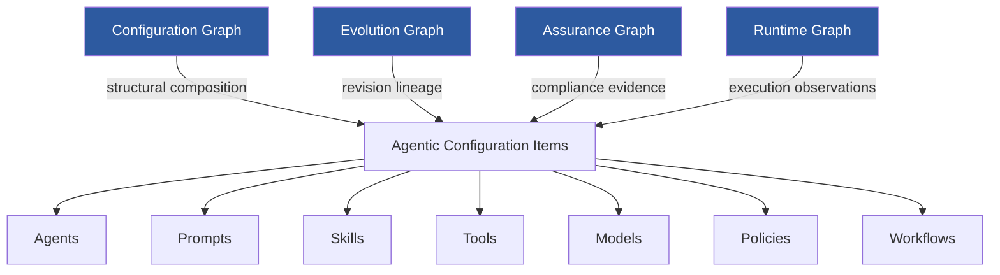
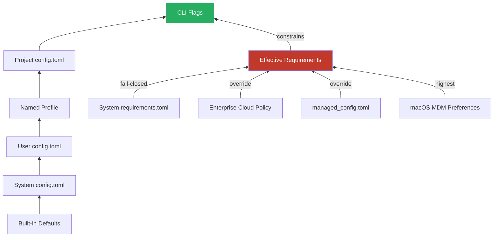

# Agentic Configuration Management: What a Framework-Independent Governance Model Means for Your Codex CLI Config Stack


---

Configuration management for agentic systems is a mess. Organisations run LangGraph pipelines alongside CrewAI crews and OpenAI SDK agents, each with its own configuration format, its own versioning story, and its own idea of what "governed" means. When a model changes or a policy tightens, the blast radius is invisible until something breaks in production.

A new paper from PwC — Quessada-Vial's *Agentic Configuration Management* (ACM), published 11 August 2026 — proposes a formal, framework-independent governance model that treats every configurable artefact in an agentic system as a typed, immutably versioned configuration item with explicit dependency tracking and monotonic impact propagation [^1]. The framework has been validated with reference implementations across LangGraph, CrewAI, and the OpenAI Agents SDK, producing governance-equivalent representations and reproducible outcomes after projection.

This article examines what ACM formalises, where Codex CLI already implements analogous patterns, and where gaps remain for teams running Codex at enterprise scale.

## The Configuration Governance Problem

Every Codex CLI deployment beyond a solo developer involves multiple interacting configuration surfaces:

- **`config.toml`** at user, project, profile, and system levels [^2]
- **`requirements.toml`** for admin-enforced constraints that users cannot override [^3]
- **`managed_config.toml`** for organisation-wide defaults that reset on restart [^3]
- **`AGENTS.md`** hierarchies for project-level behavioural instructions
- **Plugin manifests** bundling skills, MCP servers, and app connectors
- **Named profiles** for environment-specific model and policy selection

Each surface has its own merge semantics. CLI flags beat project config, which beats profiles, which beat user config, which beats system config, which beats built-in defaults [^2]. Requirements sit outside this hierarchy entirely — they override everything and fail closed when violated [^3].

The problem ACM addresses is that none of these surfaces express *dependency relationships* between configuration items. When you change a model in your profile, there is no formal mechanism to determine which skills, MCP servers, or approval policies are affected. When an admin tightens `sandbox_mode` in `requirements.toml`, there is no impact propagation that flags incompatible plugin configurations downstream.

## ACM's Core Abstractions

ACM introduces four interconnected formal structures [^1]:



### Agentic Configuration Items

An ACI is any configurable artefact — an agent definition, a prompt, a skill, a tool binding, a model reference, a policy, or a workflow. Each ACI carries four components:

1. **Identity**: unique item and revision identifiers
2. **Governance state**: lifecycle status, quality assessment, assurance evidence, impact status, and eligibility for deployment
3. **Configuration content** with integrity digests for tamper detection
4. **Governance metadata** for provenance tracking

The critical design decision is *immutable versioning*: modifications create new revisions rather than mutating existing ones. This guarantees deterministic historical reconstruction — you can always answer "what configuration was active at 14:32 on Tuesday?" [^1].

### Semantic Projection

ACM normalises framework-native configurations through *semantic projection*: a four-stage pipeline that extracts native structures, classifies artefact types, converts to canonical ACM representation, and validates that governance-relevant information is preserved [^1]. The paper demonstrates adapters for LangGraph, CrewAI, and the OpenAI Agents SDK that produce equivalent governance outcomes after projection.

### Impact Propagation

When a configuration item changes, ACM propagates impact through the dependency graph using monotonic fixed-point semantics over finite lattices. Four propagation policies control behaviour [^1]:

| Policy | Behaviour | Codex CLI Analogue |
|---|---|---|
| **Blocking** | Propagates impact; restricts eligibility | `requirements.toml` fail-closed enforcement |
| **Warning** | Propagates indication; no eligibility change | `codex doctor` advisory warnings |
| **Informational** | Preserves traceability; no propagation | JSONL audit log entries |
| **None** | Disables propagation; maintains structure | Project-scoped config isolation |

The formal guarantee is convergence to a unique least fixed point — impact analysis terminates and produces deterministic results regardless of evaluation order [^1].

## Where Codex CLI Already Implements ACM Patterns

Codex CLI's configuration model, evolved through dozens of releases in 2026, already instantiates several ACM patterns — though without the formal governance semantics.

### Typed Configuration Items

Every key in `config.toml` is typed and validated at parse time. The configuration reference documents explicit types for each key [^2]:

```toml
# Model selection — typed string with deprecation tracking
model = "gpt-5.6-terra"

# Approval policy — enum with fail-closed semantics
approval_policy = "on-request"

# Sandbox mode — enum enforcing execution boundaries
sandbox_mode = "workspace-write"

# Reasoning effort — tiered enum
model_reasoning_effort = "medium"
```

### Layered Precedence as Rudimentary Dependency

The six-layer merge hierarchy (CLI flags → project → profile → user → system → defaults) [^2] implements what ACM calls structural composition, though without explicit dependency edges. Managed configuration adds two more layers with distinct enforcement semantics [^3]:



### Fail-Closed Enforcement

When local configuration conflicts with `requirements.toml`, Codex CLI reverts to compatible values and notifies the user rather than proceeding with violations [^3]. If cloud-delivered requirements cannot be fetched and no valid cache exists, the client refuses to start [^3]. This matches ACM's *blocking* propagation policy — a change in policy propagates restrictively and prevents ineligible configurations from executing.

### MCP Server Validation

Clients enable MCP servers only when both name and identity match approved entries in `requirements.toml`; otherwise they are silently disabled [^3]. This is dependency-aware enforcement — a policy change in the server allowlist propagates to tool availability without manual intervention.

### Feature Flags as Lifecycle Gates

```toml
[features]
apps = true
goals = true
hooks = true
memories = false     # Experimental — gated
multi_agent = true
```

Feature flags control which subsystems are eligible for use [^2]. ACM would model these as lifecycle state transitions on configuration items — a feature moving from `experimental` to `stable` changes the eligibility of every configuration item that depends on it.

## Where Codex CLI Falls Short of ACM

### No Immutable Revision History

Codex CLI configuration files are mutable. When you edit `config.toml`, the previous state is lost unless you happen to have it under version control. ACM's insistence on immutable revisions with integrity digests would mean every configuration change is preserved with tamper-evident hashing [^1].

**Practical gap**: after a production incident, answering "what configuration was active when the agent ran?" requires reconstructing state from git history, log files, and memory — rather than querying a definitive configuration record.

### No Cross-Surface Dependency Graph

Codex CLI treats its configuration surfaces as independent layers merged by precedence. There is no formal graph connecting a model selection in `config.toml` to the skills that require that model's capabilities, or linking an `approval_policy` change to the MCP servers whose operations would be affected.

**Practical gap**: upgrading from `gpt-5.4` to `gpt-5.6-terra` (mandatory before 31 August 2026 [^4]) requires manual verification that every skill, plugin, and AGENTS.md directive remains compatible with the new model's behaviour. ACM's impact propagation would automate this analysis.

### No Assurance Graph

ACM's assurance graph links policies to compliance evidence and maps configuration items to the regulatory requirements they satisfy [^1]. Codex CLI has no equivalent. Teams pursuing SOC 2 or ISO 27001 compliance must build their own mapping between `requirements.toml` constraints and control objectives.

### No Release Baselines

ACM defines *release baselines* as immutable collections of ACI revisions that can be deployed and audited as a unit [^1]. Codex CLI has no mechanism to snapshot a complete configuration state — config.toml, requirements.toml, AGENTS.md, plugin manifests, and MCP server definitions — into an atomic, deployable baseline.

## Building Towards ACM with Codex CLI Today

While Codex CLI does not implement ACM natively, teams can approximate its governance patterns using existing primitives.

### Version Your Configuration Surfaces

Treat all configuration as code. A dedicated repository (or directory within your project) should track every surface:

```bash
.codex/
├── config.toml              # Project config
├── AGENTS.md                # Behavioural instructions
├── plugins/                 # Plugin manifests
│   ├── security-scanner/
│   │   └── manifest.toml
│   └── code-review/
│       └── SKILL.md
└── governance/
    ├── requirements.toml    # Admin constraints (reference copy)
    ├── CHANGELOG.md         # Manual revision log
    └── baselines/
        ├── 2026-08-01.lock  # Snapshot of effective config
        └── 2026-08-12.lock
```

### Use `codex doctor` as a Discovery Tool

`codex doctor` performs configuration validation and reports incompatibilities [^2]. Run it in CI after any configuration change to catch governance violations before deployment:

```bash
# CI step: validate configuration consistency
codex doctor --format json | jq '.warnings, .errors'
```

### Implement Impact Analysis via PreToolUse Hooks

PreToolUse hooks can act as dependency-aware gates. When a tool invocation would violate a governance constraint, the hook rejects it before execution [^5]:

```toml
# In AGENTS.md or hook configuration
# Reject tool calls that require network access when sandbox is restricted
[hooks.pre_tool_use.network_gate]
command = "check-network-policy"
exit_codes = { 0 = "approve", 1 = "reject", 2 = "suggest" }
```

### Build Configuration Baselines Manually

Until Codex CLI supports native baselines, generate snapshots of effective configuration:

```bash
# Generate a configuration baseline
codex --print-config --format toml > .codex/governance/baselines/$(date +%Y-%m-%d).lock
codex --print-instructions >> .codex/governance/baselines/$(date +%Y-%m-%d).lock
```

### Map Requirements to Compliance Controls

For regulated environments, maintain an explicit mapping between `requirements.toml` keys and compliance control objectives:

```toml
# requirements.toml with governance annotations
# Control: AC-3 (NIST SP 800-53) — Access Enforcement
sandbox_mode = "workspace-write"

# Control: AU-2 — Audit Events
[otel]
enabled = true
endpoint = "https://otel.internal.corp/v1/traces"

# Control: CM-7 — Least Functionality
[features]
memories = false
```

## The Broader Implication: Configuration as a First-Class Governance Layer

The ACM paper reveals a structural gap in how the industry thinks about agentic configuration. Current tools — including Codex CLI — treat configuration as a deployment concern: something you set up once and adjust when things break. ACM reframes configuration as a *governance artefact* with its own lifecycle, versioning, dependency management, and compliance semantics [^1].

This matters because agentic systems are compositional. A Codex CLI session may load a project `config.toml`, merge it with a named profile, apply `requirements.toml` constraints, discover MCP servers, load plugin skills, and read `AGENTS.md` instructions — all before processing the first user prompt. Each of these surfaces can change independently, and the interactions between changes are currently invisible.

The research finding that all three tested frameworks — LangGraph, CrewAI, and OpenAI Agents SDK — produced *governance-equivalent ACM representations* after semantic projection suggests that configuration governance is framework-independent [^1]. The implications for Codex CLI are clear: as the tool becomes the orchestration layer for enterprise coding workflows, it will need to express and enforce the same governance semantics that ACM formalises — immutable versioning, typed dependency graphs, monotonic impact propagation, and auditable release baselines.

The good news is that Codex CLI's existing architecture — layered configuration precedence, fail-closed requirements enforcement, MCP server validation, and hook-based policy gates — provides a solid foundation. The gap is not architectural but semantic: making the relationships between configuration items explicit, their evolution traceable, and their impact on downstream components deterministic.

## Citations

[^1]: Quessada-Vial, A. (2026). *Agentic Configuration Management*. arXiv:2608.11166. Published 11 August 2026. PwC. [https://arxiv.org/abs/2608.11166](https://arxiv.org/abs/2608.11166)

[^2]: OpenAI. (2026). *Config basics — Codex CLI documentation*. [https://learn.chatgpt.com/docs/config-file/config-basic](https://learn.chatgpt.com/docs/config-file/config-basic)

[^3]: OpenAI. (2026). *Managed configuration — Codex CLI enterprise documentation*. [https://learn.chatgpt.com/docs/enterprise/managed-configuration](https://learn.chatgpt.com/docs/enterprise/managed-configuration)

[^4]: OpenAI. (2026). *ChatGPT & Codex changelog*. GPT-5.4 and GPT-5.4 mini retirement date: 31 August 2026. [https://learn.chatgpt.com/docs/changelog](https://learn.chatgpt.com/docs/changelog)

[^5]: OpenAI. (2026). *Codex CLI hooks documentation*. PreToolUse and PostToolUse lifecycle hooks. [https://learn.chatgpt.com/docs/hooks](https://learn.chatgpt.com/docs/hooks)

[^6]: Quessada-Vial, A. (2026). *Agentic Configuration Management* — Section 7: Evaluation. 27 governance scenarios tested with nine quantitative impact cases across LangGraph, CrewAI, and OpenAI Agents SDK adapters. arXiv:2608.11166. [https://arxiv.org/abs/2608.11166](https://arxiv.org/abs/2608.11166)
