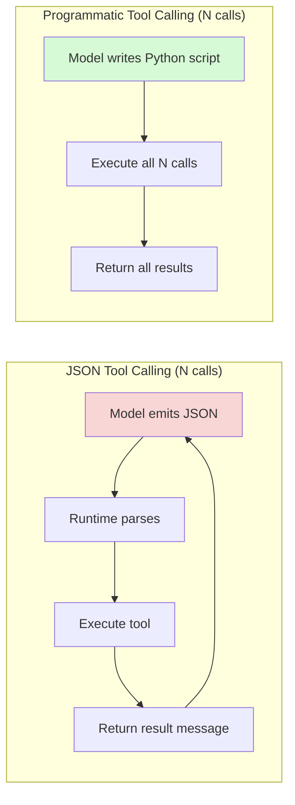

# The Bitter Lesson of Tool Calling: Why Programmatic Tool Use Outperforms JSON — and What It Means for Codex CLI


---

Tool calling is the mechanism that turns a language model from a chatbot into an agent. Every coding agent — Codex CLI included — depends on it to read files, run commands, query APIs, and orchestrate MCP servers. The industry settled on JSON-schema tool calling as the default years ago. A new paper argues that was the wrong choice, and the data are hard to ignore.

Patel, Sen, Lumer and Subbiah's *The Bitter Lesson of Tool Calling* [^1] provides the first generation-spanning empirical comparison of **programmatic tool calling** (PTC) against native JSON tool calling across 14 models on the Berkeley Function Calling Leaderboard (BFCL) v4. The title nods to Rich Sutton's famous essay: general, scalable approaches beat hand-crafted ones as compute grows [^2]. The same principle, they argue, applies to how we let models invoke tools.

## The Two Paradigms

### JSON Tool Calling (the status quo)

The model receives a JSON schema describing each tool's name, parameters, and types. It emits a structured JSON object selecting the tool and providing arguments. The runtime parses the JSON, dispatches the call, and feeds the result back as a new message. Each call requires a round trip.

### Programmatic Tool Calling

Tools are exposed as **typed Python stubs** — function signatures with docstrings and type annotations that delegate to an RPC layer. The model writes a Python script that calls these stubs directly. For parallel invocations it uses `asyncio.gather()`; for chaining, sequential calls in a single script. Execution and results are handled in one agent turn [^1].

```python
# Example typed stub from the paper
def calculate_triangle_area(
    base: int,
    height: int,
    unit: str | None = None) -> dict:
    return _rpc.call('calculate_triangle_area',
                     base=base, height=height,
                     unit=unit)
```

The model never sees a JSON schema. It sees Python signatures — the same format it has been trained on billions of times.

## The Numbers

The evaluation used a representative 309-entry subset of BFCL v4 spanning eight task categories, with 14 models released between November 2024 and July 2026 [^1].

### Headline results

| Model | JSON Accuracy | PTC Accuracy | Delta |
|---|---|---|---|
| GPT-5.6-Terra | 73.5% | 84.1% | **+10.6pp** |
| GPT-5.6-Sol | 72.2% | 82.8% | **+10.6pp** |
| Claude Sonnet 5 | 84.5% | 86.1% | +1.6pp |
| Claude Opus 4.8 | 82.2% | 83.8% | +1.6pp |
| GPT-4o | 81.9% | 55.0% | −26.9pp |
| GPT-4.1 | 81.9% | 62.1% | −19.8pp |

PTC matched or exceeded JSON in **11 of 14 models** [^1]. The three failures (GPT-4o, GPT-4.1, GPT-5.4-mini) shared a single root cause: they emitted literal `\n` escape sequences instead of actual newlines in multiline scripts, causing subprocess syntax errors. Every model released after GPT-5-nano (August 2025) handled this correctly.

### The generational pattern

The paper's central claim: **PTC accuracy tracks model generation, not model family**. All five Anthropic models and the three GPT-5.6 variants succeeded. The three older OpenAI models did not. As models improve at code generation generally, programmatic tool calling rides that improvement for free [^1].

## Where PTC Excels

### Chaining (sequential tool calls)

In a 52-entry chaining ablation with chain lengths from 2 to 20 calls, PTC dramatically outperformed JSON for newer models [^1]:

- **Claude Sonnet 5:** 80.8% → 96.2% (+15.4pp)
- **Claude Opus 4.8:** 80.8% → 94.2% (+13.4pp)

The advantage scaled with chain length: at chains of 12+ calls, the gap reached 18.8pp. JSON tool calling requires a separate round trip per link in the chain; PTC executes the entire chain in a single script.

### High fan-out parallelism

In a 32-entry parallelism ablation with fan-out from 7 to 48 concurrent calls [^1]:

- 13 of 14 models matched or exceeded JSON baseline on enumeration accuracy
- GPT-5 improved from 71.9% to 96.9% (+25.0pp)
- Claude models maintained 100% enumeration accuracy

The paper probed Claude Sonnet 5 at extreme fan-out levels. JSON tool calling collapsed: 75% accuracy at N=72, **0% at N=100**. PTC maintained 100% at both thresholds — `asyncio.gather()` scales where JSON arrays do not [^1].

### Context rot resistance

When the tool catalogue was flooded from a filtered set to 128 total function schemas (simulating a large MCP deployment), JSON accuracy degraded by 2.3% on average. PTC *improved* by 5.5% on average [^1]. The most dramatic swings:

- **GPT-4o:** −6.5% (JSON) vs +22.6% (PTC)
- **GPT-5.4-mini:** −7.5% (JSON) vs +35.5% (PTC)

A filesystem-discovery reference condition (where the model had to find tool definitions in files) degraded by 32.0% — confirming that schema flooding is a real problem for agents with many tools [^1].

## Latency and Token Economics

PTC completed chaining entries in 0.32–0.96× baseline time for 13 of 14 models, because a single-turn script eliminates the per-link round trip that JSON requires [^1]. The exception was GPT-5, where extended reasoning inflated generation time to 2.8× baseline.

On input tokens, PTC carried a 1.5× overhead for chaining (system prompt embeds full stub source). But at high fan-out, the crossover point was N≈26 calls — beyond that, JSON becomes *more* expensive because each call's schema gets repeated in the conversation [^1].



## Implications for Codex CLI

Codex CLI already operates closer to the PTC paradigm than most agents realise. Its core loop generates shell commands and code that it executes in a sandbox — it does not use JSON function-calling for its primary file and command operations [^3]. The MCP layer, however, follows the standard JSON tool-calling protocol [^4].

### Where PTC findings apply directly

**MCP tool proliferation.** As of v0.147.0 (August 2026), Codex CLI supports paginated MCP tool discovery, concurrent catalogue resolution, and the opt-in MCP 2026-07-28 protocol [^5]. The context rot finding is directly relevant: organisations deploying many MCP servers risk schema flooding. PTC's resistance to context rot suggests that MCP servers exposing typed code stubs rather than JSON schemas would degrade less gracefully under catalogue growth.

**High fan-out operations.** When Codex CLI orchestrates parallel tasks — bulk file analysis, concurrent test execution, multi-repository scanning — the parallelism findings suggest that code-based dispatch (`asyncio.gather()` or shell parallelism) will outperform JSON tool-call arrays at scale.

**Chain-heavy workflows.** Complex refactoring, multi-step debugging, and pipeline orchestration involve long tool-call chains. PTC's single-turn execution eliminates the latency penalty of per-step round trips.

### Practical configuration

You can already nudge Codex CLI towards programmatic patterns through AGENTS.md directives:

```toml
# config.toml — prefer models that handle PTC well
[profile.default]
model = "o4-mini"         # strong code generation
reasoning_effort = "high"

[profile.heavy-tools]
model = "o3"              # for high fan-out MCP workflows
reasoning_effort = "high"
```

```markdown
<!-- AGENTS.md — encourage code-based tool orchestration -->
## Tool Use Policy

When multiple independent tool calls are needed, prefer writing
a single script that executes all calls concurrently rather than
issuing them as separate tool invocations. Use asyncio.gather()
or shell-level parallelism (xargs -P, GNU parallel) for fan-out
operations exceeding 10 concurrent calls.
```

### MCP server design implications

If you maintain custom MCP servers for Codex CLI, the paper suggests a design direction: expose **typed function stubs** alongside or instead of pure JSON schemas. The MCP protocol's `tools/list` response already supports rich parameter descriptions — adding code-level type information in the description field costs nothing and may improve accuracy for capable models [^4].

## Caveats

The paper has important limitations worth noting:

1. **BFCL v4 is a function-calling benchmark, not a coding-agent benchmark.** Real Codex CLI workflows involve file I/O, shell commands, and iterative debugging — not isolated function calls. The accuracy gains may not transfer directly to agentic settings.

2. **Older models fail hard.** GPT-4o, GPT-4.1, and GPT-5.4-mini all performed worse with PTC. If your workflow pins to these models (perhaps for cost reasons), JSON tool calling remains the safer choice.

3. **The newline encoding bug** in older OpenAI models is a single, fixable failure mode. It is unclear whether the accuracy gap would persist if that bug were patched — though the paper notes GPT-5-nano and all newer models handle it correctly [^1].

4. **Token overhead at low call counts.** For simple, single-call tool use, PTC's 1.5× input token overhead makes it strictly worse. The gains emerge at scale.

## The Bitter Lesson, Applied

Sutton's original bitter lesson [^2] argued that methods leveraging computation — search and learning — always win over methods leveraging human knowledge. Patel et al. apply the same logic: JSON tool calling is a *human-designed structured interface*. Programmatic tool calling is *just code* — and models get better at code with every generation.

For Codex CLI practitioners, the actionable takeaway is not to abandon JSON tool calling today. The MCP ecosystem depends on it, and Codex CLI's tool infrastructure is built around it. But the trajectory is clear: as models improve, the overhead of forcing tool invocation through a JSON intermediary becomes an increasingly unnecessary bottleneck. Design your AGENTS.md policies, MCP servers, and workflows with the assumption that code-based tool orchestration will become the default.

---

## Citations

[^1]: Patel, I., Sen, S., Lumer, E. & Subbiah, V.K. (2026). "The Bitter Lesson of Tool Calling." *arXiv:2608.06370*. [https://arxiv.org/abs/2608.06370](https://arxiv.org/abs/2608.06370)

[^2]: Sutton, R. (2019). "The Bitter Lesson." [http://www.incompleteideas.net/IncIdeas/BitterLesson.html](http://www.incompleteideas.net/IncIdeas/BitterLesson.html)

[^3]: OpenAI. (2026). "Codex CLI Documentation." [https://developers.openai.com/codex/cli](https://developers.openai.com/codex/cli)

[^4]: Model Context Protocol Specification (2026). [https://modelcontextprotocol.io/specification](https://modelcontextprotocol.io/specification)

[^5]: OpenAI. (2026). "Codex CLI v0.147.0 Release Notes." [https://github.com/openai/codex/releases](https://github.com/openai/codex/releases)
