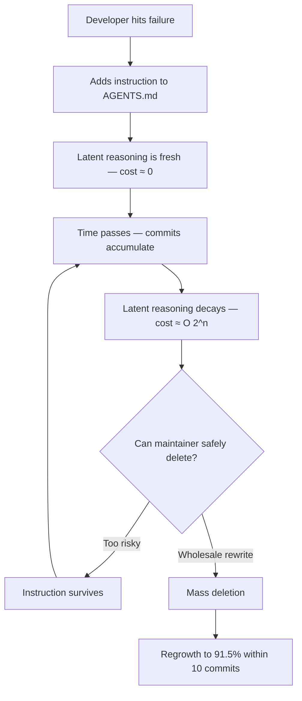
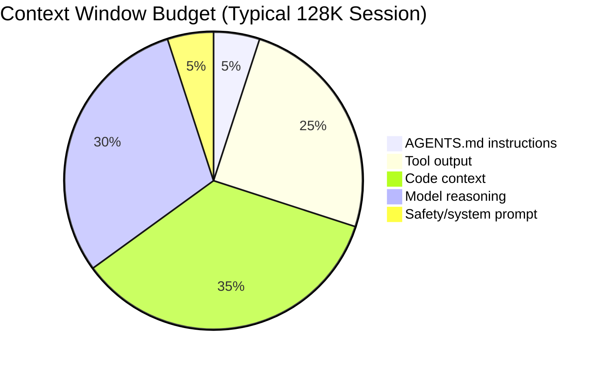

# Catastrophic Remembering: Why Your AGENTS.md Keeps Growing and How Prompt Comments Fix It


---

Every developer who has maintained an `AGENTS.md` or `CLAUDE.md` file for more than a few weeks knows the pattern: instructions go in, but they never come out. A new paper quantifies why this happens, names it **catastrophic remembering**, and demonstrates a surprisingly simple fix that eliminates 99.3% of excess instruction growth whilst preserving task satisfaction [^1].

## The Ratchet: +226% Lifetime Growth

Chakrabarti tracked 247,694 individual instruction lifetimes across 1,867 public GitHub repositories containing `CLAUDE.md`, `AGENTS.md`, and `copilot-instructions.md` files [^1]. The numbers are striking:

| Metric | Value |
|--------|-------|
| Median instructions per file (final snapshot) | 39 (90th percentile: 131) |
| Lifetime growth in instruction count | **+226%** |
| Net instructions added per commit | **+4.9** |
| Post-rewrite regrowth to 91.5% of pre-rewrite size | Within 10 commits |

The growth follows a sawtooth pattern. Files accumulate instructions at roughly 4.1% per commit. Eventually a frustrated maintainer performs a wholesale rewrite (defined as ≥50% deletion in a single commit), killing a median of 46 instructions. But within 10 commits the file has regrown to 91.5% of its pre-rewrite size — now at 4.9% per commit, *faster* than before the rewrite [^1].

This is not a workflow problem that discipline can solve. It is a structural consequence of how knowledge decays in instruction files.

## Why Deletion Is Harder Than Addition

The paper's core insight is that every instruction has **latent reasoning** — the failure that motivated it, the hypothesis behind the fix, the outcome that validated it. At write-time, this reasoning is free: the maintainer just experienced the failure. At read-time months later, recovering why an instruction exists is exponentially costly — you would need to reproduce the original failure scenario or audit the full commit history [^1].



The deletion hazard confirms this: older instructions are *less* likely to be removed, not more. The Nelson–Aalen hazard estimate shows a log-slope of −0.032 per commit (95% CI: −0.047, −0.019) [^1]. In multi-author files the effect steepens further (β = −0.049; multi-author × age interaction: −0.021, z = −11.7), which rules out content staleness as the driver — staleness would predict *increasing* deletion with age, not decreasing [^1].

The paper formally models the equilibrium file size as:

> |D∞| = A / [ρ̄(a) · s] → ∞ as ρ̄(a) → 0

Where ρ̄(a) is the recoverability of latent reasoning and s is the probability that an instruction is excess. As reasoning becomes unrecoverable, the file grows without bound [^1].

## The Fix: Prompt Comments

The solution is disarmingly simple: **annotate each instruction with its latent reasoning as a comment**. The comment records three elements:

1. **Failure history** — what went wrong
2. **Hypothesis** — why this instruction should help
3. **Outcome** — whether it actually worked

Here is the format from the paper's controlled experiment [^1]:

```markdown
<!-- r3: task 0 failed — response used 'wilderness' only 2 times
     but requirement expects exactly 5; d12 (3 bold sections) was
     passing, so keeping that approach -->
- Use the word "wilderness" exactly 5 times in every response
```

The comments are invisible to the executor (the LLM) — they exist solely for the human maintainer deciding whether to keep or delete an instruction.

### Controlled Results

The paper validated this using an **IFEval inversion** technique: creating synthetic worlds with known optimal instruction sets (|D⋆| ≈ 2.2 instructions), then measuring how much excess accumulated over 15 and 51 maintenance steps [^1]:

| Condition | Steps | Excess Size | Task Satisfaction |
|-----------|-------|-------------|-------------------|
| No comments | 15 | +60.4% | 39.0% |
| Comment-shaped noise | 15 | +53.2% | 40.3% |
| Informative comments | 15 | −5.8% | 38.2% |
| No comments | 51 | **+211.3%** | 44.0% |
| Informative comments | 51 | **+1.4%** | 44.0% |

At 51 steps, informative comments reduced excess from +211.3% to +1.4% — a **99.3% reduction** — with identical task satisfaction. Comment-shaped noise (structurally similar but uninformative) had no effect, confirming it is the reasoning content, not the comment format, that matters [^1].

### Real-World Replication

The WildIFEval replication using 64 worlds with human-written constraints showed noisy instructions cost 24.1 percentage points in correctness (95% CI: −33.4 to −14.9pp). Comments recovered 11.6pp of that loss (satisfaction from 50.4% to 62.0%), with a secondary LLM judge reproducing the effect at 7.8pp [^1].

## What This Means for Codex CLI

Codex CLI's `AGENTS.md` system is directly affected. The default `project_doc_max_bytes` limit of 32 KiB (configurable up to 64 KiB) means bloated instruction files are not just wasteful — they are *actively truncated*, silently losing the most specific instructions that tend to live in nested subdirectory files loaded last [^2] [^3].

### Practical Defences

**1. Annotate instructions with HTML comments**

Codex CLI strips HTML comments before injecting `AGENTS.md` content into the model context [^2], so comments do not consume token budget but remain visible to human editors:

```markdown
<!-- 2026-08-01: o4-mini generates Go tests without t.Helper()
     causing confusing line numbers in failure output. Adding
     explicit instruction resolved it in review of PR #347. -->
- Always call t.Helper() at the start of Go test helper functions
```

**2. Use the layered directory hierarchy**

Rather than letting a root `AGENTS.md` grow unbounded, split instructions by concern. Codex CLI walks from the Git root to the current working directory, loading one file per level [^2]:

```bash
repo/
├── AGENTS.md                    # Global: style, commit conventions
├── backend/
│   └── AGENTS.md                # Backend: API patterns, DB conventions
│       └── auth/
│           └── AGENTS.md        # Auth: JWT handling, session rules
└── frontend/
    └── AGENTS.md                # Frontend: component patterns, a11y
```

Nested files only load when you are working in that subtree, keeping the effective instruction set lean.

**3. Audit with `--print-instructions`**

Run `codex --print-instructions` periodically to see exactly what the agent receives. If the output exceeds a few hundred lines, it is time to prune — armed with your comment annotations, you will know *what* to cut [^3].

**4. Set a rewrite cadence, not a rewrite threshold**

The paper shows wholesale rewrites are counterproductive: files regrow to 91.5% within 10 commits [^1]. Instead, schedule a monthly review where you read each instruction's comment and delete any whose failure scenario no longer applies. This converts the O(2^n) recall problem back to O(1) per instruction.

**5. Use AGENTS.override.md for temporary instructions**

Codex CLI supports `AGENTS.override.md` files that take priority at each directory level [^2]. Use these for sprint-scoped or migration-scoped instructions that have a natural expiry, keeping the base `AGENTS.md` stable:

```markdown
<!-- TEMPORARY: Remove after Go 1.24 migration completes (target: 2026-09-01) -->
- Do not use slices.Concat — not available until Go 1.24
```

### Token Budget Implications

The paper's finding that median files reach 39 instructions (90th percentile: 131) maps directly to token pressure. At roughly 15–25 tokens per instruction plus comment, a 131-instruction file with comments consumes approximately 3,275–6,550 tokens before any code context loads. Codex CLI's `model_auto_compact_token_limit` and `tool_output_token_limit` settings [^4] compound this: a bloated `AGENTS.md` reduces the effective context available for code, tool output, and reasoning.



## The Broader Pattern

Catastrophic remembering is the inverse of catastrophic forgetting in neural networks. Where gradient descent overwrites old task knowledge during fine-tuning, human maintainers *preserve* instructions that should be deleted because the cost of verifying deletions grows with file age [^1]. The paper draws an explicit parallel to Lehman's laws of software evolution: environmental change drives continuous growth unless active effort is spent on simplification [^1].

The practical lesson for Codex CLI users is clear: **treat `AGENTS.md` as code, not as a changelog**. Every instruction should carry its rationale in a comment. When the rationale no longer applies, the instruction is safe to delete. Without that rationale, you are left with the only strategy the data shows working at scale — wholesale rewrites that recover within 10 commits.

The paper's 99.3% excess reduction is the kind of result that should change daily practice. The next time you add a line to `AGENTS.md`, write the comment first.

## Citations

[^1]: Chakrabarti, K. (2026). "Why Does CLAUDE.md Keep Growing? Catastrophic Remembering in Agentic Coding." arXiv:2608.11095. [https://arxiv.org/abs/2608.11095](https://arxiv.org/abs/2608.11095)

[^2]: OpenAI. (2026). "Custom instructions with AGENTS.md." Codex CLI Documentation. [https://learn.chatgpt.com/docs/agent-configuration/agents-md](https://learn.chatgpt.com/docs/agent-configuration/agents-md)

[^3]: dos Santos, V. et al. (2026). "Configuration Smells in AGENTS.md Files: A Catalog and Empirical Study." arXiv:2606.15828. [https://arxiv.org/abs/2606.15828](https://arxiv.org/abs/2606.15828)

[^4]: OpenAI. (2026). "Codex CLI Configuration Reference — config.toml." [https://github.com/openai/codex/blob/main/codex-rs/config.md](https://github.com/openai/codex/blob/main/codex-rs/config.md)

