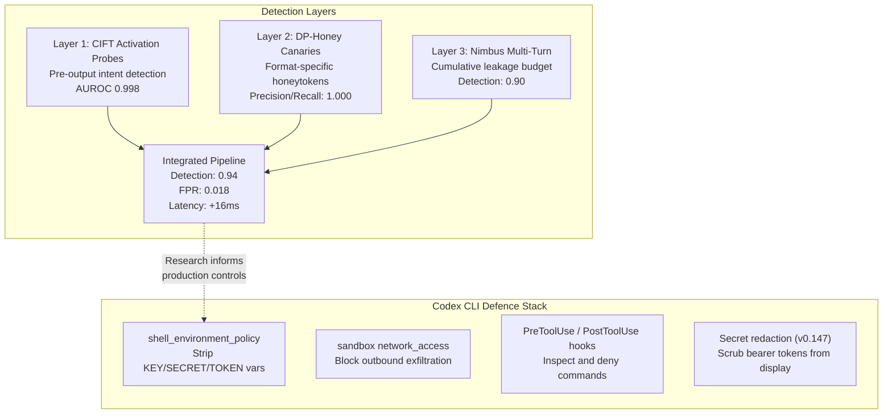
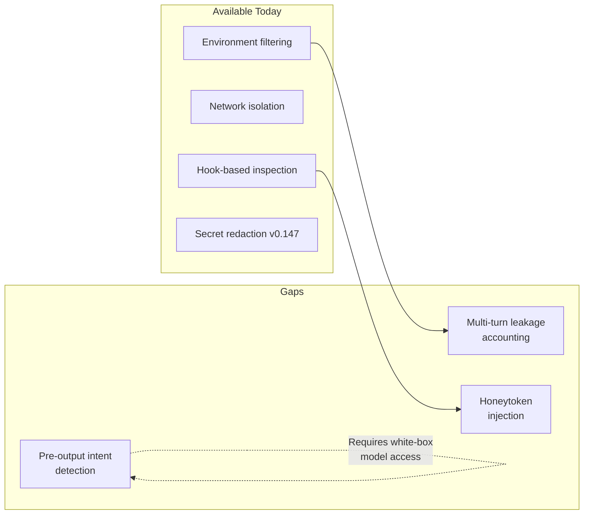

# Credential Exfiltration Defence in Depth: From Activation Probes to Codex CLI's Shell Environment Policy


---

Every coding agent session is a credential exfiltration opportunity. The agent reads your codebase, executes shell commands, queries MCP servers — and does it all inside a context window that may also contain untrusted content from pull-request descriptions, issue comments, or retrieved documentation. Recent research quantifies the threat and proposes detection layers that map cleanly onto Codex CLI's existing security surface. This article connects the dots.

## The Scale of the Problem

Chen et al.'s large-scale empirical study of 17,022 skills sampled from the SkillsMP marketplace found 520 vulnerable implementations containing 1,708 credential leakage issues [^1]. The taxonomy identifies ten distinct leakage patterns — four accidental, six adversarial. Debug logging dominates: `print` and `console.log` statements cause 73.5% of leaks because stdout is captured directly into the LLM context window [^1]. Critically, 89.6% of leaked credentials are exploitable without additional privileges, and forks retain secrets even after upstream fixes [^1].

The threat is not theoretical. At Black Hat USA 2026 on 5 August, Elad Meged of Novee Security demonstrated that a single GitHub issue — opened by an account with zero repository privileges — was sufficient to reach CI runner secrets in the vendors' own repositories for Claude Code, Gemini CLI, and OpenAI Codex [^2]. The Gemini CLI vulnerability (CVE-2026-12537, CVSS 4 score: 10.0) allowed OS command injection via a crafted `.gemini/.env` file before the sandbox even started [^2].

## Three Detection Layers: The CITA Framework

Chauhan and Revankar's "Caught in the Act(ivation)" paper proposes three complementary detection mechanisms that, taken together, cover the full exfiltration lifecycle [^3]:

### 1. Activation Probes (CIFT)

Rather than scanning output text for credential patterns, CIFT (Credential Intent Feature Tracking) trains lightweight linear probes on intermediate activation vectors to detect credential-seeking intent *before output tokens are emitted*. On Qwen-2.5-7B, the probe achieves an AUROC of 0.998 and F1 of 0.990 with a false-positive rate of just 0.015 [^3]. For comparison, substring matching manages only 0.73 AUROC, semantic embedding reaches 0.90, and LlamaGuard hits 0.85 with an FPR of 0.18 [^3].

The architecture is remarkably lightweight: K=8 layers monitored, 9,473 trainable parameters total. The catch is that it requires white-box model access — feasible for self-hosted open-weight models, not for API-only providers.

### 2. Honeytokens (DP-Honey)

The second layer constructs format-specific canary credentials — fake API keys, database connection strings, OAuth tokens — that look structurally valid but are detectable by the monitoring system. Detection uses split conformal prediction to calibrate detection thresholds, achieving precision and recall of 1.000, with coverage of 0.998 when conformal calibration is applied [^3].

### 3. Multi-Turn Leakage Tracking (Nimbus)

Per-turn detectors miss gradual exfiltration — an attacker who leaks two characters per turn across twenty turns. Nimbus treats multi-turn exfiltration as a cumulative information-flow problem, tracking an estimated leakage budget across the full conversation. In a synthetic suite of 50 conversations (20 turns each), Nimbus achieved a 0.90 detection rate with zero false-positive blocks and a mean detection turn of 9.0, compared to LlamaGuard's per-turn detection rate of 0.12 [^3].



## Mapping to Codex CLI's Defence Stack

Codex CLI cannot embed activation probes — it calls models via API, not self-hosted inference. But it implements a defence-in-depth strategy that covers the same threat surface through different mechanisms.

### Shell Environment Policy: Stop Credentials Entering the Context

The `[shell_environment_policy]` table in `config.toml` controls which environment variables reach subprocesses spawned by the agent [^4]:

```toml
[shell_environment_policy]
inherit = "core"               # Only PATH, HOME, SHELL, TERM
ignore_default_excludes = false # Keep the automatic KEY/SECRET/TOKEN filter

[shell_environment_policy.exclude]
patterns = ["AWS_*", "GITHUB_*", "DATABASE_*", "*.CREDENTIALS"]
```

Even with `inherit = "all"`, Codex applies an automatic filter that strips any variable whose name contains `KEY`, `SECRET`, or `TOKEN` (case-insensitive) [^4]. The `exclude` array adds glob-pattern overrides on top. This is the equivalent of the honeytoken layer — it prevents real credentials from ever reaching the agent's context window, making exfiltration a non-starter for the most common leakage vector.

### Sandbox Network Policy: Stop Credentials Leaving

If a credential does reach a subprocess despite environment filtering (for example, read from a `.env` file on disk), the sandbox network policy provides a second barrier [^5]:

```toml
[sandbox]
mode = "workspace-write"
network_access = false
```

With `network_access = false`, even a compromised subprocess cannot phone home. The environment policy stops credentials entering; the network policy stops them leaving.

### PreToolUse and PostToolUse Hooks: Runtime Inspection

Hooks provide programmable inspection points analogous to the CIFT activation probe — they intercept tool calls before and after execution [^5]:

```toml
[[hooks]]
event = "PreToolUse"
command = "python3 scripts/credential-guard.py"
timeout_ms = 5000
```

A `PreToolUse` hook can inspect the proposed command for credential patterns, `.env` file reads, or `curl` calls to unknown endpoints, and return `permissionDecision: "deny"` to block execution. However, a verified vulnerability in Codex CLI v0.144.1 revealed that the runtime display layer re-attaches raw tool arguments to the denial message, defeating hook-side redaction [^6]. The fix is to ensure your hook's denial reason does not repeat the blocked input, and to rely on the v0.147.0 secret-redaction layer that scrubs bearer tokens from displayed commands and replayed conversation history [^7].

### Secret Redaction in v0.147.0

Release 0.147.0 added automatic redaction of secrets and complete bearer tokens from displayed commands and replayed conversation history [^7]. This addresses terminal scrollback leakage — a vector the research papers do not cover but that is operationally significant when sessions are shared, recorded, or piped to logging infrastructure.

## A Practical Defence Configuration

Combining the research insights with Codex CLI's controls, here is a production-hardened configuration:

```toml
# config.toml — credential exfiltration defence

[model]
model = "o3"

[sandbox]
mode = "workspace-write"
network_access = false

[shell_environment_policy]
inherit = "core"
ignore_default_excludes = false

[shell_environment_policy.exclude]
patterns = [
    "AWS_*", "AZURE_*", "GCP_*", "GITHUB_*",
    "DATABASE_*", "DB_*", "MONGO_*", "REDIS_*",
    "*_KEY", "*_SECRET", "*_TOKEN", "*_PASSWORD",
    "OPENAI_API_KEY", "ANTHROPIC_API_KEY"
]

[shell_environment_policy.inject]
# Provide only the variables the agent genuinely needs
NODE_ENV = "development"
CI = "false"

[[hooks]]
event = "PreToolUse"
command = "python3 .codex/credential-guard.py"
timeout_ms = 3000

[[hooks]]
event = "PostToolUse"
command = "python3 .codex/output-scanner.py"
timeout_ms = 3000
```

The `inject` table is worth noting — it lets you provide non-sensitive variables the agent needs without inheriting the full shell environment.

## What Codex CLI Still Lacks

The research highlights three gaps in Codex CLI's current credential defence:

1. **No multi-turn leakage accounting.** Nimbus tracks cumulative information flow across conversation turns; Codex CLI hooks are stateless per-invocation. A determined attacker could exfiltrate a 40-character API key two characters at a time across twenty tool calls, and no single hook invocation would flag it. Stateful hook implementations that persist a leakage budget to disk would partially close this gap.

2. **No honeytoken injection.** Codex CLI could inject canary credentials into the agent's environment and monitor for their appearance in tool calls or network requests. The DP-Honey approach achieves perfect precision and recall [^3], and injecting canaries via `[shell_environment_policy.inject]` is already mechanically possible.

3. **No pre-output intent detection.** CIFT's activation probes require white-box model access, which API consumers do not have. Until OpenAI exposes intermediate activations (unlikely) or ships a built-in credential-intent classifier, this layer remains out of reach for Codex CLI users.



## Conclusion

The credential exfiltration threat to coding agents is empirically validated: 3.1% of marketplace skills leak credentials, 73.5% of leaks come from debug logging into stdout, and CI runner secrets can be reached through a single untrusted GitHub issue. The academic response — activation probes, honeytokens, and multi-turn leakage tracking — achieves impressive detection rates but requires white-box model access for the strongest layer.

Codex CLI's defence stack takes a different but complementary approach: prevent credentials entering the context (shell environment policy), prevent them leaving (sandbox network policy), inspect tool calls at runtime (hooks), and scrub them from display (v0.147.0 redaction). The combination is not perfect — stateful multi-turn tracking and honeytoken injection are feasible additions that would close the remaining gaps — but it provides a practical, deployable defence that senior engineers can configure today.

---

## Citations

[^1]: Chen, Z. et al., "Credential Leakage in LLM Agent Skills: A Large-Scale Empirical Study," arXiv:2604.03070v2, June 2026. [https://arxiv.org/abs/2604.03070](https://arxiv.org/abs/2604.03070)

[^2]: Meged, E. (Novee Security), "If You Run These Automations, You're Exposed Too: Critical Flaws in Anthropic, Google, and OpenAI's Coding Agents," Black Hat USA 2026, 5 August 2026. [https://novee.security/blog/critical-flaws-in-anthropic-google-and-openais-coding-agents/](https://novee.security/blog/critical-flaws-in-anthropic-google-and-openais-coding-agents/)

[^3]: Chauhan, K. and Revankar, P., "Caught in the Act(ivation): Toward Pre-Output and Multi-Turn Detection of Credential Exfiltration by LLM Agents," arXiv:2606.04141, June 2026. [https://arxiv.org/abs/2606.04141](https://arxiv.org/abs/2606.04141)

[^4]: OpenAI, "Codex CLI Shell Environment Policy," Codex CLI documentation, 2026. [https://developers.openai.com/codex/cli](https://developers.openai.com/codex/cli)

[^5]: OpenAI, "Codex CLI Security: Sandbox Modes and Approval Policies," Codex CLI documentation, 2026. [https://developers.openai.com/codex/cli](https://developers.openai.com/codex/cli)

[^6]: "Your Codex Hook's Sanitized Denial May Still Leak Your Raw Command — Here's How to Check," TerminalBlog, 2026. [https://terminalblog.com/blog/codex-pretooluse-hook-raw-command-leak/](https://terminalblog.com/blog/codex-pretooluse-hook-raw-command-leak/)

[^7]: OpenAI, "Codex CLI v0.147.0 Release Notes," GitHub, August 2026. [https://github.com/openai/codex/releases/tag/rust-v0.147.0](https://github.com/openai/codex/releases/tag/rust-v0.147.0)
