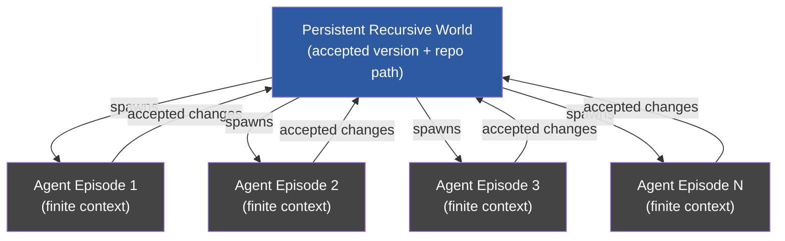
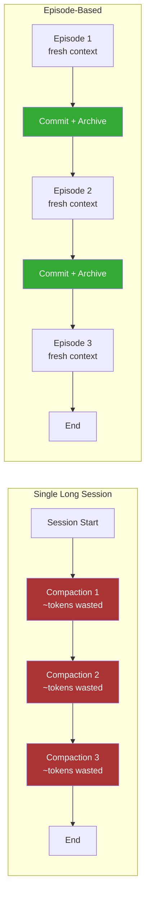

# Persistent Recursive Worlds and Autonomous Software Evolution: What a 250k-Line Compiler Built by Finite-Lived Agents Means for Codex CLI's Session Architecture


---

## The Persistence Problem

Every coding agent eventually hits a wall. Context windows fill, sessions timeout, and accumulated state evaporates. A single Codex CLI session can run for up to seven hours before context compaction becomes unsustainable [^1], yet real software projects span weeks, months, or years. The dominant limitation of AI agents in 2026 is not intelligence — it is continuity [^2].

Huang, Liang, Zheng, and Cheng's "Persistent Recursive Worlds Enable Autonomous Software Evolution" (arXiv:2608.10450, August 11, 2026) confronts this gap directly [^3]. Their Genesis system produced a 250,000-line Rust-based C compiler across 120+ hours and over 1,000 agent episodes, at a total cost of US\$44 in model-token charges. A separate experiment converted 13 MESA stellar astrophysics modules — over 100,000 lines of legacy Fortran — into nearly 90,000 lines of Rust, achieving median performance speedups between 1.55× and 6.87× across six numerical workloads [^3].

The architectural insight is deceptively simple: make the *project* persistent, not the *agent*.

## The Genesis Architecture

Genesis inverts the conventional assumption that agent longevity is the path to long-horizon software engineering. Instead, agents are explicitly finite-lived — each episode runs within a bounded context window, receives a task, and terminates. The persistent entity is the *recursive world*: a combination of an accepted codebase version and a repository path.



Each episode follows a strict lifecycle:

1. The agent receives the current accepted version and a task specification.
2. It proposes modifications or generates new code.
3. Compilation and test suites gate acceptance — only passing changes advance the persistent version.
4. The agent terminates. The world persists.

The recursive delegation model allows work to branch across repository paths, with sub-worlds handling sub-tasks independently. Only accepted consequences propagate upward. This mirrors how human teams already work — short-lived contributors against a long-lived codebase — but formalises it as an agent architecture.

## Why This Matters: The Numbers

The compiler result is particularly striking. Using DeepSeek V4 Flash as the underlying model, Genesis:

- Built approximately 250,000 tracked lines of a Rust-based C compiler [^3]
- Passed the complete c-testsuite and most LLVM and Csmith property-based tests [^3]
- Consumed over 1,000 agent episodes across 120+ hours [^3]
- Cost US\$44 in total model-token charges [^3]

A second compiler implementation using GLM 5.2 maintained full test performance despite repeated agent replacement [^3], demonstrating that model portability is a natural consequence of the architecture — the persistent world encodes the project state, not the agent's memory.

The MESA Fortran-to-Rust translation is equally significant. MESA (Modules for Experiments in Stellar Astrophysics) is a widely used stellar evolution code with complex numerical routines [^4]. Converting 13 modules from legacy Fortran to idiomatic Rust — while achieving 1.55× to 6.87× speedups — required sustained reasoning across thousands of interdependent functions, precisely the scenario where single-session agents fail.

## Mapping Genesis to Codex CLI's Session Lifecycle

Codex CLI already implements several primitives that approximate the Genesis pattern, though not yet as a unified architecture.

### Session Archive, Resume, and Fork

Codex CLI's session lifecycle has five stages: create → work → compact → archive → restore [^1]. Archived sessions are protected from accidental resume or fork until explicitly restored. Forking creates a fully self-contained session — events up to the fork point are copied into a new `transcript.jsonl`, not symlinked [^5].

This maps directly to Genesis's accepted-version branching:

| Genesis Concept | Codex CLI Equivalent |
|---|---|
| Persistent recursive world | Git repository + `AGENTS.md` + session archive |
| Agent episode | Single Codex CLI session |
| Accepted version gate | Test suite execution via PostToolUse hooks |
| Recursive delegation | Session fork (`/fork`) |
| Episode termination | Session archive (`/archive`) |

### Context Compaction as Episode Boundary

Genesis's finite-lived agents sidestep context window exhaustion entirely — each episode starts fresh. Codex CLI's `model_auto_compact_token_limit` (default: 80% of window capacity) triggers automatic compaction when the context fills [^6], but compaction is lossy. Prior summaries are discarded, and only the most recent 20,000 tokens of user messages are preserved [^6].

The Genesis architecture suggests a more radical approach: treat compaction as an *episode boundary*. Rather than summarising and continuing, a Codex CLI session could:

1. Commit accepted changes to the repository.
2. Archive the current session.
3. Spawn a new session against the updated codebase.

This pattern is already achievable manually:

```bash
# End of episode: commit accepted state
git add -A && git commit -m "episode-42: implement parser module"

# Archive current session
codex archive

# Start fresh episode against committed state
codex --resume-from-agents-md
```

### AGENTS.md as World State

In Genesis, the persistent world carries an accepted version and repository path. In Codex CLI, `AGENTS.md` serves as the persistent context that survives across sessions — it is re-read on every turn and survives compaction intact [^6]. This makes it the natural location for encoding world state between episodes:

```markdown
<!-- AGENTS.md — episode state -->
## Current Sprint
- [ ] Parser: complete expression handling (episodes 40-42)
- [x] Lexer: all token types implemented (episodes 1-15)
- [x] AST: node types defined (episodes 16-25)

## Architectural Decisions
- Using recursive descent parser (decided episode 22)
- Error recovery via synchronisation tokens (decided episode 31)

## Known Issues
- Floating-point literal parsing fails on denormalised values
- String escape sequences incomplete — see test_escapes.rs
```

### PostToolUse Hooks as Acceptance Gates

Genesis gates every proposed change through compilation and test suites before accepting it into the persistent version. Codex CLI's `PostToolUse` hooks provide the same mechanism [^7]:

```toml
# requirements.toml — acceptance gate
[post_tool_use.shell]
check = "cargo test --quiet 2>&1 | tail -1"
on_fail = "reject"
message = "All tests must pass before changes are accepted"
```

This ensures that each agent episode can only advance the codebase through passing changes — the same invariant Genesis enforces structurally.

## The Cost Equation

Genesis's US\$44 for a 250,000-line compiler challenges the economics of single-session development. Current Codex CLI pricing with `o3` or `o4-mini` makes sustained multi-hour sessions expensive, particularly when context compaction triggers repeated summarisation passes.

The episode-based model offers a different cost profile:



Each compaction pass consumes tokens to summarise the existing context, and the summarised output is itself lossy. Episode boundaries, by contrast, externalise state to the repository and `AGENTS.md` — no tokens wasted on re-summarisation, and no information lost.

Genesis used DeepSeek V4 Flash at US\$44 for 120+ hours. Even accounting for Codex CLI's typically higher per-token costs with `o3`, an episode-based workflow with cheap models for routine tasks and expensive models for architectural decisions — achievable via Codex CLI's named profiles [^7] — could substantially reduce total cost for long-horizon projects.

## Practical Implementation: Episode-Based Codex CLI Workflow

For teams wanting to adopt persistent-world patterns today, the following workflow approximates Genesis's architecture using existing Codex CLI features:

```bash
#!/bin/bash
# episode.sh — run a single development episode

EPISODE_NUM=$1
TASK_DESC=$2

# Start fresh session with episode context
codex \
  --model o4-mini \
  --approval-mode suggest \
  --input "Episode ${EPISODE_NUM}: ${TASK_DESC}. Read AGENTS.md for project context and current state. Run tests before committing any changes."

# After session ends, update episode log
echo "Episode ${EPISODE_NUM}: ${TASK_DESC} — $(date)" >> .codex/episode-log.md

# Commit accepted state
git add -A
git commit -m "episode-${EPISODE_NUM}: ${TASK_DESC}"
```

Combined with a CI pipeline that validates each episode's output, this creates the same accept-or-reject gate that Genesis uses structurally.

## Limitations and Open Questions

Genesis's architecture is not without gaps. The paper does not address:

- **Inter-episode knowledge transfer beyond code.** When an agent discovers that a particular approach fails, that negative knowledge is lost unless explicitly encoded in `AGENTS.md` or comments. ⚠️
- **Coordination across concurrent episodes.** Genesis's recursive delegation handles branching, but Codex CLI's session model does not yet support structured multi-agent coordination with merge conflict resolution.
- **Acceptance gate coverage.** Test suites can only gate for properties they test. Genesis's c-testsuite and Csmith coverage is strong for compilers, but many domains lack equivalent property-based testing infrastructure.

The deeper question is whether Codex CLI should adopt episode-based operation as a first-class primitive — an `--episode` flag that automatically commits, archives, and spawns fresh sessions at compaction boundaries — rather than leaving users to implement the pattern manually.

## Conclusion

Genesis demonstrates that the path to autonomous long-horizon software engineering runs through *project persistence*, not agent persistence. The 250,000-line compiler and 100,000-line Fortran-to-Rust translation are existence proofs that finite-lived agents, properly orchestrated against a persistent codebase, can sustain development efforts that no single context window could contain.

Codex CLI already has the primitives — session archiving, forking, `AGENTS.md`, PostToolUse hooks, named profiles — but they require manual orchestration. The gap between Codex CLI's current session lifecycle and Genesis's persistent recursive worlds is an implementation gap, not an architectural one. Closing it would move Codex CLI from a tool that assists with tasks to an engine that sustains projects.

---

## Citations

[^1]: OpenAI, "Codex CLI Session Lifecycle: Archive, Resume, Fork, and Compact," Codex CLI documentation, June 2026. [https://codex.danielvaughan.com/2026/06/05/codex-cli-session-lifecycle-archive-resume-fork-compact-management/](https://codex.danielvaughan.com/2026/06/05/codex-cli-session-lifecycle-archive-resume-fork-compact-management/)

[^2]: Zylos Research, "Long-Horizon Agent Goal Persistence: Cross-Session Continuity and Multi-Day Task Architecture," May 2026. [https://zylos.ai/research/2026-05-15-long-horizon-agent-goal-persistence/](https://zylos.ai/research/2026-05-15-long-horizon-agent-goal-persistence/)

[^3]: Huang, B., Liang, Z., Zheng, B., and Cheng, R., "Persistent Recursive Worlds Enable Autonomous Software Evolution," arXiv:2608.10450, August 11, 2026. [https://arxiv.org/abs/2608.10450](https://arxiv.org/abs/2608.10450)

[^4]: Paxton, B. et al., "Modules for Experiments in Stellar Astrophysics (MESA)," The Astrophysical Journal Supplement Series, 2011. [https://docs.mesastar.org/](https://docs.mesastar.org/)

[^5]: OpenAI, "Codex CLI Session Persistence: Resume, Fork, and Analytics," Codex CLI documentation, April 2026. [https://codex.danielvaughan.com/2026/04/13/codex-cli-session-persistence-resume-fork-analytics/](https://codex.danielvaughan.com/2026/04/13/codex-cli-session-persistence-resume-fork-analytics/)

[^6]: OpenAI, "Codex CLI Context Compaction: Architecture, Configuration, and Managing Long Sessions," Codex CLI documentation, March 2026. [https://codex.danielvaughan.com/2026/03/31/codex-cli-context-compaction-architecture/](https://codex.danielvaughan.com/2026/03/31/codex-cli-context-compaction-architecture/)

[^7]: OpenAI, "Release 0.147.0," GitHub, August 7, 2026. [https://github.com/openai/codex/releases/tag/rust-v0.147.0](https://github.com/openai/codex/releases/tag/rust-v0.147.0)
