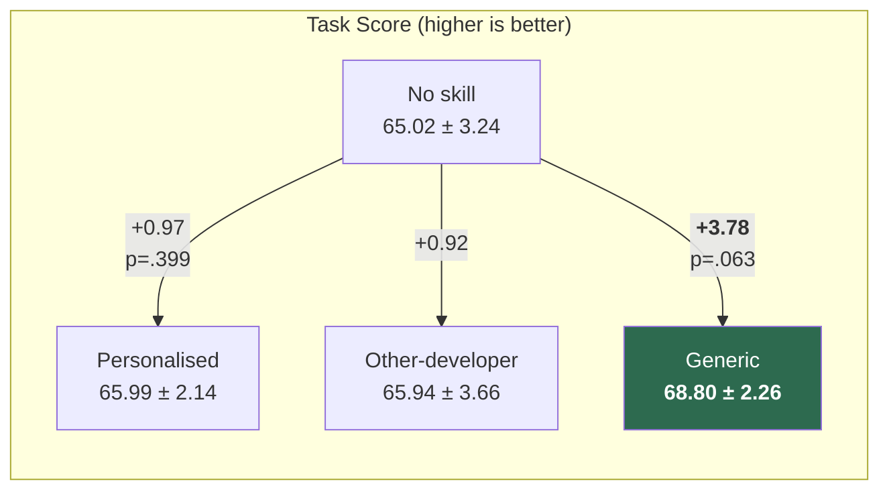
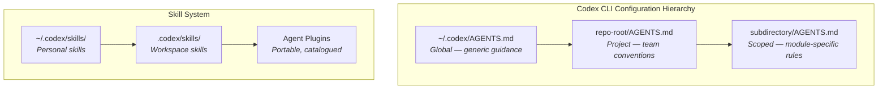

# Do Personalized Skills Help Coding Agents? Why Generic Guidance Outperforms Developer-Specific Preferences — and What It Means for Your AGENTS.md and Skill Catalog in Codex CLI

---

Every coding-agent configuration system — Codex CLI's AGENTS.md, Claude Code's CLAUDE.md, Cursor Rules — rests on an implicit bet: that encoding *your* preferences into the agent's context makes it work better *for you*. Huang, Du & Lan's August 2026 study "Do Personalized Skills Help Coding Agents?" tests that bet empirically across 206 real-world sessions, and the result is counterintuitive: **generic skills pooled across developers outperform personalised ones by a wide margin** [^1].

This article unpacks the findings, maps them onto Codex CLI's skill and plugin architecture, and offers concrete configuration guidance for teams deciding what belongs in their AGENTS.md, personal SKILL.md files, and workspace plugin catalogs.

---

## The Study: 206 Sessions, 13 Developers, Four Conditions

The researchers drew interaction traces from the SWE-chat dataset — the first large-scale corpus of real coding-agent sessions collected from open-source developers in the wild, comprising over 63,000 user prompts and 355,000 tool calls across 6,000+ sessions [^2]. After filtering for quality and minimum developer history, they retained 206 sessions from 13 developers, split 80/20 into evolution and test sets [^1].

Four conditions were compared:

| Condition | Description |
|-----------|-------------|
| **No skill** | Baseline — no SKILL.md injected |
| **Personalised skill** | SKILL.md distilled from that developer's own interaction history |
| **Other-developer skill** | SKILL.md from a randomly selected different developer |
| **Generic skill** | SKILL.md pooled across all developers' interaction traces |

Skills were generated through a two-stage pipeline: rule-based bootstrapping extracted recurring patterns across five dimensions (communication style, work approach, follow-up handling, validation preferences, commit behaviour), followed by evidence-grounded LLM refinement that retained only rules supported by at least two independent turns from different sessions [^1].

---

## The Results: Generic Wins, Personalisation Barely Registers

The headline numbers tell a clear story [^1]:

- **Generic skills** improved task scores by **+3.78 points** with a 50.95% win rate against the baseline — the largest and most consistent gain.
- **Personalised skills** managed only **+0.97 points** (not statistically significant at p=.399), with a win/loss split of 41.43%/43.81% — essentially a coin flip.
- **Other-developer skills** performed comparably to personalised ones (+0.92), suggesting that individual developer identity contributes minimal signal.

The finding that a *random stranger's* preferences work as well as your own is striking. It implies that what matters in skill files is not *whose* preferences they capture, but whether they encode **broadly transferable procedural knowledge** — testing patterns, validation approaches, communication norms [^1].

---

## The Frequency Threshold: When Personalisation Actually Works

The study did find one condition where personalised skills dramatically outperformed: when the developer had **six or more prior sessions** relevant to the current task [^1].

| Relevant prior sessions | Personalised skill advantage |
|--------------------------|------------------------------|
| 0 | **−6.33** (harmful) |
| 1–2 | 0.00 |
| 3–5 | +0.10 |
| ≥6 | **+10.17** |

This creates a sharp bimodal distribution. For most developers most of the time, personalised skills are noise — or worse, actively harmful when applied to unfamiliar task types. But for developers with deep, consistent history in a narrow problem domain, personalisation delivers a substantial +10.17-point uplift [^1].

The practical implication is clear: **personalised skills are a specialisation tool, not a general-purpose improvement**.

---

## What Skills Actually Contain

Examining the generated skill files reveals a structural difference between personalised and generic variants [^1]:

| Property | Personalised (avg) | Generic |
|----------|---------------------|---------|
| Rules | 14.15 | 25 |
| Total words | 236 | 383 |
| Workflow rules | 30.4% | — |
| Follow-up handling | 28.3% | — |
| Communication style | 23.4% | — |
| Validation | 10.3% | — |
| Commit behaviour | 7.6% | 16.0% |

Generic skills are 1.77× larger, containing more rules that generalise across developers. They disproportionately encode commit-related guidance (16.0% vs 7.6%), which represents the kind of procedural knowledge that transfers well — how to structure commits, when to run tests, how to validate changes [^1].

---

## Mapping to Codex CLI's Configuration Stack

Codex CLI provides a three-tier configuration hierarchy that maps directly onto the study's findings [^3] [^4]:

### AGENTS.md Is Your Generic Skill Layer

The study's strongest recommendation — that broadly transferable procedural knowledge outperforms individual preferences — validates how most effective teams already use AGENTS.md. Your project-root AGENTS.md should encode **shared conventions**: testing requirements, commit message formats, code review standards, architectural boundaries [^3].

What the study suggests you should *not* do is fill AGENTS.md with one developer's personal style preferences. Those belong in personal skills — if they belong anywhere.

### Personal Skills (~/.codex/skills/) Are the Personalisation Layer

Codex CLI's personal skills directory maps to the study's personalised skill condition. The evidence says these deliver value only when:

1. You have deep, consistent history in a narrow domain (≥6 relevant prior sessions)
2. The skills encode domain-specific procedural knowledge, not just communication style

For most developers, keeping personal skills minimal — or absent — is the empirically supported default [^1].

### Workspace Skills and Agent Plugins Are the Pooling Mechanism

The v0.147.0 release introduced portable Agent Plugins with federated catalog search across local, personal, workspace, and remote catalogs [^5]. This is precisely the infrastructure the study's results call for: **pooling generic skills across developers** rather than crafting individual ones.

The workspace catalog (`.codex/skills/` and workspace-scoped plugins) is where teams should invest their configuration effort. Skills shared at the workspace level naturally become generic — they encode what works for the *team*, not any individual, and the study shows this is where the largest gains lie [^1] [^5].

---

## The Hidden Cost: Skills Increase Compute Without Reducing Interaction

One finding teams should factor into their cost models: skills increased computational cost without reducing the number of human interactions [^1].

| Metric | No skill | Personalised | Generic |
|--------|----------|--------------|---------|
| Agent turns | 1.29 | 1.37 | 1.33 |
| Tool calls | 8.47 | 9.46 | 9.21 |
| Execution time (s) | 91.76 | 106.16 | 99.83 |

Skills made agents more thorough — test command groups rose from 0.56 to 0.97, and successful validation runs climbed from 43.1% to 58.9% — but they did so by consuming more tokens and more time. In Codex CLI terms, this means your `model_auto_compact_token_limit` and `tool_output_token_limit` settings in `config.toml` interact with skill length: longer skills consume more of the context budget and drive more tool calls [^1] [^6].

The practical mitigation: keep skills concise. The study's personalised skills averaged 236 words (14 rules); the generic skill was 383 words (25 rules). Both are well within Codex CLI's default `project_doc_max_bytes` ceiling of 32 KiB, but teams should treat that ceiling as a budget, not a target [^3].

---

## A Practical Configuration Checklist

Based on the study's evidence, here is how to structure your Codex CLI skill investment:

**1. Start with a strong project AGENTS.md (generic layer)**
Encode testing requirements, commit conventions, architectural boundaries, and validation expectations. This is where the +3.78-point generic skill advantage lives.

**2. Use workspace plugins for team conventions**
Share testing patterns, code review standards, and follow-up handling via workspace-scoped plugins. The v0.147.0 multi-catalog federation makes this straightforward [^5].

**3. Reserve personal skills for narrow specialisations**
Only invest in personal SKILL.md files if you work in a consistent problem domain with substantial history. For most developers, the baseline (no personal skill) performs within noise of the personalised condition [^1].

**4. Avoid encoding communication style preferences**
Communication style accounted for 23.4% of personalised skill rules but contributed minimal signal. Focus rules on *what the agent should do* (run tests, check types, verify boundaries), not *how it should talk* [^1].

**5. Monitor token cost**
Skills drive more tool calls and longer execution. Use `codex config set model_auto_compact_token_limit` to bound context growth, and review `codex usage` output to track whether skill-driven thoroughness is worth the additional cost [^6].

---

## Limitations and Open Questions

The study acknowledges important constraints. Only 13 developers contributed enough sessions for analysis, and the personalised condition had a median of just 16 evolution sessions per developer — potentially too few for stable preference extraction [^1]. The evaluation used an LLM-based developer simulator rather than real humans, achieving 89.47% semantic consistency but potentially smoothing over real interaction friction [^1].

The biggest open question for Codex CLI teams: **does skill effectiveness change with larger interaction corpora?** As SWE-chat continues to grow (it is a living dataset with an automatic collection pipeline [^2]), future studies with hundreds of developers and thousands of sessions per developer may find that personalisation eventually catches up. For now, the evidence favours generic.

⚠️ The study evaluated skills on a single coding agent framework (not Codex CLI specifically), and performance differences may vary across harnesses with different context injection mechanisms.

---

## Citations

[^1]: Huang, S., Du, K. & Lan, A. (2026). "Do Personalized Skills Help Coding Agents?" arXiv:2608.10319. [https://arxiv.org/abs/2608.10319](https://arxiv.org/abs/2608.10319)

[^2]: SWE-chat: Coding Agent Interactions From Real Users in the Wild. arXiv:2604.20779. [https://arxiv.org/abs/2604.20779](https://arxiv.org/abs/2604.20779)

[^3]: Codex CLI AGENTS.md and Skills Setup Guide. Agensi (2026). [https://www.agensi.io/learn/codex-cli-agents-md-complete-guide](https://www.agensi.io/learn/codex-cli-agents-md-complete-guide)

[^4]: The Codex CLI Customisation Stack: How AGENTS.md, Skills, MCP, Subagents, and Plugins Compose Into One System. Codex Knowledge Base (2026). [https://codex.danielvaughan.com/2026/04/12/codex-cli-customisation-stack-unified-system/](https://codex.danielvaughan.com/2026/04/12/codex-cli-customisation-stack-unified-system/)

[^5]: Codex CLI v0.147.0: Portable Agent Plugins, Multi-Catalog Federation, and the --approve-for-me Flag. Codex Knowledge Base (2026). [https://codex.danielvaughan.com/2026/08/10/codex-cli-v0147-portable-agent-plugins-multi-catalog-federation-approve-for-me-conversation-sections/](https://codex.danielvaughan.com/2026/08/10/codex-cli-v0147-portable-agent-plugins-multi-catalog-federation-approve-for-me-conversation-sections/)

[^6]: Codex CLI Guide 2026: Setup, Sandbox, AGENTS.md & MCP. Blake Crosley (2026). [https://blakecrosley.com/guides/codex](https://blakecrosley.com/guides/codex)
