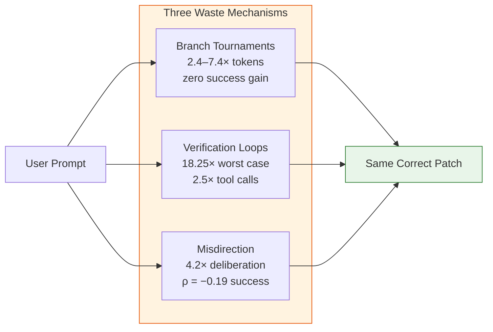
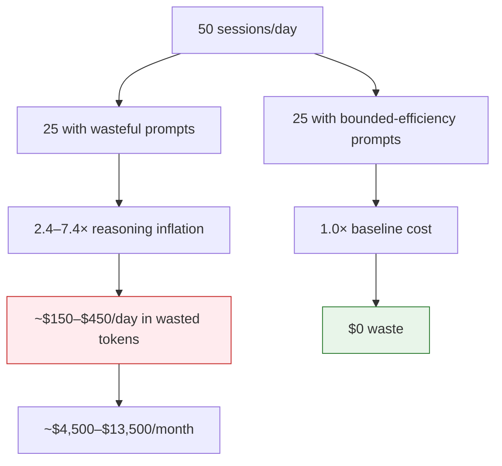

# Prompt-Induced Waste in Coding Agents: Why Your Instructions Are Burning Tokens — and How Bounded-Efficiency Prompts Cut the Bill in Codex CLI


---

## The Problem You Cannot See

Every developer who has used a coding agent has, at some point, written an instruction like "think carefully and consider multiple approaches before implementing." It feels responsible — thorough, even. The paper *Same Task, Different Work: Prompt-Induced Waste in Coding Agents* by Weinberger and Hozez (arXiv:2608.01347, August 2026) demonstrates that this instinct is quietly multiplying your token bill by up to 7.4× without improving outcomes [^1].

The core finding is deceptively simple: two prompts requesting the same code change can produce the same correct patch, yet cause the agent to perform radically different amounts of work. The waste is invisible because the output looks identical — the damage shows up only in your usage dashboard.

## The Three Waste Mechanisms

The study, spanning 4,644 valid runs across 24 deterministic tasks and seven reasoning models, identifies three distinct waste mechanisms [^1]:

### Branch Tournaments (Token-Borne Waste)

Asking an agent to "develop and compare several approaches" is the single most consistently wasteful instruction the researchers found. Across all six open-weight models in the frozen holdout, it inflated reasoning tokens by 2.4–7.4× [^1]. In 2,801 condition-blind annotated traces, the instruction produced roughly three elaborated but discarded solution branches and exactly one implemented approach — the same one the agent would have chosen without the instruction.

### Verification Loops (Tool-Borne Waste)

Instructions demanding maximum certainty — phrases like "be absolutely certain" or "verify thoroughly" — trigger a different pathology. The worst observed case hit 18.25× the clean-run median cost, executed 2.5× more tool calls, and ran 3× longer on the wall clock [^1]. The agent enters a loop of re-reading files it has already read, re-running tests it has already passed, and generating redundant assertions. Success rate: unchanged.

### Misdirection (Deliberation-Borne Waste)

Plausible but incorrect hints ("this might be a threading issue") increase pre-edit deliberation by 4.2× and show a negative correlation with success (ρ = −0.19) [^1]. The agent spends tokens investigating a false lead before arriving at the same conclusion it would have reached unprompted.



## Harness Amplification: Why Codex CLI Configuration Matters

The paper tested two harnesses: PI.DEV (Earendil Works) and Claude Code (Anthropic). The difference in baseline cost per successful task ranged from 5× to 30× depending on harness [^1]. This is not a model problem — it is a harness problem. The static prefix, turn count, and tool composition of your agent scaffold often dominate the user-prompt effect.

For Codex CLI users, this means your `config.toml` settings and `AGENTS.md` instructions are not peripheral concerns. They are the primary lever for cost control.

| Harness | Prefix Tokens | Median Turns | Test Executions |
|---------|--------------|--------------|-----------------|
| PI.DEV | 1,147–1,642 | 5–7 | 22% |
| Claude Code | 15,983–20,330 | 2–7× more | 52% |

The lesson: a lean harness prefix and bounded turn count can reduce cost by an order of magnitude before prompt engineering enters the picture.

## The Bounded-Efficiency Template

The paper's most actionable contribution is a prompt template that eliminates measured waste mechanisms while preserving diagnostic and validation behaviour. Across all six holdout models, it scored 0.98–1.06× baseline cost — effectively cost-neutral — with no success degradation [^1]:

> Work efficiently: begin with the failing test and the most likely implementation files; inspect additional files only when evidence requires it; avoid unrelated cleanup; make the smallest sufficient change; run the relevant tests; stop as soon as the acceptance criteria pass.

This template succeeds because it specifies three things simultaneously: **scope** (failing test + likely files), **acceptance criteria** (tests pass), and a **stop condition** (stop when criteria met). Generic instructions like "think deeply" lack all three.

## Wiring Bounded Efficiency into Codex CLI

### AGENTS.md: Your Project-Level Efficiency Policy

The bounded-efficiency template belongs in your `AGENTS.md` file, where it governs every session without requiring per-prompt discipline. Lulla et al. found that well-written `AGENTS.md` files reduce median runtime by 28.64% and output token consumption by 16.58% [^2]. Combined with the Weinberger–Hozez findings, the compounding effect is substantial.

```toml
# ~/.codex/config.toml — lean defaults

# Trigger compaction before the window fills
model_auto_compact_token_limit = 200000

# Truncate verbose tool output
tool_output_token_limit = 12000
```

The `model_auto_compact_token_limit` setting controls when Codex CLI summarises the conversation history to reclaim context space [^3]. A lower value triggers compaction earlier, preventing the stale-context accumulation that verification loops exploit. The `tool_output_token_limit` truncates tool output before it enters the context, directly capping the tool-borne waste mechanism.

### A Practical AGENTS.md Anti-Waste Section

```markdown
## Efficiency Policy

- Begin with the failing test and the most likely implementation files.
- Inspect additional files only when evidence requires it.
- Avoid unrelated cleanup, refactoring, or cosmetic changes.
- Make the smallest sufficient change that satisfies the acceptance criteria.
- Run the relevant test suite once. If tests pass, stop.
- Do not generate alternative implementations unless explicitly asked.
- Do not re-read files already in context.
```

This directly addresses all three waste mechanisms: it forbids branch tournaments ("do not generate alternative implementations"), caps verification loops ("run the relevant test suite once"), and discourages misdirection-chasing ("inspect additional files only when evidence requires it").

### Named Profiles for Cost-Tiered Workflows

Not every task demands the same efficiency posture. Exploratory work benefits from broader reasoning; a CI hotfix does not. Codex CLI's named profiles let you encode this distinction [^4]:

```toml
# ~/.codex/config.toml

[profile.lean]
model = "gpt-5.6-luna"
model_auto_compact_token_limit = 150000
tool_output_token_limit = 8000

[profile.explore]
model = "gpt-5.6-terra"
model_auto_compact_token_limit = 300000
tool_output_token_limit = 20000
```

Use `codex --profile lean` for routine bug fixes where bounded efficiency applies, and `codex --profile explore` for architectural investigation where broader deliberation is justified. The key insight from the paper is that the "explore" style should be an explicit, deliberate choice — not the default.

### PostToolUse Hooks as a Waste Tripwire

Codex CLI's hook system can detect waste patterns at runtime. A `PostToolUse` hook that counts consecutive identical file reads or repeated test executions can flag verification loops before they consume thousands of tokens:

```toml
# .codex/hooks.toml

[[post_tool_use]]
tool = "shell"
command = "python3 .codex/hooks/detect-verification-loop.py"
```

```python
#!/usr/bin/env python3
"""Detect repeated tool calls that indicate a verification loop."""
import json, sys, os

state_file = "/tmp/codex-tool-history.json"

def load_history():
    if os.path.exists(state_file):
        with open(state_file) as f:
            return json.load(f)
    return []

def save_history(history):
    with open(state_file, "w") as f:
        json.dump(history[-20:], f)

tool_input = os.environ.get("CODEX_TOOL_INPUT", "")
history = load_history()
history.append(tool_input)
save_history(history)

# Flag if the same command appears 3+ times in the last 10 calls
recent = history[-10:]
for cmd in set(recent):
    if recent.count(cmd) >= 3:
        print(f"⚠️ Verification loop detected: '{cmd[:80]}' repeated {recent.count(cmd)} times", file=sys.stderr)
        sys.exit(2)  # exit 2 steers the agent away
```

The `exit 2` convention tells Codex CLI to steer the agent away from the current approach without terminating the session [^5], effectively implementing the paper's "stop condition" at the harness level.

## What the Numbers Mean in Practice

Consider a team running 50 Codex CLI sessions per day. If even half of those sessions contain a "think carefully and consider alternatives" instruction — a conservative estimate for teams without explicit prompt hygiene — the Weinberger–Hozez multipliers imply:



The bounded-efficiency template is not an optimisation — it is the removal of an accidental pessimisation. The paper's contribution is proving that the pessimisation exists, quantifying it, and demonstrating that a five-line instruction eliminates it without harming success rates.

## The Deeper Lesson: Prompt Discipline as Engineering Practice

The Weinberger–Hozez paper sits alongside a growing body of evidence that lean prompts outperform elaborate ones. TechTimes reported in July 2026 that GPT-5.6 lean system prompts improved evaluation scores by 10–15% while cutting total tokens by 41–66% and reducing API costs by 33–67% [^6]. The pattern is consistent: more instruction does not mean better results. It means more tokens.

For Codex CLI practitioners, the actionable takeaway is threefold:

1. **Audit your AGENTS.md** for branch-tournament triggers ("consider multiple approaches", "explore different solutions") and verification-loop triggers ("be absolutely certain", "double-check everything"). Remove them.
2. **Set explicit stop conditions** in every task prompt: what constitutes done, and what the agent should do when it gets there (stop).
3. **Use named profiles** to separate exploratory work from routine tasks, applying different cost budgets to each.

The waste is prompt-shaped. So is the fix.

## Citations

[^1]: Weinberger, S. & Hozez, A. (2026). "Same Task, Different Work: Prompt-Induced Waste in Coding Agents — A Preregistered Two-Harness Benchmark." *arXiv:2608.01347v3*. [https://arxiv.org/abs/2608.01347](https://arxiv.org/abs/2608.01347)

[^2]: Lulla, A. et al. (2026). "On the Impact of AGENTS.md Files on the Efficiency of AI Coding Agents." *arXiv:2601.20404*. [https://arxiv.org/abs/2601.20404](https://arxiv.org/abs/2601.20404)

[^3]: OpenAI. (2026). "Codex CLI Configuration Reference." *Codex CLI Documentation*. [https://learn.chatgpt.com/docs/codex/configuration](https://learn.chatgpt.com/docs/codex/configuration)

[^4]: OpenAI. (2026). "Codex CLI v0.147.0 Release Notes." *GitHub Releases*. [https://github.com/openai/codex/releases/tag/rust-v0.147.0](https://github.com/openai/codex/releases/tag/rust-v0.147.0)

[^5]: OpenAI. (2026). "Codex CLI Hooks Documentation — PreToolUse and PostToolUse." *Codex CLI Documentation*. [https://learn.chatgpt.com/docs/codex/hooks](https://learn.chatgpt.com/docs/codex/hooks)

[^6]: TechTimes. (2026). "GPT-5.6 Prompting Guide: Lean System Prompts Now Outperform Elaborate Scaffolding." *TechTimes, 15 July 2026*. [https://www.techtimes.com/articles/320650/20260715/gpt-56-prompting-guide-lean-system-prompts-now-outperform-elaborate-scaffolding.htm](https://www.techtimes.com/articles/320650/20260715/gpt-56-prompting-guide-lean-system-prompts-now-outperform-elaborate-scaffolding.htm)
