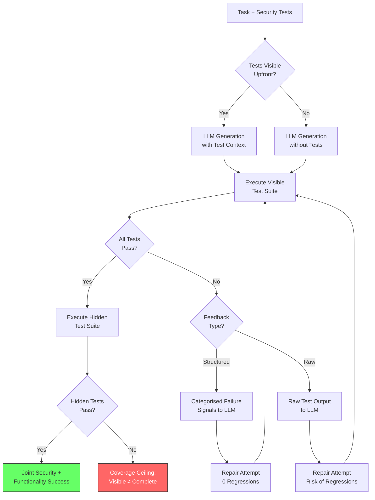

# SecTDD and Security Tests as Executable Specifications: Why Showing Tests Upfront Boosts Secure Code Generation by 19 Percentage Points — and How to Wire It into Codex CLI


---

## The Security–Functionality Trade-Off Nobody Talks About

Every senior developer has felt the tension: prompt an LLM to produce secure code and you risk breaking functionality; prompt for correct code and vulnerabilities slip through. The question is not whether LLMs can generate secure code — they demonstrably can — but whether the scaffolding around them systematically steers generation toward joint security-and-functionality success.

Liang et al. tackle exactly this problem in *Security Tests as Executable Specifications for LLM Code Generation: Benefits, Trade-offs, and Coverage Limits* (arXiv:2608.09740, August 2026) [^1]. Their SecTDD framework isolates the three factors that matter: whether security tests are visible before generation, whether failed executions trigger revision, and how failure signals are structured. The results are striking — and directly actionable in Codex CLI.

---

## What SecTDD Actually Measures

SecTDD is not another benchmark. It is a controlled experimental scaffold that uses behaviour-partitioned test sets — visible and hidden — with byte-identical initial candidates to enable precise repair comparisons [^1]. The evaluation spans:

- **2,705 trajectories** across **31 task instances**
- **Three secure-code benchmarks** (including CWEval's 31 CWE types across five languages [^2])
- **16 CWE categories** covering injection, memory safety, cryptographic misuse, and access control
- **Two model families** tested under identical conditions

The key innovation is decomposing the test-driven security workflow into orthogonal factors rather than treating "give the model tests" as a single binary intervention.

---

## Three Findings That Change How You Prompt

### 1. Upfront Visibility Matters More Than Iteration

Showing all visible security tests before generation — not drip-feeding them during repair — increased the joint functional-and-security pass rate by **19.3 percentage points** on average [^1]. This is not a marginal gain; it represents a fundamental shift in how the model reasons about constraints.

However, the benefit is not universal. Upfront visibility improved 7 of 9 benchmark–model combinations but **harmed 2** [^1]. The implication: blindly injecting tests into every prompt is naive. The model, the task complexity, and the CWE category all modulate whether upfront specifications help or hinder.

### 2. Structured Feedback Prevents Regressions

When initial generation fails, iterative repair with execution feedback can recover candidates. But how that feedback is structured determines whether repair introduces new defects:

| Feedback Type | Candidates Repaired | Regressions |
|---|---|---|
| **Structured** (categorised failure signals) | 80 | **0** |
| **Raw** (unprocessed test output) | 83 | **3** |

Three more repairs at the cost of three regressions is a poor trade [^1]. Structured feedback — where failures are categorised by CWE type and severity before reaching the model — consistently outperforms raw test dumps.

### 3. Hidden Test Families Expose the Coverage Ceiling

The most sobering finding: **candidates that pass all visible tests still fail hidden behaviour families under every tested regime** [^1]. Full visible-test compliance provides no guarantee of security completeness. This is the coverage ceiling that every test-driven approach must acknowledge.



---

## How This Maps to Codex CLI

SecTDD's three factors map directly onto Codex CLI's configuration surface. Here is how to operationalise each finding.

### Factor 1: Upfront Test Visibility via AGENTS.md

The 19.3pp gain from upfront test visibility translates to a simple AGENTS.md directive. Rather than hoping the model discovers security constraints during generation, encode them as explicit pre-conditions:

```markdown
# AGENTS.md — Security Test Specifications

## Security Test Gate
Before generating or modifying any code in `src/`:
1. Read the corresponding security test file in `tests/security/`
2. Identify all CWE categories covered by the test assertions
3. Ensure generated code satisfies every assertion
4. If no security test file exists, flag this as a gap before proceeding

## CWE Coverage Requirements
All new code must pass tests covering at minimum:
- CWE-79 (XSS) for any HTML/template output
- CWE-89 (SQL Injection) for any database queries
- CWE-78 (OS Command Injection) for any subprocess calls
- CWE-22 (Path Traversal) for any file system operations
```

This converts security tests from passive verification into active executable specifications that the model sees before writing a single line [^3].

### Factor 2: Structured Feedback via PostToolUse Hooks

SecTDD's finding that structured feedback eliminates regressions while raw feedback causes them maps directly to PostToolUse hooks. A naive hook that dumps raw test output into the model's context risks the same regression problem. Instead, structure the feedback:

```toml
# config.toml — PostToolUse security verification
[hooks.post_tool_use.security_test_gate]
command = "scripts/structured-security-feedback.sh"
exit_code_on_failure = 2
```

The hook script should categorise failures by CWE type rather than forwarding raw pytest or Jest output:

```bash
#!/usr/bin/env bash
# structured-security-feedback.sh
# Runs security tests and formats output as structured failure signals

RESULTS=$(python -m pytest tests/security/ --tb=no --no-header -q 2>&1)
EXIT_CODE=$?

if [ $EXIT_CODE -ne 0 ]; then
  # Parse failures into structured CWE-categorised signals
  python3 -c "
import sys, re

failures = '''$RESULTS'''
for line in failures.strip().split('\n'):
    match = re.search(r'test_(cwe\d+)_(\w+)', line)
    if match:
        cwe, scenario = match.groups()
        print(f'SECURITY_FAILURE: {cwe.upper()} | Scenario: {scenario}')
        print(f'  Action: Review generated code for {cwe.upper()} violation')
"
  exit 2  # Steering exit code — Codex CLI retries with feedback
fi
exit 0
```

The exit code `2` triggers Codex CLI's steering mechanism, feeding the structured output back to the model for repair [^4]. This mirrors SecTDD's structured feedback pathway that achieved 80 repairs with zero regressions.

### Factor 3: Coverage Ceiling via Named Profiles

SecTDD's coverage ceiling finding — visible tests passing does not guarantee security completeness — demands a layered verification strategy. Codex CLI's named profiles enable this tiered approach:

```toml
# config.toml — Tiered security verification profiles

[profile.dev]
model = "gpt-5.6-luna"
# Visible security tests only — fast feedback loop
# PostToolUse runs tests/security/ on every edit

[profile.review]
model = "gpt-5.6-terra"
# Adds hidden test families and SAST scanning
# PostToolUse runs tests/security/ + tests/security-extended/

[profile.security-audit]
model = "gpt-5.6-sol"
# Full coverage: visible + hidden + SAST + manual CWE checklist
# PostToolUse runs complete security suite + codex-security scan
```

The `dev` profile provides the fast feedback loop with visible tests. The `review` profile adds hidden test families that catch the coverage ceiling gap. The `security-audit` profile layers in static analysis via `@openai/codex-security` [^5] for comprehensive vulnerability detection.

---

## The Broader Secure Code Generation Landscape

SecTDD does not exist in isolation. Several complementary approaches address the security–functionality tension:

- **CWEval** (arXiv:2501.08200) provides the 31-CWE-type benchmark with paired functionality and security test oracles that SecTDD builds upon [^2]. Its key insight — that a "notable portion of functional but insecure code" escapes prior evaluations — directly motivates the hidden test family approach.

- **DRV (Detect-Repair-Verify)** (arXiv:2603.00897) establishes a multi-language pipeline where detection feeds into LLM-guided repair, then verification confirms the fix [^6]. SecTDD's structured feedback mechanism can be seen as refining the repair step with CWE-categorised signals.

- **Surgical Repair** (arXiv:2604.16697) identifies the "Format-Reliability Gap" — LLMs possess robust security knowledge but fail to apply it during generation [^7]. This aligns with SecTDD's finding that upfront test visibility closes the gap by making security constraints explicit rather than relying on the model's latent knowledge.

---

## Practical Integration Checklist

For teams wiring SecTDD principles into their Codex CLI workflows:

1. **Write security tests first** — before the implementation prompt. Place them in `tests/security/` with filenames matching `test_cwe{number}_{scenario}.py`.

2. **Reference tests in AGENTS.md** — add a security test gate directive that instructs the model to read and satisfy security tests before generating code.

3. **Structure your PostToolUse feedback** — never forward raw test output. Parse failures into CWE-categorised signals with actionable remediation hints.

4. **Layer verification with named profiles** — use visible tests for development speed, hidden tests for review, and full SAST scans for security audits.

5. **Accept the coverage ceiling** — no finite test suite guarantees security completeness. Complement test-driven security with `@openai/codex-security` scanning and manual review for high-risk CWE categories.

6. **Monitor regression rates** — track whether repair cycles introduce new failures. If regressions appear, switch from raw to structured feedback immediately.

---

## Conclusion

SecTDD's contribution is not a new benchmark or a new model — it is a rigorous decomposition of why test-driven security works when it works, and why it fails when it fails. The 19.3pp uplift from upfront test visibility is the headline, but the zero-regression structured feedback and the coverage ceiling honesty are equally important for production workflows.

For Codex CLI users, the mapping is direct: AGENTS.md for upfront specifications, PostToolUse hooks for structured feedback, and named profiles for tiered coverage. The scaffolding around the model matters at least as much as the model itself.

---

## Citations

[^1]: Liang, Y., Gan, C., Ying, R., Wei, H., Cui, Z. & Ni, S. (2026). "Security Tests as Executable Specifications for LLM Code Generation: Benefits, Trade-offs, and Coverage Limits." arXiv:2608.09740. [https://arxiv.org/abs/2608.09740](https://arxiv.org/abs/2608.09740)

[^2]: Yang, J., et al. (2025). "CWEval: Outcome-driven Evaluation on Functionality and Security of LLM Code Generation." arXiv:2501.08200. IEEE/ACM International Workshop on Large Language Models for Code (LLM4Code). [https://arxiv.org/abs/2501.08200](https://arxiv.org/abs/2501.08200)

[^3]: OpenAI. (2026). "Codex CLI AGENTS.md Documentation." GitHub. [https://github.com/openai/codex](https://github.com/openai/codex)

[^4]: OpenAI. (2026). "Codex CLI Hooks: PreToolUse & PostToolUse Reference." GitHub. [https://github.com/openai/codex](https://github.com/openai/codex)

[^5]: OpenAI. (2026). "@openai/codex-security: Open-Source Agentic Security Scanner." GitHub. Apache 2.0 licence. [https://github.com/openai/codex](https://github.com/openai/codex)

[^6]: Chen, Z., et al. (2026). "Detect Repair Verify for Securing LLM Generated Code: A Multi-Language Empirical Study." arXiv:2603.00897. [https://arxiv.org/abs/2603.00897](https://arxiv.org/abs/2603.00897)

[^7]: Li, J., et al. (2026). "Surgical Repair of Insecure Code Generation in LLMs From Mechanistic Diagnosis to Deployment-Ready Intervention." arXiv:2604.16697. [https://arxiv.org/abs/2604.16697](https://arxiv.org/abs/2604.16697)
