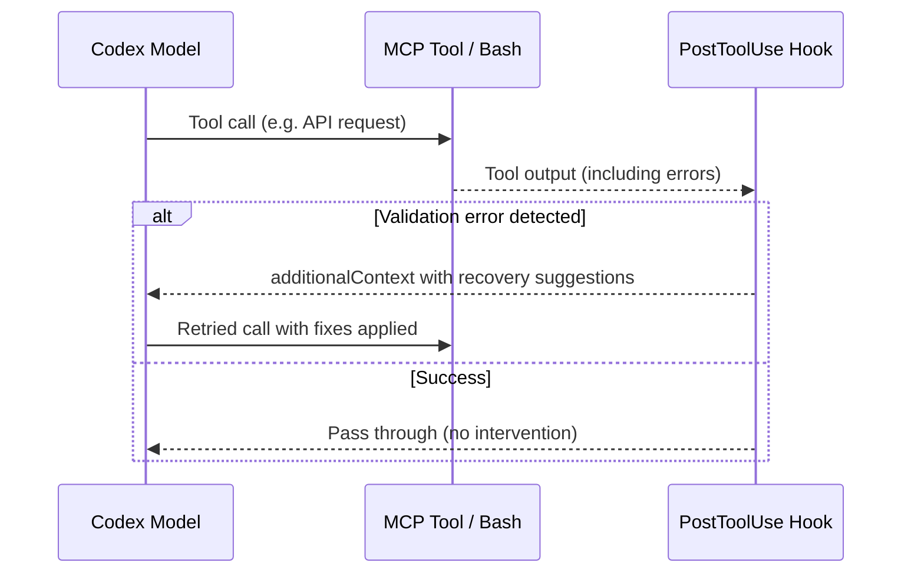

# Self-Reflective APIs: Why Structured Error Recovery Beats Plain English for Coding Agents — and How to Build It into Codex CLI


---

When a coding agent hits a validation error calling an API or tool, what comes back matters enormously. A plain-English message like `"Invalid input: ingredient not compatible"` forces the model to reason about what went wrong, hallucinate a fix, and retry — burning tokens and often failing. A **self-reflective API** returns a machine-readable recovery payload that tells the agent exactly what to change, lifting task-completion rates by up to 40 percentage points [^1]. This article unpacks the research, maps it to Codex CLI's hook architecture, and shows how to wire structured recovery into your own tool integrations.

## The Research: Structure Beats Verbosity

Canedo and Chethan (arXiv:2606.05037, June 2026) tested three error-response modes against identical validation logic across 270 attempts on three LLMs [^1]:

| Response Mode | What the Agent Sees | Haiku 4.5 Success | Sonnet 4.6 Success |
|---|---|---|---|
| **Traditional** | Generic error string | 10.0% | 16.7% |
| **Verbose** | Per-rule diagnosis, no fix | 60.0% | 46.7% |
| **Reflective** | Diagnosis + typed `suggestions[]` | 96.7% | 86.7% |

The reflective mode's `recovery_feedback.suggestions[]` payload contains structured actions with literal parameter values — not prose hints, but typed repair instructions the model can consume directly [^1].

### Why It Works

Three mechanisms explain the gap:

1. **Eliminated inference burden.** The model does not need to guess the fix from a natural-language description. The action vocabulary (`ADD_INGREDIENT`, `REPLACE_INCOMPATIBLE_INGREDIENT`, `MODIFY_PARAMS`) is registered and disclosed via OpenAPI or system prompt [^1].

2. **Reduced retry count.** Mean retries dropped from 4.0–4.6 (traditional) to 1.3–2.0 (reflective) within a five-retry budget [^1].

3. **Token efficiency.** Tokens-per-success improved 1.8–2.2× on Anthropic models. Sonnet 4.6 consumed 2,504 tokens per success in reflective mode versus 19,237 in traditional mode [^1].

### The Caveat

The lift was not statistically significant on gpt-4o-mini (p=0.435), suggesting smaller models may not reliably parse structured recovery payloads [^1]. This aligns with the broader observation that structured tool-use contracts benefit larger, more capable models disproportionately.

## The Self-Reflective Payload Schema

The minimal schema wraps validation errors with a typed suggestions array [^1]:

```json
{
  "data": { /* original request payload */ },
  "feedback": {
    "type": "recovery_guidance",
    "suggestions": [
      {
        "action": "REPLACE_INCOMPATIBLE_INGREDIENT",
        "parameters": {
          "current": "coconut milk",
          "replacement": "crème fraîche",
          "reason": "coconut milk is incompatible with French classical technique"
        }
      },
      {
        "action": "CLARIFY_MEASUREMENT",
        "parameters": {
          "field": "sugar",
          "current_value": "a handful",
          "suggested_value": "50g"
        }
      }
    ]
  }
}
```

The critical design decision: suggestions carry **literal values**, not instructions. The agent does not reason about what `crème fraîche` means — it substitutes the value and retries [^1].

## Mapping to Codex CLI: PostToolUse Hooks as Recovery Injectors

Codex CLI's hook system already supports precisely this pattern. A PostToolUse hook receives the tool's output, analyses it, and can inject structured feedback back into the model's context window [^2][^3].



### The Exit Code 2 Pattern

For simple recovery steering, a PostToolUse hook can exit with code 2 and write the recovery reason to stderr [^2]. This blocks the original result and substitutes the hook's feedback:

```bash
#!/bin/bash
# hooks/post-tool-use/api-recovery.sh
# Reads tool output from stdin, checks for validation errors,
# returns structured recovery suggestions

INPUT=$(cat)
TOOL_NAME=$(echo "$INPUT" | jq -r '.tool_name')
TOOL_RESPONSE=$(echo "$INPUT" | jq -r '.tool_response')

# Only process API tool calls
if [[ "$TOOL_NAME" != "mcp__api__"* ]]; then
  exit 0
fi

# Check for validation errors in the response
if echo "$TOOL_RESPONSE" | jq -e '.error.validation_errors' > /dev/null 2>&1; then
  # Extract and reformat as structured recovery
  echo "$TOOL_RESPONSE" | jq '{
    decision: "block",
    additionalContext: (
      "RECOVERY GUIDANCE: The API returned validation errors. " +
      "Apply these fixes and retry:\n" +
      (.error.recovery_feedback.suggestions | map(
        "- Action: " + .action + " | " +
        (.parameters | to_entries | map(.key + "=" + (.value | tostring)) | join(", "))
      ) | join("\n"))
    )
  }'
  exit 0
fi

exit 0
```

### The Full JSON Pattern

For richer recovery, return a JSON object with `additionalContext` — this gets injected into the model's context window, subject to the `additionalContextLimit` (default 2,500 tokens) [^2]:

```json
{
  "decision": "block",
  "additionalContext": "STRUCTURED RECOVERY:\n1. Replace field 'ingredient' value 'coconut milk' with 'crème fraîche' (French cuisine incompatibility)\n2. Replace field 'sugar_amount' value 'a handful' with '50g' (vague measurement)\nRetry the API call with these substitutions applied.",
  "hookSpecificOutput": {
    "hookEventName": "PostToolUse",
    "recoveryType": "self_reflective",
    "suggestionsCount": 2
  }
}
```

## AGENTS.md Directives for Self-Reflective Recovery

Wire the pattern into your project's `AGENTS.md` to instruct Codex CLI how to handle structured recovery payloads [^4]:

```markdown
## Tool Error Recovery Protocol

When an MCP tool or API call returns a validation error with a
`recovery_feedback.suggestions[]` array:

1. Parse each suggestion's `action` and `parameters` fields
2. Apply the literal parameter values to the original request
3. Retry exactly once with all suggestions applied simultaneously
4. If the retry fails, report both the original and retry errors

Do NOT:
- Ignore structured suggestions and attempt your own fix
- Apply suggestions one at a time (cascading failures will multiply retries)
- Retry more than once without human approval
```

## Designing Self-Reflective MCP Servers

If you maintain MCP servers that Codex CLI connects to, the self-reflective pattern requires roughly 20 lines of wrapper code [^1]. The key requirements:

1. **Typed action vocabulary** — register every recovery action your API can suggest. Disclose the vocabulary in the tool's description or via OpenAPI [^1].

2. **Literal parameters** — every suggestion must include the exact values to substitute, not descriptions of what to change.

3. **Validation isolation** — the `recovery_feedback` payload must not leak ground-truth answers. Canedo and Chethan's `audit_prompt_leakage.py` CI tool detects two leakage classes: validator-message leaks (literal fixes in error messages) and task-prompt leaks (success criteria in metadata) [^1].

```toml
# config.toml — MCP server with self-reflective error handling
[mcp_servers.billing-api]
command = "npx"
args = ["-y", "@acme/billing-mcp-server", "--reflective-errors"]
env = { REFLECTIVE_MODE = "true" }
```

## When Not to Use Self-Reflective Recovery

The pattern has clear boundaries:

- **Small models.** The gpt-4o-mini result (p=0.435) suggests models below a certain capability threshold cannot reliably parse and apply structured recovery [^1]. Stick to verbose prose for smaller models.
- **Non-deterministic failures.** Network timeouts, rate limits, and transient errors do not benefit from recovery suggestions — a simple retry suffices.
- **Security-sensitive operations.** Recovery suggestions that include credential values, file paths, or SQL fragments could be exploited. Use PreToolUse hooks to sanitise recovery payloads before they reach the model [^2].

## The Broader Pattern: Shifting Repair Knowledge from Model to API

The self-reflective API research confirms a principle that experienced Codex CLI users already know: **the less reasoning you ask the model to do about tool failures, the better it performs**. This is the same principle behind Codex CLI's exit code 2 steering [^2], the SecTDD structured feedback pattern [^5], and the bounded-efficiency prompt template [^6]. Each moves domain-specific repair knowledge out of the model's reasoning and into typed, machine-readable contracts.

The PostToolUse hook system is the natural integration point. It sits between the tool's output and the model's next reasoning step, exactly where a self-reflective payload needs to be injected. Combined with `additionalContext` injection and the 2,500-token budget [^2], it provides a clean, bounded channel for structured recovery that does not pollute the model's broader context.

## Citations

[^1]: Canedo, A. and Chethan, G. (2026) 'Self-Reflective APIs: Structure Beats Verbosity for AI Agent Recovery', *arXiv:2606.05037*. Available at: [https://arxiv.org/abs/2606.05037](https://arxiv.org/abs/2606.05037)

[^2]: OpenAI (2026) 'Hooks — Codex CLI Documentation'. Available at: [https://developers.openai.com/codex/hooks](https://developers.openai.com/codex/hooks)

[^3]: OpenAI (2026) 'Codex CLI v0.147.0 Release Notes'. Available at: [https://github.com/openai/codex/releases](https://github.com/openai/codex/releases)

[^4]: OpenAI (2026) 'AGENTS.md — Codex CLI Documentation'. Available at: [https://developers.openai.com/codex/agents-md](https://developers.openai.com/codex/agents-md)

[^5]: Liang, Y. et al. (2026) 'Security Tests as Executable Specifications for LLM Code Generation', *arXiv:2608.09740*. Available at: [https://arxiv.org/abs/2608.09740](https://arxiv.org/abs/2608.09740)

[^6]: Weinberger, N. and Hozez, R. (2026) 'Same Task, Different Work: Prompt-Induced Waste in Coding Agents', *arXiv:2608.01347v3*. Available at: [https://arxiv.org/abs/2608.01347](https://arxiv.org/abs/2608.01347)
