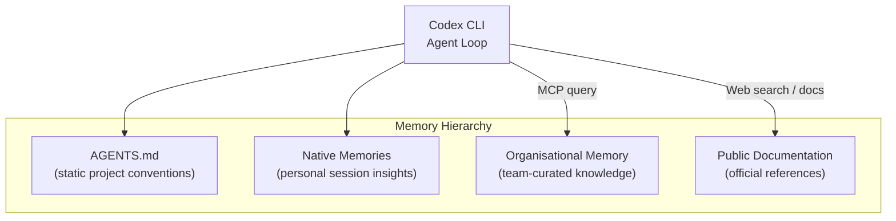

# Shared Organisational Memory for Enterprise Coding Agents: What a Production Deployment Reveals About Knowledge Capture in Codex CLI


---

Every enterprise codebase carries knowledge that never reaches documentation: internal DSLs, proprietary platform quirks, local conventions, recent hotfixes, and tacit workflows that experienced developers carry in their heads. When coding agents enter these environments, they start from scratch every session — and the cost compounds across an entire engineering organisation. A new production deployment study by Dhanyamraju and Raghav demonstrates a system that captures this tacit knowledge as a side effect of normal coding work, curates it through a five-agent pipeline, and serves it back to future coding agent sessions via MCP [^1]. The architecture maps cleanly onto Codex CLI's existing hook infrastructure, native memory system, and MCP integration — and exposes gaps worth understanding.

## The Problem: Knowledge That Lives Nowhere

Coding agents have access to public documentation, API references, and repository contents. What they lack is the accumulated organisational knowledge that makes the difference between a working solution and a production-ready one: the fact that the internal payments service silently drops headers over 8 KB, that the CI pipeline requires a specific Go version for the integration test stage, or that the `user_preferences` table was migrated last quarter and the old column names still appear in three microservices.

AGENTS.md and project-level instruction files address some of this by encoding static conventions. Codex CLI's native Memories system (shipped in v0.128) extracts durable insights from completed sessions and persists them for future use [^2]. But both approaches are scoped to individual developers or single-agent contexts. When a team of forty engineers uses coding agents across a shared codebase, each agent rediscovers the same pitfalls independently.

## The Shared Memory Architecture

The system described in the paper operates as a three-stage lifecycle: collection, curation, and consumption [^1].

```mermaid
flowchart LR
    subgraph Collection
        A[Coding Agent<br/>edits local KB] -->|PostToolUse<br/>hook fires| B[Diff detection<br/>vs KB Replica]
        B -->|Stop hook fires| C[Contributor<br/>approval gate]
    end
    subgraph Curation
        C -->|Approved diff| D[Enrichment<br/>Agent]
        D --> E[Bucketing<br/>Agent]
        E --> F[Security<br/>Scan Agent]
        F --> G[Collision<br/>Checker]
        G --> H[Trust Score<br/>Initialisation]
    end
    subgraph Consumption
        H --> I[Curated<br/>Memory Store]
        I -->|MCP / REST| J[Consumer<br/>Client]
        J --> K[Future coding<br/>agent sessions]
    end
```



### Collection: Fly-on-the-Wall Capture

Rather than requiring the agent to explicitly recognise and record insights, the system observes changes to designated Markdown knowledge-base files during normal coding work. Two Claude Code hook events drive the capture:

- **PostToolUse**: fires after each file write, triggering a Diff Match Patch comparison between the current Local Knowledge Base and a baseline Knowledge Base Replica [^1].
- **Stop**: fires at task completion, ensuring any final edits are captured before the session closes.

Crucially, no diff is transmitted without explicit contributor approval. The capture surface is bounded to designated files (e.g. `AGENTS.md` or files within `.claude/` directories), preventing the system from silently exfiltrating arbitrary repository content.

### Curation: Five-Agent Pipeline

Raw diffs are not useful as retrievable knowledge. The curation pipeline processes each approved contribution through five sequential agents [^1]:

| Agent | Function |
|-------|----------|
| **Enrichment** | Converts raw diffs into structured Q&A pairs with working examples and caveats |
| **Bucketing** | Assigns tool/platform tags and knowledge-type labels from a controlled registry |
| **Security Scan** | Applies deterministic checks across six categories: dependency vulnerabilities (OSV-Scanner style), secrets (Gitleaks style), unsafe code patterns (Bandit/Semgrep), PII (Presidio style), workflow command risks, and grounding consistency |
| **Collision Checker** | Deduplicates against existing memories using a top-5 candidate pool after overlapping-tag prefilter |
| **Trust Score Init** | Establishes a Bayesian-smoothed reliability score: `B = (vR + mC)/(v + m)`, with prior weight 10 for agent votes, 3 for human votes |

The security gate's sanity check across 56 synthetic cases showed 80.4% appropriate outcomes, 19.0% cautious-but-non-blocking, 0.6% overcautious, and zero unsafe acceptances [^1].

### Consumption: Three Retrieval Modes

Curated memories are served through MCP and REST endpoints in three modes [^1]:

- **Fast**: tag-filtered hybrid search (BM25 + vector, alpha 0.5), question-weighted 0.7 / answer-weighted 0.3
- **Normal**: expanded candidate pool with Cohere reranking
- **Deep Research**: iterative synthesis traversing linked memory graphs

Embeddings use `gemini-embedding` at 1,536 dimensions with HNSW indexing in Weaviate. Default retrieval returns 5 memories, configurable up to 50.

## Deployment Numbers

As of 22 July 2026, the production deployment had processed 900 contributed learnings, yielding 483 productive contributions (53.7%) that generated 1,144 curated memories — 2.37 memories per productive learning [^1]. Of those memories, 96.2% contain semantic links, with 7,863 total links spanning 35 tools and frameworks.

The 46.3% rejection rate is notable: nearly half of contributed knowledge either failed security gating, duplicated existing memories, or lacked sufficient structure for curation. This suggests the pipeline is genuinely selective rather than indiscriminately accumulating context.

## Mapping to Codex CLI

Codex CLI already provides the infrastructure that this architecture requires.

### Hooks as Collection Layer

Codex CLI's hook engine (stable since v0.124.0) supports `PostToolUse` and session lifecycle events [^3]. A collection client could be implemented as a hook configuration in `codex.toml`:

```toml
[hooks.post_tool_use.memory_capture]
command = "node ./hooks/capture-kb-diff.js"
match_tool = "write_file"

[hooks.stop.memory_flush]
command = "node ./hooks/flush-pending-diffs.js"
```

The hook receives the tool response payload, enabling file-path filtering to restrict capture to designated knowledge-base files.

### MCP as Consumption Layer

Codex CLI's MCP integration (upgraded to SDK 3.0.0 in v0.147.0 [^4]) supports the consumption interface directly. A shared memory MCP server would expose `query`, `read_memory`, `feedback`, and `resolve_links` operations, appearing as standard tools in the agent's available tool set.

The MCP 2026-07-28 protocol's paginated discovery is particularly relevant here: an organisational memory store spanning thousands of memories across dozens of tools benefits from paginated enumeration rather than loading the entire schema at startup [^4].

### AGENTS.md as Routing Layer

AGENTS.md directives can instruct the agent when to query organisational memory:

```markdown
## Organisational Memory

Before implementing solutions involving internal services or platform-specific
patterns, query the shared memory MCP server with the service name and task type.
Prefer organisational memories with trust scores above 6.0.
```

This positions AGENTS.md as the routing layer that tells the agent *when* to consult shared memory, whilst the MCP server provides the *how*.

### Native Memories as Local Complement

Codex CLI's native Memories system (v0.128+) operates at the individual session level, extracting insights from completed tasks [^2]. The shared organisational memory system operates at the team level. The two are complementary: native memories capture personal workflow preferences and local project state, whilst organisational memory captures cross-team institutional knowledge.



## What the Gaps Reveal

The paper is candid about its limitations, and several are directly relevant to Codex CLI operators considering this pattern [^1]:

**Scoped capture surface.** Knowledge collection is limited to designated files. Insights that emerge in terminal output, test logs, or conversation exchanges are invisible to the collection layer. Codex CLI's hook system could address this by adding a `PostConversation` or `PostSession` hook event that surfaces the full interaction transcript for knowledge extraction.

**Indirect feedback signals.** Trust scores depend on explicit voting rather than automatic usage-pattern monitoring. When a memory is retrieved and the task succeeds, no signal flows back to the trust scorer. Codex CLI's `PostToolUse` hooks could instrument this: if the agent queries memory and subsequently completes the task without errors, an automatic positive signal could be generated.

**Injection risk.** Shared memories become part of the agent's input surface. A compromised contributor could inject adversarial instructions disguised as organisational knowledge. The security gate's deterministic scanning catches obvious patterns, but sophisticated prompt injection remains an open concern. Codex CLI's `PreToolUse` hooks and sandbox policies provide defence-in-depth here — even if injected instructions reach the agent, the sandbox constrains their impact [^5].

**No provenance chain.** The paper notes that curation operates post-hoc, unable to observe original problem constraints. When a memory says "always use connection pooling for the analytics service", there is no link back to the incident that motivated that guidance. A production deployment would benefit from attaching commit SHAs, issue IDs, or session identifiers to memories at collection time.

## Practical Recommendations

For teams considering shared organisational memory with Codex CLI:

1. **Start with a bounded capture surface.** Designate a single `.claude/knowledge/` directory per repository and configure `PostToolUse` hooks to capture diffs only to files within it.

2. **Implement the curation pipeline as an MCP server.** The five-agent pipeline maps naturally to an MCP server that accepts raw diffs and returns curated Q&A memories through standard MCP operations.

3. **Set trust score thresholds in AGENTS.md.** Instruct the agent to weight high-trust memories (score > 6.0) as authoritative and low-trust memories (score < 3.0) as advisory, reducing the risk of acting on poorly validated knowledge.

4. **Use `requirements.toml` for memory security policy.** Codex CLI's `requirements.toml` can enforce that the organisational memory MCP server runs with restricted network access and that contributed diffs are validated against the security scanning pipeline before persistence [^5].

5. **Monitor the rejection rate.** The paper's 46.3% rejection rate provides a useful baseline. A significantly lower rate may indicate insufficient security gating; a significantly higher rate may indicate the capture surface is too broad or the enrichment agent's Q&A conversion is too aggressive.

## Conclusion

The shared organisational memory system demonstrates that tacit enterprise knowledge can be captured as a side effect of coding work rather than as a separate documentation activity. The three-stage architecture — collection via hooks, curation via a multi-agent pipeline, consumption via MCP — aligns directly with Codex CLI's existing infrastructure. The deployment numbers (1,144 curated memories from 900 contributions, 96.2% with semantic links) suggest the approach produces genuinely useful knowledge at meaningful scale. The remaining gaps — limited capture surface, indirect feedback, injection risk, missing provenance — are all addressable within Codex CLI's hook and sandbox architecture, and represent concrete engineering work rather than fundamental design barriers.

---

## Citations

[^1]: Dhanyamraju, H. R. & Raghav, L. (2026). "Shared Organizational Memory for Enterprise Coding Agents: System Design and Deployment Snapshot." arXiv:2608.00122. [https://arxiv.org/abs/2608.00122](https://arxiv.org/abs/2608.00122)

[^2]: OpenAI. (2026). "Codex CLI Memories: Native Session Persistence and Cross-Session Context Strategies." Codex Knowledge Base. [https://codex.danielvaughan.com/2026/05/01/codex-cli-memories-persistent-context-session-memory-ecosystem/](https://codex.danielvaughan.com/2026/05/01/codex-cli-memories-persistent-context-session-memory-ecosystem/)

[^3]: OpenAI. (2026). "Codex CLI Hooks: Complete Guide to Events, Policy Engines and Production Patterns." Codex Knowledge Base. [https://codex.danielvaughan.com/2026/04/15/codex-cli-hooks-complete-guide-events-policy-patterns/](https://codex.danielvaughan.com/2026/04/15/codex-cli-hooks-complete-guide-events-policy-patterns/)

[^4]: OpenAI. (2026). "Codex CLI v0.147.0 Release Notes." GitHub. [https://github.com/openai/codex/releases/tag/rust-v0.147.0](https://github.com/openai/codex/releases/tag/rust-v0.147.0)

[^5]: OpenAI. (2026). "Codex CLI Guide 2026: Setup, Sandbox, AGENTS.md & MCP." [https://blakecrosley.com/guides/codex](https://blakecrosley.com/guides/codex)
