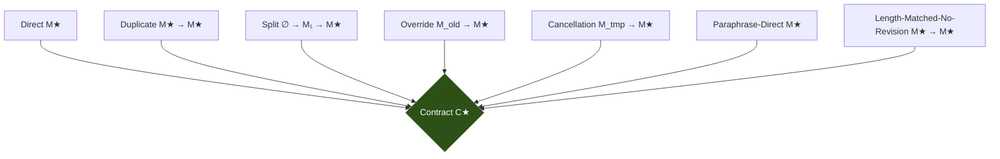
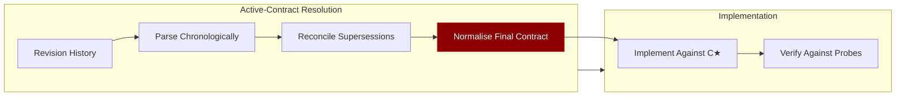

# SpecPath and Specification-Path Sensitivity: Why Your Coding Agent Fails When Requirements Evolve — Even When the Final Spec Is Identical


---

## The Problem Nobody Tests For

You refine a requirement across three messages. Your colleague states the same requirement in one clean prompt. Both final specifications are logically identical. The coding agent produces correct code for your colleague and broken code for you.

This is **specification-path sensitivity** — a failure mode identified by Wu et al. in their August 2026 paper *SpecPath: Testing Coding Agents Across Contract-Equivalent Specification Histories*[^1]. Their finding is stark: **35% of agent executions that succeed on a direct, consolidated specification fail on at least one contract-equivalent revision history**. The final contract is the same; only the path to it differs.

For anyone using Codex CLI in iterative workflows — which is most real development — this has immediate practical consequences.

---

## What SpecPath Measures

SpecPath is a diagnostic evaluation framework with a deceptively simple premise: hold everything constant (repository, contract, verifier, agent system, budget) and vary only the *revision path* through which the specification reaches its final form[^1].

### The Five Task Families

The authors selected five calibrated tasks from real open-source PRs:

| Task | Repository | Behaviour Scope |
|------|-----------|----------------|
| Kedro | kedro-org/kedro | Catalog replacement precedence |
| NeMo Agent Toolkit | NVIDIA/NeMo-Agent-Toolkit | Conversion failures raise errors |
| pytest-odoo | camptocamp/pytest-odoo | Subtest compatibility restoration |
| SBSim | google/sbsim | Bounded time inputs raise errors |
| Tracecat | TracecatHQ/tracecat | Required/optional secret retrieval |

### Seven Specification Histories

Each task was presented through seven contract-equivalent histories[^1]:



All seven histories resolve to the same normalised final contract C★. The **Direct** condition serves as the competence baseline. The revision conditions (Duplicate, Split, Override, Cancellation) test whether agents can correctly resolve evolving requirements. The control conditions (Paraphrase-Direct, Length-Matched-No-Revision) isolate wording and token-count effects.

### Scale

The full factorial matrix: 5 tasks × 7 models × 2 scaffolds × 7 conditions × 3 repeats = **1,470 planned executions**, of which 1,194 were scored under fixed budget[^1].

---

## The Numbers That Matter

### Aggregate Accuracy Hides the Problem

Final-Contract Realisation (FCR) across conditions[^1]:

| Condition | FCR |
|-----------|-----|
| Direct | 78.8% |
| Duplicate | 75.8% |
| Override | 81.1% |
| Cancellation | 80.3% |
| Split | 77.7% |
| **Average non-direct** | **78.7%** |

Aggregate accuracy is stable — 78.8% vs 78.7%. A naive benchmark would declare these agents robust.

### But Conditional Path Violation Tells the Real Story

The authors introduce **Conditional Path Violation (CPV)**: among executions that *succeed* on the direct specification, how many fail on at least one equivalent alternative?

**Answer: 36.4%** (95% CI 25.6–45.1%)[^1].

This is not a marginal edge case. Over a third of "capable" agent configurations break when the same requirement arrives through a revision history rather than a clean prompt.

Per-task CPV rates vary considerably:

| Task Family | CPV Rate |
|-------------|----------|
| pytest-odoo | 47.4% |
| Tracecat | 45.5% |
| Kedro | 40.0% |
| SBSim | 33.3% |
| NeMo Agent Toolkit | 16.0% |

The highest-CPV tasks (pytest-odoo, Tracecat) involve nuanced boundary conditions — precisely the requirements most likely to evolve during real development.

### Scaffold Effect

The two scaffolds showed different CPV profiles[^1]:

- **Mini-swe-agent**: 43.0% any-CPV
- **OpenHands**: 30.7% any-CPV

Confidence intervals overlap, so neither is a clear winner. But the finding is suggestive: how the harness presents conversation history to the model matters as much as the model itself. This echoes Ben Sghaier et al.'s finding that harness design contributes independently to agent quality[^2].

---

## Why This Happens: Active-Contract Resolution

SpecPath identifies the failure mechanism as **active-contract resolution** — the inference step where the agent must recover the normalised, binding obligations from the complete conversation history *before* it can begin implementation[^1].

When a specification arrives in a single message, the model has one canonical source of truth. When it arrives through revisions, the model must:

1. Parse the revision history chronologically
2. Identify which requirements supersede earlier ones
3. Reconcile contradictions (Override condition)
4. Handle explicit retractions (Cancellation condition)
5. Integrate partial additions (Split condition)

Each step is an opportunity for the model to misresolve the final contract. The **Duplicate** condition — where the same specification is simply repeated — has an 18.3% CPV rate, suggesting that even inert repetition introduces noise into the resolution process[^1].



The normalisation step (highlighted) is where path sensitivity manifests. The contract C★ is identical across all paths; the agent's *internal representation* of that contract is not.

---

## What This Means for Codex CLI

Codex CLI users routinely interact through iterative refinement — the exact pattern SpecPath shows is fragile. Here is how to defend against specification-path sensitivity.

### 1. Use Plan Mode as a Contract-Resolution Gate

Codex CLI's plan mode (`/plan` or `Shift+Tab`) forces the agent to propose a plan before implementation[^3]. In the SpecPath framework, this is equivalent to inserting an explicit active-contract resolution step with human verification.

After an iterative requirement conversation, switch to plan mode and ask:

```bash
# After several rounds of requirement refinement
/plan Summarise the final requirements as a numbered list of acceptance criteria, then propose an implementation plan.
```

Review the summarised requirements. If the agent has misresolved the contract — dropped a cancellation, failed to integrate a split — you catch it before any code is written.

Configure planning depth for complex specifications in `config.toml`:

```toml
[plan_mode]
plan_mode_reasoning_effort = "high"
```

### 2. Encode Final Specifications in AGENTS.md

SpecPath demonstrates that conversation history is a noisy channel for specifications. AGENTS.md provides a clean, version-controlled channel that bypasses revision-history parsing entirely[^4].

For any requirement that has evolved through iteration, consolidate it into AGENTS.md:

```markdown
<!-- AGENTS.md -->
## Secret Retrieval Contract
<!-- Consolidates requirement from tickets TRACE-1245, TRACE-1301 -->
- Required secrets: raise `SecretMissing` if absent
- Optional secrets: return `None` if absent, never raise
- All secrets: validate format before return
- Retrieval order: environment → vault → config file
```

This transforms the agent's task from "resolve a revision history" to "implement a consolidated specification" — the Direct condition where agents perform best.

### 3. Structure Iterative Prompts to Minimise Path Noise

SpecPath's control conditions show that paraphrase and extra history length produce small, non-significant effects (−3.1pp and −4.0pp respectively, both intervals including zero)[^1]. But the revision conditions (Override, Cancellation, Split) produce meaningful CPV rates.

When refining requirements iteratively with Codex CLI:

- **Prefer additive refinement** (Split-like): "Also add X" rather than "Replace Y with X"
- **After overrides, restate the full requirement**: "To be clear, the complete requirement is now: ..."
- **After cancellations, confirm what remains**: "I've dropped the Z requirement. The remaining requirements are: ..."

### 4. Use PostToolUse Hooks for Contract Verification

For critical workflows, wire a PostToolUse hook that verifies the agent's implementation matches a pre-defined contract:

```toml
# config.toml
[[hooks]]
event = "PostToolUse"
command = "python3 scripts/verify-contract.py"
timeout_ms = 30000
```

The verification script can check that all acceptance criteria from AGENTS.md are addressed in the generated code, providing an automated equivalent of SpecPath's executable probes.

### 5. Named Profiles for Specification Complexity

Use Codex CLI named profiles to match agent configuration to specification complexity[^3]:

```toml
# ~/.codex/profiles/iterative-spec.toml
# For tasks with evolving requirements — higher reasoning, plan-first
model = "o3"
approval_policy = "on-request"
plan_mode_reasoning_effort = "xhigh"

# ~/.codex/profiles/clean-spec.toml
# For consolidated specifications — standard configuration
model = "o4-mini"
approval_policy = "auto-edit"
plan_mode_reasoning_effort = "medium"
```

When you know a task has gone through significant requirement evolution, use the iterative-spec profile to give the agent more reasoning budget for contract resolution.

---

## The Broader Implication

SpecPath's 36.4% CPV rate is measured on *five calibrated tasks with fourteen agent configurations*. The authors explicitly caution against generalising to all software tasks[^1]. But the qualitative finding — that stable aggregate accuracy conceals path-conditioned failures — is a structural property of how language models process conversation histories.

This connects to several parallel research threads. SlopCodeBench demonstrated that agent output degrades over long-horizon iterative tasks[^5], and the SWE-RPG benchmark found that requirement clarification failures account for 24.5–46.0% of agent failures — far exceeding planning or code-generation failures[^6]. SpecPath adds a crucial dimension: even when the final requirement is unambiguous, the *history* through which it was derived can poison the implementation.

For Codex CLI practitioners, the defence is straightforward: **consolidate your specifications before implementation, verify contract resolution in plan mode, and encode final requirements in AGENTS.md rather than relying on conversation history alone**.

---

## Citations

[^1]: Wu, Y., Wang, H., Yang, H., Ji, J. & Lin, F. (2026). "SpecPath: Testing Coding Agents Across Contract-Equivalent Specification Histories." arXiv:2608.09799. [https://arxiv.org/abs/2608.09799](https://arxiv.org/abs/2608.09799)

[^2]: Ben Sghaier, O. et al. (2026). "Don't Blame the Large Language Model: How Agent Harness Evolution Shapes Coding Agent Quality." arXiv:2607.03691. [https://arxiv.org/abs/2607.03691](https://arxiv.org/abs/2607.03691)

[^3]: OpenAI. (2026). "Codex CLI Documentation — Plan Mode, Named Profiles, Configuration." [https://developers.openai.com/codex/changelog](https://developers.openai.com/codex/changelog)

[^4]: OpenAI. (2026). "Codex CLI Guide — AGENTS.md Specification." [https://github.com/openai/codex](https://github.com/openai/codex)

[^5]: Zhang, Y. et al. (2026). "SlopCodeBench: Benchmarking How Coding Agents Degrade Over Long-Horizon Iterative Tasks." arXiv:2603.24755. [https://arxiv.org/abs/2603.24755](https://arxiv.org/abs/2603.24755)

[^6]: Zhou, Y. et al. (2026). "A Unified Issue Resolution Benchmark for Requirement Clarification, Planning, and Code Generation for Coding Agents." arXiv:2608.09072. [https://arxiv.org/abs/2608.09072](https://arxiv.org/abs/2608.09072)
