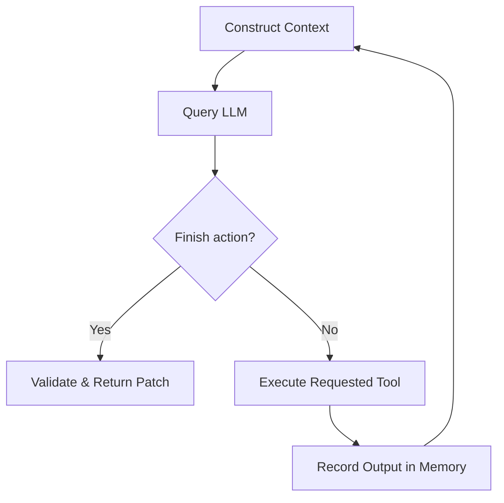
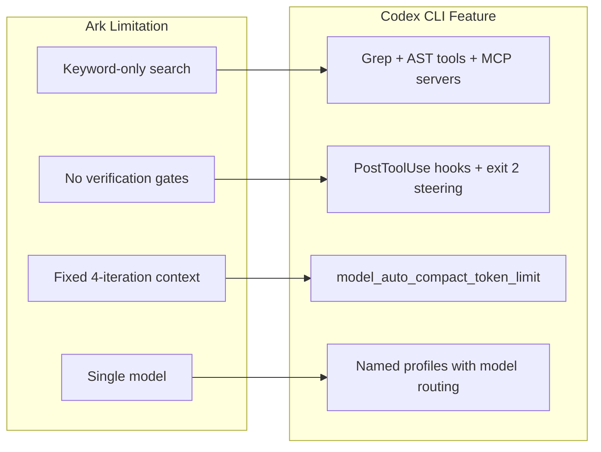

# Understanding the Architecture of Coding Agents: What a Minimal Research Prototype Reveals About Codex CLI's Design


---

Coding agents have become the primary interface for AI-assisted software development, yet their internal architecture remains surprisingly under-documented. No systematic architectural description — comparable to those available for compilers or operating systems — exists for the class of tools that includes Codex CLI, Claude Code, and OpenCode. A new paper by Marco Tulio Valente, *Understanding the Architecture of Coding Agents* (arXiv:2608.10934, August 2026), addresses this gap by documenting the core architectural components, building a minimal research prototype called Ark, and comparing it against production agents using an established taxonomy [^1]. The findings illuminate exactly why Codex CLI makes the design choices it does — and where the architectural frontier lies.

## The Nine Components Every Coding Agent Shares

Valente identifies nine core components present across all modern coding agents [^1]:

1. **Agentic Loop** — the central control mechanism coordinating LLM requests and tool execution
2. **System Prompt** — instructions defining behaviour, protocol, constraints, and available tools
3. **Tools** — local programs executed at LLM request (file operations, search, testing, patching)
4. **Memory** — records of execution history including tool invocations and outputs
5. **Context** — information reconstructed before each LLM call (task description, workspace instructions, agent state, recent iterations)
6. **Error Handling** — management of ReAct protocol violations and patch generation failures
7. **Security Mechanisms** — workspace isolation, path restrictions, tool constraints, patch validation
8. **Tracing** — recording all interactions and actions for debugging and audit
9. **LLM Integration** — API abstraction layer handling model communication

This decomposition matters because it gives practitioners a shared vocabulary. When you configure `AGENTS.md`, you are writing the *System Prompt* component. When you set `sandbox_mode` in `config.toml`, you are tuning *Security Mechanisms*. When you adjust `model_auto_compact_token_limit`, you are managing *Context* compaction.

## The Agentic Loop: Where All Roads Converge

Every coding agent studied follows the ReAct (Reason + Act) paradigm [^2], implemented as an imperative loop:



The loop repeats until the model signals completion or an iteration limit is reached. Codex CLI implements this in its `AgentLoop.run()` function with the pattern *Think → Tool Call → Observe → Repeat*, continuing until the model produces a final answer without additional tool requests [^3]. The default iteration cap is 50 turns.

What distinguishes production agents is the sophistication layered onto this loop. Codex CLI adds subagent spawning (since v0.128.0), where the main agent can dispatch specialised subagents that execute subtasks in parallel, each with its own independent context window and sandbox [^3]. Ark, by contrast, runs a single loop with no parallelism — and still solves 80% of its benchmark tasks.

## Rombaut's Taxonomy: Twelve Dimensions Across Three Layers

Valente adopts the architectural taxonomy from Rombaut's *Inside the Scaffold* (arXiv:2604.03515), which analyses 13 open-source coding agent scaffolds across 12 dimensions organised into three layers [^4]:

### Control Architecture
- **Control loop type** — all agents converge on ReAct-based loops
- **Loop driver entity** — LLM-driven decision making (the model decides what to do next)
- **Implementation approach** — imperative `while` loop in every case

### Tool and Environment Interface
- **Tool set size and composition** — ranges from 5 (Ark) to 18+ (Codex CLI)
- **Code editing mechanism** — unified diff patches vs string replacement vs line-level edits
- **Tool discovery strategy** — static (tools defined at startup) vs dynamic (tools discovered at runtime)
- **Context retrieval methods** — keyword/regex search vs AST-aware navigation
- **Execution isolation level** — sandboxed subprocess vs local shell

### Resource Management
- **State representation** — flat list vs typed event log
- **Context compaction strategies** — truncation vs LLM-based summarisation
- **Multi-model routing** — single model vs model selection per task type
- **Persistent memory** — none vs cross-session recall

## How Codex CLI Compares

The paper directly compares Ark against Codex CLI and OpenCode. The contrast is instructive [^1]:

| Dimension | Ark | Codex CLI | OpenCode |
|---|---|---|---|
| Tools | 5 static | 18+ with dynamic discovery | Dynamic discovery |
| Code editing | Unified diff | Multiple strategies | String replacement |
| Isolation | Temporary workspace copy | Platform-level sandbox | Local shell |
| Context compaction | Last 4 iterations only | LLM-based summarisation via `model_auto_compact_token_limit` | LLM-based summarisation |
| Multi-model | Single model | Named profiles, model routing per task | Multiple model support |
| Persistent memory | None | Session history, rollout files | None |
| Tracing | Basic logging | Full rollout recording with replay | Basic logging |

Codex CLI's architectural advantage emerges in three areas:

**Security depth.** Codex CLI implements platform-level sandboxing where shell and code execution occur in isolated subprocesses with configurable permission levels (`sandbox_mode` in `config.toml`) [^3]. Ark copies the project to a temporary workspace — functional isolation, but no enforcement.

**Context engineering.** Codex CLI's six-layer configuration merge precedence (global defaults → user config → project config → `AGENTS.md` → environment variables → CLI flags) means the *Context* component draws from a rich hierarchy. Ark constructs context from only the task description and the four most recent iterations.

**Tool ecosystem.** Codex CLI's MCP integration (now supporting MCP 2026-07-28 with paginated discovery) means the tool set is extensible at runtime [^5]. Ark's five static tools — `list_files`, `read_file`, `find_text`, `run_tests`, `finish` — cannot be extended without modifying the source.

## What Ark Proves: Minimalism Works (Up to a Point)

Ark is implemented in 13 Python files totalling 1,471 lines of code [^1]. It solves 8 of 10 ArkBench tasks using `gpt-5.4-mini`, averaging 23.5 seconds and 3,342 tokens per task at a total cost under \$0.50. The two failures are both incomplete-propagation problems: a bug fix that catches the wrong exception type, and a rename refactoring that misses some call sites.

This confirms what the taxonomy predicts. The *Control Architecture* layer is essentially solved — every agent uses the same ReAct loop. The differentiation happens in *Tool and Environment Interface* and *Resource Management*. Ark's failures are tool-coverage failures: with only keyword search (`find_text`), it cannot reliably trace all references to a renamed function across a codebase. Production agents like Codex CLI compensate with richer search tools, AST-aware navigation, and the ability to run linters and type checkers as verification gates.

### Mapping Ark's Limitations to Codex CLI Solutions



## Practical Implications for Codex CLI Users

### 1. Your AGENTS.md Is the System Prompt Component

The paper frames the system prompt as the primary steering mechanism for agent behaviour. In Codex CLI, `AGENTS.md` files at project, directory, and workspace levels compose the system prompt hierarchically. Treat them as architectural configuration, not casual notes. Every instruction you add becomes part of the context constructed before each LLM call.

### 2. Tool Count Matters Less Than Tool Quality

Ark demonstrates that five well-chosen tools can solve 80% of maintenance tasks. When designing MCP server tool sets for Codex CLI, resist the temptation to expose dozens of narrow tools. The *Bitter Lesson of Tool Calling* research (arXiv:2608.06370) shows that context rot accelerates under schema flooding [^6]. Prefer fewer, well-typed tools with clear semantics.

### 3. Context Compaction Is the Scaling Bottleneck

Ark's fixed 4-iteration window works for small tasks but cannot sustain long-horizon work. Codex CLI's `model_auto_compact_token_limit` and `tool_output_token_limit` settings in `config.toml` control when and how aggressively context is compressed. For long sessions, set these deliberately:

```toml
[model]
model_auto_compact_token_limit = 80000
tool_output_token_limit = 16000
```

### 4. Security Is an Architectural Layer, Not a Feature

The taxonomy separates security mechanisms as a distinct component precisely because they cross-cut the entire execution flow. In Codex CLI, this means `sandbox_mode`, `approval_policy`, `PreToolUse` hooks, and the MCP server allowlist work together as a coherent security layer. Disabling one weakens the others.

### 5. Tracing Enables Everything Else

Ark's minimal tracing is adequate for a research prototype but insufficient for production debugging. Codex CLI's rollout files record every LLM interaction, tool call, and output, enabling session replay and audit. Use `codex --rollout-dir ./traces` to capture traces for post-hoc analysis of agent behaviour.

## The Architectural Frontier

Valente's work highlights three areas where even production agents have gaps:

**Persistent cross-session memory.** Ark has none; Codex CLI has session history and rollout files but no semantic memory that accumulates knowledge across projects. The Addressable Recall Compaction research (arXiv:2607.25066) points toward observation stores as a solution, but no agent has shipped this yet.

**Formal verification of patches.** Both Ark and Codex CLI validate patches syntactically (does it apply cleanly?) but not semantically (does it preserve invariants?). The CausalRepair work (arXiv:2608.10613) on dual-slicing for causal repair suggests a path forward.

**Adaptive tool discovery.** Codex CLI's MCP integration allows runtime tool extension, but the agent cannot reason about *which* tools it needs for a given task and request them dynamically. The gap between static tool sets and fully adaptive tool acquisition remains open.

## Citations

[^1]: Valente, M. T. (2026). "Understanding the Architecture of Coding Agents: An Exploratory Study Using a Research Prototype." arXiv:2608.10934. [https://arxiv.org/abs/2608.10934](https://arxiv.org/abs/2608.10934)

[^2]: Yao, S. et al. (2023). "ReAct: Synergizing Reasoning and Acting in Language Models." ICLR 2023. [https://arxiv.org/abs/2210.03629](https://arxiv.org/abs/2210.03629)

[^3]: ZenML (2026). "Building Production-Ready AI Agents: OpenAI Codex CLI Architecture and Agent Loop Design." [https://www.zenml.io/llmops-database/building-production-ready-ai-agents-openai-codex-cli-architecture-and-agent-loop-design](https://www.zenml.io/llmops-database/building-production-ready-ai-agents-openai-codex-cli-architecture-and-agent-loop-design)

[^4]: Rombaut, B. (2026). "Inside the Scaffold: A Source-Code Taxonomy of Coding Agent Architectures." arXiv:2604.03515. [https://arxiv.org/abs/2604.03515](https://arxiv.org/abs/2604.03515)

[^5]: OpenAI (2026). "Codex CLI v0.147.0 Release Notes." [https://github.com/openai/codex/releases/tag/rust-v0.147.0](https://github.com/openai/codex/releases/tag/rust-v0.147.0)

[^6]: Patel, I., Sen, S., Lumer, E. & Subbiah, V.K. (2026). "The Bitter Lesson of Tool Calling." arXiv:2608.06370. [https://arxiv.org/abs/2608.06370](https://arxiv.org/abs/2608.06370)
