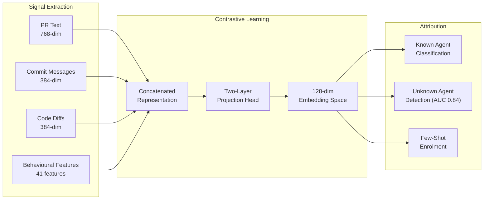

# AgenTag and Open-World Agent Attribution: Why PR Descriptions Reveal More Than Code Diffs — and What It Means for Codex CLI Commit Governance


---

## The Attribution Problem

Every coding agent that opens a pull request under a developer's GitHub account creates a provenance gap. Regulated teams — finance, healthcare, government — increasingly need to know *which tool* touched *which commit*, not just that AI was involved somewhere. Self-disclosed trailers like `Co-authored-by:` help when agents opt in, but they are trivially stripped, inconsistently applied, and tell you nothing about the *specific* agent behind the contribution.

Ghaleb's AgenTag framework, published August 2, 2026 [^1], attacks this problem head-on: given a pull request, can you reliably identify which AI coding agent authored it — even if you have never seen that agent before?

The answer is yes, with a weighted F1 of 0.96 across five agents. But the route to that answer overturns an assumption most engineers would make about where attribution signal lives.

## The Surprising Finding: Text Beats Code

AgenTag analysed 33,580 agentic pull requests from five agents — OpenAI Codex (64.9% of the dataset), GitHub Copilot (14.8%), Devin (14.4%), Cursor (4.6%), and Claude Code (1.4%) — alongside 6,618 human-authored PRs [^1].

The framework extracted four signal streams:

- **PR text**: title and description encoded via Sentence-BERT (768 dimensions)
- **Commit messages**: version-control communication style (384 dimensions)
- **Code diffs**: added lines analysed via multiple code encoders (384 dimensions)
- **Behavioural features**: 41 engineered features covering commit patterns, PR structure, patch-level characteristics, and temporal behaviour

The critical discovery: PR descriptions and commit messages alone achieved an F1 of 0.89, nearly matching the full four-modality fusion at 0.91. Code diffs alone scored 0.59 — barely better than chance for a five-class problem [^1]. Four independent code representations (general sentence encoder, CodeBERT, GraphCodeBERT, and code-content features) all confirmed this was not an encoder artefact.

In other words, **coding agents are distinguished primarily by how they communicate changes, not by the code they generate**.

## Agent-Specific Behavioural Signatures

Each agent leaves a distinct fingerprint in its communication patterns [^1]:

| Agent | Signature |
|-------|-----------|
| **OpenAI Codex** | Distinctively brief: median 35-character commit messages, delta -0.62 to -0.75 across all length signals |
| **GitHub Copilot** | Opens 97% of PRs with "Initial plan" commits; links resolved issues in 84% of cases |
| **Devin** | Uses conventional-commit prefixes (`fix:`, `feat:`) in 46% of PRs; writes long, multi-line commits (delta +0.71) |
| **Cursor** | Minimal markdown usage (28% use headers); fewest bullet points (delta -0.52) |
| **Claude Code** | Most structured: 74% use summary-plus-bullets format; median 231-character messages vs 58 for the next agent |

These signatures persist even after stripping self-disclosed markers. When AgenTag removed trailers, tool URLs, templates, and residual tool names in three progressive tiers, weighted F1 dropped only 0.026 points (0.947 to 0.921) [^1]. Attribution relies on latent stylistic characteristics, not watermarks.

## Open-World Recognition

Real-world governance cannot assume a closed set of known agents. AgenTag addresses this with a supervised contrastive learning architecture that maps PR representations into a 128-dimensional embedding space via a two-layer projection head [^1].



The leave-one-agent-out protocol achieved an AUC of 0.84 for detecting previously unseen agents — significantly outperforming non-learned baselines by +0.081 AUC [^1]. Crucially, the system supports few-shot enrolment: just 10 labelled PRs from a new agent are sufficient to add it to the recognised set without retraining.

## Per-Agent Performance and Its Implications

Attribution accuracy varied significantly across agents [^1]:

| Agent | F1 Score | Notes |
|-------|----------|-------|
| OpenAI Codex | 0.98 | Strong signal from consistently terse style |
| GitHub Copilot | 0.98 | "Initial plan" pattern highly distinctive |
| Devin | 0.90 | Conventional-commit prefixes create clear separation |
| Cursor | 0.78 | Less distinctive communication patterns |
| Claude Code | 0.56 | Heavily dependent on trailer presence; drops to 0.45 when markers stripped |

The Claude Code result deserves attention. Its lower score reflects both the smallest sample size (1.4% of the dataset) and the fact that Claude Code's distinctiveness concentrates in its structured trailers. Once those are stripped, latent signals from its summary-plus-bullets format (delta +0.81 for multi-line ratio) remain, but are insufficient for reliable standalone attribution.

## The Dataset Contamination Warning

AgenTag uncovered a critical data-quality issue: at least 5% of ostensibly "human-labelled" PRs in the AIDev dataset contained explicit AI-authorship markers [^1]. A marker-blind classifier concentrated disclosed agent authorship 7.7x at high confidence scores, confirming systematic label noise.

This finding has direct implications for any team building internal models or dashboards to track AI usage in their repositories. Submitter identity is an unreliable ground truth — content-based contamination checks are essential.

## Mapping to Codex CLI's Attribution Stack

Codex CLI already provides mechanisms that interact directly with AgenTag's findings.

### commit_attribution Configuration

Since PR #11617 (February 2026), Codex CLI injects `Co-authored-by:` trailers into commit messages via prompt-based injection when `codex_git_commit` runs [^2]. The `commit_attribution` configuration option in `config.toml` supports three modes:

```toml
# Default: standard Codex co-author tag
[git]
commit_attribution = "default"

# Custom: team-specific attribution string
[git]
commit_attribution = "custom"
commit_attribution_label = "Co-authored-by: CodexBot <codex@internal.corp>"

# Disabled: no attribution (not recommended for regulated teams)
[git]
commit_attribution = "disabled"
```

AgenTag's marker-stripping experiments demonstrate that this trailer is necessary but not sufficient. Even with `commit_attribution = "disabled"`, Codex CLI's characteristically brief commit messages (median 35 characters) remain detectable with F1 0.98 [^1].

### AGENTS.md as Communication Style Governor

AgenTag's central finding — that communication style, not code, drives attribution — means AGENTS.md instructions directly influence your agent's fingerprint. Consider:

```markdown
## Commit Message Policy

- Use conventional-commit format: `type(scope): description`
- Include a body paragraph explaining WHY, not WHAT
- Keep subject line under 72 characters
- Reference issue numbers where applicable
```

These instructions would shift Codex CLI's commit signature away from its natural terse style toward Devin-like conventional-commit patterns. Whether this is desirable depends on your governance posture: teams wanting transparent attribution should preserve default signatures; teams wanting consistent commit hygiene across human and agent authors should standardise.

### PostToolUse Hooks for PR Description Governance

Since PR descriptions carry the strongest attribution signal, PostToolUse hooks can enforce description standards at PR-creation time [^3]:

```json
{
  "hooks": [
    {
      "event": "PostToolUse",
      "tool": "shell",
      "pattern": "gh pr create",
      "command": "python3 scripts/validate_pr_description.py",
      "exit_code_on_failure": 2
    }
  ]
}
```

An exit code of 2 feeds the validation result back to the agent as `additionalContext`, allowing the model to revise the PR description before submission [^3]. This creates a governance gate at exactly the point where AgenTag's strongest signal originates.

### Named Profiles for Multi-Model Routing

Codex CLI v0.147.0 supports named profiles that route different task types to different models [^4]. AgenTag's temporal analysis showed macro F1 degradation from 0.805 to 0.749 over seven months [^1], partly because agent signatures shift as models and prompts evolve. Teams tracking attribution over time should consider:

```toml
[profiles.review]
model = "gpt-5.6-terra"

[profiles.implement]
model = "o4-mini"
```

Different models may produce different commit-message signatures. If attribution consistency matters for your audit trail, pin the model used for commits and PR creation to a single profile.

## Robustness Boundaries

AgenTag's generalisation testing revealed important constraints [^1]:

- **Repository-disjoint splits**: macro F1 dropped from 0.805 to 0.738 — signatures partially encode repository-specific patterns
- **Leave-one-language-out**: F1 ranged from 0.433 to 0.713 across eight languages — programming language influences agent communication style
- **Chronological splits**: macro F1 degraded to 0.749 over seven months — model updates shift fingerprints

For production governance, this means attribution models require periodic recalibration as agent versions evolve.

## Practical Recommendations

AgenTag's cost-benefit analysis [^1] maps directly to Codex CLI deployment decisions:

1. **Lightweight governance**: PR text alone provides strong attribution (F1 0.85). No additional API calls required — parse descriptions at PR-open time via a webhook or GitHub Action.

2. **Standard governance**: Add commit-message analysis for +0.065 F1. Codex CLI's `commit_attribution` makes this trivial — even when disabled, the latent signature remains.

3. **Maximum attribution**: Full multimodal fusion adds only +0.019 F1 from code diffs at the highest retrieval cost. Rarely justified given the marginal gain.

4. **Open-world readiness**: Deploy contrastive-learning embeddings with few-shot enrolment. When a new agent appears in your PR stream, 10 labelled examples are sufficient to add it without retraining.

5. **Dataset hygiene**: If you are building internal AI-usage dashboards from Git history, apply content-based contamination checks rather than trusting submitter identity. At least 5% of "human" PRs in research datasets contain agent markers [^1].

## What AgenTag Does Not Solve

The framework has clear boundaries that Codex CLI configuration cannot compensate for:

- **Single-PR scope**: AgenTag attributes individual PRs but does not track multi-PR campaigns or cross-repository agent workflows
- **Prompt-evolution drift**: agent signatures shift with model updates and prompt engineering changes, requiring model recalibration
- **Adversarial evasion**: a motivated actor could deliberately reshape commit messages to evade attribution — AgenTag assumes honest-but-distinguishable agents, not adversarial obfuscation
- **Claude Code construct validity**: with only 1.4% of the dataset and trailer-dependent signal, Claude Code attribution remains fragile [^1]

## Citations

[^1]: Ghaleb, T. A. (2026). "AgenTag: Attribution of AI Coding Agents from Behavioral Fingerprints." arXiv:2608.00966. August 2, 2026. [https://arxiv.org/abs/2608.00966](https://arxiv.org/abs/2608.00966)

[^2]: OpenAI. (2026). "Codex CLI commit co-author attribution." PR #11617, merged February 17, 2026. [https://github.com/openai/codex/discussions/2807](https://github.com/openai/codex/discussions/2807)

[^3]: OpenAI. (2026). "Codex CLI Hooks Configuration." Codex CLI documentation, v0.147.0. [https://github.com/openai/codex](https://github.com/openai/codex)

[^4]: OpenAI. (2026). "Codex CLI v0.147.0 Release Notes." August 7, 2026. [https://github.com/openai/codex/releases](https://github.com/openai/codex/releases)

[^5]: Ghaleb, T. A. (2026). "Fingerprinting AI Coding Agents on GitHub." arXiv:2601.17406. January 2026. [https://arxiv.org/abs/2601.17406](https://arxiv.org/abs/2601.17406)

[^6]: Shan, C. et al. (2026). "Agent trajectories as programs: fingerprinting and programming coding-agent behavior." arXiv:2606.16988. June 2026. [https://arxiv.org/abs/2606.16988](https://arxiv.org/abs/2606.16988)
