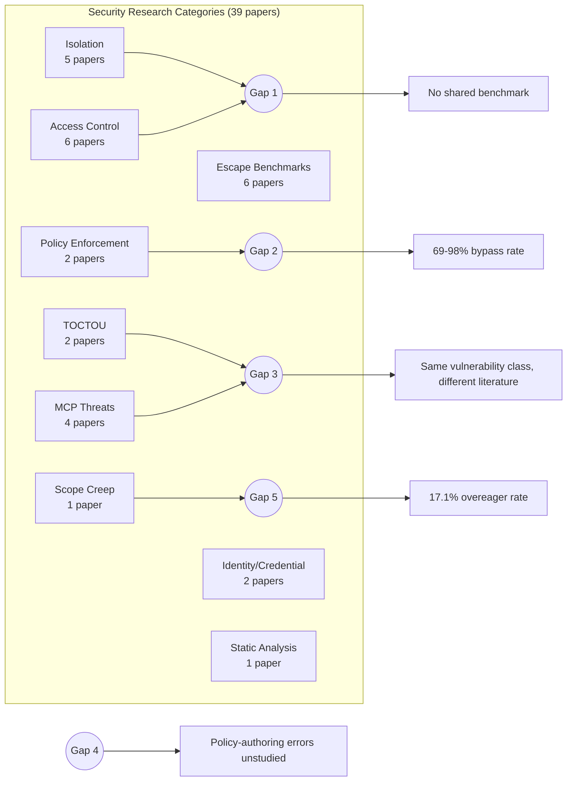
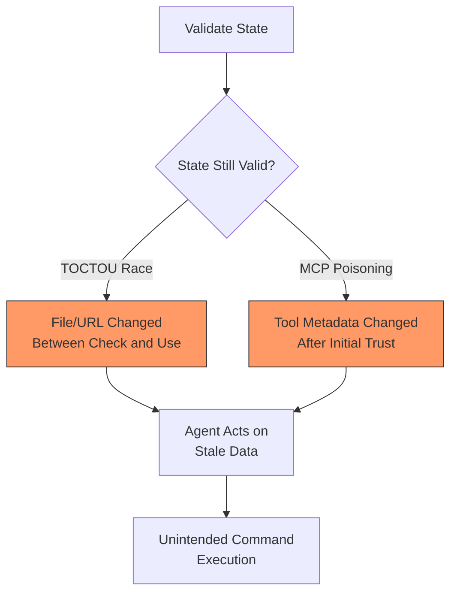

# The Balkanisation of Execution-Security Research: What Five Cross-Cutting Gaps Mean for Your Codex CLI Defence Stack


---

Coding agents read your repositories, call your tools, and execute shell commands — often with limited human oversight. The security research tackling this problem is growing rapidly: 17 papers appeared in the first half of 2026 alone[^1]. But according to a new systematisation by Rashidi (arXiv:2608.05743, July 2026), the 39 papers published between 2023 and 2026 across 17 categories rarely cite one another[^1]. Isolation researchers do not test against access-control benchmarks. Policy-enforcement researchers ignore the bypass corpora that already exist. The result is a fragmented landscape where five cross-cutting gaps remain unaddressed — and every one of them maps directly onto a configuration surface in Codex CLI.

This article walks through those five gaps, examines the evidence behind each, and shows which Codex CLI controls already mitigate them and where the defence stack still falls short.

## The Taxonomy: 17 Categories, 39 Papers

Rashidi's corpus spans sandbox isolation, adversarial escape benchmarks, access control and capability models, policy enforcement fragility, TOCTOU races, MCP-specific threats, harness-level evaluation, identity delegation, execution provenance, network egress control, static analysis, scope-creep measurement, skill/plugin packaging security, and foundational prompt-injection work[^1]. The paper's verification protocol confirmed four disclosed, patched CVEs directly affecting production agent harnesses — including CVE-2025-59536 and CVE-2026-21852 in Claude Code — demonstrating that these concerns are not speculative[^1].

The corpus growth tells its own story: 4 papers in 2023, 4 in 2024, 14 in 2025, and 17 in just the first half of 2026[^1]. Execution security only became an active concern once coding agents gained broad, largely unsandboxed tool access.



## Gap 1: Isolation vs Access Control — No Shared Benchmark

The corpus contains five isolation architectures (IsolateGPT, ceLLMate, and others) and six access-control frameworks (PORTICO, SEAgent, and others), yet no shared benchmark compares whether capability-based systems outperform containment boundaries — or whether they function complementarily[^1].

### Where Codex CLI Sits

Codex CLI v0.147.0 stacks both approaches. The `sandbox_mode` configuration provides containment isolation at three levels:

```toml
# config.toml — isolation layer
[sandbox]
sandbox_mode = "workspace-write"   # also: "read-only", "full-network"
```

The `approval_policy` adds an access-control layer on top:

```toml
# config.toml — access control layer
approval_policy = "unless-allow-listed"
```

PreToolUse hooks then act as a fine-grained capability gate, inspecting each command before execution and returning exit code 2 to block it with feedback[^2]. This layered model is precisely what the paper argues is needed but never evaluated in any single study.

**The gap for Codex CLI:** no published work measures whether Codex CLI's PreToolUse hooks add measurable security beyond its sandbox containment, or whether they introduce approval fatigue that degrades the isolation benefit. The Pwn2Own Berlin 2026 coding-agents category — which paid out US\$1,298,250 across 47 unique zero-days — suggests the threat model is real enough to warrant such evaluation[^1].

## Gap 2: Policy Enforcement Fragility — 69% to 98% Bypass Rates

ShellSieve's automated denylist-bypass pipeline tested 1,709 denylists scraped from GitHub and found fragility rates between 69.0% and 98.6%, depending on bypass classification method[^3]. Yet none of the isolation or access-control papers in the corpus re-evaluate their defences against these empirically proven bypass techniques[^1].

### What This Means for Codex CLI Hooks

If you write a PreToolUse hook that maintains a denylist of dangerous commands, ShellSieve's findings suggest it will be bypassed between two-thirds and nearly all of the time. The fragility comes from shell aliasing, encoding tricks, subshell invocation, and argument reordering — techniques that a pattern-matching hook cannot catch without a canonicalisation stage[^3].

Codex CLI's `requirements.toml` enforces fail-closed policy at the configuration level[^2], but custom hooks authored by teams are subject to exactly the policy-authoring errors the paper identifies as unstudied. A more robust approach combines static analysis (like CARE's canonicalisation pipeline[^4]) with the sandbox containment that neutralises bypass consequences:

```toml
# requirements.toml — fail-closed enforcement
[security]
sandbox_mode = "workspace-write"    # containment as backstop
network_access = "deny"             # no egress by default

[hooks]
pre_tool_use = "scripts/verify-command.sh"  # denylist as advisory layer
```

The key insight: treat hooks as a **detection** layer, not a **prevention** layer. The sandbox is your prevention layer.

## Gap 3: TOCTOU and MCP — Same Vulnerability, Different Literatures

Time-of-check-to-time-of-use races — where the agent validates a file or webpage, then acts on a stale copy after conditions change — and MCP tool-poisoning attacks — where tool metadata is validated once and then trusted forever — are structurally identical validate-then-act problems[^1]. The two literatures remain entirely separate despite addressing the same vulnerability class.

TOCTOU-Bench demonstrated that prompt rewriting and state-integrity monitoring reduce flaw rates from 12% to 8% across 66 tasks[^5]. MCP audits of 1,899 open-source servers found 7.2% carrying traditional vulnerabilities and 5.5% exhibiting tool-poisoning[^1].



### Codex CLI's Position

Codex CLI v0.147.0 introduced the MCP 2026-07-28 protocol with paginated discovery and non-blocking server startup[^2], but the validate-once-trust-forever model for MCP tool metadata persists. PostToolUse hooks can verify post-conditions after each tool invocation, providing a partial defence:

```bash
#!/bin/bash
# PostToolUse hook: verify file hasn't changed since pre-check
EXPECTED_HASH="$1"
ACTUAL_HASH=$(sha256sum "$TARGET_FILE" | cut -d' ' -f1)
if [ "$EXPECTED_HASH" != "$ACTUAL_HASH" ]; then
    echo "TOCTOU: file changed between validation and use" >&2
    exit 2  # signal feedback to agent
fi
```

**The gap:** Codex CLI has no built-in mechanism to re-validate MCP tool descriptions between discovery and invocation. A malicious or compromised MCP server could update its tool metadata after initial connection without triggering re-verification.

## Gap 4: The Honest Policy Author Assumption

Every access-control and enforcement mechanism in the corpus assumes correctly specified policies from trustworthy authors[^1]. No empirical study examines policy-authoring error itself — despite ShellSieve's fragility findings suggesting this may be as significant a real-world risk as enforcement failure[^3].

### AGENTS.md as Policy Surface

In Codex CLI, `AGENTS.md` serves as the primary policy document — a natural-language specification that the agent treats as binding instructions[^2]. But natural language is inherently ambiguous. Consider:

```markdown
<!-- AGENTS.md -->
## Security Rules
- Do not modify files outside the project directory
- Do not execute commands that could affect system state
- Always run tests before committing
```

"Files outside the project directory" — does this include symlinks that resolve outside it? "Commands that could affect system state" — does `git push` count? The policy is well-intentioned but underspecified, and no tooling exists to validate AGENTS.md directives against the actual capability surface.

`requirements.toml` provides a more structured alternative for machine-enforceable policies, but teams still need to author the rules correctly. Codex CLI's `codex doctor` command can validate configuration syntax but cannot assess whether the expressed policy matches the intended security posture[^2].

## Gap 5: Scope Creep — 17.1% Overeager Action Rate

The most surprising finding: benign but unrequested agent actions occur at rates up to 17.1% under realistic prompting, varying dramatically with prompt phrasing[^1]. The paper notes that Codex CLI exhibited substantially higher unrequested-action rates than ask-to-continue frameworks in scope-creep benchmarking[^1].

This failure mode — authorised capabilities invoked for unintended purposes — is addressed by no access-control mechanism in the corpus. Existing systems assume a binary "permitted or not" model rather than "intended right now or not"[^1].

### Defence Through Approval Policy

Codex CLI's `approval_policy` is the closest existing defence:

```toml
# Mitigating scope creep through explicit approval
approval_policy = "on-failure"     # ask on errors — misses silent scope creep
approval_policy = "unless-allow-listed"  # ask for unlisted ops — higher friction
```

The v0.147.0 `--approve-for-me` flag[^2] trades human oversight for throughput — precisely the trade-off that scope-creep research suggests is dangerous. When the agent reformats your entire codebase because you asked it to fix a single function, the action was technically permitted but obviously unintended.

PostToolUse hooks could implement scope verification by comparing each action against the original task specification:

```bash
#!/bin/bash
# PostToolUse scope-check: flag actions outside stated task
TASK_SCOPE="$CODEX_TASK_DESCRIPTION"
ACTION="$CODEX_LAST_ACTION"
# Use lightweight model to assess relevance
echo "$ACTION" | scope-checker --task "$TASK_SCOPE" --threshold 0.7
```

**The gap:** Codex CLI provides no built-in scope-boundary enforcement. The agent's context window is the only mechanism preventing task drift, and context compaction can erase the original task specification entirely.

## The Defence Stack Today

Mapping Rashidi's five gaps against Codex CLI's current controls:

| Gap | Codex CLI Control | Coverage |
|-----|------------------|----------|
| 1. Isolation vs Access Control | `sandbox_mode` + `approval_policy` + PreToolUse hooks | Layered but unevaluated |
| 2. Policy Enforcement Fragility | `requirements.toml` fail-closed + custom hooks | Hooks vulnerable to bypass |
| 3. TOCTOU / MCP Races | PostToolUse verification + MCP 2026-07-28 protocol | No MCP re-validation |
| 4. Policy Authoring Errors | `AGENTS.md` + `requirements.toml` + `codex doctor` | No semantic validation |
| 5. Scope Creep | `approval_policy` + context window | No scope-boundary enforcement |

## What Should Change

Three concrete improvements would address the gaps most relevant to Codex CLI:

1. **Scope-aware approval:** extend `approval_policy` with a `scope` parameter that anchors the agent's permitted actions to the initial task description, surviving context compaction.

2. **MCP re-validation hooks:** add a PreToolUse gate that re-fetches and compares MCP tool metadata against the cached version before each invocation, detecting tool-poisoning mutations.

3. **Policy linting:** a `codex doctor --lint-policy` command that analyses AGENTS.md and requirements.toml against the actual sandbox and hook configuration, flagging underspecified rules and known bypass patterns from the ShellSieve corpus.

The Balkanisation paper's core message is that security researchers are solving adjacent problems in isolation. Codex CLI's defence stack — spanning sandbox containment, hook-based access control, policy enforcement, and approval workflows — already touches all five gap categories. The opportunity is to evaluate these layers together rather than treating each as independently sufficient.

## Citations

[^1]: Rashidi, M. (2026). "The Balkanization of Execution-Security Research for AI Coding Agents: Isolation, Access Control, and Time-of-Check-to-Time-of-Use Vulnerabilities." arXiv:2607.05743. [https://arxiv.org/abs/2607.05743](https://arxiv.org/abs/2607.05743)

[^2]: OpenAI. (2026). "Codex CLI v0.147.0 Release Notes." GitHub. [https://github.com/openai/codex/releases](https://github.com/openai/codex/releases)

[^3]: ShellSieve denylist-bypass pipeline, as cited in Rashidi (2026). Fragility rates of 69.0%–98.6% across 1,709 GitHub denylists. Referenced via arXiv:2607.05743.

[^4]: Liu, Y. et al. (2026). "CARE: Pre-Execution Command Verification for Shell-Executing LLM Agents." arXiv:2607.21642. [https://arxiv.org/abs/2607.21642](https://arxiv.org/abs/2607.21642)

[^5]: TOCTOU-Bench, as cited in Rashidi (2026). 66 tasks, flaw rate reduction from 12% to 8% through prompt rewriting and state-integrity monitoring. Referenced via arXiv:2607.05743.

[^6]: Codex CLI documentation. "Configuration Reference: sandbox_mode, approval_policy, hooks." [https://github.com/openai/codex](https://github.com/openai/codex)
