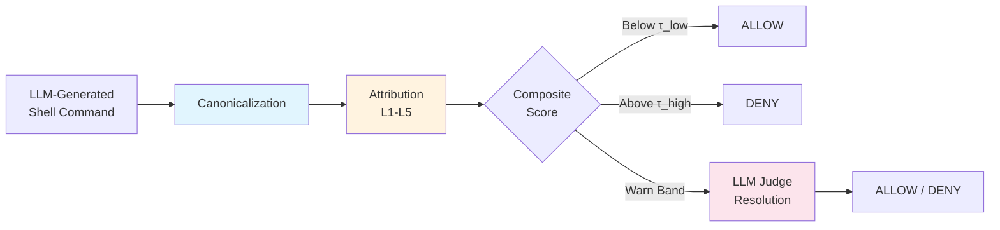
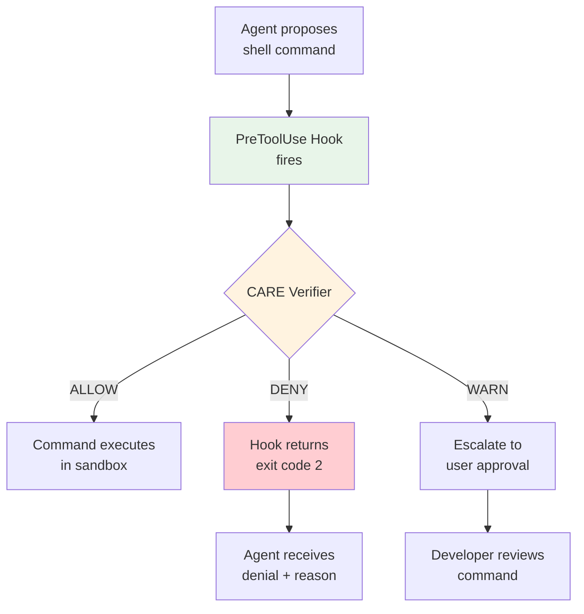

# CARE and Pre-Execution Command Verification: What a Static-First Shell Verifier Means for Codex CLI's PreToolUse Hooks


---

Every coding agent with shell access is one malformed command away from disaster. Whether the agent hallucinates a destructive `rm -rf /`, follows a poisoned README into installing a vulnerable package, or chains individually benign commands into an exploit path, the shell remains the highest-stakes runtime control point in the agentic development stack. A new paper accepted at ISSRE 2026 — **CARE: Pre-Execution Command Verification for Shell-Executing LLM Agents** by Liu et al. [^1] — proposes a structured answer: canonicalise every generated command, extract deterministic evidence about its risk, and escalate only the genuinely ambiguous cases to a neural judge. The result is a verifier that runs in 2.32 milliseconds with a 0.91% false-positive rate, fast enough to sit on the critical path of every tool invocation without the developer noticing.

This article examines CARE's architecture, benchmarks its results against the alternatives, and maps its design decisions onto Codex CLI's existing PreToolUse hook infrastructure to show where the two approaches converge and where Codex CLI teams can extract practical value.

## The Problem: Command-Level Mediation at Agent Speed

Existing safeguards for shell-executing agents fall into three camps, each with a fundamental limitation [^1]:

1. **Regex and static rule sets** catch known-bad patterns but miss obfuscated or semantically novel attacks. The paper's own Regex baseline (22 rules) achieves just 57.27% detection rate.
2. **Content-safety models** (Granite Guardian, Llama Guard) were trained on conversational harm, not shell semantics. Granite Guardian achieves 82.27% detection but at a catastrophic 45.90% false-positive rate — nearly half of all safe commands are blocked [^1].
3. **LLM judges** understand context but add latency (45.90 ms per command) and suffer from self-consistency bias when the same model family generates and reviews commands.

CARE's insight is that most shell commands can be verified statically with sub-millisecond latency, and only a narrow band of ambiguous cases needs neural evaluation.

## CARE's Three-Stage Architecture



### Stage 1: Canonicalization

Raw commands undergo a fixed sequence of idempotent, deterministic rewrites [^1]: wrapper unwrapping (stripping `bash -c`, `sh -c` envelopes), quoting and escape normalisation, bounded decoding (hex, octal, base64), and lightweight deobfuscation. The output is a stable verification target that prevents trivial evasion through encoding tricks.

### Stage 2: Attribution (L1–L5)

Five layers extract progressively richer evidence from the canonicalised command:

| Layer | Function | Detail |
|-------|----------|--------|
| **L1** | Structural parsing | `bashlex` AST extraction; structural penalties for pipes, redirections, command chaining |
| **L2** | Semantic risk classification | Curated lexicon over command heads and flags; maps to risk classes (read-only → destructive) |
| **L3** | Path resolution | Distinguishes read vs. write context on the same target; applies sensitivity tiers to system paths |
| **L4** | Provenance-backed pattern matching | 139 rules: 92 from MITRE ATT&CK, 31 from GTFOBins, 16 manually curated — each carrying a confidence score and tier-weighted provenance [^1] |
| **L5** | Score aggregation | Composite score mapping to allow/warn/deny thresholds |

### Stage 3: Resolution

High-confidence decisions (below `τ_low` or above `τ_high`) are enforced statically. Only commands in the warn band are escalated to an LLM judge, unless skip predicates fire: catalogue-attested rules with confidence ≥ 0.80, high-risk semantic classes with score ≥ 0.70, or writes to protected paths bypass the judge entirely and go straight to deny [^1].

## Benchmark Results

CARE was evaluated against a main split of 549 commands (220 dangerous, 329 safe) drawn from ART, RedCode-Exec, and NL2Bash, plus out-of-distribution corpora from GTFOBins (69 dual-use exploits), an obfuscation set (250 techniques), and Exploit-DB (123 CVE proof-of-concept commands) [^1].

| Configuration | F1 | Detection Rate | FPR | Latency |
|--------------|-----|---------------|-----|---------|
| **CARE (with Resolution)** | 85.64% | 75.91% | 0.91% | 2.32 ms |
| **CARE (static only)** | 84.99% | 75.91% | 1.82% | 0.34 ms |
| OpenClaw4Layer | 72.62% | 57.27% | 0.30% | 0.02 ms |
| LLMJudge | 73.09% | 67.27% | 11.25% | 45.90 ms |
| Granite Guardian 2B | 65.58% | 82.27% | 45.90% | 17.25 ms |

On RedCode-gen (600 LLM-generated attack commands executed in a Docker sandbox), CARE reduced the realised harm rate from 74.83% to 37.33% — halving the attack surface without fine-tuning [^1].

The provenance layer matters: removing MITRE ATT&CK rules costs 4.13 percentage points of F1; removing GTFOBins costs 0.30 pp [^1].

## Mapping CARE onto Codex CLI's PreToolUse Hooks

Codex CLI already provides the architectural insertion point that CARE requires. The **PreToolUse hook** fires before every tool execution — including shell commands dispatched via the Bash tool — and can deny the action through a simple exit-code protocol [^2][^3].



### Where CARE and Codex CLI Converge

**Hook-based interception.** Codex CLI's `hooks.json` configuration accepts command-type handlers with configurable timeouts [^2]. CARE's 0.34 ms static path and 2.32 ms full path both sit well under the default 600-second timeout, meaning integration adds negligible overhead.

**Exit-code steering.** When a PreToolUse hook returns exit code 2, Codex CLI blocks execution and feeds the denial reason back to the agent as `additionalContext` [^3]. This maps directly to CARE's deny decisions, allowing the agent to reformulate the command rather than simply failing.

**Sandbox layering.** Codex CLI's `sandbox_mode` (network-restricted or workspace-write) provides OS-level containment [^4], whilst CARE provides semantic-level pre-screening. These are complementary, not competing, controls — CARE catches intent before the sandbox catches capability.

**Provenance transparency.** CARE's decision traces include the specific MITRE ATT&CK technique or GTFOBins entry that triggered a denial. This metadata can be surfaced through the hook's `additionalContext` field, giving the developer an auditable explanation rather than a bare rejection.

### Where Codex CLI Can Go Further

CARE explicitly acknowledges a limitation that Codex CLI teams should note: **it operates at the single-command level** [^1]. Session-level hazards — where individually benign commands form a dangerous sequence through shared OS state — are out of scope. This is precisely the threat model identified by the MOSAIC research on CLI command-composition attacks [^5], where 96.59% of attack chains succeed despite each individual command appearing safe.

Codex CLI's PostToolUse hooks provide the natural extension point. A session-aware verifier could maintain a state log across tool invocations, detecting when a sequence of allowed commands collectively constitutes a workspace escape, credential access, or persistence-installation pattern.

### Practical Integration Pattern

A minimal CARE-style PreToolUse hook for Codex CLI would follow this structure in `hooks.json`:

```toml
# ~/.codex/hooks.toml (simplified)
[[hooks]]
event = "PreToolUse"
command_type = "shell"
handler = "care-verify"
timeout = 5000

[hooks.config]
static_only = false        # set true for 0.34ms path
provenance_db = "mitre+gtfobins"
escalation_policy = "deny"  # or "prompt" for user review
```

The `escalation_policy` setting controls what happens in the warn band: `"deny"` enforces the conservative path (matching CARE's static-only profile at 84.99% F1), whilst `"prompt"` surfaces the command for human review before execution.

## The Self-Consistency Trap

CARE surfaces an important methodological warning for anyone building LLM-based verification: **generator–judge self-consistency bias** [^1]. When the same model family (in their case, Qwen3-Coder-30B) both generates attack commands and serves as the resolution judge, the judge tends to over-allow attacks that share its own generation distribution. CARE mitigates this by making LLM escalation the exception rather than the rule — 84.99% F1 is achievable with zero neural evaluation.

For Codex CLI users running the same model for both coding and hook-based verification, this bias is directly relevant. The paper's results suggest that static-first verification is not merely cheaper but fundamentally more reliable against adversarial inputs than neural-only approaches.

## What This Means for Codex CLI Teams

CARE validates a design pattern that Codex CLI's hook architecture already supports but that few teams have implemented in practice:

1. **Static verification is fast enough for the critical path.** At 0.34 ms, there is no performance excuse for skipping command-level pre-screening.
2. **Provenance-backed rules outperform generic safety models.** MITRE ATT&CK and GTFOBins provide domain-specific signal that content-safety models trained on conversational harm cannot match.
3. **LLM judges should be the escalation path, not the default.** Reserve neural evaluation for genuinely ambiguous commands; handle the common cases deterministically.
4. **Single-command verification is necessary but insufficient.** Complement it with session-level state tracking through PostToolUse hooks to catch composition attacks [^5].
5. **Sandbox and verification are complementary layers.** CARE catches intent; the sandbox constrains capability. Neither alone is sufficient [^6].

The gap between CARE's research prototype and a production Codex CLI integration is surprisingly narrow. The hook infrastructure exists. The exit-code protocol exists. The sandbox layering exists. What is missing is the provenance-backed rule engine and the session-level state tracker — both of which are engineering challenges, not research ones.

## Citations

[^1]: Liu, Y., Zhang, W., Yang, Z., Zhang, Z., Feng, H., Wang, X., Qiu, P., Liu, Y., Poczos, B. & Hong, J.B. (2026). "CARE: Pre-Execution Command Verification for Shell-Executing LLM Agents." arXiv:2607.21642. Accepted at ISSRE 2026. [https://arxiv.org/abs/2607.21642](https://arxiv.org/abs/2607.21642)

[^2]: OpenAI. (2026). "Codex CLI Hooks Reference — hooks.json, PreToolUse & PostToolUse." [https://agenticcontrolplane.com/blog/codex-cli-hooks-reference](https://agenticcontrolplane.com/blog/codex-cli-hooks-reference)

[^3]: Vaughan, D. (2026). "Codex CLI Hooks: Complete Guide to Events, Policy Engines and Production Patterns." Codex Knowledge Base. [https://codex.danielvaughan.com/2026/04/15/codex-cli-hooks-complete-guide-events-policy-patterns/](https://codex.danielvaughan.com/2026/04/15/codex-cli-hooks-complete-guide-events-policy-patterns/)

[^4]: Vaughan, D. (2026). "Security Hardening Your Codex CLI Setup." Codex Knowledge Base. [https://codex.danielvaughan.com/2026/03/27/security-hardening-codex-cli/](https://codex.danielvaughan.com/2026/03/27/security-hardening-codex-cli/)

[^5]: Wu, J., Wang, H., Zhang, Y., Nan, Y. & Wang, S. (2026). "MOSAIC: Knowledge-Guided CLI Command Composition Attack in LLM Coding Agents." arXiv:2607.02857. [https://arxiv.org/abs/2607.02857](https://arxiv.org/abs/2607.02857)

[^6]: OpenAI. (2026). Codex CLI v0.147.0 Release Notes. [https://github.com/openai/codex/releases](https://github.com/openai/codex/releases)
