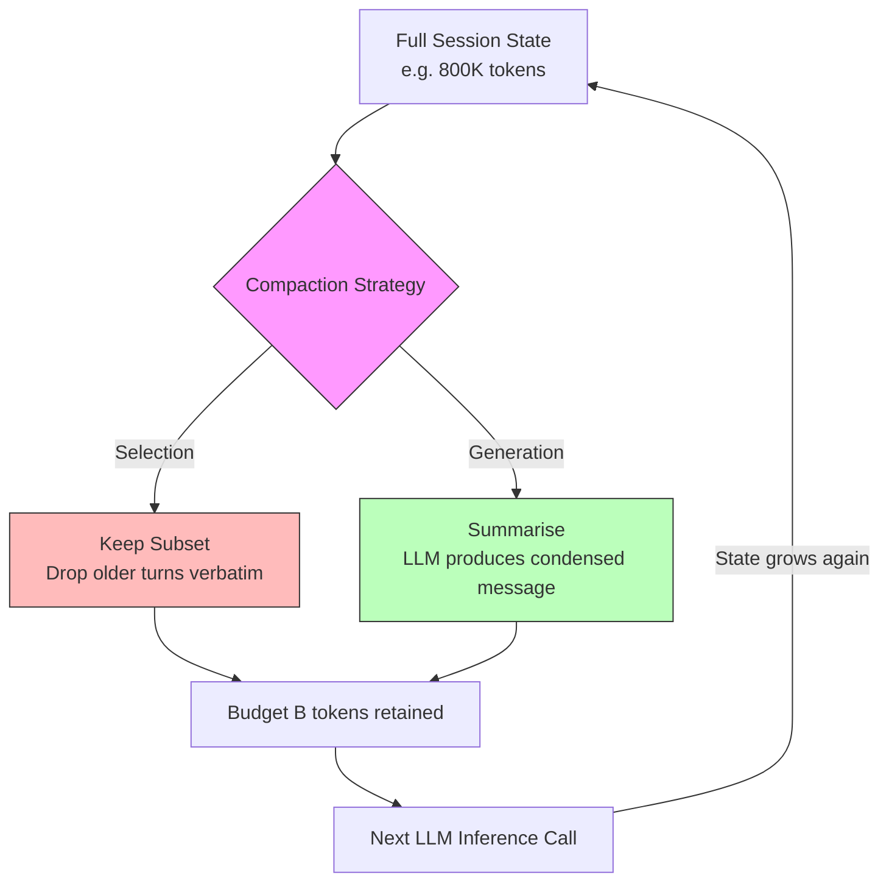
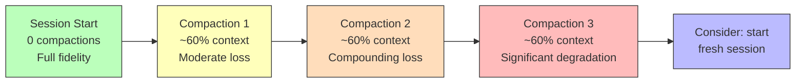

# Context Compaction Theory: What a Formal Analysis of Bounded Context Windows Means for Your Codex CLI Sessions


---

Every coding agent — Codex CLI, Claude Code, Gemini CLI, OpenCode, Goose — does it. When the conversation history approaches the model's context limit, the agent compresses state into a shorter representation and carries on. We call it context compaction, and until now it has been a purely empirical exercise: tweak the summary prompt, adjust the threshold, hope for the best.

Tirmazi, Markelon, Bishop, and Mitzenmacher changed that on 2 August 2026 with *Context Compaction Theory* [^1], the first formal treatment of the problem. Their framework, grounded in one-way communication complexity, proves why some compaction strategies are fundamentally superior to others — and why your Codex CLI `compact_prompt` configuration matters more than you might think.

## The problem, stated precisely

A coding agent accumulates state across a session: file contents read, tool outputs, user instructions, intermediate reasoning. When the accumulated state exceeds the model's context window, the agent must discard or condense information before the next inference call. This is context compaction [^1].

Despite its ubiquity — Codex CLI's auto-compaction triggers at a configurable `model_auto_compact_token_limit` (default ~200,000 tokens, hard-capped at 90% of the effective window) [^2] — the process has received essentially no formal analysis. The paper changes that by introducing two game-theoretic models that capture the two dominant strategies used in practice.

## Two games, two strategies

### The Context Selection Game

A **selector** receives the full item universe (the agent's accumulated state) and must choose a subset whose total size fits within budget *B*. An adversary then issues a query; the selector's score depends on how well the retained subset answers it [^1].

This models the approach taken by agents that simply drop older turns or prune tool outputs — keeping a subset of the original tokens verbatim. In Codex CLI terms, this corresponds to the conversation truncation that occurs when `model_auto_compact_token_limit` is hit without a custom `compact_prompt` [^2].

### The Context Generation Game

A **generator** receives the same universe but may emit an *arbitrary* message of at most *B* symbols. It can create new tokens, reorder information, and compress below the sum of item sizes. An interpreter then answers the query using only this generated message [^1].

This models LLM-based summarisation — the strategy Codex CLI uses by default, where the model produces a condensed summary of the session history. It is also what Claude Code's `/compact` command and OpenCode's `\compact` command invoke [^3].



## The equivalence theorem

The paper's central result connects context compaction to one-way communication complexity — a well-studied area of theoretical computer science with decades of known bounds [^1].

**Theorem 1** states that the minimum budget any generation-based algorithm needs to answer a query set within target error ε equals the one-way randomised communication complexity of the corresponding communication problem [^1]. In practical terms: for any query family you care about (dependency checking, file-content recall, test-result tracking), there is a known lower bound on how small your compacted context can be without losing information — and generation-based compaction can achieve it.

**Corollary 2** establishes that selection-based algorithms correspond to a *restricted* class of one-way protocols where messages must encode subset identifiers rather than arbitrary information [^1].

## Generation provably beats selection

**Theorem 3** provides the separation result. For *n* = 2^*k* items of log₂(*n*) bits each, any generation algorithm can answer universe-reconstruction queries using just *n* bits, while every selection algorithm requires at least *n* · log₂(*n*) bits — a **Θ(log n) factor gap** [^1].

This is not a minor constant-factor improvement. For a session containing 1,024 distinct items (file reads, tool outputs, user messages), the selection approach requires roughly 10× more budget than generation for lossless reconstruction. The gap grows logarithmically with session complexity.

The implication for Codex CLI is clear: the default LLM-based summarisation (generation) is not merely convenient — it is *provably* more information-efficient than any strategy that simply selects which turns to keep.

## Where LLM compaction actually fails

The theoretical framework sets lower bounds. The empirical evaluation checks whether current implementations approach them. The results are sobering.

The authors recorded 15,000 items in Anthropic's context compaction endpoint, configured it for set membership queries, and compared its error rate against a Bloom filter of identical compacted size. The Bloom filter represents near-optimal compaction for membership queries [^1].

Result: the LLM-based compaction answered membership queries with an error rate close to random guessing — substantially worse than the Bloom filter baseline [^1]. Control experiments confirmed the degradation came from information loss during compaction, not retrieval failures.

This finding has direct relevance to Codex CLI sessions. When your agent needs to track which files have been modified, which tests have passed, or which dependencies contain known vulnerabilities, a compacted summary may lose precisely the discrete set-membership information that matters most.

## Mapping to Codex CLI configuration

The theory provides concrete guidance for how you configure your Codex CLI sessions.

### Trigger compaction earlier, not later

The paper's cost analysis quantifies what practitioners already suspect: re-deriving a 100,000-token summary from an 800,000-token history costs approximately \$13 and takes ~26 minutes on a frontier model [^1]. This is why agents use compacted context forwarding rather than recomputation — and why triggering compaction *early* preserves more information per compaction event.

Codex CLI's recommended practice is to set `model_auto_compact_token_limit` to roughly 60% of the effective window [^2], well below the hard 90% ceiling:

```toml
# ~/.codex/config.toml
model_auto_compact_token_limit = 150000  # ~60% of 258K effective window
```

The formal analysis supports this: fewer items at compaction time means a smaller item universe, which reduces the minimum budget required for faithful representation.

### Customise your compact prompt

The default compaction prompt is generic. The paper's framework suggests that domain-specific compaction — where the condenser knows which query families matter — can approach communication-complexity lower bounds more closely [^1].

```toml
# .codex/config.toml (project-level)
compact_prompt = """
Summarise this session preserving:
1. All file paths modified and their current state
2. All test results with pass/fail status
3. The current task objective and remaining steps
4. Any error messages or blockers encountered
Discard: exploratory reads that led nowhere, redundant tool output.
"""
```

This steers the generation algorithm towards the query families you actually care about, reducing effective error for those queries at the cost of information about queries you will never ask.

### Recognise when generation degrades

The paper documents that after compaction, agents discard prior information irreversibly — full transcripts exist in storage but agents operate only on compacted versions going forward [^1]. Codex CLI's own documentation acknowledges quality degradation with repeated compactions [^4].

A session with three compactions behind it produces measurably worse output than a fresh session with focused context [^2]. The formal framework explains why: each compaction round is a lossy channel, and errors compound multiplicatively across rounds. The paper identifies repeated compaction as an open problem requiring multi-invocation analysis [^1].



## The set disjointness problem and dependency auditing

One of the paper's most practically relevant results concerns set disjointness queries — precisely the kind of query a coding agent faces when checking whether project dependencies overlap with a known-vulnerability database [^1].

For *N* dependencies in an *m*-bit namespace, the paper shows that any compaction algorithm requires Ω(*N* · *m*) bits — effectively "no better than uncompressed storage" for large repositories [^1]. If your project has 500 npm dependencies and you need to check them against a vulnerability list after compaction, the compacted context must retain essentially all dependency information or risk missing vulnerabilities.

This has implications for how Codex CLI's PostToolUse hooks interact with compacted sessions. A security-scanning hook that relies on the agent remembering which packages it has already checked will fail silently after compaction unless the compact prompt explicitly preserves dependency state.

## Open problems the paper identifies

Four open problems map directly to coding agent architecture [^1]:

1. **Adaptive adversaries**: The current analysis assumes queries are fixed before compaction. In practice, a developer's next question depends on the agent's compacted response — an adaptive setting the theorems do not yet cover.

2. **Selection–generation characterisation**: For which query families does generation strictly beat selection, and by how much? This would tell us when simple turn-dropping suffices and when summarisation is essential.

3. **Repeated compaction**: Multi-round compaction analysis is needed. Codex CLI's documentation already warns about quality degradation with iterations [^4], but no formal bounds exist on the error accumulation rate.

4. **Computational efficiency**: The information-theoretic lower bounds may be unattainable with polynomial-time condensers or current LLM interpreters — a gap between what is theoretically possible and what is practically achievable.

## Practical takeaways

| Principle | Theory says | Codex CLI action |
|---|---|---|
| Generation beats selection | Θ(log n) gap for certain queries | Use LLM summarisation, not turn-dropping |
| Domain-specific compaction wins | Matching condenser to query family reduces error | Customise `compact_prompt` per project |
| Compact early | Smaller universe → lower minimum budget | Set threshold to ~60% of effective window |
| Some queries resist compaction | Set membership requires Ω(N·m) bits | Use PostToolUse hooks for state that must survive compaction |
| Repeated compaction degrades | Lossy channel compounds errors | Start fresh sessions for long-horizon work rather than relying on multiple compactions |

Context compaction is not a solved problem — it is a formally hard one. The contribution of Tirmazi *et al.* is to make that hardness precise, give us tools to reason about it, and show where current implementations fall short. For Codex CLI users managing long sessions, the message is clear: understand what your compaction preserves, configure it deliberately, and know when to start a fresh session instead.

## Citations

[^1]: Tirmazi, H., Markelon, S., Bishop, A., & Mitzenmacher, M. (2026). "Context Compaction Theory." arXiv:2608.01326. [https://arxiv.org/abs/2608.01326](https://arxiv.org/abs/2608.01326)

[^2]: Codex CLI Context Compaction: Architecture, Configuration, and Managing Long Sessions. Codex Knowledge Base, March 2026. [https://codex.danielvaughan.com/2026/03/31/codex-cli-context-compaction-architecture/](https://codex.danielvaughan.com/2026/03/31/codex-cli-context-compaction-architecture/)

[^3]: Context Compaction Research: Claude Code, Codex CLI, OpenCode, Amp. GitHub Gist, April 2026. [https://gist.github.com/badlogic/cd2ef65b0697c4dbe2d13fbecb0a0a5f](https://gist.github.com/badlogic/cd2ef65b0697c4dbe2d13fbecb0a0a5f)

[^4]: Context Health Monitoring in Codex CLI: Compaction Telemetry, Degradation Detection, and Long-Session Quality Patterns. Codex Knowledge Base, May 2026. [https://codex.danielvaughan.com/2026/05/14/codex-cli-context-health-monitoring-compaction-telemetry-long-session-quality/](https://codex.danielvaughan.com/2026/05/14/codex-cli-context-health-monitoring-compaction-telemetry-long-session-quality/)

[^5]: The Context Window Gap: Why Codex CLI Caps GPT-5.6's Million-Token Window at 272K. Codex Knowledge Base, July 2026. [https://codex.danielvaughan.com/2026/07/20/context-window-gap-codex-cli-gpt56-advertised-vs-effective-budget-compaction-strategy/](https://codex.danielvaughan.com/2026/07/20/context-window-gap-codex-cli-gpt56-advertised-vs-effective-budget-compaction-strategy/)

[^6]: Context Compaction Deep Dive: How Codex CLI, Claude Code, and OpenCode Manage Long Sessions. Codex Knowledge Base, April 2026. [https://codex.danielvaughan.com/2026/04/14/context-compaction-deep-dive-codex-cli-claude-code-opencode/](https://codex.danielvaughan.com/2026/04/14/context-compaction-deep-dive-codex-cli-claude-code-opencode/)
